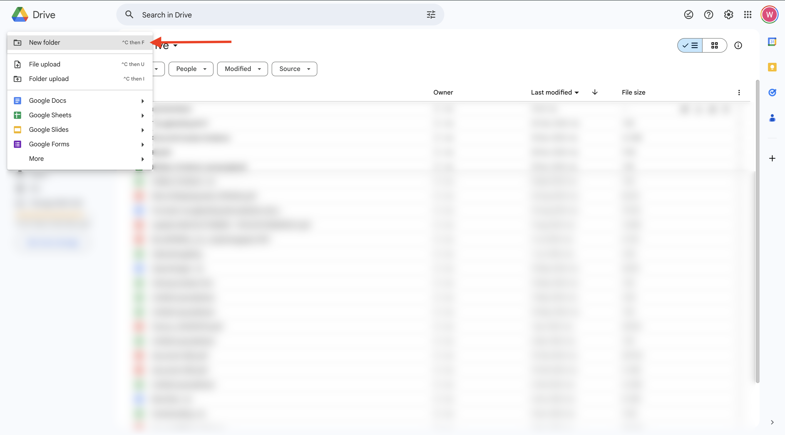
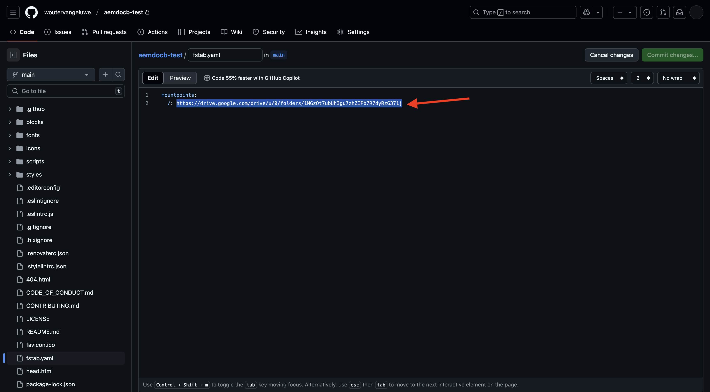

# 1.1.2 Uw op documenten gebaseerde website maken

Terwijl u wacht tot uw Cloud Manager-programma is gemaakt, hebt u genoeg tijd om uw eerste op documenten gebaseerde ontwerpwebsite in te stellen. De hieronder oefening is gebaseerd op [ aem.live het Leerprogramma van de Ontwikkelaar ](https://www.aem.live/developer/tutorial){target="_blank"} . Volg de onderstaande stappen om aan de slag te gaan.

## 1.1.2.1 Google Drive instellen

Ga naar [ https://drive.google.com ](https://drive.google.com){target="_blank"} . Klik **+ Nieuw** en klik dan **Nieuwe Omslag**.

{zoomable="yes"}

Geef de map een naam `aemdocb-test` . Klik **creëren**.

{zoomable="yes"}

Download het dossier [ aemboilerplate.zip ](./../../../assets/aem/aemboilerplate.zip){target="_blank"} en haal het op uw computer uit.

{zoomable="yes"}

Er staan 3 bestanden in die map. Kopieer deze bestanden naar de nieuwe map Google Drive.

{zoomable="yes"}

U moet deze bestanden nu omzetten in een eigen Google-bestand. Om dat te doen, open elk dossier en ga dan naar **Dossier** > **sparen als Google Docs**.

{zoomable="yes"}

Dit moet u doen voor alle 3 bestanden en daarna ziet u 6 bestanden in uw map Google Drive.

{zoomable="yes"}

Dit staat dan in uw map.

{zoomable="yes"}

Opdat op document-gebaseerde auteursdemo werkt, moet u nu uw omslag van de Aandrijving van Google met het e-mailadres **helix@adobe.com** delen. Klik uw omslagnaam, klik **Aandeel** en klik dan **opnieuw Aandeel**.

{zoomable="yes"}

Ga het e-mailadres **helix@adobe.com** in en klik **verzenden**.

{zoomable="yes"}

Kopieer en noteer vervolgens de URL van uw Google Drive-map zoals u dat in de volgende exercitie nodig hebt. Klik uw omslagnaam, klik **Aandeel** en klik dan **verbinding van het Exemplaar**.

{zoomable="yes"}

`https://drive.google.com/drive/folders/1PNIOFeptIfszSebawT-Y_bwB4_anQWk5?usp=drive_link`

U moet de parameter voor de querytekenreeks `?usp=drive_link` verwijderen, zodat de URL er als volgt uitziet:

`https://drive.google.com/drive/folders/1PNIOFeptIfszSebawT-Y_bwB4_anQWk5`

## 1.1.2.2 Opstelling uw repo van GitHub

Ga naar [ https://github.com ](https://github.com){target="_blank"} . Klik **Teken binnen**.

{zoomable="yes"}

Voer uw referenties in. Klik **Teken binnen**.

{zoomable="yes"}

Zodra binnen ondertekend, zult u uw dashboard zien GitHub.

{zoomable="yes"}

Ga naar [ https://github.com/adobe/aem-boilerplate ](https://github.com/adobe/aem-boilerplate){target="_blank"} . Dan zie je dit. Klik **Gebruik dit malplaatje** en klik dan **creeer een nieuwe bewaarplaats**.

{zoomable="yes"}

Voor de **naam van de Bewaarplaats**, gebruik `aemdocb-test`. Plaats het zicht aan **Privé**. Klik **creeer bewaarplaats**.

{zoomable="yes"}

Na een paar seconden wordt de repository gemaakt.

{zoomable="yes"}

Daarna, ga naar [ https://github.com/apps/aem-code-sync ](https://github.com/apps/aem-code-sync){target="_blank"} . Klik **vormen**.

{zoomable="yes"}

Klik op uw GitHub-account.

{zoomable="yes"}

Klik **slechts uitgezochte bewaarplaatsen** en voeg dan de bewaarplaats toe die u enkel creeerde. Daarna, klik **installeren**.

{zoomable="yes"}

Je krijgt deze bevestiging.

{zoomable="yes"}

## 1.1.2.3 Bestand fstab.yaml bijwerken

Klik in uw GitHub-repo om het bestand `fstab.yaml` te openen.

{zoomable="yes"}

Klik **uitgeven** pictogram.

{zoomable="yes"}

U moet nu de waarde voor het gebied **url** op lijn 2 bijwerken.

{zoomable="yes"}

U moet de huidige waarde door URL van uw specifiek milieu van AEM CS in combinatie met de montages van uw reactie vervangen GitHub.

Dit is de huidige waarde van de URL: `https://drive.google.com/drive/u/0/folders/1MGzOt7ubUh3gu7zhZIPb7R7dyRzG371j` .

Vervang die waarde door de URL die u hebt gekopieerd uit de map Google Drive, `https://drive.google.com/drive/folders/1PNIOFeptIfszSebawT-Y_bwB4_anQWk5` . Klik **Veranderingen vastleggen...**.

{zoomable="yes"}

Klik **veranderingen** vastleggen.

{zoomable="yes"}

## 1.1.2.4 AEM Sidekick-extensie installeren

Ga naar [ https://chromewebstore.google.com/detail/aem-sidekick/ccfggkjabjahcjoljmgmklhpaccedipo ](https://chromewebstore.google.com/detail/aem-sidekick/ccfggkjabjahcjoljmgmklhpaccedipo){target="_blank"} . Klik **toevoegen aan Chrome**.

{zoomable="yes"}

Zet de **uitbreiding van AEM Sidekick** vast.

{zoomable="yes"}

## 1.1.2.5 Een op documenten gebaseerde website voorvertonen en publiceren

Ga terug naar de map Google Drive. In de taakbar, klik de **uitbreiding van AEM Sidekick**. Vervolgens verschijnt er een pop-up met een AEM Sidekick-balk in uw map.

{zoomable="yes"}

Selecteer de 3 bestanden in de map Google Drive. Klik **Voorproef**.

{zoomable="yes"}

Klik opnieuw **Voorproef**.

{zoomable="yes"}

Klik om het groene dialoogvenster te sluiten.

{zoomable="yes"}

Selecteer de 3 bestanden in de map Google Drive opnieuw. Nu, klik **publiceren**.

{zoomable="yes"}

Klik **publiceren**.

{zoomable="yes"}

Klik om het groene dialoogvenster opnieuw te sluiten. Nu, selecteer de dossier **index**, klik **Exemplaar URLs** en klik dan **Levende URLs van het Exemplaar**.

{zoomable="yes"}

De gekopieerde URL ziet er als volgt uit: `https://main--aemdocb-test--woutervangeluwe.aem.live/` .

In de bovenstaande URL:

- **belangrijkste** verwijst naar de tak op uw reactie GitHub
- **aemdocb-test** verwijst naar de naam van de bewaarplaats GitHub
- **woutervanwe** verwijst naar de naam van de GitHub gebruikersrekening
- **.live** verwijst naar de live omgeving van uw AEM-instantie
- U kunt **.live** door **.page** vervangen om de voorproefmilieu van uw instantie van AEM te openen

Open een nieuw browservenster en ga naar de URL.

{zoomable="yes"}

## 1.1.2.6 Breng een wijziging aan en publiceer uw wijziging

Ga terug naar uw Aandrijving van Google en open de filer **index** in Google.

{zoomable="yes"}

Vervang de tekst **het Testen** door een andere tekst van keus. Klik **Voorproef**.

{zoomable="yes"}

Vervolgens wordt de voorvertoningsversie van uw website geopend. Herzie uw verandering en klik **publiceren**.

{zoomable="yes"}

U ziet dan de live versie van uw website.

{zoomable="yes"}

Deze oefening was een goede manier om aan de slag te gaan en zelf documenten te ontwerpen. U kunt nu doorgaan met de volgende oefening, waarbij u uw eigen demo-website instelt met CitiSignal als een demo-merk.

Volgende Stap: [ 1.1.3 Opstelling uw milieu van AEM CS ](./ex3.md){target="_blank"}

Ga terug naar [ Adobe Experience Manager Cloud Service &amp; Edge Delivery Services ](./aemcs.md){target="_blank"}

[ ga terug naar Alle Modules ](./../../../overview.md){target="_blank"}
