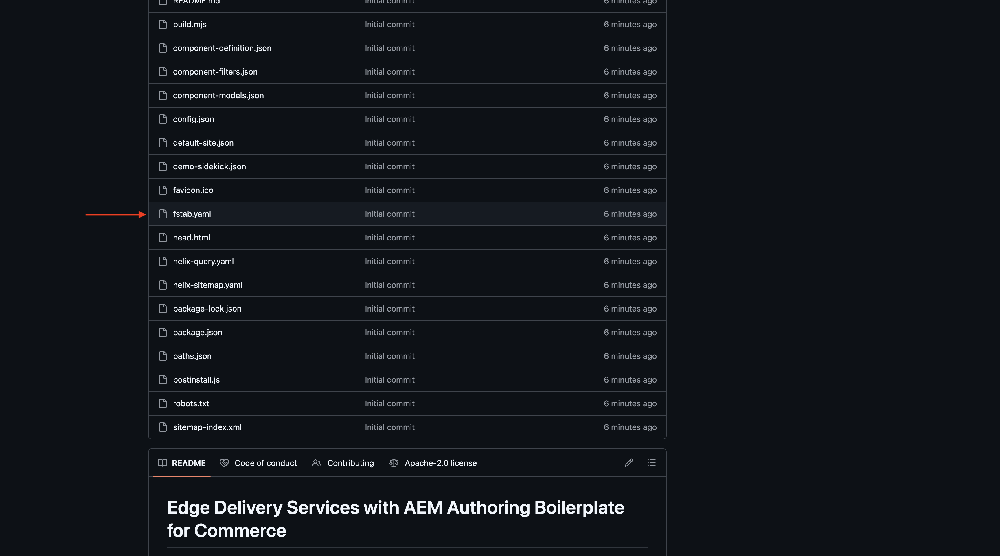
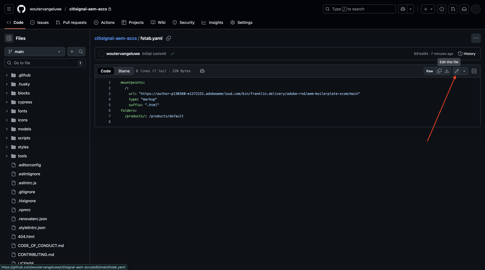
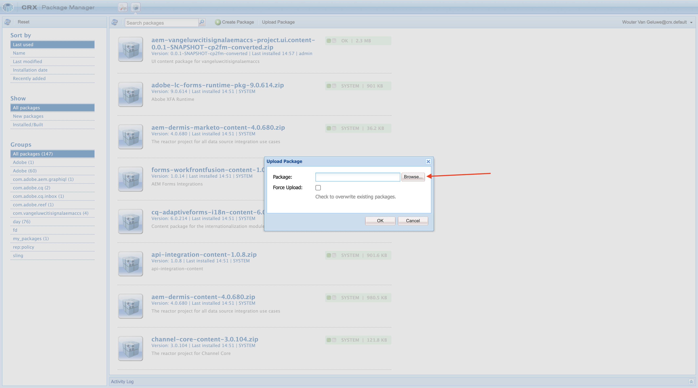
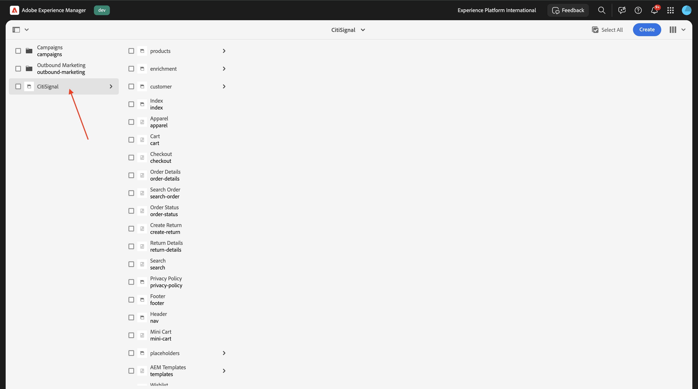
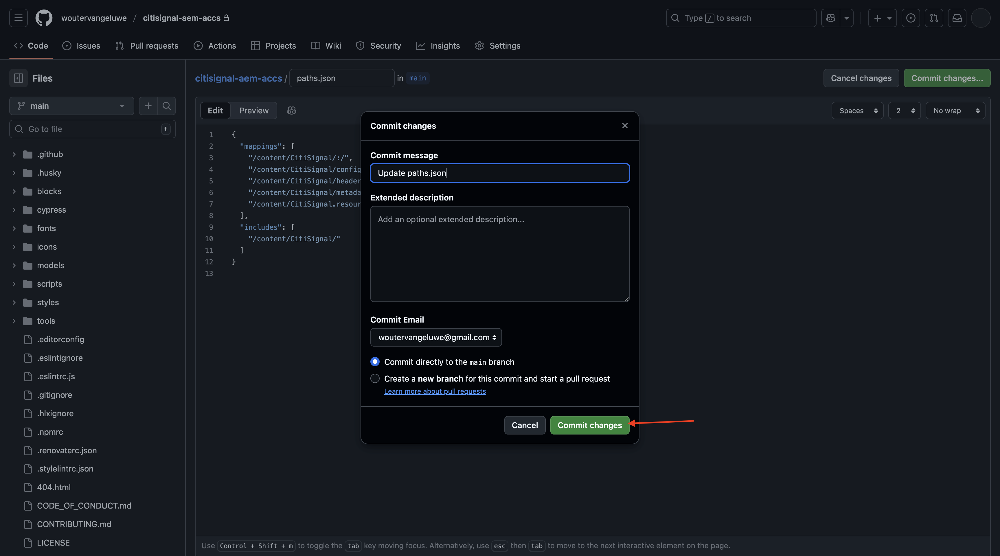

# 1.1.2 De AEM CS-omgeving instellen

## 1.1.2.1 Uw GitHub-repo instellen

Ga naar [&#x200B; https://github.com &#x200B;](https://github.com){target="_blank"}. Klik **Teken binnen**.


Voer uw referenties in. Klik **Teken binnen**.


Zodra binnen ondertekend, zult u uw dashboard zien GitHub.


Ga naar [&#x200B; https://github.com/adobe-rnd/aem-boilerplate-xcom &#x200B;](https://github.com/adobe-rnd/aem-boilerplate-xcom){target="_blank"}. Dan zie je dit. Klik **Gebruik dit malplaatje** en klik dan **creeer een nieuwe bewaarplaats**.


Voor de **naam van de Bewaarplaats**, gebruik `citisignal-aem-accs`. Plaats het zicht aan **Privé**. Klik **creeer bewaarplaats**.


Na een paar seconden wordt de repository gemaakt.


Daarna, ga naar [&#x200B; https://github.com/apps/aem-code-sync &#x200B;](https://github.com/apps/aem-code-sync){target="_blank"}. Klik **installeren** of **vormen**.


Klik **verdergaan** knoop naast uw GitHub gebruikersrekening.


Klik **vormen** naast uw GitHub gebruikersrekening.


Klik **slechts uitgezochte bewaarplaatsen** en voeg dan de bewaarplaats toe die u enkel creeerde.


De rol neer en klikt **sparen**.


Je krijgt deze bevestiging.


## 1.1.2.2 Bestand fstab.yaml bijwerken

Klik in uw GitHub-repo om het bestand `fstab.yaml` te openen.



Klik **uitgeven** pictogram.



U moet nu de waarde voor het gebied **url** op lijn 3 bijwerken.


U moet de huidige waarde door URL van uw specifiek milieu van AEM Sites CS in combinatie met de montages van uw reactie vervangen GitHub.

Dit is de huidige waarde van de URL: `https://author-p130360-e1272151.adobeaemcloud.com/bin/franklin.delivery/adobe-rnd/aem-boilerplate-xcom/main` .

Er zijn 3 delen van de URL die moeten worden bijgewerkt

`https://XXX/bin/franklin.delivery/YYY/ZZZ/main`

XXX moet worden vervangen door de URL van uw AEM CS Author-omgeving.

YYY zou door uw GitHub gebruikersrekening moeten worden vervangen.

ZZZ zou door de naam van de bewaarplaats moeten worden vervangen GitHub die u in de vorige oefening gebruikte.

U kunt URL van uw milieu van de Auteur van AEM CS vinden door [&#x200B; https://my.cloudmanager.adobe.com &#x200B;](https://my.cloudmanager.adobe.com){target="_blank"} te gaan. Klik uw **Programma** om het te openen.


Daarna, klik de 3 punten **..** op het **milieu&#39;s** lusje en klik **Details van de Mening**.


U zult dan uw milieudetails, met inbegrip van URL van uw **milieu van de Auteur** zien. De URL kopiëren.


XXX = `author-p166717-e1786231.adobeaemcloud.com`

Voor de naam van de GitHub-gebruikersaccount kunt u dat gemakkelijk vinden in de URL van uw browser. In dit voorbeeld is de naam van de gebruikersaccount `woutervangeluwe` .

YYY = `woutervangeluwe`


Voor de bewaarplaatsnaam GitHub, kunt u het in het browser venster ook vinden dat u in GitHub hebt geopend. In dit geval is de naam van de gegevensopslagruimte `citisignal` .

ZZZ = `citisignal-aem-accs`


Deze drie waarden samen leiden tot deze nieuwe URL die moet worden geconfigureerd in het bestand `fstab.yaml` .

`https://author-p166717-e1786231.adobeaemcloud.com/bin/franklin.delivery/woutervangeluwe/citisignal-aem-accs/main`

U moet ook controleren of deze coderegels ook aan het bestand worden toegevoegd:

```
folders:
  /products/: /products/default
```

>[!IMPORTANT]
>
>Deze coderegels worden weergegeven op de lijnen 6 en 7 in de onderstaande afbeelding. Voeg de regels handmatig toe als deze regels ontbreken.

Klik **Veranderingen vastleggen...**.


Klik **veranderingen** vastleggen.


Het bestand `fstab.yaml` is nu bijgewerkt.

## 1.1.2.3 CitiSignal-middelen en -site uploaden

Ga naar [&#x200B; https://my.cloudmanager.adobe.com &#x200B;](https://my.cloudmanager.adobe.com){target="_blank"}. Klik uw **Programma** om het te openen.


Klik vervolgens op de URL van de omgeving van uw auteur.


Klik **Teken binnen met Adobe**.


U ziet dan de omgeving van uw auteur.


Uw URL ziet er als volgt uit: `https://author-p166717-e1786231.adobeaemcloud.com/ui#/aem/aem/start.html?appId=aemshell`

U moet nu tot het **milieu van de Manager van het Pakket van CRX** van AEM toegang hebben. U doet dit door `ui#/aem/aem/start.html?appId=aemshell` te verwijderen van de URL en deze te vervangen door `crx/packmgr` . Dit houdt in dat uw URL er nu als volgt moet uitzien:
`https://author-p166717-e1786231.adobeaemcloud.com/crx/packmgr` .
Het greep **gaat** binnen om het milieu van de pakketmanager te laden


Daarna, klik **uploadt pakket**.


Klik **doorbladeren** om van het te uploaden pakket de plaats te bepalen.

Het te uploaden pakket wordt genoemd **burgersignaal-assets.zip** en kan hier worden gedownload: [&#x200B; https://one-adobe-tech-insiders.s3.us-west-2.amazonaws.com/one-adobe/citisignal_aem_accs.zip &#x200B;](https://one-adobe-tech-insiders.s3.us-west-2.amazonaws.com/one-adobe/citisignal_aem_accs.zip){target="_blank"}.



Selecteer het pakket `citisignal_aem_accs.zip` en klik **Open**.


Daarna, klik O.K. **&#x200B;**.


Het pakket wordt vervolgens geüpload. Daarna, klik **installeer** op het pakket u enkel uploadde.


Klik **installeren**.


Na een paar minuten wordt uw pakket geïnstalleerd.


U kunt dit venster nu sluiten.

## 1.1.2.4 CitiSignal-elementen publiceren

Ga naar [&#x200B; https://my.cloudmanager.adobe.com &#x200B;](https://my.cloudmanager.adobe.com){target="_blank"}. Klik uw **Programma** om het te openen.


Klik vervolgens op de URL van de omgeving van uw auteur.


Klik **Teken binnen met Adobe**.


U ziet dan de omgeving van uw auteur. Klik **Assets**.


Klik **Dossiers**.


Klik om de omslag **te selecteren CitiSignal** en dan **te klikken leidt Publicatie**.


Klik **daarna**.


Klik **publiceren**.


Uw middelen zijn nu gepubliceerd.

## 1.1.2.5 CitiSignal-website publiceren

Klik de **productnaam van 0&rbrace; Adobe Experience Manager &lbrace;in de hoogste linkerhoek van uw scherm en klik dan de** pijl **naast** Assets **.**


Daarna, klik **Plaatsen**.


U zou dan uw **CitiSignal** website moeten zien die na het installeren van het pakket alvorens werd gecreeerd.



Om uw plaats aan de bewaarplaats te verbinden GitHub die u vóór creeerde, moet u een **Configuratie van Edge Delivery Services** tot stand brengen.

De eerste stap om dat te doen is de Configuratie van de a **Wolk** tot stand te brengen.

Om dat te doen, klik de **het productnaam van Adobe Experience Manager** in de hoogste linkerhoek van uw scherm, dan klik het **hulpmiddelen** pictogram en selecteer dan **Algemeen**. Klik om **Browser van de Configuratie te openen**.


Dan moet je dit zien. Klik **creëren**


Plaats de gebieden **Titel** en **Naam** aan `CitiSignal`. Laat checkbox voor **de Configuraties van de Wolk** toe.

Klik **creëren**.


Dan moet je dit hebben.


Daarna, moet u sommige gebieden van de **Configuratie van de Wolk** bijwerken u enkel creeerde.

Om dat te doen, klik de **productnaam van 0&rbrace; Adobe Experience Manager &lbrace;in de hoogste linkerhoek van uw scherm, dan klik het** hulpmiddelen **pictogram en selecteer dan** de Diensten van de Wolk **.** Klik om **Configuratie van Edge Delivery Services** te openen.


Selecteer **CitiSignal**, klik **creeer** en selecteer **Configuratie**.


U moet nu de gebieden **Organisatie** en **Naam van de Plaats** invullen. Om dat te doen, heb eerst een blik door URL van uw bewaarplaats GitHub.


- **Organisatie**: gebruik de naam van uw naam van GitHub org, in dit voorbeeld is het `woutervangeluwe`
- **Naam van de Plaats**: gebruik de naam van de bewaarplaats GitHub, die `citisignal-aem-accs` zou moeten zijn.

Klik **sparen &amp; Sluiten**.


Dan moet je dit hebben. Laat checkbox vóór uw nieuw creëren de Configuratie van de Wolk van Edge toe en klik **publiceren**.


## 1.1.2.6 Bestandspaden.json bijwerken

Klik in uw GitHub-repo om het bestand `paths.json` te openen.


Klik **uitgeven** pictogram.


U moet nu de tekst vervangen `aem-boilerplate-commerce` door `CitiSignal` op de regels 3, 4, 5, 6, 7 en 10.

Klik **Veranderingen** vastleggen.


Klik **Veranderingen** vastleggen.



Het bestand `paths.json` is nu bijgewerkt.

## 1.1.2.7 CitiSignal-website publiceren

Klik de **productnaam van 0&rbrace; Adobe Experience Manager &lbrace;in de hoogste linkerhoek van uw scherm en selecteer dan** Plaatsen **.**


Daarna, klik checkbox vóór **CitiSignal**. Dan, klik **leiden Publicatie**.


Klik **daarna**.


Klik **omvatten de Montages van Kinderen**.


Klik om checkbox **te selecteren omvat kinderen** en klik dan om andere checkboxes te deselecteren. Klik **OK**.


Klik **publiceren**.


Je wordt hier teruggestuurd. Klik **CitiSignal**, selecteer checkbox voor **index** en klik dan **uitgeven**.


Uw website zal dan in de **Universele Redacteur** openen.


U kunt nu toegang krijgen tot uw website door naar `main--citisignal-aem-accs--XXX.aem.page` en/of `main--citisignal-aem-accs--XXX.aem.live` te gaan, nadat u XXX hebt vervangen door uw GitHub-gebruikersaccount, die in dit voorbeeld `woutervangeluwe` is.

In dit voorbeeld wordt de volledige URL als volgt:
`https://main--citisignal-aem-accs--woutervangeluwe.aem.page` en/of `https://main--citisignal-aem-accs--woutervangeluwe.aem.live` .

Het kan enige tijd duren voordat alle activa correct zijn weergegeven, aangezien deze eerst moeten worden gepubliceerd.

U zult dan dit zien:


## 1.1.2.8 Paginaprestaties testen

Ga naar [&#x200B; https://pagespeed.web.dev/ &#x200B;](https://pagespeed.web.dev/){target="_blank"}. Ga uw URL in en klik **analyseren**.


Vervolgens ziet u dat uw website, zowel voor mobiele als voor desktoptoepassingen, een hoge score haalt:

**Mobiel**:


**Desktop**:


Volgende Stap: [&#x200B; ontwikkelt een douaneblok &#x200B;](./ex3.md){target="_blank"}

Ga terug naar [&#x200B; Adobe Experience Manager Cloud Service &amp; Edge Delivery Services &#x200B;](./aemcs.md){target="_blank"}

[&#x200B; ga terug naar Alle Modules &#x200B;](./../../../overview.md){target="_blank"}
