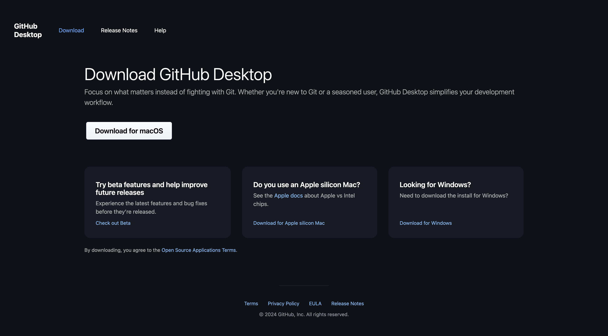
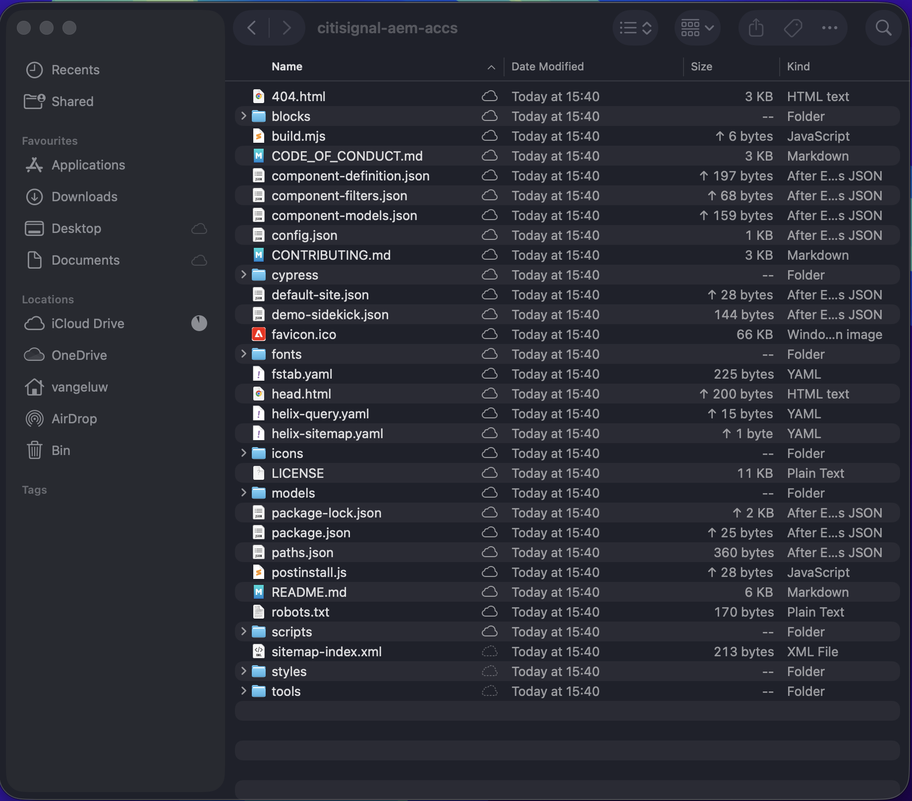
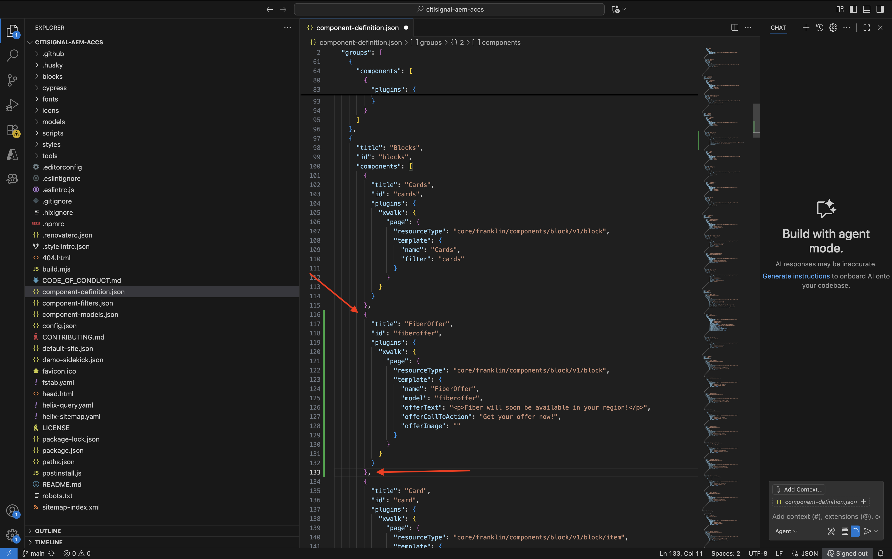
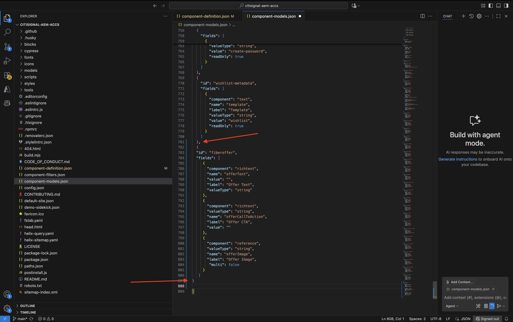
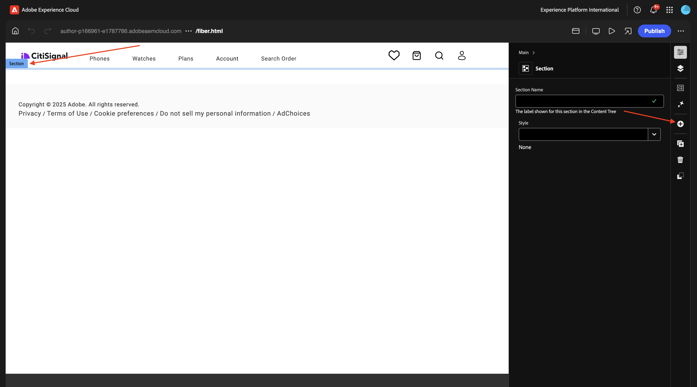
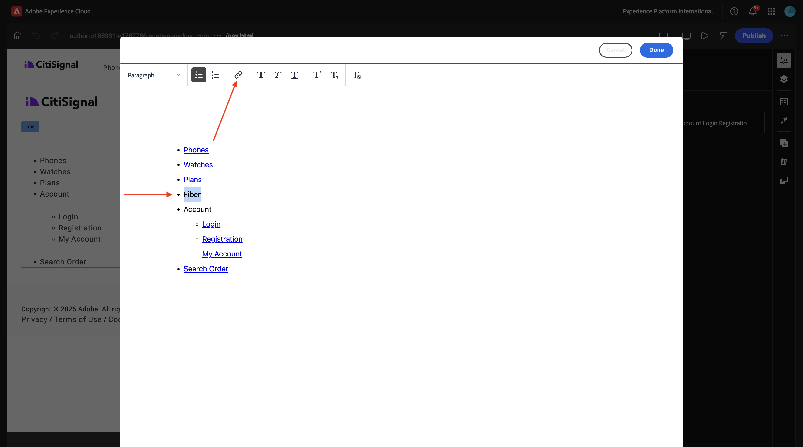

# 1.1.3 Een basisblok met aangepaste inhoud ontwikkelen

## 1.1.3.1 De lokale ontwikkelomgeving instellen

Ga naar [&#x200B; https://desktop.github.com/download/ &#x200B;](https://desktop.github.com/download/){target="_blank"}, download en installeer **Desktop van Github**.



Zodra de Desktop van Github geïnstalleerd is, ga naar de reactie GitHub u in de vorige oefening creeerde. Klik **&lt;> Code** en klik dan **Open met Desktop GitHub**.


Uw reactie GitHub zal dan in de Desktop worden geopend GitHub. Voel vrij om de **Lokale Weg** te veranderen. Klik **Kloon**.


Er wordt nu een lokale map gemaakt.



Open Visual Studio Code. Ga naar **Dossier** > **Open Omslag**.


Selecteer de omslag die door uw opstelling GitHub voor **wordt gebruikt burgerschap-aaem-toegang**.


U zult nu die omslag open in de Code van Visual Studio zien, bent u nu bereid om een nieuw blok tot stand te brengen.


## 1.1.3.2 Een aangepast basisblok maken

Adobe raadt u aan blokken te ontwikkelen in drie fasen:

- Maak de definitie en het model voor het blok, herzie het, en breng het aan productie.
- Maak inhoud met het nieuwe blok.
- Implementeer de decoratie en stijlen voor het nieuwe blok.

### component-definition.json

In de Code van Visual Studio, open het dossier **component-definition.json**.


De rol neer tot u de **Blokken** ziet. Plaats uw curseur onder de sluitende steun van de component **Kaarten**


Plak deze code en voer een komma **&#x200B;**&#x200B;na het codeblok in:

```json
{
  "title": "FiberOffer",
  "id": "fiberoffer",
  "plugins": {
    "xwalk": {
      "page": {
        "resourceType": "core/franklin/components/block/v1/block",
        "template": {
          "name": "FiberOffer",
          "model": "fiberoffer",
          "offerText": "<p>Fiber will soon be available in your region!</p>",
          "offerCallToAction": "Get your offer now!",
          "offerImage": ""
        }
      }
    }
  }
}
```

Sla uw wijzigingen op.



### component-models.json

In de Code van Visual Studio, open het dossier **component-models.json**.


Schuif omlaag totdat u het laatste item ziet. Plaats uw curseur naast de sluitende steun van de laatste component.


Voer een komma **&#x200B;**&#x200B;in en druk op Enter en op de volgende regel en plak deze code:

```json
{
  "id": "fiberoffer",
  "fields": [
     {
       "component": "richtext",
       "name": "offerText",
       "value": "",
       "label": "Offer Text",
       "valueType": "string"
     },
     {
       "component": "richtext",
       "valueType": "string",
       "name": "offerCallToAction",
       "label": "Offer CTA",
       "value": ""
     },
     {
       "component": "reference",
       "valueType": "string",
       "name": "offerImage",
       "label": "Offer Image",
        "multi": false
     }
   ]
}
```

Sla uw wijzigingen op.



### component-filters.json

In de Code van Visual Studio, open het dossier **component-filters.json**.


Onder **sectie**, ga een komma `,` in en kleef identiteitskaart van uw component `"fiberoffer"` na de huidige laatste lijn.

Sla uw wijzigingen op.


## 1.1.3.3 Uw wijzigingen vastleggen

U hebt nu verscheidene veranderingen in uw project aangebracht die terug naar uw bewaarplaats moeten worden geëngageerd GitHub. Om dat te doen, open **Desktop GitHub**.

U zou dan de 3 dossiers moeten zien die u enkel onder **Veranderingen** uitgeeft. Controleer uw wijzigingen.


Voer een naam in voor uw PR, `Fiber Offer custom block` . Klik **Vastleggen aan hoofd**.


Dan moet je dit zien. Klik **Push oorsprong**.


Na een paar seconden, zijn uw veranderingen geduwd aan uw bewaarplaats GitHub.


Ga in uw browser naar uw GitHub-account en naar de opslagplaats die u voor CitiSignal hebt gemaakt. Dan zou je iets dergelijks moeten zien, waaruit blijkt dat je wijzigingen zijn ontvangen.


## 1.1.3.4 Voeg uw blok toe aan een pagina

Nu uw basis citaatblok wordt bepaald en aan het project CitiSignal geëngageerd, kunt u a **fiberbied** blok aan een bestaande pagina toevoegen.

Ga naar [&#x200B; https://my.cloudmanager.adobe.com &#x200B;](https://my.cloudmanager.adobe.com){target="_blank"}. Klik uw **Programma** om het te openen.


Daarna, klik de 3 punten **..** op het **milieu&#39;s** lusje en klik **Details van de Mening**.


Dan zie je de omgevingsdetails. Klik URL van uw **milieu van de Auteur**.

>[!NOTE]
>
>Het is mogelijk dat uw omgeving gehiberd is. Als dat het geval is, zult u uw milieu eerst moeten ontberen.


Je moet dan de AEM Author-omgeving zien. Ga naar **Plaatsen**.


Ga naar **CitiSignal**. Klik **creëren** en selecteren **Pagina**.


Selecteer **Pagina** en klik **daarna**.


Voer de volgende waarden in:

- Titel: **Vezel**
- Naam: **vezel**
- De Titel van de pagina: **Vezel**

Klik **creëren**.


Selecteer **Open**.


Dan moet je dit zien.


Klik op het lege gebied om de **sectie** component te selecteren. Klik vervolgens op de plusknop **+** in het rechtermenu.



Vervolgens wordt het aangepaste blok weergegeven in de lijst met beschikbare blokken. Klik om het te selecteren.


U zult dan gebieden als **Tekst van de Aanbieding** zien, **CTA van de Aanbieding** en **Beeld van de Aanbieding** wordt toegevoegd aan de redacteur. Klik **+ voeg** op het **gebied van het Beeld van de Aanbieding** toe om een beeld te selecteren.


Dan moet je dit zien. Klik om de omslag **burgersignaal** te openen.


Selecteer het beeld **product-verrijking-1.png**. Klik **Uitgezocht**.


Dan moet je dit hebben. Klik **publiceren**.


Klik **publiceren** opnieuw.


Uw nieuwe pagina is nu gepubliceerd.

## 1.1.3.5 Nieuwe pagina toevoegen aan het navigatiemenu

In uw overzicht van AEM Sites, ga **CitiSignal** en controleer checkbox voor het dossier **Kopbal/nav**. Klik **uitgeven**.


Selecteer het **gebied van de Tekst** in het voorproefscherm en klik dan het **3&rbrace; gebied van de Tekst &lbrace;op de rechterkant van het scherm om het uit te geven.**


Voeg met de tekst `Fiber` een menuoptie toe aan het navigatiemenu. Selecteer de tekst **Vezel** en klik het **verbindings** pictogram.



Ga dit voor **URL** in `/content/CitiSignal/fiber.html` en klik het **V** pictogram om te bevestigen.


Dan moet je dit hebben. Klik **Gedaan**.


Dan moet je dit hebben. Klik **publiceren**.


Klik **publiceren** opnieuw.


U kunt nu de wijzigingen in uw website bekijken door naar `main--citisignal--XXX.aem.page/us/en/` en/of `main--citisignal--XXX.aem.live/us/en/` te gaan, nadat u XXX hebt vervangen door uw GitHub-gebruikersaccount, die in dit voorbeeld `woutervangeluwe` is.

In dit voorbeeld wordt de volledige URL als volgt:
`https://main--citisignal--woutervangeluwe.aem.page/us/en/` en/of `https://main--citisignal--woutervangeluwe.aem.live/us/en/` .

Dan moet je dit zien. Klik **Vezel**.


Hier is uw standaard aangepaste blok, maar nu weergegeven op de website.


Volgende Stap: [&#x200B; Geavanceerd Blok van de Douane &#x200B;](./ex4.md){target="_blank"}

Ga terug naar [&#x200B; Adobe Experience Manager Cloud Service &amp; Edge Delivery Services &#x200B;](./aemcs.md){target="_blank"}

[&#x200B; ga terug naar Alle Modules &#x200B;](./../../../overview.md){target="_blank"}
