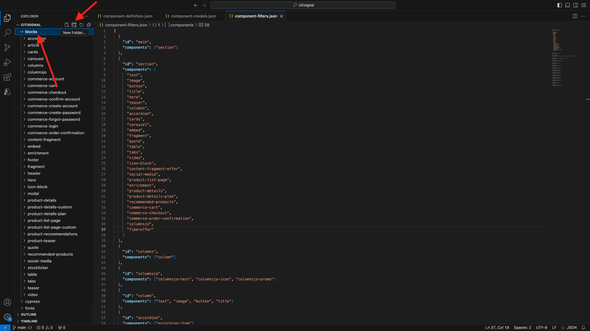

# 1.1.4 Geavanceerd aangepast blok

In de vorige oefening, vormde u een basisdouaneblok genoemd **Aanbieding van de Vezel** dat showcases als **Tekst van de Aanbieding**, **Aanbieding CTA** en **Aanbieding** op uw website.

U kunt nu aan dit blok blijven werken.

{zoomable="yes"}

## 1.1.4.1 Stijl uw blok

Nu u een werkend **vezelaanbieding** blok hebt kunt u het stileren op het toepassen.

Ga terug naar de Code van Visual Studio en open de omslag **blokken**. Er moeten nu meerdere mappen worden weergegeven die elk naar een specifiek blok verwijzen. Om uw **vezelaanbieding** blok geavanceerder te maken, moet u nu een omslag voor uw douaneblok tot stand brengen.

{zoomable="yes"}

Selecteer de omslag **blokken** en klik dan **creëren Nieuwe Omslag** pictogram.

{zoomable="yes"}

Noem uw omslag `fiberoffer` en de slag **gaat** binnen.

{zoomable="yes"}

Selecteer de nieuwe **fiberoffer** omslag en klik **creëren Nieuw Dossier** pictogram.

{zoomable="yes"}

Er wordt nu een nieuw bestand gemaakt. Ga de naam **fiberoffer.js** in en de slag gaat binnen.

{zoomable="yes"}

U kunt blokversiering nu uitvoeren door volgende JavaScript in het dossier **toe te voegen fiberoffer.js**.

Sla het bestand op.

```js
export default function decorate(block) {
  const offerText = block.children[0];
  const offerCTA = block.children[1];
  const offerImage = block.children[2];

  offerText.id = 'offerText';
  offerText.className = 'offerText';
  offerCTA.id = 'offerCTA';
  offerCTA.className = 'offerCTA';
  offerImage.id = 'offerImage';
  offerImage.className = 'offerImage';
}
```

{zoomable="yes"}

Selecteer de nieuwe **fiberoffer** omslag en klik **creeer opnieuw Nieuw Dossier** pictogram.

{zoomable="yes"}

Er wordt nu een nieuw bestand gemaakt. Ga de naam **fiberoffer.css** in en de slag gaat binnen.

{zoomable="yes"}

Kopieer en plak de volgende CSS-code in het nieuwe bestand.

```js
.offerText, .offerCTA, .offerImage{
    color: #14161A;
    font-size: 30px;
    padding: 0 0 24px;
    display: flex;
    flex-direction: column;
    margin: 1rem 0;
    text-align: center;
}
```

Sla uw wijzigingen op.

{zoomable="yes"}

U hebt nu verscheidene veranderingen in uw project aangebracht die terug naar uw bewaarplaats moeten worden geëngageerd GitHub. Om dat te doen, open **Desktop GitHub**.

U zou dan de 2 dossiers moeten zien die u enkel onder **Veranderingen** heeft uitgegeven. Controleer uw wijzigingen.

Voer een naam in voor uw PR, `js css` . Klik **Vastleggen aan hoofd**.

{zoomable="yes"}

Dan moet je dit zien. Klik **Push oorsprong**.

{zoomable="yes"}

Ga in uw browser naar uw GitHub-account en naar de opslagplaats die u voor CitiSignal hebt gemaakt. Dan zou je iets dergelijks moeten zien, waaruit blijkt dat je wijzigingen zijn ontvangen.

{zoomable="yes"}

U kunt nu de wijzigingen in uw website bekijken door naar `main--citisignal--XXX.aem.page/us/en/` en/of `main--citisignal--XXX.aem.live/us/en/` te gaan, nadat u XXX hebt vervangen door uw GitHub-gebruikersaccount, die in dit voorbeeld `woutervangeluwe` is.

In dit voorbeeld wordt de volledige URL als volgt:
`https://main--citisignal--woutervangeluwe.aem.page/us/en/` en/of `https://main--citisignal--woutervangeluwe.aem.live/us/en/` .

Dit wordt dan weergegeven met de opmaak die op de pagina is toegepast.

{zoomable="yes"}

## 1.1.4.2 Logica toevoegen en gegevens laden vanaf een extern eindpunt

Voor deze oefening, zult u een &quot;ruwe&quot;configuratie van Adobe Web SDK doen en u zult het volgende beste voorstel van Adobe Journey Optimizer Offer Decisioning vragen.

Om duidelijk te zijn: dit is niet bedoeld als een best practice-implementatie van Web SDK voor AEM as a Cloud Service. In de volgende oefening zult u gegevensinzameling gebruikend een specifieke stop uitvoeren die voor dit werd ontwikkeld.

Deze oefening is bedoeld om u een paar basisdingen in JavaScript te tonen, als het laden van een externe bibliotheek JS, gebruikend de {**bibliotheek 0} alloy.js, die een verzoek en meer verzenden.**

De bibliotheek **alloy.js** is de bibliotheek achter Web SDK die het mogelijk maakt om verzoeken van een website naar Adobe Edge Network, en van daar zo toepassingen zoals Adobe Experience Platform, Adobe Analytics, Adobe Target en meer te verzenden.

Voeg deze code toe onder de vorige code die u hebt toegevoegd voor de opmaak van het blok:

```javascript
var script1 = document.createElement('script');
  script1.text = "!function(n,o){o.forEach(function(o){n[o]||((n.__alloyNS=n.__alloyNS||[]).push(o),n[o]=function(){var u=arguments;return new Promise(function(i,l){n[o].q.push([i,l,u])})},n[o].q=[])})}(window,['alloy']);"
  document.head.appendChild(script1);

  var script2 = document.createElement('script');
  script2.async = true;
  script2.src = "https://cdn1.adoberesources.net/alloy/2.14.0/alloy.min.js";
  document.head.appendChild(script2);

  alloy("configure", {
    "edgeConfigId": "045c5ee9-468f-47d5-ae9b-a29788f5948f",
    "orgId": "907075E95BF479EC0A495C73@AdobeOrg",
    "defaultConsent": "in"
  });
```

Dan moet je dit hebben.

De eerste manuscriptmarkering (script1) die u toevoegde, is een functie die door SDK van het Web wordt gebruikt en die tot een venstervoorwerp leidt, genoemd **legering**.

De tweede scripttag (script2) laadt asynchroon de bibliotheek alloy.js van de Adobe CDN.

In het derde codeblok wordt in feite het legeringsobject geconfigureerd voor het verzenden van gegevens naar een specifieke Adobe IMS Org en DataStream.

In **Begonnen het Worden** module, vormde u reeds een datastream, geroepen `--aepUserLdap-- - One Adobe Datastream`. Het gebied **edgeConfigId** in de bovengenoemde codeverwijzingen identiteitskaart van de gegevensstroom die werd gevormd.

U te hoeven niet om het gebied **edgeConfigId** op dit ogenblik te veranderen. In de volgende oefening zult u dit kunnen doen gebruikend de **MarTech** stop.

{zoomable="yes"}

Dat zou u nu moeten doen.

{zoomable="yes"}

Voeg vervolgens dit blok toe onder de vorige code die u hebt toegevoegd.

```javascript
var ECID = "";

  alloy("getIdentity")
    .then(function (result) {
      // The command succeeded.
      console.log("ECID:", result.identity.ECID);
      ECID = result.identity.ECID;
      getOffer(ECID);

    })
    .catch(function (error) {
      // The command failed.
      // "error" will be an error object with additional information.
    });
```

Dit codeblok wordt gebruikt om de waarde van de Experience Cloud-id (ECID) op te halen. De ECID is de unieke apparaat-id van uw browser.

Zoals u in de bovenstaande code kunt zien, wordt een andere functie aangeroepen wanneer de ECID is opgehaald. Deze functie wordt genoemd **getOffer ()** die u daarna zult toevoegen.

{zoomable="yes"}

Voeg vervolgens de onderstaande code toe onder de

```javascript
async function getOffer(ECID) {
  var url = "https://edge.adobedc.net/ee/irl1/v1/interact?configId=045c5ee9-468f-47d5-ae9b-a29788f5948f";

  var timestamp = new Date().toISOString();

  var offerRequest = {
    "events": [
      {
        "xdm": {
          "eventType": "decisioning.propositionDisplay",
          "timestamp": timestamp,
          "_experienceplatform": {
            "identification": {
              "core": {
                "ecid": ECID
              }
            }
          },
          "identityMap": {
            "ECID": [
              {
                "id": ECID
              }
            ]
          }
        },
        "query": {
          "personalization": {
            "schemas": [
              "https://ns.adobe.com/personalization/default-content-item",
              "https://ns.adobe.com/personalization/html-content-item",
              "https://ns.adobe.com/personalization/json-content-item",
              "https://ns.adobe.com/personalization/redirect-item",
              "https://ns.adobe.com/personalization/ruleset-item",
              "https://ns.adobe.com/personalization/message/in-app",
              "https://ns.adobe.com/personalization/message/content-card",
              "https://ns.adobe.com/personalization/dom-action"
            ],
            "decisionScopes": [
              "eyJ4ZG06YWN0aXZpdHlJZCI6ImRwczpvZmZlci1hY3Rpdml0eToxYTI3ODk3NzAzYTY5NWZmIiwieGRtOnBsYWNlbWVudElkIjoiZHBzOm9mZmVyLXBsYWNlbWVudDoxYTI0ZGM2MWJmYjJlMjIwIn0=",
              "eyJ4ZG06YWN0aXZpdHlJZCI6ImRwczpvZmZlci1hY3Rpdml0eToxYTI3ODk3NzAzYTY5NWZmIiwieGRtOnBsYWNlbWVudElkIjoiZHBzOm9mZmVyLXBsYWNlbWVudDoxYTI0ZGM0MzQyZjJlMjFlIn0="
            ]
          }
        }
      }
    ]
  }

  try {
    const response = await fetch(url, {
      method: "POST",
      headers: {
        "Content-Type": "application/json"
      },
      body: JSON.stringify(offerRequest),
    });

    if (response.status === 200) {
      var body = await response.json();
      console.log("Offer Decisioning Response: ", body);

      const decisions = body["handle"];

      decisions.forEach(decision => {
        if (decision["type"] == "personalization:decisions") {
          console.log("Offer Decisioning decision detail: ", decision);
          const payloads = decision["payload"];

          if (payloads === undefined || payloads.length == 0) {
            //do nothing
          } else {
            payloads.forEach(payload => {
              if (payload["placement"]["name"] == "Web - Image") {
                console.log("Web-Image payload");
                const items = payload["items"];
                items.forEach(item => {
                  if (item["id"].includes("dps:fallback-offer")) {
                    console.log("Item details: ", item);
                    const deliveryURL = item["data"]["deliveryURL"];

                    document.querySelector("#offerImage").innerHTML = "";
                  } else if (item["id"].includes("dps:personalized-offer")) {
                    console.log("Item details: ", item);
                    const deliveryURL = item["data"]["deliveryURL"];
                    console.log("Web-Image Personalized Offer Content: ", deliveryURL)

                    document.querySelector("#offerImage").innerHTML = "";
                  }
                });
              } else if (payload["placement"]["name"] == "Web - JSON") {
                console.log("Web-JSON payload");
                const items = payload["items"];
                items.forEach(item => {
                  if (item["id"].includes("dps:fallback-offer")) {
                    const content = JSON.parse(item["data"]["content"]);

                    console.log("Web-JSON Fallback Content: ", content)

                    document.querySelector("#offerText").innerHTML = content.text;
                    document.querySelector("#offerCTA").innerHTML = content.cta;
                  } else if (item["id"].includes("dps:personalized-offer")) {
                    const content = JSON.parse(item["data"]["content"]);

                    console.log("Web-JSON Personalized Offer Content: " + content);

                    document.querySelector("#offerText").innerHTML = content.text;
                    document.querySelector("#offerCTA").innerHTML = content.cta;
                  }
                });
              }
            });
          }
          document.querySelector("#offerImage").style.display = "block";
          document.querySelector("#offerText").style.display = "block";
          document.querySelector("#offerCTA").style.display = "block";
        }
      });
    } else {
      console.warn("Offer Decisioning Response unsuccessful:", response.body);
    }
  } catch (error) {
    console.error("Error when getting Offer Decisioning Response:", error);
  }
}
```

Het is zeer belangrijk dat dit codeblok onder de sluitende steun wordt gekleefd die u op lijn 42 in dit voorbeeld kunt zien. De code u enkel plakte is een afzonderlijke functie die het heeft vereist eigen plaats in dit dossier, en kan niet in de bovengenoemde **standaardfunctie** worden genest.

{zoomable="yes"}

Het codeblok u enkel plakte simuleert een verzoek dat normaal door Web SDK/alloy.js zou worden gemaakt. In dit voorbeeld zal a **halen** verzoek aan **edge.adobedc.net** worden gemaakt.

In het verzoek, worden 2 **Scopes van het Besluit** gespecificeerd die Adobe Journey Optimizer Offer Decisioning zullen vragen om een besluit over welke aanbieding te verstrekken door dit ECID moet worden gezien.

Zodra de reactie wordt ontvangen, zal deze code de reactie ontleden en dingen als URL van het beeld filtreren dat moet worden getoond en ook de reactie JSON die dingen zoals de Tekst van de Aanbieding en de CTA van de Aanbieding bevat, waarna zal het deze op de website tonen.

Herinner me - deze benadering wordt gebruikt enkel voor enablement doel en is niet de beste manier om gegevensinzameling uit te voeren.

Sla uw wijzigingen op. Dan, open **Desktop van Github**, geef een naam aan uw PR en klik **verbind aan hoofd**.

{zoomable="yes"}

Daarna, klik **Push oorsprong**.

{zoomable="yes"}

U kunt nu de wijzigingen in uw website bekijken door naar `main--citisignal--XXX.aem.page/us/en/` en/of `main--citisignal--XXX.aem.live/us/en/` te gaan, nadat u XXX hebt vervangen door uw GitHub-gebruikersaccount, die in dit voorbeeld `woutervangeluwe` is.

In dit voorbeeld wordt de volledige URL als volgt:
`https://main--citisignal--woutervangeluwe.aem.page/us/en/` en/of `https://main--citisignal--woutervangeluwe.aem.live/us/en/` .

Dan moet je dit zien.

{zoomable="yes"}

Volgende Stap: [ AEM Edge Delivery Services MarTech plugin ](./ex5.md){target="_blank"}

Ga terug naar [ Adobe Experience Manager Cloud Service &amp; Edge Delivery Services ](./aemcs.md){target="_blank"}

[ ga terug naar Alle Modules ](./../../../overview.md){target="_blank"}
