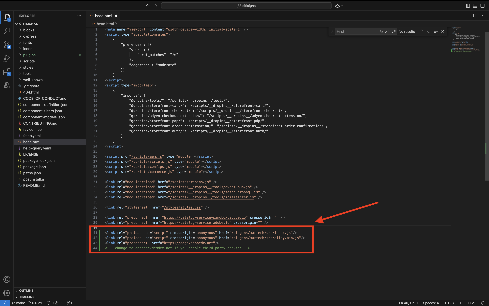
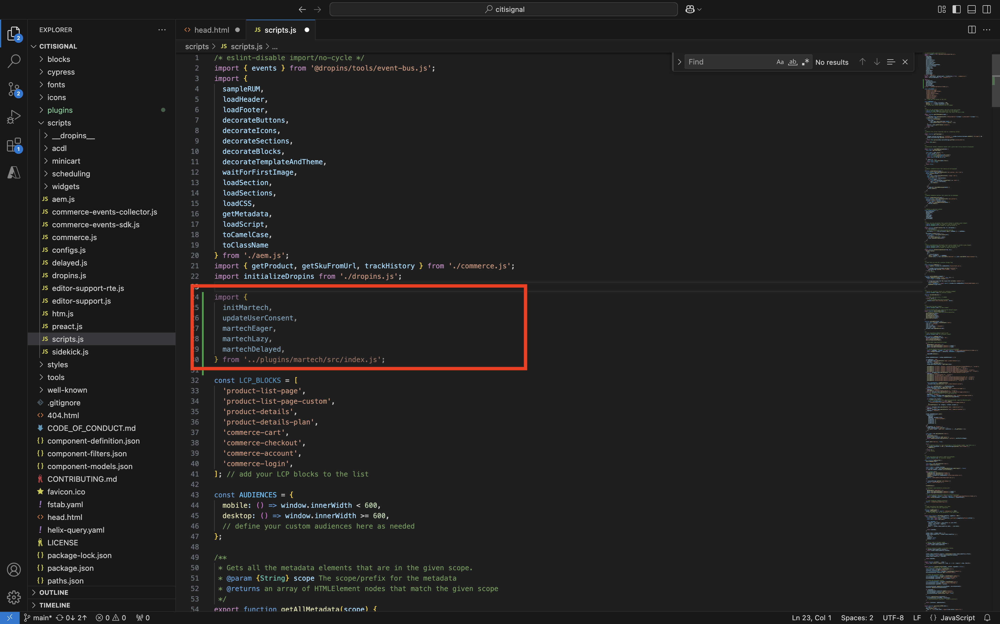
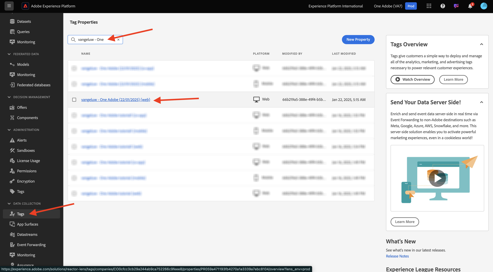
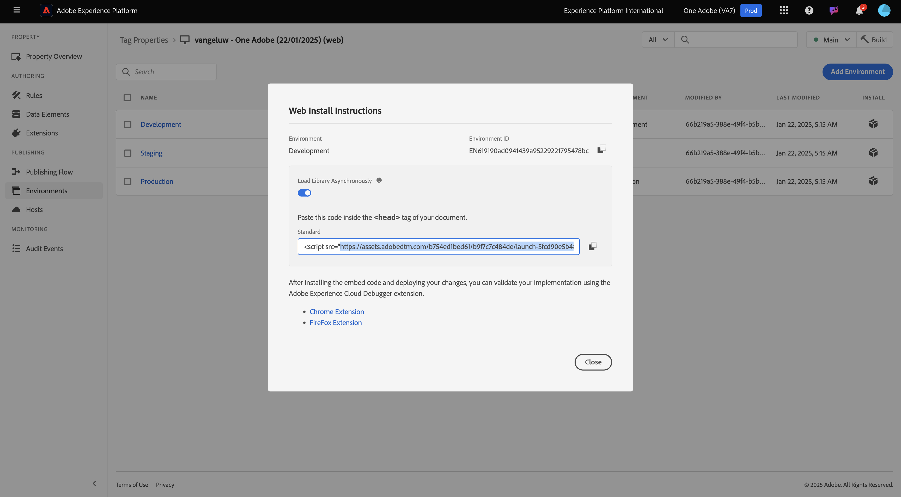
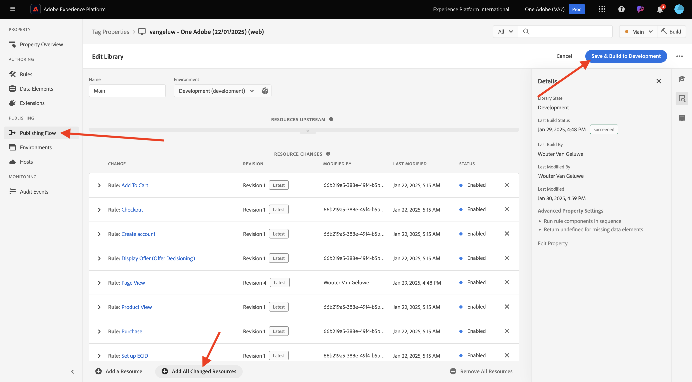
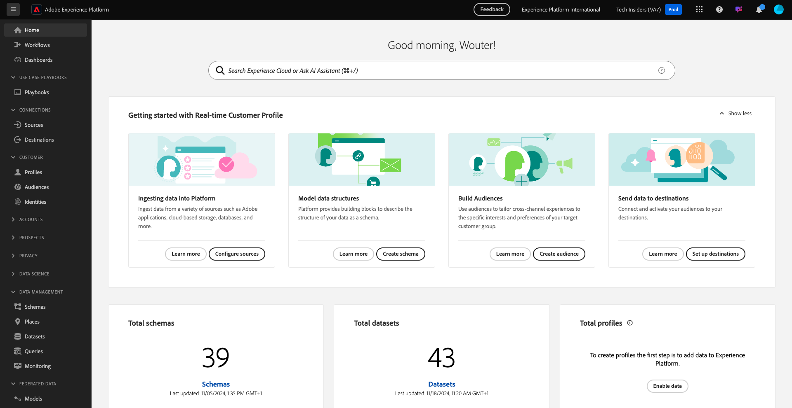
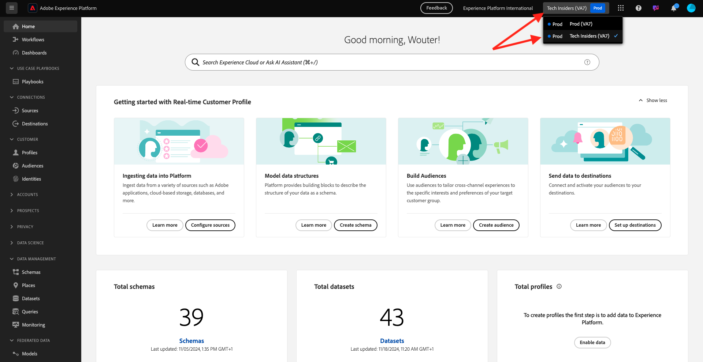

# 1.1.5 AEM Edge Delivery Services MarTech-insteekmodule

Met de AEM MarTech-insteekmodule kunt u snel een complete MarTech-stapel instellen voor uw AEM-project.

>[!NOTE]
>
>Deze insteekmodule is momenteel beschikbaar voor klanten in samenwerking met AEM Engineering via co-innovatieprojecten. U kunt meer informatie over [ https://github.com/adobe-rnd/aem-martech ](https://github.com/adobe-rnd/aem-martech) vinden.

## 1.1.5.1 Voeg de plug-in toe aan uw reactie

Navigeer aan de omslag die u voor uw **burgerschap** bewaarplaats GitHub gebruikt. Klik de omslagnaam met de rechtermuisknop aan en selecteer dan **Nieuwe Terminal bij Omslag**.

{zoomable="yes"}

Dan zie je dit. Plak het volgende bevel en de slag **gaat** binnen.

```
git subtree add --squash --prefix plugins/martech https://github.com/adobe-rnd/aem-martech.git main
```

Dan moet je dit zien.

{zoomable="yes"}

Navigeer aan de omslag die u voor uw **burgerschap** GitHub bewaarplaats gebruikt, open de omslag **stoppen**. U zou een omslag moeten nu zien genoemd **martech**.

{zoomable="yes"}

## 1.1.5.2 head.html

In de Code van Visual Studio, open het dossier **head.html**. Kopieer de hieronder code en kleef het in het dossier **head.html**.

```javascript
<link rel="preload" as="script" crossorigin="anonymous" href="/plugins/martech/src/index.js"/>
<link rel="preload" as="script" crossorigin="anonymous" href="/plugins/martech/src/alloy.min.js"/>
<link rel="preconnect" href="https://edge.adobedc.net"/>
<!-- change to adobedc.demdex.net if you enable third party cookies -->
```

Sla uw wijzigingen op.

{zoomable="yes"}

## 1.1.5.3 scripts.js

In de Code van Visual Studio, ga naar de omslag **manuscripten** en open het dossier **scripts.js**. Kopieer de hieronder code en kleef het in het dossier **scripts.js**, onder de bestaande de invoermanuscripten.

```javascript
import {
  initMartech,
  updateUserConsent,
  martechEager,
  martechLazy,
  martechDelayed,
} from '../plugins/martech/src/index.js';
```

Sla uw wijzigingen op.

{zoomable="yes"}

In de Code van Visual Studio, in het dossier **scripts.js**, vind de volgende code:

```javascript
const AUDIENCES = {
  mobile: () => window.innerWidth < 600,
  desktop: () => window.innerWidth >= 600,
  // define your custom audiences here as needed
};
```

Onder **const AUDIENCES = {...};** kleef de hieronder code:

```javascript
  const isConsentGiven = true;
  const martechLoadedPromise = initMartech(
    // The WebSDK config
    // Documentation: https://experienceleague.adobe.com/en/docs/experience-platform/web-sdk/commands/configure/overview#configure-js
    {
      datastreamId: "XXX",
      orgId: "XXX",
      defaultConsent: 'in',
      onBeforeEventSend: (payload) => {
        // set custom Target params 
        // see doc at https://experienceleague.adobe.com/en/docs/platform-learn/migrate-target-to-websdk/send-parameters#parameter-mapping-summary
        payload.data.__adobe.target ||= {};

        // set custom Analytics params
        // see doc at https://experienceleague.adobe.com/en/docs/analytics/implementation/aep-edge/data-var-mapping
        payload.data.__adobe.analytics ||= {};
      },

      // set custom datastream overrides
      // see doc at:
      // - https://experienceleague.adobe.com/en/docs/experience-platform/web-sdk/commands/datastream-overrides
      // - https://experienceleague.adobe.com/en/docs/experience-platform/datastreams/overrides
      edgeConfigOverrides: {
        // Override the datastream id
        // datastreamId: '...'

        // Override AEP event datasets
        // com_adobe_experience_platform: {
        //   datasets: {
        //     event: {
        //       datasetId: '...'
        //     }
        //   }
        // },

        // Override the Analytics report suites
        // com_adobe_analytics: {
        //   reportSuites: ['...']
        // },

        // Override the Target property token
        // com_adobe_target: {
        //   propertyToken: '...'
        // }
      },
    },
    // The library config
    {
      launchUrls: ["XXX"],
      personalization: !!getMetadata('target') && isConsentGiven,
    },
  );
```

{zoomable="yes"}

Er zijn een paar variabelen die u in de bovengenoemde code, door de variabelen van uw eigen milieu moet vervangen:

- `datastreamId: "XXX"`
- `orgId: "XXX"`
- `launchUrls: ["XXX"]`

U kunt deze variabelen vinden door deze instructies te volgen:

### datastreamId

Ga naar [ https://platform.adobe.com/ ](https://platform.adobe.com/) en ga dan naar **Datastreams** in het linkermenu. Zorg ervoor dat u in de juiste zandbak bent, die `--aepSandboxName--` zou moeten zijn. Zoek in de datastream die is gemaakt in de sectie Aan de slag van deze zelfstudie, die de naam `--aepUserLdap-- - One Adobe Datastream` moet krijgen. Klik het **exemplaar** pictogram om **identiteitskaart DataStream** te kopiëren en het in de Code van Visual Studio, in het dossier **scripts.js** te kleven, door de placeholder waarde `XXX` naast `datastreamId:` te vervangen.

{zoomable="yes"}

### orgId

Ga naar [ https://platform.adobe.com/ ](https://platform.adobe.com/) en ga dan naar **Vragen** in het linkermenu. Onder **Geloofsbrieven**, zult u **IMS Org identiteitskaart** als **Gebruikersnaam** vinden. Klik het **pictogram van het 0&rbrace; exemplaar &lbrace;om** IMS Org identiteitskaart **te kopiëren en het in de Code van Visual Studio, in het dossier** scripts.js **te kleven, door de placeholder waarde** naast `XXX` te vervangen.`orgId:`

{zoomable="yes"}

### launchUrls

Ga naar [ https://platform.adobe.com/ ](https://platform.adobe.com/) en ga dan naar **Markeringen** in het linkermenu. Zoek naar uw eigenschap met behulp van de LDAP, die `--aepUserLdap--` moet zijn. Open uw bezit van het Web.

{zoomable="yes"}

In het linkermenu, ga naar **Milieu&#39;s** en klik dan **installeer** pictogram voor het **milieu van de Ontwikkeling**.

{zoomable="yes"}

U vindt dan de URL die u nodig hebt, maar deze bevindt zich in een HTML `<script></script>` -tag. Kopieer alleen het onderdeel dat begint bij `https` tot `.min.js` .

{zoomable="yes"}

De URL ziet er als volgt uit: `https://assets.adobedtm.com/b754ed1bed61/b9f7c7c484de/launch-5fcd90e5b482-development.min.js`. Zorg ervoor dat er geen andere tekst wordt gekopieerd, omdat dit fouten zou veroorzaken. In de Code van Visual Studio, in het dossier **scripts.js**, vervang de placeholder waarde `XXX` in de `launchUrls:` serie.

U hebt nu de drie variabelen die u nodig hebt. Het bestand `scripts.js` moet er nu als volgt uitzien:

{zoomable="yes"}

Zoek vervolgens naar dit codeblok:

```javascript
const main = doc.querySelector('main');
  if (main) {
    decorateMain(main);
    document.body.classList.add('appear');
    await loadSection(main.querySelector('.section'), waitForFirstImage);	
  }
```

{zoomable="yes"}

Vervang het door dit codeblok:

```javascript
const main = doc.querySelector('main');
  if (main) {
    decorateMain(main);
    document.body.classList.add('appear');
    await Promise.all([
      martechLoadedPromise.then(martechEager),
      loadSection(main.querySelector('.section'), waitForFirstImage)
    ]);
  }
```

{zoomable="yes"}

Zoek vervolgens naar en blader omlaag naar `async function loadLazy(doc) {` .

{zoomable="yes"}

Voeg onder de regel `autolinkModals(doc);` de volgende coderegel toe:

```javascript
await martechLazy();
```

{zoomable="yes"}

Zoek vervolgens naar de regel en blader omlaag naar de regel `function loadDelayed() {` .

{zoomable="yes"}

Voeg dit codeblok onder de regel `// load anything that can be postponed to the latest here` toe.

```javascript
window.setTimeout(() => {
    martechDelayed();
    return import('./delayed.js');
  }, 3000);
```

{zoomable="yes"}

Zoek vervolgens naar de regel die `window.adobeDataLayer.push` bevat en ga naar deze regel.

{zoomable="yes"}

Het object `pageContext` wordt als volgt gedefinieerd. U moet nu twee objecten toevoegen onder `pageContext` .

```javascript
	pageContext: {
      pageType,
      pageName: document.title,
      eventType: 'visibilityHidden',
      maxXOffset: 0,
      maxYOffset: 0,
      minXOffset: 0,
      minYOffset: 0,
    }
```

Dit is de code die moet worden toegevoegd:

```javascript
	,
    _experienceplatform: {
      identification:{
        core:{
          ecid: sessionStorage.getItem("com.adobe.reactor.dataElements.ECID")
        }
      }
    },
    web: {
      webPageDetails:{
        name: document.title,
        URL: window.location.href
      }
    }
```

**window.adobeDataLayer.push** zou nu als dit moeten kijken:

```javascript
  window.adobeDataLayer.push({
    pageContext: {
      pageType,
      pageName: document.title,
      eventType: 'visibilityHidden',
      maxXOffset: 0,
      maxYOffset: 0,
      minXOffset: 0,
      minYOffset: 0,
    },
    _experienceplatform: {
      identification:{
        core:{
          ecid: sessionStorage.getItem("com.adobe.reactor.dataElements.ECID")
        }
      }
    },
    web: {
      webPageDetails:{
        name: document.title,
        URL: window.location.href
      }
    }
  });
```

{zoomable="yes"}

U hebt nu alle vereiste veranderingen in het dossier **scripts.js** aangebracht.

De open cliënt van de Desktop van GitHub en begaat uw veranderingen.

{zoomable="yes"}

Klik **Push oorsprong** om uw veranderingen in uw bewaarplaats te duwen GitHub.

{zoomable="yes"}

## 1.1.5.4 ACDL-extensie in eigenschap Codes

Als u de AEM Edge Delivery Services MarTech-insteekmodule correct wilt laten werken, moet u de extensie voor

Ga naar [ https://experience.adobe.com/#/data-collection/ ](https://experience.adobe.com/#/data-collection/). Zoek naar en open dan uw bezit van Markeringen voor Web, dat `--aepUserLdap-- - One Adobe (DD/MM/YYYY)` wordt genoemd.

{zoomable="yes"}

Ga naar **Uitbreidingen**, aan **Catalogus**. Klik de Laag van Gegevens van de Cliënt van de uitbreiding **Adobe** en klik dan **installeren**.

{zoomable="yes"}

Dan moet je dit zien. Op dit moment hoeft niets te veranderen. Klik **sparen aan Bibliotheek**.

{zoomable="yes"}

Uw extensie wordt vervolgens toegevoegd aan de eigenschap Tags.

{zoomable="yes"}

Ga naar **het Publiceren Stroom** en open uw **Belangrijkste** bibliotheek. Klik **toevoegen alle Gewijzigde Middelen** en klik dan **sparen &amp; bouwen aan Ontwikkeling**.

{zoomable="yes"}

Uw wijzigingen zijn nu geïmplementeerd.

## 1.1.5.5 Gegevens verzenden naar Adobe Experience Platform Edge Network

U kunt nu de wijzigingen in uw website bekijken door naar `main--citisignal--XXX.aem.page/us/en/` en/of `main--citisignal--XXX.aem.live/us/en/` te gaan, nadat u XXX hebt vervangen door uw GitHub-gebruikersaccount, die in dit voorbeeld `woutervangeluwe` is.

In dit voorbeeld wordt de volledige URL als volgt:
`https://main--citisignal--woutervangeluwe.aem.page/us/en/` en/of `https://main--citisignal--woutervangeluwe.aem.live/us/en/` .

>[!NOTE]
>
>U kunt overwegen een incognito-webpagina te openen om ervoor te zorgen dat u de gegevensverzameling start met een nieuw, schoon profiel. Dit is gemakkelijker voor het zuiveren en het oplossen van problemen.

{zoomable="yes"}

In Chrome, open **Hulpmiddelen van de Ontwikkelaar** door **Meer Hulpmiddelen** te gaan > **Hulpmiddelen van de Ontwikkelaar**.

{zoomable="yes"}

In **de mening van de Console**, zult u een aantal lijnen zien die met `[alloy]` beginnen. Kijk eens naar de verzoeken, één van hen zou als dit moeten kijken en het verzoeklichaam hebben zoals die in het beeld wordt vermeld.

`[alloy] Request 55a9ddbc-0521-4ba3-b527-3da2cb35328a: Sending request.`

Open de payload en boor omlaag naar het veld `events[0].xdm._experienceplatform.identification.core.ecid` en kopieer de ECID.

{zoomable="yes"}

## 1.1.5.6 Klantprofiel weergeven in Adobe Experience Platform

Login aan Adobe Experience Platform door naar dit URL te gaan: [ https://experience.adobe.com/platform ](https://experience.adobe.com/platform).

Na het aanmelden landt je op de homepage van Adobe Experience Platform.

{zoomable="yes"}

Alvorens u verdergaat, moet u a **zandbak** selecteren. De te selecteren sandbox krijgt de naam ``--aepSandboxName--`` . Na het selecteren van de aangewezen zandbak, zult u de het schermverandering zien en nu bent u in uw specifieke zandbak.

{zoomable="yes"}

In het linkermenu, ga naar **Klant** > **Profielen** > **doorbladeren**. Selecteer **Identiteit namespace** van **ECID** en dan voorbij **ECID** die u in de vorige stap kopieerde. Klik **Mening**. Vervolgens wordt een profiel weergegeven in de lijst. Klik erop om het te openen.

{zoomable="yes"}

U zult dan het **overzicht van het Dashboard van het 0&rbrace; Profiel zien &lbrace;, dat ECID toont.** Daarna, ga naar **Gebeurtenissen**.

{zoomable="yes"}

Onder **Gebeurtenissen**, zult u verscheidene Gebeurtenissen van de Ervaring, met inbegrip van een gebeurtenis met eventType **web.webpagedetails.pageViews** zien. Klik **Mening JSON** om alle gebeurtenissen te bekijken die werden verzameld.

{zoomable="yes"}

In de **JSON** mening, verifieer de gebeurtenis met eventType **web.webpagedetails.pageViews** om dingen als de **Naam van de Pagina** en **Pagina URL** te zien.

{zoomable="yes"}

Je hebt deze oefening nu voltooid.

Volgende Stap: [ Samenvatting &amp; Voordelen ](./summary.md){target="_blank"}

Ga terug naar [ Adobe Experience Manager Cloud Service &amp; Edge Delivery Services ](./aemcs.md){target="_blank"}

[ ga terug naar Alle Modules ](./../../../overview.md){target="_blank"}
