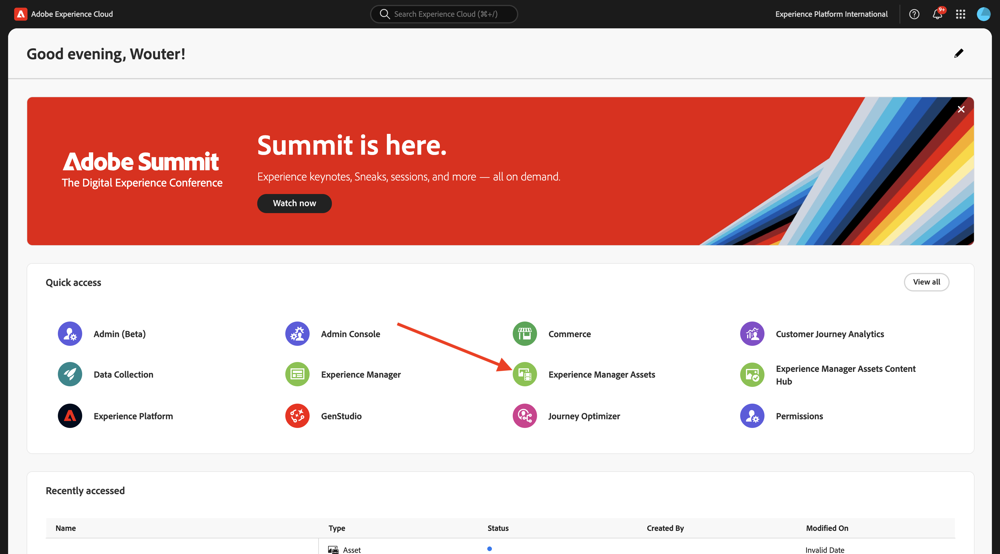
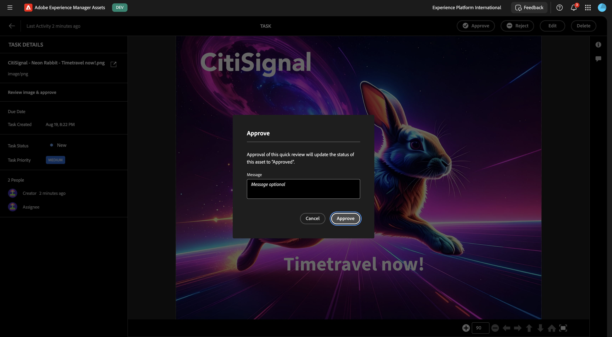

# 1.2.1 Aan de slag met AEM Assets

Ga naar [&#x200B; https://experience.adobe.com/ &#x200B;](https://experience.adobe.com/){target="_blank"}. Zorg ervoor dat u zich in de juiste omgeving bevindt, die u `--aepImsOrgName--` moet noemen.

Open **Adobe Experience Manager Assets**.

Selecteer de AEM Assets CS-omgeving die aan u is toegewezen. In dit geval is de omgeving die moet worden geselecteerd `--aepUserLdap-- - CitiSignal dev author` .

Dan moet je dit zien. Ga naar **Assets**.

Gebruik een map met de naam `--aepUserLdap-- - CitiSignal Fiber Campaign` . Als het nog niet bestaat, klik **creeer Omslag**.

Ga de naam `--aepUserLdap--` voor uw omslag in en klik **creeer**.

Open de nieuwe map. In een van de vorige exercities hebt u twee afbeeldingen gemaakt met de namen `CitiSignal - Neon Rabbit - Get On Board Now!.png` en `CitiSignal - Neon Rabbit - Timetravel now!.png` . U moet deze afbeeldingen nu in deze map uploaden als ze er nog niet zijn.

Voor het geval u deze dossiers niet meer hebt, kunt u hen [&#x200B; hier &#x200B;](./images/CitiSignal_Neon_Rabbit.zip){target="_blank"} downloaden.

Klik **toevoegen Assets**.

Selecteer de twee bovenstaande afbeeldingen. Klik **Open**.

Klik **uploaden**.

Klik op een van de afbeeldingen om deze te selecteren.

Klik **Details**.

U ziet nu de beschikbare metagegevens van het specifieke bestand.

In het juiste menu, ga naar **Vertoningen**. Vervolgens ziet u een aantal vooraf gedefinieerde uitvoeringen van de afbeelding die u hebt geselecteerd, zodat u deze kunt downloaden.

In het juiste menu, klik het **schaar** pictogram. U vindt een aantal bewerkingsacties die beschikbaar zijn voor u, aangedreven door Adobe Express. Klik **verwijderen Achtergrond**.

Na een paar seconden, zou u iets gelijkaardig aan dit moeten zien, met de capaciteit om of uw veranderingen toe te passen of het nieuwe dossier te downloaden. Sluit de pop-up.

Het Beeld van de klem **Gewas**.

U kunt enkele variaties van verschillende snijgrootten testen.

In het juiste menu, ga naar **Taken**. Klik **toewijzen Taken**.

Plaats de **Titel van de Taak** aan `Review image & approve`. Wijs uzelf toe. Klik **creëren**.

Klik **Mening** op het bericht.

Alternatief, vernieuw het scherm om de pas gecreëerde taken te zien verschijnen in de **Verwante lijst van Taken**. Klik de **Open** knoop om het detail van de taak te bekijken.

Dan moet je iets dergelijks zien. Klik **goedkeuren**.

Bevestig door te klikken **goedkeuren**.

Uw middelen zijn nu goedgekeurd in AEM Assets.

Volgende Stap: [&#x200B; Samenvatting &amp; Voordelen &#x200B;](./summary.md){target="_blank"}

Ga terug naar [&#x200B; Adobe Experience Manager Assets &#x200B;](./aemassets.md){target="_blank"}

[&#x200B; ga terug naar Alle Modules &#x200B;](./../../../overview.md){target="_blank"}
