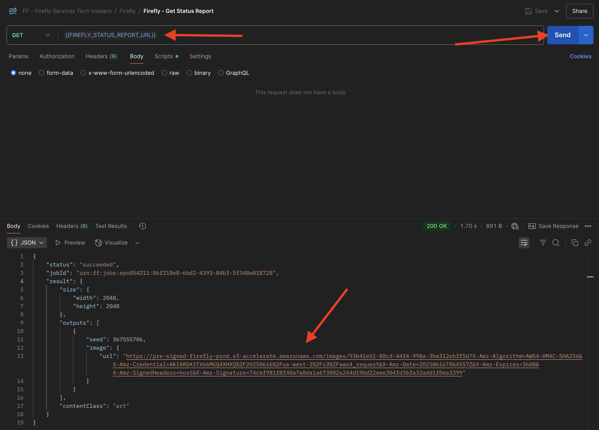
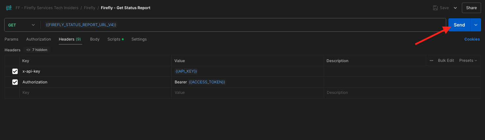

# 1.1.1 Aan de slag met Firefly Services

Firefly Services omvat **Firefly APIs**, **Lightroom APIs**, **Photoshop APIs**, **InDesign APIs**, en **Inhoud Tags APIs**.

Deze API&#39;s combineren de kracht van creatieve Adobe-gereedschappen, zoals Photoshop en Lightroom, met geavanceerde AI/ML-functies, zoals Content Tagging, Generative Fill, Text to Image en nog veel meer.

Met Firefly Services creëert u niet alleen maar — u automatiseert, schaalt uw inhoudsproductie en gebruikt de nieuwste AI/ML-technologieën om uw workflows op te vullen.

In deze oefening, zult u leren hoe te om Postman en Adobe I/O te gebruiken om met diverse Adobe Firefly Services APIs te werken.

Deze oefening richt zich specifiek op de Firefly APIs, zoals:

- **Firefly produceert Beelden API**: dit API wordt gebruikt aan geproduceerde beelden gebruikend de Modellen van Firefly
- **Firefly produceert Vergelijkbare Beelden API**: dit API wordt gebruikt aan geproduceerde beelden die aan een reeds bestaand beeld gelijkaardig zijn
- **Firefly breidt Beeld API** uit: dit API wordt gebruikt om een bestaand beeld aan een grotere aspectverhouding/grootte uit te breiden
- **Firefly vult Beeld API**: dit API vult een gebied van een bestaand beeld dat op beelden wordt gebaseerd die Firefly op uw herinnering produceert. Dit wordt bereikt met een masker dat het gebied definieert dat moet worden gevuld.
- **Firefly produceert Samengestelde API van Objecten**: dit API staat u toe om een inputbeeld te verstrekken zelf, dat dan uw beeld met beelden combineert die door Firefly worden geproduceerd om een beeld samengestelde, of scène tot stand te brengen.
- **Aangepaste Modellen API van Firefly**: dit API staat u toe om met uw eigen Modellen van de Douane van Firefly te werken, om nieuwe beelden te produceren die op uw Model van de Douane van Firefly worden gebaseerd

## 1.1.1.1 Voorwaarden

Alvorens met deze oefening verder te gaan, moet u de opstelling van [ uw project van Adobe I/O ](./../../../modules/getting-started/gettingstarted/ex6.md) hebben voltooid, en u moet ook een toepassing gevormd hebben om met APIs, zoals [ Postman ](./../../../modules/getting-started/gettingstarted/ex7.md) of [ PostBuster ](./../../../modules/getting-started/gettingstarted/ex8.md) in wisselwerking te staan.

## 1.1.1.2 API-basisbeginselen

Er zijn meerdere typen API-aanvragen:

- **GET**: dit wordt gebruikt wanneer het proberen om informatie van een API eindpunt terug te winnen, als het krijgen van een Rapport van de Status
- **POST**: dit wordt gebruikt wanneer iets nieuw moet worden gedaan, als het hebben van Adobe Firefly Services een nieuw beeld produceren
- **PUT**: dit wordt gebruikt om bestaande gegevens volledig bij te werken
- **PATCH**: dit wordt gebruikt om bestaande gegevens selectief bij te werken
- **DELETE**: dit wordt gebruikt om gegevens te schrappen

Wanneer u met API&#39;s werkt, zult u ook zien dat responscodes worden geretourneerd door de verschillende API-eindpunten.

Er zijn vijf verschillende categorieën reacties die u kunt verwachten:

- **1xx informatieve reactie**: het verzoek werd ontvangen, lopend proces
- **2xx succesvol**: het verzoek werd met succes ontvangen, begrepen en aanvaard
- **3xx redirection**: de verdere actie moet worden genomen om het verzoek te voltooien
- **4xx cliëntfout**: het verzoek bevat slechte syntaxis of kan niet worden vervuld
- **5xx serverfout**: de server slaagde er niet in om een schijnbaar geldig verzoek te vervullen

Hier is een voorbeeld van gemeenschappelijke reactiecodes u kunt verwachten:

- **200 OK**: dit is goed, uw met succes voltooide verzoek
- **201 creeerde**: dit is goed, als voorbeeld, is uw beeld gecreeerd
- **202 Erkende**: dit is goed, wordt uw verzoek goedgekeurd en zal worden verwerkt
- **401 onbevoegd**: dit is niet goed, waarschijnlijk is uw toegangstoken niet geldig
- **403 Verboden**: dit is niet goed, u waarschijnlijk ontbreekt de vereiste toestemmingen voor de actie u probeert uit te voeren
- **404 niet Gevonden**: dit is niet goed, waarschijnlijk URL u probeert te bereiken bestaat niet
- **429 Te Vele Verzoeken**: dit is niet goed, u waarschijnlijk naar vele verzoeken in een korte periode hebt verzonden. Probeer het later opnieuw.

## 1.1.1.3 Ontdek firefly.adobe.com - fase 1

Laten we Adobe Firefly Services gaan verkennen. U begint bijvoorbeeld met het genereren van een CitiSignal-afbeelding. Het CitiSignal-ontwerpteam wil graag een neonversie van de merknaam CitiSignal genereren. Ze willen Adobe Firefly Services gebruiken om dat te doen.

Het eerste wat nodig is om dit te bereiken, is een zwarte en witte versie van de merknaam CitiSignal, iets dat er als volgt uitziet:


### {0.1 Maak uw compositieverwijzingsafbeelding1.1.1.3

U kunt [ dit steekproefbeeld ](./images/CitiSignal.jpg) gebruiken of u kunt uw eigen tekst tot stand brengen om te experimenteren. Volg de onderstaande stappen in Adobe Illustrator om uw eigen afbeeldingsbestand te maken. Als u de vooraf gedefinieerde afbeelding wilt gebruiken, slaat u de onderstaande sectie over en gaat u naar stap **1.1.1.3.2. Genereer de afbeelding** rechtstreeks.

Open **Adobe Illustrator**. Klik **Nieuw dossier**.


Selecteer **Web-Groot 1920 x 1080px**. Klik **creëren**.


Dan moet je dit hebben. Klik het **t** tekstpictogram.


Dan moet je dit hebben.


Verander het doopvonttype in een doopvonttype van keus, in dit geval is het doopvonttype **Vet van Adobe Schone**.


Verander de doopvontgrootte in een grootte van keus, in dit geval **250 pt**.


Dan moet je dit hebben.


Verander de tekst aangezien u, in dit geval **CitiSignal** wenst.


De tekst in het bestand centreren.


Ga naar **Dossier > de Uitvoer > sparen voor Web (Verouderd)**


Dan moet je dit hebben. Klik **sparen**.


Geef het bestand een naam en sla het op uw bureaublad op. Klik **sparen**.


### 1.1.1.3.2 Genereer uw afbeelding

Ga naar [ https://firefly.adobe.com ](https://firefly.adobe.com). Klik het **profiel** pictogram en zorg u aan de juiste **Rekening** het programma wordt geopend, die `--aepImsOrgName--` zou moeten zijn. Indien nodig, klik **Profiel van de Schakelaar** om aan die rekening over te schakelen.


Voer de vraag `neon light lettering on a brick wall of a night club` in. Klik **produceren**.


Dan zou je iets gelijkaardigs moeten hebben. Deze afbeeldingen zijn nog niet nuttig. Onder **Samenstelling**, klik **uploadt beeld**.


Selecteer het beeld u vroeger, in dit geval **CitiSignal.jpg** creeerde. Klik **Open** en klik dan **produceren**.


Dan zou je iets gelijkaardigs moeten hebben. De toepassing van de verwijzing van de Samenstelling is nog niet groot. Om dat te veranderen, verander de **schuif van de Sterkte** in de maximumwaarde. Klik **produceren** opnieuw.


U hebt nu verschillende afbeeldingen met een neonversie van de merknaam CitiSignal, die u kunt gebruiken om verder te doorlopen.


Je hebt nu geleerd om Firefly te gebruiken om een ontwerpprobleem in een paar minuten op te lossen.

## 1.1.1.4 Ontdek firefly.adobe.com - fase 2

Ga naar [ https://firefly.adobe.com/generate/image ](https://firefly.adobe.com/generate/image). Dan moet je dit zien. Klik de **Model** dropdown lijst van het Model. Er zijn drie beschikbare versies van Adobe Firefly Services:

- Firefly Image 3
- Firefly Image 4
- Firefly Image 4 Ultra


>[!NOTE]
>
>Firefly Image 3 en Image 4 zijn beschikbaar voor iedereen die Adobe Firefly Services gebruikt, terwijl voor Firefly Image 4 Ultra een Firefly Pro-licentie is vereist.

Klik om **Beeld 3 van Firefly** voor deze oefening te selecteren.


Ga de herinnering `Horses in a field` in en klik **produceert**.


Dan zou je iets gelijkaardigs moeten zien.


Daarna, open omhoog de **Hulpmiddelen van de Ontwikkelaar** in uw browser.


Dan moet je dit zien. Ga naar het **Netwerk** lusje. Dan, klik **produceren** opnieuw.


Ga de onderzoekstermijn **in produceren-async**. U zou dan een verzoek met de naam **moeten zien produceren-async**. Selecteer het en ga dan naar **Payload** waar u de details van het verzoek zult zien.


Het verzoek dat u hier ziet, is het verzoek dat naar de server-kant achtergrond van Firefly Services wordt verzonden. Het bevat verschillende belangrijke parameters:

- **herinnering**: Dit is uw herinnering, die om vraagt welk soort beeld Firefly zou moeten produceren

- **zaden**: In dit verzoek, werden de zaden geproduceerd op een willekeurige manier. Wanneer Firefly een afbeelding genereert, wordt het proces standaard gestart door een willekeurig getal, een zaadgetal genaamd, te kiezen. Dit willekeurige getal draagt bij aan wat elke afbeelding uniek maakt. Dit is ideaal als u een groot aantal afbeeldingen wilt genereren. Het kan echter voorkomen dat u afbeeldingen wilt genereren die op meerdere aanvragen lijken. Als Firefly bijvoorbeeld een afbeelding genereert die u wilt wijzigen met behulp van andere Firefly-opties (zoals voorinstellingen voor stijlen, referentieafbeeldingen, enz.), kunt u in toekomstige HTTP-aanvragen de onzekerheid van toekomstige afbeeldingen beperken en inbellen op de gewenste afbeelding.


Bekijk de UI opnieuw. Verander de **aspectverhouding** in **Breedbeeld (16:9)**.


De rol neer aan **Gevolgen**, gaat naar **Thema&#39;s** en selecteert een effect zoals **Kunstdeco**.


Zorg ervoor **Hulpmiddelen van de Ontwikkelaar** nog open in uw browser is. Dan, produceert de klik **** en inspecteert het netwerkverzoek dat wordt verzonden.


Wanneer u de details van het netwerkverzoek inspecteert, zult u nu het volgende zien:

- **herinnering** is niet veranderd in vergelijking met het vorige verzoek
- **zaden** zijn veranderd in vergelijking met het vorige verzoek
- **grootte** is veranderd, gebaseerd op de verandering in **verhouding van de Verhouding**.
- **stijlen** is toegevoegd, en heeft een verwijzing naar het **art_deco** effect dat u selecteerde


Voor de volgende oefening, zult u één van de **zaad** aantallen moeten gebruiken. Schrijf een zaadnummer van keuze.

>[!NOTE]
>
>De zaadaantallen zijn willekeurige aantallen die op het tijdstip van het klikken **worden gekozen produceren**. Als u een verenigbare blik en een gevoel aan uw geproduceerd beeld over veelvoudige **zou willen hebben produceren** verzoeken, is het belangrijk om het **zaadaantal** van keus in toekomstige verzoeken te herinneren en te specificeren.

In de volgende oefening, zult u gelijkaardige dingen met Firefly Services doen, maar dan door API in plaats van UI te gebruiken. In dit voorbeeld, is het zaadaantal **142194** voor het eerste beeld, dat 2 paarden heeft die naar elkaar kijken met hun hoofd die elkaar onder ogen zien.

## 1.1.1.5 Adobe I/O - access_token

In **Adobe IO - OAuth** inzameling, selecteer het verzoek genoemd **POST - krijg het Token van de Toegang** en selecteer **verzend**. De reactie zou een nieuw **access_token** moeten bevatten.


## 1.1.1.6 Firefly Services API, Text 2 Image, Image 3

Nu u een geldig en vers access_token hebt, bent u klaar om uw eerste aanvraag naar Firefly Services API&#39;s te verzenden.

Het verzoek u hier zult gebruiken is a **asynchroon** verzoek, dat u van een reactie voorziet die URL van de baan bevat die is voorgelegd, zo betekent het dat u een tweede verzoek zult moeten gebruiken om de status van de baan te controleren en tot het beeld toegang te hebben dat werd geproduceerd.

>[!NOTE]
>
>Met de release van Firefly Image 4 en Image 4 Ultra worden synchrone aanvragen vervangen door asynchrone aanvragen.

Selecteer het verzoek genoemd **POST - Firefly - T2I V3 async** van **FF - Firefly Services de Instanties van de Tech van de Tech {** inzameling. Ga naar **Kopballen** en verifieer de sleutel/waardepaarcombinaties.

| Sleutel | Waarde |
|:-------------:| :---------------:| 
| `x-api-key` | `{{API_KEY}}` |
| `Authorization` | `Bearer {{ACCESS_TOKEN}}` |

Beide waarden in deze aanvraag hebben betrekking op omgevingsvariabelen die vooraf zijn gedefinieerd. `{{API_KEY}}` verwijst naar het gebied **identiteitskaart van de Cliënt** van uw project van Adobe I/O. Als deel van **Begonnen** sectie dit leerprogramma, vormde u dat in Postman.

De waarde voor het gebied **Vergunning** is een beetje speciaal: `Bearer {{ACCESS_TOKEN}}`. Het bevat een verwijzing naar het **Token van de Toegang** dat u in de vorige stap produceerde. Wanneer u uw **Token van de Toegang** door het verzoek **POST te gebruiken - krijg het Token van de Toegang** in **Adobe IO - OAuth** inzameling, een manuscript liep in Postman dat het gebied **access_token** als milieuvariabele opsloeg, die nu in het verzoek **POST - Firefly - T2I V3 async** wordt van verwijzingen voorzien. Gelieve te nota van de specifieke toevoeging van het woord **Drager** en een ruimte vóór `{{ACCESS_TOKEN}}`. De woorddrager is hoofdlettergevoelig en de ruimte is vereist. Als dit niet correct wordt gedaan, zal Adobe I/O a **401 onbevoegde** fout terugkeren aangezien het niet uw **Symbolisch van de Toegang** correct zal kunnen verwerken.


Daarna, ga naar het **Lichaam** en verifieer de herinnering. Klik **verzenden**.


Dan krijgt u onmiddellijk antwoord. Deze reactie bevat niet de beeld-URL&#39;s van gegenereerde afbeelding, maar een URL van het statusrapport van de taak die u hebt gestart en bevat een andere URL waarmee u de actieve taak kunt annuleren.

>[!NOTE]
>
>De verzameling van Postman die u gebruikt, is geconfigureerd voor het gebruik van dynamische variabelen. Als voorbeeld, is het gebied **statusUrl** opgeslagen als dynamische variabele in Postman dankzij de **Manuscripten** die in Postman zijn gevormd.


Om het statusrapport van uw lopende baan te controleren, selecteer het verzoek genoemd **GET - Firefly - krijg het Rapport van de Status** van **FF - Firefly Services de Ingeurs van de Tech** inzameling. Klik om het te openen, en klik dan **verzenden**. Selecteer de URL van de gegenereerde afbeelding en open deze in uw browser.

>[!NOTE]
>
>De verzameling van Postman die u gebruikt, is geconfigureerd voor het gebruik van dynamische variabelen. Als voorbeeld, werd het gebied **statusUrl** van het vorige verzoek opgeslagen als dynamische variabele in Postman en het wordt nu gebruikt als URL voor **GET - Firefly - krijgt het verzoek van het Rapport van de Status**.


U zou een gelijkaardige reactie moeten ontvangen hebben. Dit is het overzicht van de taak die is uitgevoerd. U kunt het gebied **url** zien, dat het geproduceerde beeld bevat. Kopieer (of klik) de afbeeldings-URL uit het antwoord en open deze in uw webbrowser om de afbeelding weer te geven.


Er moet een mooie afbeelding worden afgebeeld `horses in a field` .


In het **Lichaam** van uw verzoek **POST - Firefly - T2I V3 async**, voeg het volgende onder het gebied `"promptBiasingLocaleCode": "en-US"` toe en vervang veranderlijk `XXX` door één van de zaadaantallen die willekeurig door Firefly Services UI werden gebruikt. In dit voorbeeld, is het **zaad** aantal `142194`.

```json
,
  "seeds": [
    XXX
  ]
```

Klik **verzenden**. Vervolgens ontvangt u een reactie met een koppeling naar het statusrapport van de taak die u zojuist hebt verzonden.


Om het statusrapport van uw lopende baan te controleren, selecteer het verzoek genoemd **GET - Firefly - krijg het Rapport van de Status** van **FF - Firefly Services de Ingeurs van de Tech** inzameling. Klik om het te openen, en klik dan **verzenden**. Selecteer de URL van de gegenereerde afbeelding en open deze in uw browser.


U zou dan een nieuw beeld met lichte verschillen moeten zien, die op **worden gebaseerd zaad** dat werd gebruikt. Het zaad `142194` had twee paarden die naar elkaar keken met hun hoofd naar elkaar gericht.


Daarna, in het **Lichaam** van uw verzoek **POST - Firefly - T2I V3 async**, kleef het hieronder **stijlen** voorwerp onder het **zaden** voorwerp. Dit zal de stijl van het geproduceerde beeld in **art_deco** veranderen.

```json
,
  "contentClass": "art",
  "styles": {
    "presets": [
      "art_deco"
    ],
    "strength": 50
  }
```

Dan moet je dit hebben. Klik **verzenden**. Vervolgens ontvangt u een reactie met een koppeling naar het statusrapport van de taak die u zojuist hebt verzonden.


Om het statusrapport van uw lopende baan te controleren, selecteer het verzoek genoemd **GET - Firefly - krijg het Rapport van de Status** van **FF - Firefly Services de Ingeurs van de Tech** inzameling. Klik om het te openen, en klik dan **verzenden**. Selecteer de URL van de gegenereerde afbeelding en open deze in uw browser.


Uw afbeelding is nu een beetje gewijzigd. Bij het toepassen van voorinstellingen voor stijlen wordt de zaadafbeelding niet meer op dezelfde manier toegepast als voorheen. Over het algemeen is het met generatieve AI erg moeilijk om te garanderen dat dezelfde combinatie van inpunt-parameters leidt tot hetzelfde beeld dat wordt gegenereerd.


Verwijder de code voor het **zaad** voorwerp uit het **Lichaam** van uw **POST - Firefly - T2I V3 async** verzoek. Klik **verzenden** en klik dan beeld URL die u van de reactie krijgt. Vervolgens ontvangt u een reactie met een koppeling naar het statusrapport van de taak die u zojuist hebt verzonden.

```json
,
  "seeds": [
    XXX
  ]
```


Om het statusrapport van uw lopende baan te controleren, selecteer het verzoek genoemd **GET - Firefly - krijg het Rapport van de Status** van **FF - Firefly Services de Ingeurs van de Tech** inzameling. Klik om het te openen, en klik dan **verzenden**. Selecteer de URL van de gegenereerde afbeelding en open deze in uw browser.



Uw afbeelding is nu weer een beetje gewijzigd.


## 1.1.1.7 Firefly Services API, Gen Expand

Selecteer het verzoek genoemd **POST - Firefly - Gen breidt async** uit van **FF - de 3} inzameling van Tech Insiders van Firefly Services {en gaat naar het** Lichaam **van het verzoek.**

- **grootte**: Ga de gewenste resolutie in. De hier ingevoerde waarde moet groter zijn dan de oorspronkelijke grootte van de afbeelding en mag niet groter zijn dan 3999.
- **image.source.url**: Dit gebied vereist een verbinding aan het beeld dat moet worden uitgebreid. In dit voorbeeld wordt een variabele gebruikt om te verwijzen naar de afbeelding die tijdens de vorige oefening is gegenereerd.

- **horizontale groepering**: Geaccepteerde waarden zijn: `"center"`, `"left`, `"right"`.
- **verticale groepering**: Geaccepteerde waarden zijn: `"center"`, `"top`, `"bottom"`.


Vervolgens ontvangt u een reactie met een koppeling naar het statusrapport van de taak die u zojuist hebt verzonden.


Om het statusrapport van uw lopende baan te controleren, selecteer het verzoek genoemd **GET - Firefly - krijg het Rapport van de Status** van **FF - Firefly Services de Ingeurs van de Tech** inzameling. Klik om het te openen, en klik dan **verzenden**. Selecteer de URL van de gegenereerde afbeelding en open deze in uw browser.


U ziet nu dat de afbeelding die in de vorige oefening is gegenereerd, is uitgebreid naar de resolutie van 3999x3999.


Produceer een nieuw beeld gebruikend **Firefly - T2I V3 async** verzoek.


Om het statusrapport van uw lopende baan te controleren, selecteer het verzoek genoemd **GET - Firefly - krijg het Rapport van de Status** van **FF - Firefly Services de Ingeurs van de Tech** inzameling. Klik om het te openen, en klik dan **verzenden**. Selecteer de URL van de gegenereerde afbeelding en open deze in uw browser.


Vervolgens ziet u een vergelijkbare afbeelding.


Selecteer het verzoek genoemd **POST - Firefly - Gen breidt async** uit van **FF - de 3} inzameling van Tech Insiders van Firefly Services {en gaat naar het** Lichaam **van het verzoek.**

Wanneer u de uitlijning van de plaatsing wijzigt, zal de uitvoer ook iets anders zijn. In dit voorbeeld, wordt de plaatsing veranderd in **verlaten, bodem**. Klik **verzenden**. Vervolgens ontvangt u een reactie met een koppeling naar het statusrapport van de taak die u zojuist hebt verzonden.


Om het statusrapport van uw lopende baan te controleren, selecteer het verzoek genoemd **GET - Firefly - krijg het Rapport van de Status** van **FF - Firefly Services de Ingeurs van de Tech** inzameling. Klik om het te openen, en klik dan **verzenden**. Selecteer de URL van de gegenereerde afbeelding en open deze in uw browser.


Vervolgens ziet u dat de oorspronkelijke afbeelding op een andere plaats wordt gebruikt, wat van invloed is op de hele afbeelding.


## 1.1.1.8 Firefly Services API, Text 2 Image, Image 4 &amp; Image 4 Ultra

Met de recente release van Firefly Image Model 4 zijn verschillende verbeteringen beschikbaar gesteld:

- Firefly Image Model 4 biedt uitvoer met een resolutie van 2.000 rpm en verbeterde definitie en details.
- Firefly Image Model 4 biedt aanzienlijke verbeteringen op het gebied van tekstrendering, mensen, dieren en architectuur.
- Firefly Image Model 4 houdt vast aan de toezegging van Adobe om IP-vriendelijke, commercieel veilige generatieve AI te gebruiken.

Firefly Image Model 4 biedt u uitzonderlijke beelden van mensen, dieren en gedetailleerde scènes en u kunt Afbeeldingsmodel 4 Ultra gebruiken voor het genereren van beelden met hyperrealistische menselijke interacties, architectonische elementen en complexe landschappen. &#x200B;

### {0.1 image4_standard1.1.1.8

Selecteer het verzoek genoemd **POST - Firefly - T2I V4** van **FF - de 3} inzameling van de Technische Instanties van Firefly Services {en ga naar de** Kopballen **van het verzoek.**

U zult opmerken dat URL van het verzoek van **Firefly Services API, Tekst 2 Beeld, Beeld 3** verzoek verschillend is, dat **https://firefly-api.adobe.io/v3/images/generate** was. Dit URL richt aan **https://firefly-api.adobe.io/v3/images/generate-async**. De toevoeging van **- async** in URL betekent u het asynchrone eindpunt gebruikt.

In de **variabelen van de Kopbal**, zult u een nieuwe variabele genoemd **x-model-versie** opmerken. Dit is een vereiste koptekst bij interactie met Firefly Image 4 en Image 4 Ultra. Als u Firefly Image 4 of Image 4 Ultra wilt gebruiken bij het genereren van afbeeldingen, moet de koptekstwaarde worden ingesteld op `image4_standard` of `image4_ultra` . In dit voorbeeld gebruikt u `image4_standard` .

Als u niet **x-model-versie** aan `image4_standard` of `image4_ultra` plaatst, dan zal Firefly Services aan het gebruiken `image3` momenteel in gebreke blijven.


Ga naar het **Lichaam** van het verzoek. U moet zien dat in het lichaam vier afbeeldingsvariaties worden aangevraagd. De herinnering is onveranderd van vóór, en vraagt nog om **paarden op een gebied** worden geproduceerd. Klik **verzenden**


Dan krijgt u onmiddellijk antwoord. Deze reactie bevat niet de beeld-URL&#39;s van gegenereerde afbeelding, maar een URL van het statusrapport van de taak die u hebt gestart en bevat een andere URL waarmee u de actieve taak kunt annuleren.


Om het statusrapport van uw lopende baan te controleren, selecteer het verzoek genoemd **GET - Firefly - krijg het Rapport van de Status** van **FF - Firefly Services de Ingeurs van de Tech** inzameling. Klik om het te openen, en klik dan **verzenden**.


Vervolgens ziet u het statusrapport van de functie voor het genereren van afbeeldingen die u net hebt gestart. Verifieer het gebied **status**, aangezien het aan **lopende** kan worden geplaatst, zo betekent het dat de baan nog niet heeft voltooid. In dit voorbeeld, wordt de baanstatus geplaatst aan **succesvol**, zo betekent het dat de beelden u verzocht zijn geproduceerd.


Schuif een beetje omlaag in de reactie. Vervolgens ziet u in totaal 4 afbeeldingsvariaties die door Adobe Firefly Services worden geretourneerd. Klik (of kopieer) URL van één van de beelden en open het in uw browser.


U zou dan een hyperrealistisch beeld van **paarden op een gebied** moeten zien.


### {0.2 image4_ultra1.1.1.8

Ga terug naar het verzoek genoemd **POST - Firefly - T2I V4** van **FF - de 3} inzameling van Tech Insiders van Firefly Services {en ga naar de** Kopballen **van het verzoek.**

Verander veranderlijk **x-model-versie** in `image4_ultra`. In dit voorbeeld gebruikt u `image4_ultra` .


Ga naar het **Lichaam** van het verzoek. Wijzig in de hoofdtekst het aantal afbeeldingsvariaties in 1, net als bij Firefly Image 4 Ultra. Er kan slechts 1 afbeelding tegelijk worden gegenereerd. De herinnering is onveranderd van vóór, en vraagt nog om **paarden op een gebied** worden geproduceerd. Klik **verzenden**


Het antwoord bevat opnieuw een URL van het statusrapport van de taak die u hebt gestart en bevat een andere URL waarmee u de actieve taak kunt annuleren.


Om het statusrapport van uw lopende baan te controleren, selecteer het verzoek genoemd **GET - Firefly - krijg het Rapport van de Status** van **FF - Firefly Services de Ingeurs van de Tech** inzameling. Klik om het te openen, en klik dan **verzenden**.



Vervolgens ziet u het statusrapport van de functie voor het genereren van afbeeldingen die u net hebt gestart. Verifieer het gebied **status**, aangezien het aan **lopende** kan worden geplaatst, zo betekent het dat de baan nog niet heeft voltooid. In dit voorbeeld, wordt de baanstatus geplaatst aan **succesvol**, zo betekent het dat de beelden u verzocht zijn geproduceerd.


U zou dan een hyperrealistisch beeld van **paarden op een gebied** moeten zien.


### Negatieve aanwijzingen

Als u Firefly wilt verzoeken om niets op te nemen in de afbeelding die wordt gegenereerd, kunt u het veld `negativePrompt` opnemen wanneer u de API gebruikt (deze optie is momenteel niet beschikbaar voor de interface). Als voorbeeld, als u geen bloemen wilt inbegrepen zijn wanneer de herinnering **paarden op een gebied** wordt uitgevoerd, dan kunt u dit in het **Lichaam** van uw API verzoek specificeren:

```
"negativePrompt": "no flowers",
```

Ga naar het verzoek **POST - Firefly - T2I V4** van **FF - Firefly Services de inzameling van Tech Insiders** en ga naar het **Lichaam** van het verzoek. Plak de bovenstaande tekst in de hoofdtekst van de aanvraag. Klik **verzenden**.


Dan moet je dit zien.


Om het statusrapport van uw lopende baan te controleren, selecteer het verzoek genoemd **GET - Firefly - krijg het Rapport van de Status** van **FF - Firefly Services de Ingeurs van de Tech** inzameling. Klik om het te openen, en klik dan **verzenden**. Selecteer de URL van de gegenereerde afbeelding en open deze in uw browser.


Dan zie je de gegenereerde afbeelding, die geen bloemen zou moeten bevatten.


## Volgende stappen

Ga naar [ optimaliseer uw proces van Firefly gebruikend Microsoft Azure en presigned URLs ](./ex2.md){target="_blank"}

Ga terug naar [ Overzicht van Adobe Firefly Services ](./firefly-services.md){target="_blank"}

Ga terug naar [ Alle modules ](./../../../overview.md){target="_blank"}