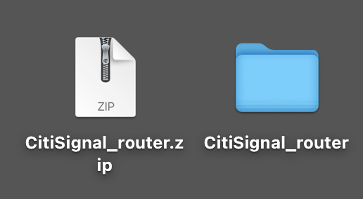
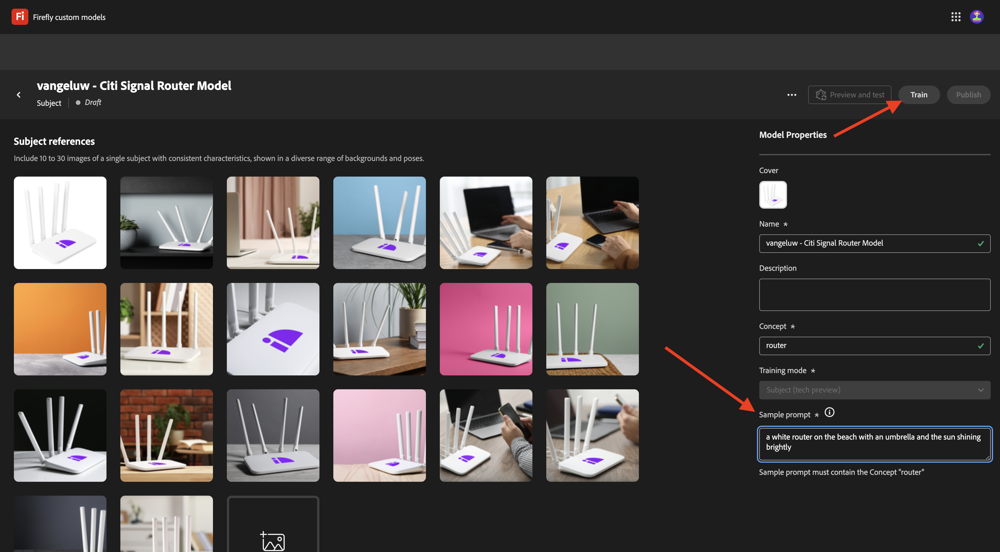

# 1.1.4 Firefly API voor aangepaste modellen

## 1.1.4.1 Wat zijn Firefly Custom Models?

Met aangepaste Firefly-modellen kunt u afbeeldingsvariaties genereren die met uw merk worden uitgelijnd met de functie Tekst op afbeelding. Door deze modellen te trainen met uw eigen afbeeldingen, kunt u inhoud genereren die de identiteit van uw merk weerspiegelt.
Transformeer uw stijl of onderwerp om nieuwe ideeën te verkennen, visualiseer verschillende omgevingen, produceer innovatieve inhoud, en pas inhoud aan specifieke segmenten aan.

Met aangepaste Firefly-modellen kunt u...

- Onmerkbare ideeën en concepten maken
- Tekenthema&#39;s met consistente stijlen maken
- Consistente merkstijlen maken om campagnes snel uit te breiden

Hiervoor ondersteunt Firefly Custom Models:

- Aangepaste onderwerpmodellen
- Aangepaste stijlmodellen

### Aangepaste onderwerpmodellen

Bij het trainen van aangepaste modellen over een specifiek onderwerp — of het nu objecten of tekens betreft — is het de bedoeling de essentiële kenmerken van het onderwerp te identificeren en het model te helpen deze in verschillende contexten en posities te repliceren.

Zoek naar beelden met de volgende kenmerken wanneer het leiden van een onderwerpmodel:

- Consistentie van objecten: geef afbeeldingen van hetzelfde merk en model als het onderwerp, maar zorg dat het onderwerp er niet sterk anders uitziet in verschillende afbeeldingen. Meerdere kleuren niet mengen en er is een gemeenschappelijk thema of patroon tussen afbeeldingen mogelijk. Uw onderwerp kan echter per scène, pose, kleding en achtergrond verschillen.
- Objectfocus: gebruik afbeeldingen van het onderwerp in duidelijke focus zonder onnodige afleidingen. Houd het onderwerp in de buurt van het midden van de afbeelding en zorg ervoor dat het ten minste 25% van het afbeeldingsgebied in beslag neemt.
- Omgevingscontext: geef een beeld van het onderwerp in verschillende weergaven en contexten, en laat het zien in verschillende belichtingsomstandigheden. Terwijl afbeeldingen met een witte of transparante achtergrond kunnen worden gebruikt, is het beter om ook een combinatie met een complexere omgeving te hebben.
- Vermijd andere objecten: vermijd grote items op de achtergrond of aan het teken. Om het even welk groot punt dat in de beelden wordt getoond wordt gememoriseerd door het model en zal in de geproduceerde beelden verschijnen, gelijkend op het zelfde punt in de trainingsdataset.

### Aangepaste stijlmodellen

Aangepaste modellen die zijn opgeleid voor een stijl, geven de vormgeving van de elementen aan en genereren zo vergelijkbare afbeeldingen als u hierom wordt gevraagd.

Een effectief stijlmodel trainen:

- Vergelijkbare esthetica bieden: neem afbeeldingen op die verschillende scènes en objecten weergeven, terwijl u hetzelfde uiterlijk behoudt.
- Gebruik verschillende afbeeldingen: gebruik zoveel mogelijk afbeeldingen om te voorkomen dat het model te veel focus krijgt op ongewenste objecten of onderwerpen.
- Vermijd vaste zinnen: een vast patroon heeft een groter gewicht dan andere zinnen. Als bijvoorbeeld elk bijschrift &#39;De achtergrond is effen zwart&#39; of &#39;schattige tekenstijlen&#39; bevat, is het model afhankelijk van deze zin. Als dit niet het geval is, worden de gewenste resultaten niet bereikt met een testaanwijzing.

## 1.1.4.2 Uw aangepaste model configureren

Ga naar [ https://firefly.adobe.com/ ](https://firefly.adobe.com/). Klik **Modellen van de Douane**.

{zoomable="yes"}

Dit bericht wordt mogelijk weergegeven. Als u doet, klik **akkoord** om verder te gaan.

{zoomable="yes"}

Dan moet je dit zien. Klik **Lijn een model**.

{zoomable="yes"}

Configureer de volgende velden:

- **Naam**: gebruik `--aepUserLdap-- - Citi Signal Router Model`
- **Wijze van de Opleiding**: uitgezochte **Onderwerp (technologievoorproef)**
- **Concept**: enter `router`
- **sparen aan**: open de dropdown lijst en klik **+ creeer Nieuw Project**

{zoomable="yes"}

Geef het nieuwe project de naam: `--aepUserLdap-- - Custom Models`. Klik **creëren**.

{zoomable="yes"}

Dan moet je dit zien. Klik **verdergaan**.

{zoomable="yes"}

U moet nu de referentieafbeeldingen opgeven die worden getraind in het aangepaste model. Klik **Uitgezochte beelden van uw computer**.

{zoomable="yes"}

Download de verwijzingsbeelden [ hier ](https://one-adobe-tech-insiders.s3.us-west-2.amazonaws.com/CitiSignal_router.zip). Pak het downloadbestand uit, wat u dit kan geven.

{zoomable="yes"}

Navigeer naar de map met de bestanden met downloadafbeeldingen. Selecteer hen allen en klik **Open**.

{zoomable="yes"}

Vervolgens ziet u dat de afbeeldingen worden geladen.

{zoomable="yes"}

Na een paar minuten worden de afbeeldingen correct geladen. Sommige afbeeldingen hebben mogelijk een fout. Dit wordt veroorzaakt door het feit dat het bijschrift voor de afbeelding niet is gegenereerd of niet lang genoeg is. Bekijk elke afbeelding met een fout en voer een bijschrift in dat aan de vereisten voldoet en beschrijf de afbeelding.

{zoomable="yes"}

Als alle afbeeldingen bijschriften hebben die aan de vereisten voldoen, moet u toch een voorbeeldprompt weergeven. Ga om het even welke herinnering in die het woord &quot;router&quot;gebruikt. Zodra je dat hebt gedaan, kun je beginnen met het trainen van je model. Klik **Lijn**.

{zoomable="yes"}

Dan zie je dit. De training voor uw model kan 20 tot 30 minuten of langer duren.

{zoomable="yes"}

Na 20 tot 30 minuten is uw model nu opgeleid en kan het worden gepubliceerd. Klik **publiceren**.

{zoomable="yes"}

Klik **publiceren** opnieuw.

{zoomable="yes"}

Sluit het **aangepaste model van het Aandeel** popup.

{zoomable="yes"}

## 1.1.4.3 Uw aangepaste model gebruiken in de gebruikersinterface

Ga naar [ https://firefly.adobe.com/cme/train ](https://firefly.adobe.com/cme/train). Klik op het aangepaste model om het te openen.

{zoomable="yes"}

Klik **Voorproef en test**.

{zoomable="yes"}

U zult dan de steekproefherinnering zien die u alvorens wordt uitgevoerd inging.

{zoomable="yes"}

## 1.1.4.4 Enable your Custom Model for Firefly Services Custom Models API

Als uw aangepaste model is opgeleid, kan het ook worden gebruikt via de API. In oefening 1.1.1 hebt u al uw Adobe I/O-project geconfigureerd voor interactie met Firefly Services via de API.

Ga naar [ https://firefly.adobe.com/cme/train ](https://firefly.adobe.com/cme/train). Klik op het aangepaste model om het te openen.

{zoomable="yes"}

Klik de 3 punten **..** en klik dan **Aandeel**.

{zoomable="yes"}

Om tot een Model van de Douane van Firefly toegang te hebben, moet het Model van de Douane aan **Technische E-mail van de Rekening** van uw Project van Adobe I/O worden gedeeld.

Om uw **Technische E-mail van de Rekening** terug te winnen, ga [ https://developer.adobe.com/console/projects ](https://developer.adobe.com/console/projects). Klik om het project met de naam `--aepUserLdap-- One Adobe tutorial` te openen.

{zoomable="yes"}

Klik **Server-aan-Server**.

{zoomable="yes"}

Klik om uw **Technische E-mail van de Rekening** te kopiëren.

{zoomable="yes"}

Plak uw **Technische E-mail van de Rekening** en klik **Uitnodiging om** uit te geven.

{zoomable="yes"}

De **Technische E-mail van de Rekening** zou nu tot het Model van de Douane moeten kunnen toegang hebben.

{zoomable="yes"}

## 1.1.4.5 Interactie met de API voor aangepaste modellen van Firefly Services

In Oefening 1.1.1 die met Firefly Services wordt begonnen, downloadde u dit dossier: [ postman-ff.zip ](./../../../assets/postman/postman-ff.zip) aan uw lokale Desktop en u toen invoerde die inzameling in Postman.

Open Postman en ga naar de omslag **FF - de Modellen API van de Douane**.

{zoomable="yes"}

Open het verzoek **1. FF - getCustomModels** en klik **verzenden**.

{zoomable="yes"}

Het aangepaste model dat u eerder hebt gemaakt, met de naam `--aepUserLdap-- - Citi Signal Router Model`, wordt weergegeven als onderdeel van het antwoord. Het gebied **assetId** is het unieke herkenningsteken van uw Model van de Douane, dat in het volgende verzoek van verwijzingen zal worden voorzien.

{zoomable="yes"}

Open het verzoek **2. Afbeeldingen synchroniseren genereren**. In dit voorbeeld wilt u twee variaties genereren op basis van uw aangepaste model. U kunt de vraag die in dit geval `a white router on a volcano in Africa` is, altijd bijwerken.

Klik **verzenden**.

{zoomable="yes"}

De reactie bevat een gebied **jobId**. De taak om deze twee afbeeldingen te genereren, wordt nu uitgevoerd en u kunt de status controleren met de volgende aanvraag.

{zoomable="yes"}

Open het verzoek **3. Krijg de Status van CM** en klik **verzenden**. Vervolgens ziet u dat de status is ingesteld op actief.

{zoomable="yes"}

Na een paar notulen, verzend **** opnieuw voor het verzoek **. Krijg de Status van CM**. U zou dan moeten zien dat de status die in **werd veranderd succesvol** was en u zou twee beeld URLs als deel van de output moeten zien. Klik om beide bestanden te openen.

{zoomable="yes"}

Dit is de eerste afbeelding die in dit voorbeeld is gegenereerd.

{zoomable="yes"}

Dit is de tweede afbeelding die in dit voorbeeld is gegenereerd.

{zoomable="yes"}

Je hebt deze oefening nu voltooid.

## Volgende stappen

Ga naar [ Samenvatting &amp; voordelen ](./summary.md){target="_blank"}

Ga terug naar [ Werkend met Photoshop APIs ](./ex3.md){target="_blank"}

Ga terug naar [ Overzicht van Adobe Firefly Services ](./firefly-services.md){target="_blank"}
