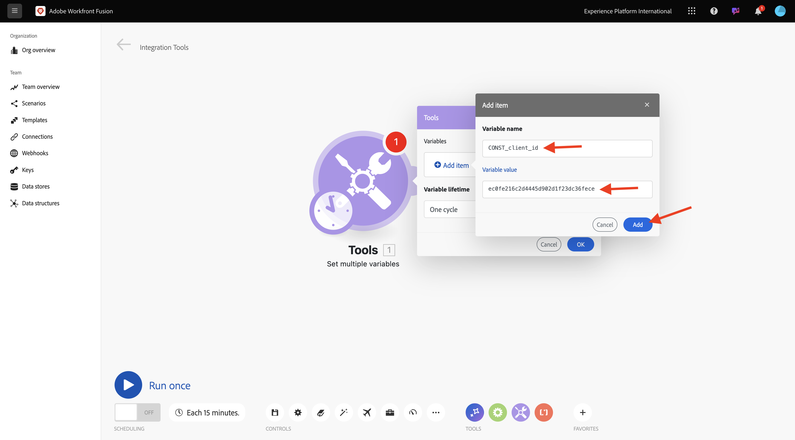
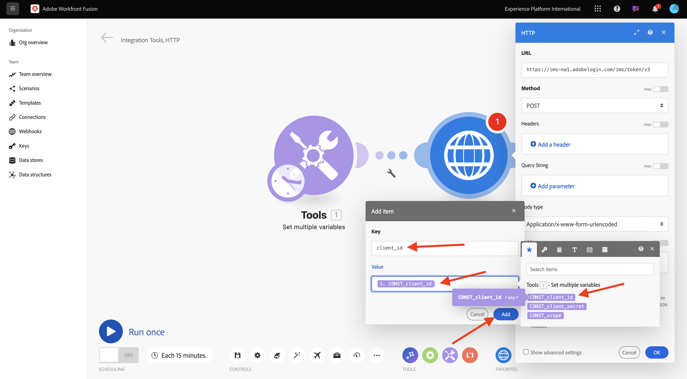

# 1.2.1 Aan de slag met Workfront Fusion

Leer hoe u Workfront Fusion en Adobe I/O kunt gebruiken om Adobe Firefly Services API&#39;s te zoeken.

## 1.2.1.1 Nieuw scenario maken

Ga naar [ https://experience.adobe.com/ ](https://experience.adobe.com/){target="_blank"}. Open **de Fusie van Workfront**.

Ga naar **Scenario&#39;s**.

Klik op het pictogram **+** om een nieuwe map voor uw werk te maken.

Noem de omslag `--aepUserLdap--` en selecteer **sparen**.

Selecteer uw omslag, en selecteer dan **nieuw scenario** creëren.

Een leeg scenario verschijnt, selecteert **hulpmiddelen** en selecteert **Vastgestelde veelvoudige variabelen**.

Verplaats het **klok** pictogram op de onlangs toegevoegde **Vastgestelde veelvoudige variabelen**.

Het scherm moet er zo uitzien.

Klik op het vraagteken met de rechtermuisknop aan en selecteer **module van de Schrapping**.

Daarna, klik op **plaats veelvoudige variabelen** met de rechtermuisknop aan en selecteer **Montages**.

## 1.2.1.2 Adobe I/O-verificatie configureren

U moet nu de variabelen vormen die nodig zijn om tegen Adobe I/O voor authentiek te verklaren. In de vorige oefening, creeerde u een project van Adobe I/O. De variabelen van dat Adobe I/O-project moeten nu worden gedefinieerd in Workfront Fusion.

De volgende variabelen moeten worden gedefinieerd:

| Sleutel | Waarde |
|:-------------:| :---------------:| 
| `CONST_client_id` | uw Adobe I/O-project Client-id |
| `CONST_client_secret` | uw Adobe I/O-project clientgeheim |
| `CONST_scope` | Adobe I/O-projectbereik |

Vind deze variabelen door naar [ https://developer.adobe.com/console/projects ](https://developer.adobe.com/console/projects){target="_blank"} te gaan en uw project van Adobe I/O te openen, dat `--aepUserLdap-- One Adobe tutorial` wordt genoemd.

In uw project, uitgezochte **OAuth server-Server** om de waarden voor de bovengenoemde sleutels te zien.

Gebruikend de bovengenoemde sleutels en de waarden, kunt u **vormen Vastgestelde veelvoudige variabelen** voorwerp. Selecteer **toevoegen punt**.

Ga de **Veranderlijke naam** in: **CONST_client_id** en zijn **Veranderlijke waarde**, uitgezocht **voeg** toe.

Selecteer **toevoegen punt**.

Ga **Veranderlijke naam** in: **CONST_client_geheime** en zijn **Veranderlijke waarde**, uitgezocht **voeg** toe.

Selecteer **toevoegen punt**.

Ga **Veranderlijke naam** in: **CONST_scope** en zijn **Veranderlijke waarde**, uitgezocht **voeg** toe.

Selecteer **O.K.**.

Plaats over **veelvoudige variabelen** en selecteer het grote **+** pictogram om een andere module toe te voegen.

Het scherm moet er zo uitzien.

In de onderzoeksbar, ga **http** in. Selecteer **HTTP** om het te openen.

Selecteer **maak een verzoek**.

| Sleutel | Waarde |
|:-------------:| :---------------:| 
| `URL` | `https://ims-na1.adobelogin.com/ims/token/v3` |
| `Method` | `POST` |
| `Body Type` | `x-www-form-urlencoded` |

Selecteer **toevoegen punt**.

Voeg items toe voor elk van de onderstaande waarden:

| Sleutel | Waarde |
|:-------------:| :---------------:| 
| `client_id` | de vooraf gedefinieerde variabele voor `CONST_client_id` |
| `client_secret` | de vooraf gedefinieerde variabele voor `CONST_client_secret` |
| `scope` | de vooraf gedefinieerde variabele voor `CONST_scope` |
| `grant_type` | `client_credentials` |

Configuratie voor `client_id`:

Configuratie voor `client_secret` .

Configuratie voor `scope` .

Configuratie voor `grant_type` .

De rol neer en controleert de doos voor **ontleedt reactie**. Selecteer **O.K.**.

Het scherm moet er zo uitzien. Selecteer **Looppas eens**.

Nadat het scenario is uitgevoerd, moet uw scherm er als volgt uitzien:

Selecteer het **vraagteken** pictogram op het **Vastgestelde veelvoudige variabelen** voorwerp om te zien wat gebeurde toen dat voorwerp liep.

Selecteer het **vraagteken** pictogram op **HTTP - doe een verzoek** voorwerp om te zien wat gebeurde toen dat voorwerp liep. In **OUTPUT**, zie **access_token** die door Adobe I/O wordt teruggekeerd.

Beweeg over **HTTP - doe een verzoek** en selecteer **+** pictogram om een andere module toe te voegen.

Zoek in de zoekbalk naar `tools` . Selecteer **Hulpmiddelen**.

Selecteer **Vastgestelde veelvoudige variabelen**.

Selecteer **toevoegen punt**.

Plaats **Veranderlijke naam** aan `bearer_token`. Selecteer `access_token` als dynamische **Variabele waarde**. Selecteer **toevoegen**.

Het scherm moet er zo uitzien. Selecteer **O.K.**.

Selecteer **nogmaals Looppas**.

Zodra het scenario loopt, selecteer het **vraagteken** pictogram op het laatste **Vastgestelde veelvoudige variabelen** voorwerp. Let op: het access_token wordt opgeslagen in de variabele `bearer_token` .

Daarna, klik met de rechtermuisknop op het eerste voorwerp **plaats veelvoudige waarden** en selecteer **anders noemen**.

Plaats de naam aan **initialiseert Constanten**. Selecteer **O.K.**.

Wijzig de naam van het tweede voorwerp aan **voor authentiek verklaren aan Adobe I/O**. Selecteer **O.K.**.

Verander de naam van het derde voorwerp aan **plaats Token van de Drager**. Selecteer **O.K.**.

Uw scherm moet er als volgt uitzien:

Wijzig vervolgens de naam van het scenario in `--aepUserLdap-- - Adobe I/O Authentication` .

Selecteer **sparen**.

## Volgende stappen

Ga naar [ Gebruik Adobe APIs binnen de Fusie van Workfront ](./ex2.md){target="_blank"}

Ga terug naar [ de Automatisering van het Werkschema van Creative met Workfront Fusion ](./automation.md){target="_blank"}

Ga terug naar [ Alle Modules ](./../../../overview.md){target="_blank"}
