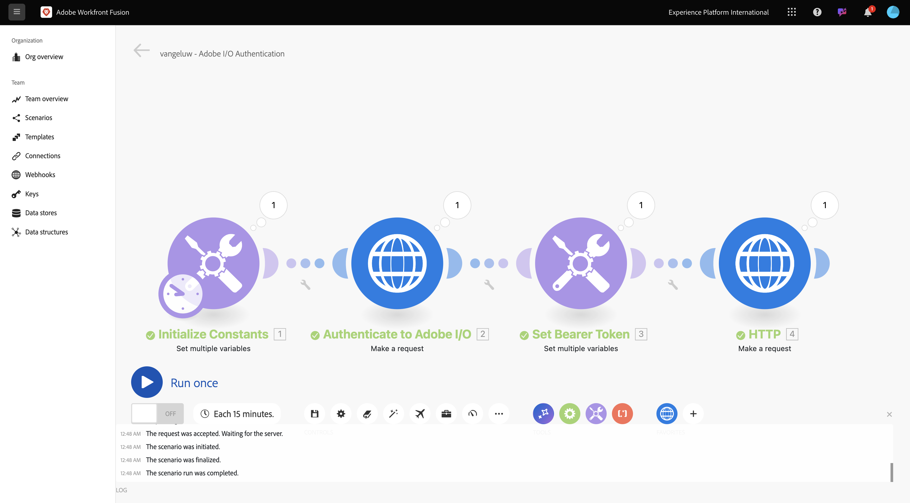
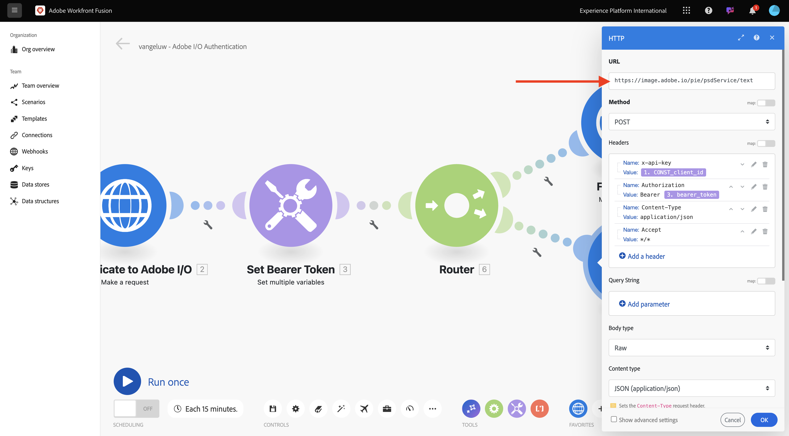
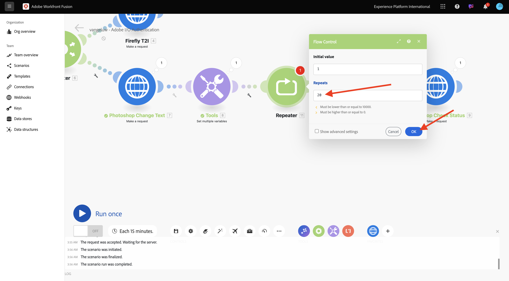
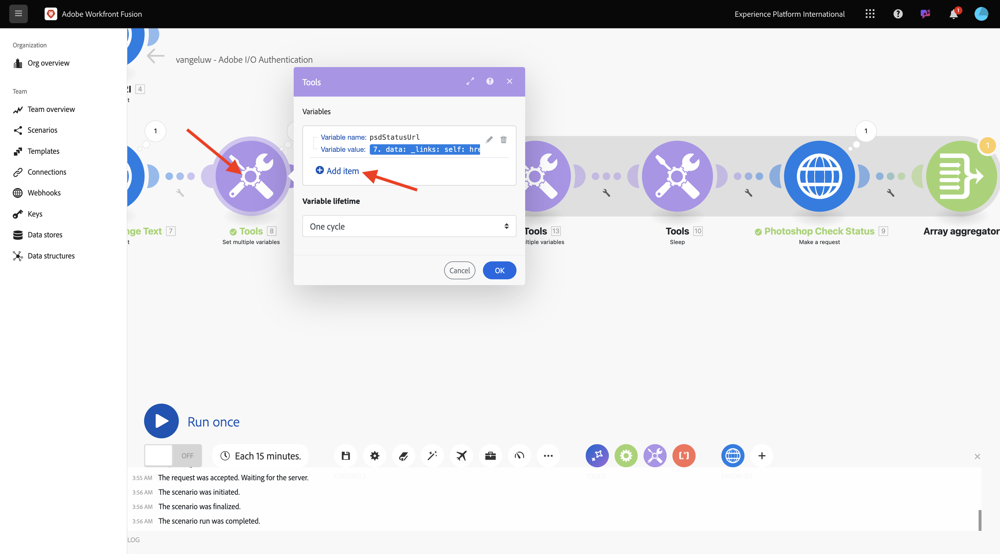
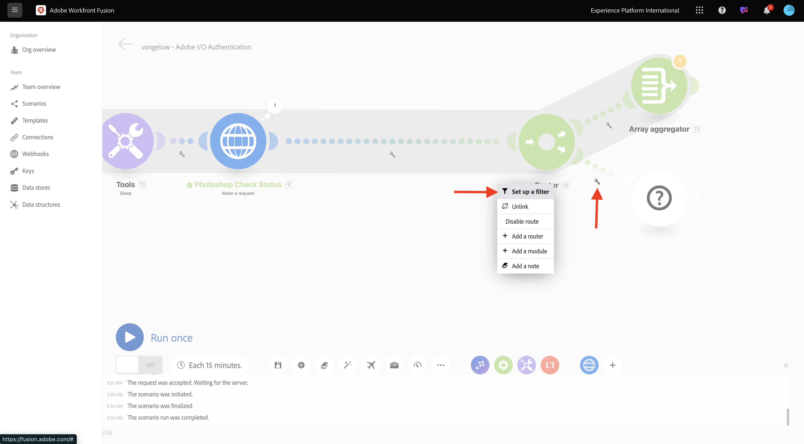
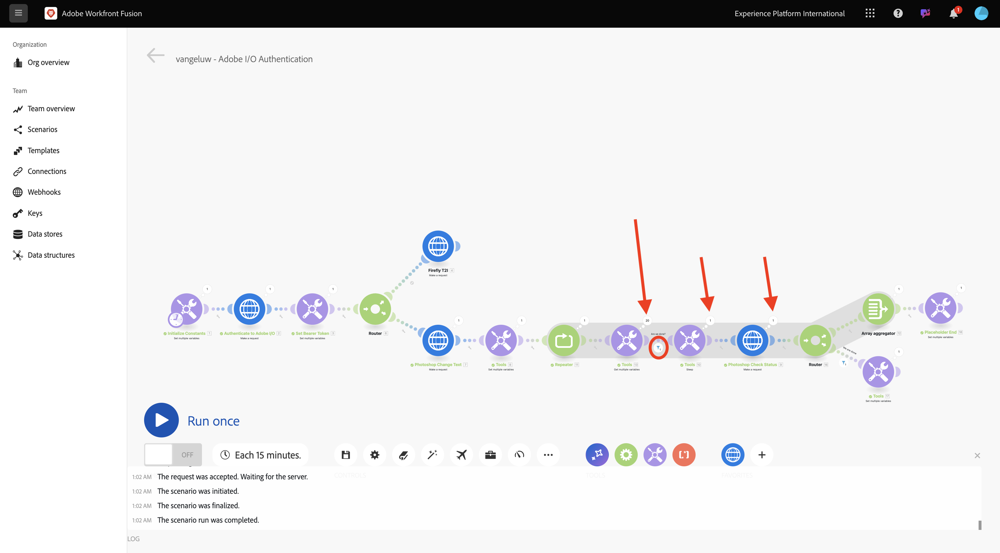

# 1.2.2 Adobe API&#39;s gebruiken in Workfront Fusion

Leer hoe u Adobe API&#39;s kunt gebruiken in Workfront Fusion.

## 1.2.2.1 Firefly Text To Image API gebruiken met Workfront Fusion

Plaats over de tweede **plaats veelvoudige variabelen** knoop en selecteer **+** om een andere module toe te voegen.


Onderzoek naar **http** en selecteer **HTTP**.


Selecteer **maak een verzoek**.


Selecteer deze variabelen:

- **URL**: `https://firefly-api.adobe.io/v3/images/generate`
- **Methode**: `POST`

Selecteer **toevoegen een kopbal**.


Voer de volgende kopteksten in:

| Sleutel | Waarde |
|:-------------:| :---------------:| 
| `x-api-key` | opgeslagen variabele voor `CONST_client_id` |
| `Authorization` | `Bearer ` + de opgeslagen variabele voor `bearer_token` |
| `Content-Type` | `application/json` |
| `Accept` | `*/*` |

Voer de details in voor `x-api-key` . Selecteer **toevoegen**.


Selecteer **toevoegen een kopbal**.


Voer de details in voor `Authorization` . Selecteer **toevoegen**.


Selecteer **toevoegen een kopbal**. Voer de details in voor `Content-Type` . Selecteer **toevoegen**.


Selecteer **toevoegen een kopbal**. Voer de details in voor `Accept` . Selecteer **toevoegen**.


Plaats het **type van Lichaam** aan **Onbewerkte**. Voor **inhoudstype**, uitgezochte **JSON (toepassing/json)**.


Plak deze nuttige lading in het **inhoud van het Verzoek** gebied.

```json
{
	"numVariations": 1,
	"size": {
		"width": 2048,
      "height": 2048
    },
    "prompt": "Horses in a field",
    "promptBiasingLocaleCode": "en-US"
}
```

Controle de doos voor **ontleed reactie**. Selecteer **O.K.**.


Selecteer **Looppas eens**.


Het scherm moet er zo uitzien.



Wilt u de **selecteren?** op het vierde knooppunt, HTTP, om het antwoord te zien. Er wordt een afbeeldingsbestand weergegeven in het antwoord.


Kopieer de URL van de afbeelding en open deze in een browservenster. Uw scherm moet er als volgt uitzien:


Klik met de rechtermuisknop op **HTTP** en hernoem naar **Firefly T2I**.


Selecteer **Opslaan** om uw wijzigingen op te slaan.


## 1.2.2.2 Photoshop API gebruiken met Workfront Fusion

Selecteer **moersleutel** tussen de knopen **plaats Token van de Drager** en **Firefly T2I**. Selecteer **een router** toevoegen.


Klik **Firefly T2I** voorwerp met de rechtermuisknop aan en selecteer **Kloon**.


Sleep en laat vallen het gekloonde voorwerp dicht bij **Router** voorwerp-het auto-verbindt met de **Router**. Uw scherm moet er als volgt uitzien:


U hebt nu een identiek exemplaar gebaseerd op het **Firefly T2I** HTTP- verzoek. Sommige montages van **Firefly T2I** HTTP- verzoek zijn gelijkaardig aan wat u met **Photoshop API** moet in wisselwerking staan, die een tijdspaarder is. Nu, moet u slechts de variabelen veranderen die niet het zelfde, zoals verzoek URL en de lading zijn.

Verander **URL** in `https://image.adobe.io/pie/psdService/text`.



Vervang **inhoud van het Verzoek** door de hieronder nuttige lading:

```json
  {
    "inputs": [
      {
        "storage": "external",
        "href": "{{AZURE_STORAGE_URL}}/{{AZURE_STORAGE_CONTAINER}}/citisignal-fiber.psd{{AZURE_STORAGE_SAS_READ}}"
      }
    ],
    "options": {
      "layers": [
        {
          "name": "2048x2048-button-text",
          "text": {
            "content": "Click here"
          }
        },
        {
          "name": "2048x2048-cta",
          "text": {
            "content": "Buy this stuff"
          }
        }
      ]
    },
    "outputs": [
      {
        "storage": "azure",
        "href": "{{AZURE_STORAGE_URL}}/{{AZURE_STORAGE_CONTAINER}}/citisignal-fiber-changed-text.psd{{AZURE_STORAGE_SAS_WRITE}}",
        "type": "vnd.adobe.photoshop",
        "overwrite": true
      }
    ]
  }
```


Opdat dit **inhoud van het Verzoek** om behoorlijk te functioneren, zijn er sommige variabelen die ontbreken:

- `AZURE_STORAGE_URL`
- `AZURE_STORAGE_CONTAINER`
- `AZURE_STORAGE_SAS_READ`
- `AZURE_STORAGE_SAS_WRITE`

Ga terug naar uw eerste knoop, uitgezochte **initialiseert Constanten** en kies dan **punt** voor elk van deze variabelen toevoegen.


| Sleutel | Voorbeeldwaarde |
|:-------------:| :---------------:| 
| `AZURE_STORAGE_URL` | `https://vangeluw.blob.core.windows.net` |
| `AZURE_STORAGE_CONTAINER` | `vangeluw` |
| `AZURE_STORAGE_SAS_READ` | `?sv=2023-01-03&st=2025-01-13T07%3A36%3A35Z&se=2026-01-14T07%3A36%3A00Z&sr=c&sp=rl&sig=4r%2FcSJLlt%2BSt9HdFdN0VzWURxRK6UqhB8TEvbWkmAag%3D` |
| `AZURE_STORAGE_SAS_WRITE` | `?sv=2023-01-03&st=2025-01-13T17%3A21%3A09Z&se=2025-01-14T17%3A21%3A09Z&sr=c&sp=racwl&sig=FD4m0YyyqUj%2B5T8YyTFJDi55RiTDC9xKtLTgW0CShps%3D` |

U kunt uw variabelen vinden door terug naar Postman te gaan, en uw **Variabelen van het Milieu** te openen.


Kopieer deze waarden naar Workfront Fusion en voeg een nieuw item toe voor elk van deze 4 variabelen.

Het scherm moet er zo uitzien. Selecteer **O.K.**.


Daarna, ga terug naar het gekloonde verzoek van HTTP om de **inhoud van het Verzoek** bij te werken. Merk de zwarte variabelen in de **inhoud van het Verzoek** op, die de variabelen zijn u over van Postman kopieerde. U moet de variabelen wijzigen die u zojuist hebt gedefinieerd in Workfront Fusion. Vervang elke variabele één door één door de zwarte tekst te schrappen en het te vervangen door de correcte variabele.


Maak deze 3 veranderingen in de **input** sectie. Selecteer **O.K.**.


Maak deze 3 veranderingen in de **output** sectie. Selecteer **O.K.**.


Klik de gekloonde knoop met de rechtermuisknop aan, en selecteer **anders noemen**. Verander de naam in **de Tekst van de Verandering van Photoshop**.


Uw scherm moet er als volgt uitzien:


Selecteer **Looppas eens**.


Selecteer het **onderzoek** pictogram op de **knoop van de Tekst van de Verandering van Photoshop** om de reactie te zien. U moet een reactie hebben die er als volgt uitziet, met een koppeling naar een statusbestand.


Alvorens met de interactie van Photoshop API verder te gaan, maak de route aan de **knoop van Firefly T2I** onbruikbaar om onnodige API vraag aan dat API eindpunt niet te verzenden. Selecteer het **moersleutelpictogram**, en selecteer dan **maak route** onbruikbaar.


Uw scherm moet er als volgt uitzien:


Daarna, voeg een andere **Vastgestelde veelvoudige variabelen** knoop toe.


Plaats het na de **knoop van de Tekst van de Verandering van Photoshop**.


Selecteer de **Vastgestelde veelvoudige variabelen** knoop, uitgezocht **punt** toevoegen. Selecteer de waarde van de variabele in het antwoord op de vorige aanvraag.

| Naam variabele | Waarde variabele |
|:-------------:| :---------------:| 
| `psdStatusUrl` | `data > _links > self > href` |

Selecteer **toevoegen**.


Selecteer **O.K.**.


Klik met de rechtermuisknop op het **knooppunt Photoshop Tekst** wijzigen en selecteer **Kloon**.


Sleep de gekloonde HTTP-aanvraag na het **knooppunt Meerdere variabelen** instellen dat u zojuist hebt gemaakt.


Klik met de rechtermuisknop op de gekloonde HTTP-aanvraag, selecteer **Naam wijzigen** en wijzig de naam in **Photoshop Check Status** .


Selecteer deze optie om de HTTP-aanvraag te openen. Verander URL zodat het de variabele verwijzingen die u in de vorige stap creeerde, en plaats de **Methode** aan **GET**.


Verwijder het **Lichaam** door de lege optie te selecteren.


Selecteer **O.K.**.


Selecteer **Looppas eens**.


Een reactie die het gebied **status** bevat, met status die aan **wordt geplaatst lopend** verschijnt. Het duurt een paar seconden voordat Photoshop het proces heeft voltooid.


Nu u weet dat de reactie iets meer tijd nodig heeft om te worden gebeëindigd, kan het een goed idee zijn om een tijdopnemer vóór deze HTTP- verzoek toe te voegen zodat het niet onmiddellijk loopt.

Selecteer de **knoop van Hulpmiddelen** en selecteer dan **Slaap**.


Plaats de **Slaap** knoop binnen tussen **vastgestelde veelvoudige variabelen** en **Status van de Controle van Photoshop**. Plaats de **Vertraging** aan **5** seconden. Selecteer **O.K.**.


Het scherm moet er zo uitzien. De uitdaging met de onderstaande configuratie is dat 5 seconden wachten genoeg kan zijn, maar misschien is het niet genoeg. In werkelijkheid, zou het beter zijn om een intelligentere oplossing zoals een do.. terwijl lijn te hebben die de status om de 5 seconden controleert tot de status **** wordt geëist. Dus je kunt zo&#39;n tactiek in de volgende stappen implementeren.


Selecteer het **moersleutelpictogram** binnen tussen **plaats veelvoudige variabelen** en **Slaap**. Selecteer **module** toevoegen.


Onderzoek naar `flow` en selecteer dan **de Controle van de Stroom**.


Selecteer **Repeater**.


Plaats **herhaalt** aan **20**. Selecteer **O.K.**.



Daarna, uitgezochte **+** op de **Status van de Controle van Photoshop** om een andere module toe te voegen.


Onderzoek naar **stroom** en selecteer **de Controle van de Stroom**.


Selecteer **de Samenvoegaar van de Serie**.


Plaats **Module van Source** aan **Repeater**. Selecteer **O.K.**.


Uw scherm moet er als volgt uitzien:


Selecteer het **moersleutelpictogram** en selecteer **een module** toevoegen.


Onderzoek naar **hulpmiddelen** en selecteer **Hulpmiddelen**.


Selecteer **krijgen veelvoudige variabelen**.


Selecteer **+ voeg punt** toe en plaats **Veranderlijke naam** aan `done`.


Selecteer **O.K.**.


Selecteer de **Vastgestelde veelvoudige variabelen** knoop die u vóór vormde. Om veranderlijk **te initialiseren gedaan**, moet u het aan `false` hier plaatsen. Selecteer **+ toevoegen punt**.



Gebruik `done` voor de naam van de **variabele**

Om de status in te stellen, is een booleaanse waarde nodig. Als u de booleaanse waarde wilt vinden, selecteert u **tandwiel** en vervolgens .`false` Selecteer **Toevoegen**.


Selecteer **OK.**


Daarna, selecteer het **moersleutelpictogram** na **krijgt veelvoudige variabelen** knoop die u vormde.


Selecteer **Opstelling een filter**. U moet nu de waarde van veranderlijk controleren **gedaan**. Als die waarde aan **vals** wordt geplaatst, dan moet het volgende deel van de lijn worden uitgevoerd. Als de waarde aan **waar** wordt geplaatst, betekent het dat het proces reeds met succes heeft voltooid zodat is er geen behoefte om met het volgende deel van de lijn verder te gaan.


Voor het etiket, gebruik **zijn wij gedaan?**. Plaats de **Voorwaarde** gebruikend reeds bestaande variabele **gereed**, zou de exploitant aan **Gelijk aan** moeten worden geplaatst en de waarde zou de booleaanse variabele `false` moeten zijn. Selecteer **O.K.**.


Daarna, maak één of andere ruimte tussen de knopen **Status van de Controle van Photoshop** en **de aggregator van de Serie**. Dan, selecteer het **moersleutelpictogram** en selecteer **een router** toevoegen. U doet dit omdat er na het controleren van de status van het Photoshop-bestand twee paden moeten zijn. Als de status `succeeded` is, dan zou de variabele van **gedaan** aan `true` moeten worden geplaatst. Als de status niet gelijk is aan `succeeded` , moet de lus worden voortgezet. De router zal het mogelijk maken om dit te controleren en te plaatsen.


Na het toevoegen van de router, selecteer het **moersleutelpictogram** en selecteer **Opstelling een filter**.



Voor het etiket, gebruik **wij worden gedaan**. Plaats de **Voorwaarde** gebruikend de reactie van de **3} knoop van de Status van de Controle van Photoshop door het antwoordgebied te kiezen** data.outputs [] .status **, zou de exploitant aan** Gelijk aan **moeten worden geplaatst en de waarde zou `succeeded` moeten zijn.** Selecteer **O.K.**.


Daarna, selecteer de lege knoop met het vraagteken en onderzoek naar **hulpmiddelen**. Dan, selecteer **Hulpmiddelen**.


Selecteer **Vastgestelde veelvoudige variabelen**.


Wanneer deze tak van de router wordt gebruikt, betekent dit dat de status van het maken van het Photoshop-bestand is voltooid. Dit betekent dat de do... terwijl lus niet langer de status in Photoshop hoeft te blijven controleren, dus u moet de variabele `done` instellen op `true`.

Voor de **naam van de Variabele**, gebruik `done`.

Voor de **Variabele waarde**, zou u de booleaanse waarde `true` moeten gebruiken. Selecteer het **tandwiel** pictogram en selecteer dan `true`. Selecteer **toevoegen**.


Selecteer **OK.**


Klik vervolgens met de rechtermuisknop op het **knooppunt Meerdere variabelen** instellen dat u zojuist hebt gemaakt en selecteer **Kloon**.


Sleep de gekloonde knoop zodat het met de **aggregator van de Serie** verbindt. Dan, klik de knoop met de rechtermuisknop aan en selecteer **anders noemen**, en verander de naam in `Placeholder End`.


Verwijder de bestaande variabele en selecteer **+ Punt toevoegen**. Voor de **Veranderlijke naam**, gebruik `placeholder`, voor de **Variabele waarde**, gebruik `end`. Selecteer **toevoegen** en dan selecteren **O.K.**.


Selecteer **sparen** om uw scenario te bewaren. Selecteer vervolgens   **Looppas eens**.


Uw scenario wordt dan uitgevoerd en zou met succes moeten beëindigen. Bericht dat doe...while lijn die u vormde het werk fijn. In de onderste looppas, kunt u zien dat de **Repeater** 20 keer liep die op de bel op **wordt gebaseerd Hulpmiddelen > krijgt veelvoudige variabelen** knoop. Na die knoop, vormde u een filter dat de status controleerde en slechts als de status niet gelijk was aan **succesvol**, werden de volgende knopen uitgevoerd. In deze looppas, liep het deel na de filter slechts eenmaal, omdat de status reeds **** in de eerste looppas werd succesvol.



U kunt het statuut van de verwezenlijking van uw nieuw dossier van Photoshop verifiëren door de bel op het **verzoek van HTTP van de Status van de Controle van Photoshop** te klikken en neer te boren aan het **status** gebied.


U hebt nu de basisversie van een herhaalbaar scenario gevormd dat een aantal stappen automatiseert. In de volgende oefening, zult u op dat herhalen door ingewikkeldheid toe te voegen.

## Volgende stappen

Ga naar [ automatisering van het Proces met de Fusie van Workfront ](./ex3.md){target="_blank"}

Ga terug naar [ de Automatisering van het Werkschema van Creative met Workfront Fusion ](./automation.md){target="_blank"}

Ga terug naar [ Alle Modules ](./../../../overview.md){target="_blank"}
