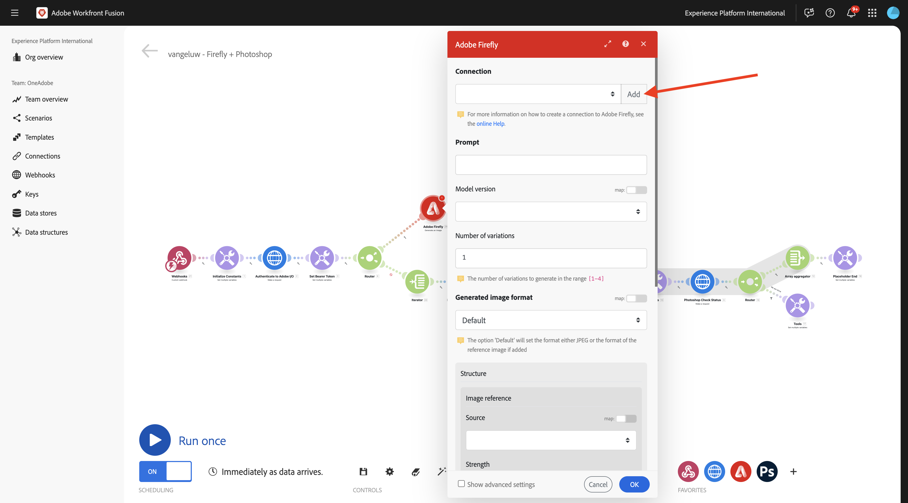
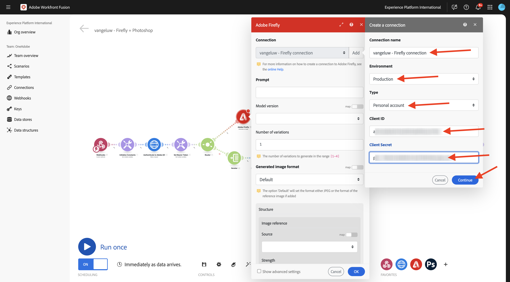
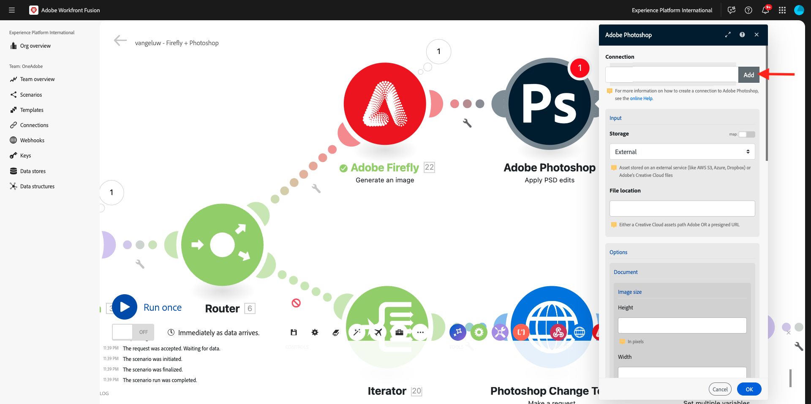
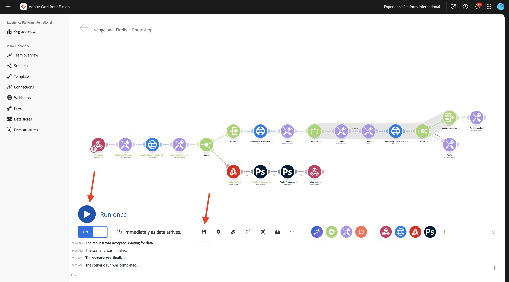

# 1.2.4 Automatisering met behulp van connectors

U gaat nu de out-of-the-box connectors gebruiken in Workfront Fusion for Photoshop en u gaat de Firefly Text-2-Image-aanvraag en de Photoshop-aanvragen verbinden met één scenario.

## 1.2.4.1 Variabelen bijwerken

Alvorens met de schakelaaropstelling verder te gaan, moeten de volgende variabelen aan **worden toegevoegd initialiseert Constanten** module.

- `AZURE_STORAGE_URL`
- `AZURE_STORAGE_CONTAINER`
- `AZURE_STORAGE_SAS_READ`
- `AZURE_STORAGE_SAS_WRITE`

Ga terug naar uw eerste knoop, uitgezochte **initialiseert Constanten** en kies dan **punt** voor elk van deze variabelen toevoegen.


| Sleutel | Voorbeeldwaarde |
|:-------------:| :---------------:| 
| `AZURE_STORAGE_URL` | `https://vangeluw.blob.core.windows.net` |
| `AZURE_STORAGE_CONTAINER` | `vangeluw` |
| `AZURE_STORAGE_SAS_READ` | `?sv=2023-01-03&st=2025-01-13T07%3A36%3A35Z&se=2026-01-14T07%3A36%3A00Z&sr=c&sp=rl&sig=4r%2FcSJLlt%2BSt9HdFdN0VzWURxRK6UqhB8TEvbWkmAag%3D` |
| `AZURE_STORAGE_SAS_WRITE` | `?sv=2023-01-03&st=2025-01-13T17%3A21%3A09Z&se=2025-01-14T17%3A21%3A09Z&sr=c&sp=racwl&sig=FD4m0YyyqUj%2B5T8YyTFJDi55RiTDC9xKtLTgW0CShps%3D` |

U kunt uw variabelen vinden door terug naar Postman te gaan, en uw **Variabelen van het Milieu** te openen.


Kopieer deze waarden naar Workfront Fusion en voeg een nieuw item toe voor elk van deze 4 variabelen.

Het scherm moet er zo uitzien. Selecteer **O.K.**.


## 1.2.4.2 Activeer uw scenario met een webhaak

Tot dusver, hebt u uw scenario manueel in werking gesteld om te testen. Werk nu uw scenario bij met een webhaak, zodat het vanuit een externe omgeving kan worden geactiveerd.

Selecteer **+**, onderzoek naar **webhaak** en selecteer dan **Webhooks**.


Selecteer **Webhaak van de Douane**.


Sleep de **Webhaak van de Douane** module aan het begin van uw scenario. Daarna, selecteer het **klok** pictogram en sleep het op de **Eigen webhaak** module.


Dan moet je dit zien. Sleep vervolgens de rode stip op de eerste module naar de paarse stip op de tweede module.


Dan moet je dit zien. Daarna, klik de **Webhaak van de Douane** module.


Klik **toevoegen**.


Plaats de **naam van Webhaak** aan `--aepUserLdap-- - Firefly + Photoshop Webhook`. Klik **sparen**.


De URL van uw webhaak is nu beschikbaar. Klik **adres van het Exemplaar aan klembord** om URL te kopiëren.


Open Postman, en voeg een nieuwe omslag in de inzameling **toe FF - de Instanties van de Tech van Firefly Services**.


Geef de map een naam `--aepUserLdap-- - Workfront Fusion` .


In de omslag die u enkel creeerde, selecteer de 3 punten **...** en selecteer **verzoek** toevoegen.


Plaats het **type van Methode** aan **POST** en kleef URL van uw webhaak in de adresbar.


U moet een douanelichaam verzenden, zodat de veranderlijke elementen van een externe bron aan uw scenario van de Fusie van Workfront kunnen worden verstrekt.

Ga naar **Lichaam** en selecteer **onbewerkt**.


Plak de onderstaande tekst in de hoofdtekst van uw verzoek. Selecteer **verzenden**.

```json
{
    "psdTemplate": "citisignal-fiber.psd",
    "xlsFile": "placeholder",
    "prompt":"misty meadows",
    "cta": "Buy this now!",
    "button": "Click here to buy!"
}
```


Terug in de Fusie van Workfront, verschijnt een bericht op uw douane webhaak die zegt: **met succes bepaalde**.


## 1.2.4.3 Adobe Firefly Connector

Klik op het pictogram **+** om een nieuwe module toe te voegen.


Ga de onderzoekstermijn `Adobe Firefly` in en selecteer dan **Adobe Firefly**.


Selecteer **produceer een beeld**.


Klik de **Adobe Firefly** module om het te openen, en dan te klikken **voeg** toe om een nieuwe verbinding tot stand te brengen.



Vul de volgende velden in:

- **naam van de Verbinding**: gebruik `--aepUserLdap-- - Firefly connection`.
- **Milieu**: gebruik **Productie**.
- **Type**: gebruik **Persoonlijke rekening**.
- **identiteitskaart van de Cliënt**: kopieer **identiteitskaart van de Cliënt** van uw project van Adobe I/O dat `--aepUserLdap-- - One Adobe tutorial` wordt genoemd.
- **Geheim van de Cliënt**: kopieer het **Geheime Cliënt** van uw project van Adobe I/O dat `--aepUserLdap-- - One Adobe tutorial` wordt genoemd.

U kunt **identiteitskaart van de Cliënt** en **Geheime Cliënt** van uw project van Adobe I/O [&#x200B; hier &#x200B;](https://developer.adobe.com/console/projects.){target="_blank"} vinden.


Zodra u alle gebieden hebt ingevuld, gaat de klik **&#x200B;**&#x200B;verder. Uw verbinding wordt dan automatisch gevalideerd.



Daarna, selecteer de veranderlijke **herinnering** die aan het scenario door de inkomende **Douane webhaak** wordt verstrekt.


Plaats de **Modelversie** **herinnering** aan **image4 norm**. Klik **OK**.


Klik **sparen** om uw veranderingen op te slaan en dan **in werking te stellen eens** om uw configuratie te testen.


Ga naar Postman, verifieer de herinnering in uw verzoek en klik dan **verzenden**.


Zodra u hebt geklikt verzend, ga terug naar de Fusie van Workfront en klik het borstelpictogram op de **Adobe Firefly** module om de details te verifiëren.


Ga in **UITVOER** naar **Details** > **url** om URl van het beeld te vinden dat door **Adobe Firefly** werd geproduceerd.


Kopieer de URL en passeer deze in uw browser. U zou nu een beeld moeten zien dat de herinnering vertegenwoordigt u binnen van het verzoek van Postman, in dit geval **misty graslanden** verzond.


## 1.2.4.2 De achtergrond van een PSD-bestand wijzigen

U zult nu uw scenario bijwerken om het slimmer te maken door meer uit-van-de-doos schakelaars te gebruiken. U gaat ook de uitvoer van Firefly naar Photoshop verbinden, zodat de achtergrondafbeelding van het PSD-bestand dynamisch verandert door de uitvoer van de actie Afbeelding genereren door Firefly te gebruiken.

Dan moet je dit zien. Daarna, beweegt over de **Adobe Firefly** module en klikt **+** pictogram.


In het onderzoeksmenu, ga `Photoshop` in en klik dan de **Adobe Photoshop** actie.


Selecteer **toepassen PSD geeft uit**.


Dan moet je dit zien. Klik **toevoegen** om een nieuwe verbinding aan Adobe Photoshop toe te voegen.



Configureer de verbinding als volgt:

- Het type van verbinding: selecteer **Adobe Photoshop (Server-aan-Server)**
- Naam van verbinding: enter `--aepUserLdap-- - Adobe I/O`
- Client-id: uw client-id plakken
- Clientgeheim: plak uw clientgeheim

Klik **verdergaan**.


Om uw **identiteitskaart van de Cliënt te vinden** en **Geheim van de Cliënt**, ga [&#x200B; https://developer.adobe.com/console/home &#x200B;](https://developer.adobe.com/console/home){target="_blank"} en open uw project van Adobe I/O, dat `--aepUserLdap-- One Adobe tutorial` wordt genoemd. Ga naar **OAuth Server-aan-Server** om uw identiteitskaart van de Cliënt en Geheime cliënt te vinden. Kopieer deze waarden en plak ze in de verbindingsinstelling in Workfront Fusion.


Na het klikken **ga** verder, zal een popup venster kort worden getoond terwijl uw geloofsbrieven worden geverifieerd. Als je klaar bent, moet je dit zien.


U moet nu de bestandslocatie invoeren van het PSD-bestand waarmee u Fusion wilt gebruiken. Voor **Opslag**, uitgezochte **Azure** en voor **plaats van het Dossier**, ga `{{1.AZURE_STORAGE_URL}}/{{1.AZURE_STORAGE_CONTAINER}}/{{1.AZURE_STORAGE_SAS_READ}}` in. Plaats de cursor naast de tweede `/` . Dan, heb een blik op de beschikbare variabelen en scrol neer om veranderlijk **psdTemplate** te vinden. Klik veranderlijk **psdTemplate** om het te selecteren.


Dan moet je dit zien.


Schuif al manier neer tot u **Lagen** ziet. Klik **toevoegen punt**.


Dan moet je dit zien. U moet nu de naam invoeren van de laag in de Photoshop PSD-sjabloon die wordt gebruikt voor de achtergrond van het bestand.


In het dossier **wordt** gebruikt het burgerschap-vezel.psd, zult u de laag vinden die voor de achtergrond gebruikte. In dit voorbeeld, wordt die laag genoemd **2048x2048-background**.


Plak de naam **2048x2048-achtergrond** in de dialoog van de Fusie van Workfront.


De rol neer tot u **Input** ziet. U moet nu definiëren wat op de achtergrondlaag moet worden ingevoegd. In dit geval, moet u de output van de **Adobe Firefly** module selecteren, die het dynamisch geproduceerde beeld bevat.

Voor **Opslag**, uitgezochte **Extern**. Voor **plaats van het Dossier**, zult u veranderlijk `{{XX.details[].url}}` van de output van de **Adobe Firefly** module moeten kopiëren en kleven maar u moet **XX** in de variabele door het opeenvolgingsaantal van de **Adobe Firefly** module vervangen, die in dit voorbeeld **5** is.


Daarna, scrol neer tot u **ziet uitgeven**. De reeks **geeft** **&#x200B;**&#x200B;uit en plaatst **Type** aan **Laag**. Klik **toevoegen**.


Dan moet je dit zien. Vervolgens moet u de uitvoer van de handeling definiëren. Klik **toevoegen punt** onder **output**.


Selecteer **Azure** voor **Opslag**, kleef dit `{{1.AZURE_STORAGE_URL}}/{{1.AZURE_STORAGE_CONTAINER}}/citisignal-fiber-replacedbg.psd{{1.AZURE_STORAGE_SAS_WRITE}}` onder **Plaats van het Dossier** en selecteer **vnd.adobe.photoshop** onder **Type**. Klik om **toe te laten tonen geavanceerde montages**.


Onder **Geavanceerde Montages**, uitgezochte **ja** om dossiers met de zelfde naam te beschrijven.
Klik **toevoegen**.


Dan moet je dit hebben. Klik **OK**.


Klik **sparen** om uw veranderingen op te slaan en dan **in werking te stellen eens** om uw configuratie te testen.


Ga naar Postman, verifieer de herinnering in uw verzoek en klik dan **verzenden**.


Dan moet je dit zien. Klik de bel op **Adobe Photoshop - pas PSD uit** module uitgeeft.


U ziet nu dat er een nieuw PSD-bestand is gegenereerd en opgeslagen in uw Microsoft Azure Storage Account.


## 1.2.4.3 Tekstlagen van PSD-bestand wijzigen

Daarna, beweeg over **Adobe Photoshop - pas PSD uit geeft** module uit en klik **+** pictogram.


Selecteer **Adobe Photoshop**.


Selecteer **tekstlagen** uitgeven.


Dan moet je dit zien. Selecteer eerst de eerder geconfigureerde Adobe Photoshop-verbinding met de naam `--aepUserLdap-- Adobe I/O` .


Voor het **dossier van de Input**, uitgezocht **Azure** voor **het dossieropslag van de Input** en zorg ervoor om de output van het vorige verzoek te selecteren, **Adobe Photoshop - pas PSD uit**, die u als dit kunt bepalen: ``{{XX.data[].`_links`.renditions[].href}}`` (vervang XX door het opeenvolgingsaantal van de vorige module Adobe Photoshop - pas PSD uit).

Daarna, klik **+ voeg punt** onder **Lagen** toe beginnen de tekstlagen toe te voegen die moeten worden bijgewerkt.


Er zijn 2 te maken veranderingen, de tekst van CTA en de knooptekst in het dossier **wordt aangebracht burgerschap-fiber.psd** moet worden bijgewerkt.

Om de laagnamen te vinden, open het dossier **burgerschap-fiber.psd**. In het dossier, zult u opmerken dat de laag die call to action bevat **wordt genoemd 2048x2048-cta**.


In het dossier **wordt** 2048x2048-knoop-tekst **genoemd.**


U moet eerst de veranderingen vormen die aan de laag **moeten gebeuren 2048x2048-cta**. Ga de naam **2048x2048-cta** onder **Naam** in de dialoog in.


De rol neer tot u **Tekst** > **Inhoud** ziet. Selecteer veranderlijke **cta** van de lading van de Webhaak. Klik **toevoegen**.


Dan moet je dit zien. Klik op **+ Add item** onder **Lagen** om de volgende tekstlaag toe te voegen die moet worden bijgewerkt.


Ga de naam **2048x2048-knoop-tekst** onder **Naam** in de dialoog in.


De rol neer tot u **Tekst** > **Inhoud** ziet. Selecteer de veranderlijke **knoop** van de payload van de Webhaak. Klik **toevoegen**.


Dan moet je dit zien.


De rol neer tot u **Output** ziet. Voor **Opslag**, uitgezochte **Azure**. Voor **plaats van het Dossier**, ga de hieronder plaats in. Let op de toevoeging van de variabele `{{timestamp}}` aan de bestandsnaam die wordt gebruikt om ervoor te zorgen dat elk bestand dat wordt gegenereerd een unieke naam heeft. Ook, plaats het **Type** aan **vnd.adobe.photoshop**.

`{{1.AZURE_STORAGE_URL}}/{{1.AZURE_STORAGE_CONTAINER}}/citisignal-fiber-changed-text-{{timestamp}}.psd{{1.AZURE_STORAGE_SAS_WRITE}}`

Plaats **Type** aan **vnd.adobe.photoshop**. Klik **OK**.


Klik **sparen** om uw veranderingen te bewaren.


## 1.2.4.4 Webhacerespons

Na het toepassen van deze veranderingen in uw dossier van Photoshop, moet u nu de reactie van de a **Webhaak** vormen die zal worden teruggestuurd naar welke toepassing dit scenario heeft geactiveerd.

Beweeg over de module **Adobe Photoshop - geef tekstlagen** uit en klik **+** pictogram.


Onderzoek naar `webhooks` en selecteer **Webhaak**.


Selecteer **reactie Webhaak**.


Dan moet je dit zien. Plak hieronder nuttige lading in **Lichaam**.

```json
{
    "newPsdTemplate": ""
}
```


Kopieer en kleef veranderlijk `{{XX.data[]._links.renditions[].href}}` en vervang **XX** door het opeenvolgingsaantal van laatste **Adobe Photoshop - geef tekstlagen** module uit, die in dit geval **7** is.


Laat checkbox voor **toe tonen geavanceerde montages** en klik dan **toevoegen punt**.


Op het gebied **Sleutel**, ga `Content-Type` in. Op het gebied **Waarde**, ga `application/json` in. Klik **toevoegen**.


Dan moet je dit hebben. Klik **OK**.


Klik **auto-richt**.


Dan moet je dit zien. Klik **sparen** om uw veranderingen op te slaan en dan **in werking te stellen eens** om uw scenario te testen.



Ga terug naar Postman en klik **verzenden**. De herinnering die hier wordt gebruikt is **slechte graslanden**.


Het scenario wordt vervolgens geactiveerd en na enige tijd wordt een reactie weergegeven in Postman die de URL van het nieuwe PSD-bestand bevat.


Als herinnering: zodra het scenario in Workfront Fusion in werking is gesteld, zult u informatie over elke module kunnen zien door de bel boven elke module te klikken.


Met Azure Storage Explorer kunt u het nieuwe PSD-bestand zoeken en openen door erop te dubbelklikken in Azure Storage Explorer.


Uw dossier zou dan als dit, met de achtergrond moeten kijken die door een achtergrond met **slechte graslanden** wordt vervangen.


Als u uw scenario opnieuw in werking stelt, en dan een nieuw verzoek van Postman verzendt gebruikend een verschillende herinnering, zult u dan zien hoe gemakkelijk en herbruikbaar uw scenario is geworden. In dit voorbeeld, is de nieuwe herinnering die wordt gebruikt **zonnige woestijn**.


Een paar minuten later is er een nieuw PSD-bestand met een nieuwe achtergrond gemaakt.


## Volgende stappen

Ga naar [&#x200B; 1.2.3 Frame.io en Workfront Fusion &#x200B;](./ex3.md){target="_blank"}

Ga terug naar [&#x200B; de Automatisering van het Werkschema van Creative met Workfront Fusion &#x200B;](./automation.md){target="_blank"}

Ga terug naar [&#x200B; Alle Modules &#x200B;](./../../../overview.md){target="_blank"}
