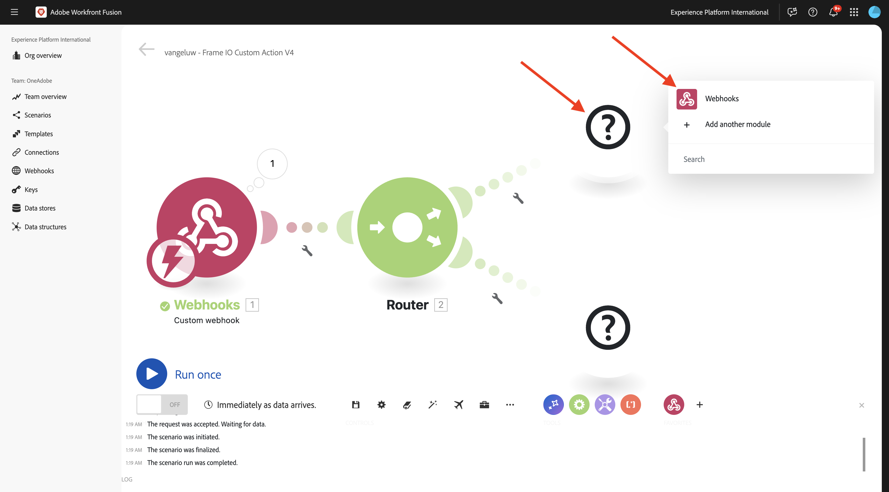
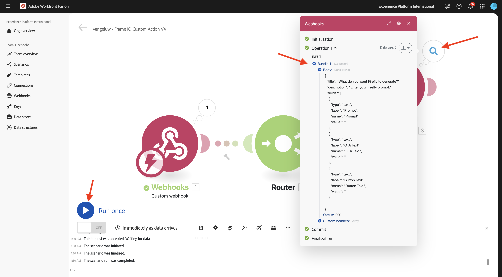

# 1.2.3 Frame.io en Workfront Fusion

In de vorige oefening vormde u het scenario `--aepUserLdap-- - Firefly + Photoshop` en vormde een inkomende webhaak om het scenario, en een webhaakreactie teweeg te brengen wanneer het scenario met succes voltooide. Vervolgens hebt u Postman gebruikt om dat scenario te activeren. Postman is een groot hulpmiddel voor het testen, maar in een echt bedrijfsscenario, zouden de bedrijfsgebruikers Postman niet gebruiken om een scenario teweeg te brengen. In plaats daarvan zouden ze een andere toepassing gebruiken en verwachten ze dat andere toepassing een scenario in Workfront Fusion activeert. In deze oefening, is dat precies wat u met Frame.io zult doen.

>[!NOTE]
>
>Deze oefening werd gecreeerd voor Frame.io V4. Enkele hieronder mogelijkheden die in de oefening worden gebruikt zijn momenteel in alpha en zijn over het algemeen nog niet beschikbaar.

## 1.2.3.1 Voorwaarden

Alvorens met deze oefening verder te gaan, moet u de opstelling van [&#x200B; uw project van Adobe I/O &#x200B;](./../../../modules/getting-started/gettingstarted/ex6.md) hebben voltooid met inbegrip van het toevoegen van **Frame.io API** aan uw project van Adobe I/O, en u moet ook een toepassing gevormd hebben om met APIs, zoals [&#x200B; Postman &#x200B;](./../../../modules/getting-started/gettingstarted/ex7.md) of [&#x200B; PostBuster &#x200B;](./../../../modules/getting-started/gettingstarted/ex8.md) in wisselwerking te staan.

## 1.2.3.2 Toegang tot Frame.io

Ga naar [&#x200B; https://next.frame.io/ &#x200B;](https://next.frame.io/){target="_blank"}.


Controleer aan welke instantie u momenteel bent aangemeld door op het instantiepictogram te klikken. Kies de instantie waartoe u toegang hebt gekregen. Dit moet `--aepImsOrgName--` zijn.

Klik **+ Nieuw Project** om uw eigen project in Frame.io tot stand te brengen.


Selecteer het **Lege** malplaatje en ga dan de naam `--aepUserLdap--` voor uw project in. Klik **creëren Nieuw Project**.


U zult dan uw project in het linkermenu zien. Klik **+** pictogram en selecteer dan **Nieuwe Omslag**.


Voer de naam `CitiSignal Fiber Campaign` in en dubbelklik op de map om deze te openen.


Klik **uploaden**.


In één van de vorige oefeningen, downloadde u [&#x200B; burgersignaal-fiber.psd &#x200B;](./../../../assets/ff/citisignal-fiber.psd){target="_blank"}. Selecteer dat dossier en klik **Open**.


Het dossier **burgerschap-fiber.psd** zal dan beschikbaar in uw pas gecreëerde omslag zijn.


## 1.2.3.3 Workfront Fusion en Frame.io

In de vorige oefening, creeerde u het scenario `--aepUserLdap-- - Firefly + Photoshop`, dat met een douane webhaak begon en dat met een webshreactie beëindigde. Het gebruik van de webhaken werd vervolgens getest met Postman, maar het is duidelijk dat het punt van een dergelijk scenario moet worden genoemd door een externe toepassing. Zoals eerder vermeld, is Frame.io die oefening, maar tussen Frame.io en `--aepUserLdap-- - Firefly + Photoshop` is een ander Workfront Fusion-scenario nodig. u zult nu dat scenario vormen.

Ga naar [&#x200B; https://experience.adobe.com/ &#x200B;](https://experience.adobe.com/){target="_blank"}. Open **de Fusie van Workfront**.


In het linkermenu, ga naar **Scenario&#39;s** en selecteer uw omslag `--aepUserLdap--`. Klik **creeer een nieuw scenario**.


Gebruik de naam `--aepUserLdap-- - Frame IO Custom Action V4` .


Klik het **voorwerp van het vraagteken** op het canvas. Ga de tekst `webhook` in het onderzoeksvakje in en klik **Webhooks**.


Klik **WebHaak van de Douane**.


Klik **toevoegen** om een nieuwe webhaakURL tot stand te brengen.


Voor de **naam van Webhaak**, gebruik `--aepUserLdap-- - Frame IO Custom Action Webhook`. Klik **sparen**.


Dan moet je dit zien. Laat dit scherm open en onaangeroerd zoals u het in een volgende stap nodig hebt. U zult WebHaak URL in een volgende stap moeten kopiëren, door **adres van het Exemplaar aan klembord** te klikken.


## 1.2.3.4 Frame.io V4 API voor aangepaste handelingen

Ga naar Postman en open het verzoek **POST - krijg het Symbolische van de Toegang** in de inzameling **Adobe IO - OAuth**. Verifieer het gebied **werkingsgebied** onder **Params**. Het gebied **werkingsgebied** zou het werkingsgebied `frame.s2s.all` moeten omvatten. Voeg het toe als het ontbreekt. Daarna, verzendt de klik **&#x200B;**&#x200B;om een nieuw **access_token** te verzoeken.


Daarna, open het verzoek **GET - de Rekeningen van de Lijst** in de inzameling **Frame.io V4 - de Instanties van de Tech**. Klik **verzenden**.


Vervolgens ziet u een vergelijkbare reactie die een of meer accounts bevat. Herzie de reactie en bepaal de plaats van het gebied **identiteitskaart** voor de rekening Frame.io V4 u gebruikt. U kunt de naam van de Rekening in Frame.io V4 gebruikersinterface vinden:


Kopieer de waarde van het gebied **identiteitskaart**.


In het linkermenu, ga naar **Milieu&#39;s** en selecteer het milieu u gebruikt. Vind veranderlijk **`FRAME_IO_ACCOUNT_ID`** en kleef **identiteitskaart** die u van het vorige verzoek in zowel de **Aanvankelijke waarde** kolom en de **Huidige waarde** kolom kreeg. Klik **sparen**.


In het linkermenu, ga terug naar **Inzamelingen**. Open het verzoek **GET - de Werkruimten van de Lijst** in de inzameling **Frame.io V4 - de Instanties van de Tech**. Klik **verzenden**.


Vervolgens ziet u een vergelijkbare reactie die een of meer accounts bevat. Herzie de reactie en bepaal de plaats van het gebied **identiteitskaart** voor Frame.io V4 Workspace u gebruikt. Kopieer de waarde van het gebied **identiteitskaart**.


In het linkermenu, ga naar **Milieu&#39;s** en selecteer het milieu u gebruikt. Vind veranderlijk **`FRAME_IO_WORKSPACE_ID`** en kleef **identiteitskaart** die u van het vorige verzoek in zowel de **Aanvankelijke waarde** kolom en de **Huidige waarde** kolom kreeg. Klik **sparen**.


In het linkermenu, ga terug naar **Inzamelingen**. Open het verzoek **POST - creeer de Actie van de Douane** in de inzameling **Frame.io V4 - de Instanties van de Tech**, in de omslag **Acties van de Douane**.

Ga naar het **Lichaam** van het verzoek. Verander het gebied **naam** aan `--aepUserLdap--  - Frame.io Custom Action V4` en verander dan het gebied **url** in de waarde van Webhaak URL u van de Fusie van Workfront kopieerde.

Klik **verzenden**.


Uw aangepaste actie Frame.io V4 is nu gemaakt.


Ga terug naar [&#x200B; https://next.frame.io/ &#x200B;](https://next.frame.io/){target="_blank"} en ga naar de omslag **Campagne van de Vezel CitiSignal** die u in uw project `--aepUserLdap--` creeerde. Vernieuw de pagina.


Na het hebben van de pagina verfrist, klik de 3 punten **...** op de activa **&#x200B;**&#x200B;en open het **menu van de Acties van de Douane**. De aangepaste handeling die u eerder hebt gemaakt, wordt dan weergegeven in het menu dat wordt weergegeven. Klik op de aangepaste handeling `--aepUserLdap-- - Frame IO Custom Action Fusion V4` .


U zou dan een gelijkaardige **pop-up van de Actie van de Douane** moeten zien. Deze pop-up is het resultaat van de communicatie tussen Frame.io en Workfront Fusion.


Zet het scherm terug op Workfront Fusion. U zou nu **met succes moeten zien bepaald** op het voorwerp van de Verbinding van de Douane verschijnen WebHaak. Klik **OK**.


Klik **Looppas Eenmaal** om testwijze toe te laten, en de mededeling met Frame.io opnieuw te testen.


Ga terug naar Frame.io en klik nogmaals op de aangepaste handeling `--aepUserLdap-- - Frame IO Custom Action Fusion V4` .


Schakel het scherm weer in op Workfront Fusion. U zou nu een groen controleteken, en een bel moeten zien die **1** tonen. Klik op de ballon om de details weer te geven.


De gedetailleerde mening van de bel toont u de gegevens die van Frame.io werden ontvangen. Je moet verschillende id&#39;s zien. Als voorbeeld, toont het gebied **resource.id** unieke identiteitskaart in Frame.io van de activa **burgerschap-fiber.psd**.


Nu communicatie tot stand is gebracht tussen Frame.io en Workfront Fusion, kunt u uw configuratie voortzetten.

## 1.2.3.5 Een aangepaste formulierreactie bieden op Frame.io

Wanneer de aangepaste handeling wordt aangeroepen in Frame.io, verwacht Frame.io een reactie van Workfront Fusion te ontvangen. Als u terugdenkt aan het scenario u in de vorige oefening bouwde, wordt een aantal variabelen vereist om het standaardPhotoshop PSD dossier bij te werken. Deze variabelen worden gedefinieerd in de payload die u hebt gebruikt:

```json
{
    "psdTemplate": "citisignal-fiber.psd",
    "xlsFile": "placeholder",
    "prompt":"misty meadows",
    "cta": "Buy this now!",
    "button": "Click here to buy!"
}
```

Zo in orde voor het scenario `--aepUserLdap-- - Firefly + Photoshop` om met succes in werking te stellen, zijn de gebieden zoals **herinnering**, **cta**, **knoop** en **psdTemplate** nodig.

De eerste 3 gebieden, **herinnering**, **cta**, **knoop**, vereisen gebruikersinput die in Frame.io moet worden verzameld wanneer de gebruiker de douaneactie aanhaalt. Dus het eerste wat we moeten doen binnen Workfront Fusion is controleren of deze variabelen al dan niet beschikbaar zijn en als dat niet het geval is, moet Workfront Fusion reageren op Frame.io met het verzoek om deze variabelen in te voeren. De manier om dat te bereiken is door een formulier in Frame.io te gebruiken.

Ga terug naar Workfront Fusion en open uw scenario `--aepUserLdap-- - Frame IO Custom Action` . Beweeg over het **Webhaak van de Douane** voorwerp en klik **+** pictogram om een andere module toe te voegen.


Onderzoek naar `Flow Control` en klik **de Controle van de Stroom**.


Klik om **Router** te selecteren.


Dan moet je dit zien.


Klik op **?** voorwerp en klik dan om **Webhooks** te selecteren.



Selecteer **reactie Webhaak**.


Dan moet je dit zien.


Kopieer de hieronder code JSON en kleef het op het gebied **Lichaam**.


```json
{
  "title": "What do you want Firefly to generate?",
  "description": "Enter your Firefly prompt.",
  "fields": [
    {
      "type": "text",
      "label": "Prompt",
      "name": "Prompt",
      "value": ""
    },
    {
      "type": "text",
      "label": "CTA Text",
      "name": "CTA Text",
      "value": ""
    },
    {
      "type": "text",
      "label": "Button Text",
      "name": "Button Text",
      "value": ""
    }
  ]
}
```

Klik op het pictogram om de JSON-code op te schonen en te verfraaien. Dan, klik O.K. **&#x200B;**.


Klik **sparen** om uw veranderingen te bewaren.


Daarna, moet u opstelling een filter ervoor zorgen dat dit weg van het scenario slechts loopt wanneer geen herinnering beschikbaar is. Klik het **moersleutelpictogram** en selecteer dan **Opstelling een filter**.


Configureer de volgende velden:

- **Etiket**: gebruik `Prompt isn't available`.
- **Voorwaarde**: gebruik `{{1.data.Prompt}}`.
- **Basisexploitanten**: uitgezochte **bestaat niet**.

>[!NOTE]
>
>Variabelen in Workfront Fusion kunnen handmatig worden opgegeven met de volgende syntaxis: `{{1.data.Prompt}}` . Het getal in de variabele verwijst naar de module in het scenario. In dit voorbeeld, kunt u zien dat de eerste module in het scenario **Webhooks** wordt genoemd en een opeenvolgingsaantal van **1** heeft. Dit betekent dat veranderlijk `{{1.data.Prompt}}` tot het gebied **data.Prompt** van de module met opeenvolgingsaantal 1 zal toegang hebben. De aantallen van de opeenvolging kunnen soms verschillend zijn zodat let op wanneer het kopiëren/het kleven van dergelijke variabelen en verifieer altijd dat het gebruikte opeenvolgingsaantal het correcte is.

Klik **OK**.


Dan moet je dit zien. Klik **sparen** pictogram eerst, en klik dan **in werking stellen eens** om uw scenario te testen.


Dan moet je dit zien.


Ga terug naar Frame.io en klik de douaneactie `--aepUserLdap-- - Frame IO Custom Action Fusion` op de activa **burgerschap-fiber.psd** opnieuw.


U zou nu een herinnering binnen Frame.io moeten zien. Vul de velden nog niet in en verzend het formulier nog niet. Deze herinnering wordt getoond gebaseerd van de reactie van de Fusie van Workfront die u enkel vormde.


De schakelaar terug naar de Fusie van Workfront en klikt de bel op de **module van de Reactie van Webhaak**. U zult zien dat onder **INPUT**, u het lichaam ziet dat de nuttige lading JSON voor de vorm bevat. Klik **Looppas eens** opnieuw.



Dan moet u dit nog eens zien.


Ga terug naar Frame.io en vul de velden in zoals aangegeven.

- **Herinnering**: futuristische laserbeams die door ruimte lopen
- **CTA**: Timetravel nu!
- **Tekst van de Knoop**: Krijg aan boord!

Klik **voorleggen**.


Dan zie je een popup in Frame.io die er zo uitziet.


De schakelaar terug naar de Fusie van Workfront en klikt de bel op de **Webhaak van de Douane** module. In Verrichting 1, onder **UITVOER**, kunt u een nieuw **gegevens** voorwerp nu zien dat gebieden als **Tekst van de Knoop** bevat, **Tekst van CTA** en **Vragen**. Met deze variabelen van de gebruikersinvoer beschikbaar in uw scenario, hebt u genoeg om uw configuratie voort te zetten.


## 1.2.3.6 Bestandslocatie ophalen van Frame.io

Zoals eerder besproken, zijn de gebieden zoals **herinnering**, **cta**, **knoop** en **psdTemplate** nodig voor dit scenario aan functie. De eerste 3 gebieden zijn nu reeds beschikbaar maar **psdTemplate** aan gebruik nog mist. **psdTemplate** zal nu een plaats Frame.io van verwijzingen voorzien aangezien het dossier **wordt** ontvangen &lbrace;in Frame.io. Om de locatie van dat bestand op te halen, moet u de verbinding Frame.io configureren en gebruiken in Workfront Fusion.

Ga terug naar Workfront Fusion en open uw scenario `--aepUserLdap-- - Frame IO Custom Action V4` . Over de **heen?** klikt u op het pictogram **+** om een andere module toe te voegen en te zoeken naar `frame` . Klik **Frame.io**.


Klik **Frame.io**.


Klik **maak een douane API vraag**.


Om de verbinding te gebruiken Frame.io, moet u het eerst vormen. Klik **toevoegen** om dat te doen.


Selecteer het **type van Verbinding** **Server IMS aan Server** en ga de naam `--aepUserLdap-- - Adobe I/O - Frame.io S2S` in.


Daarna, moet u **identiteitskaart van de Cliënt** ingaan en **Geheime Cliënt** van het project van Adobe I/O dat u als deel van de **Begonnen** module vormde. U kunt **identiteitskaart van de Cliënt** en **Geheime Cliënt** van uw project van Adobe I/O [&#x200B; hier &#x200B;](https://developer.adobe.com/console/projects.){target="_blank"} vinden.


Ga terug naar je scenario in Workfront Fusion. Plak de waarden van **identiteitskaart van de Cliënt** en **Geheime Cliënt** op hun respectieve gebied in het venster van de verbindingsopstelling. Klik **verdergaan**. De verbinding wordt nu getest door Workfront Fusion.


Als de verbinding met succes werd getest, zal het automatisch onder **Verbinding** verschijnen. U hebt nu een succesvolle verbinding, en u moet de configuratie voltooien om alle elementdetails van Frame.io, met inbegrip van de dossierplaats te krijgen. Om dit te doen, zult u **identiteitskaart van het Middel** moeten gebruiken.


Het gebied **identiteitskaart van het Middel** wordt gedeeld door Frame.io aan de Fusie van Workfront als deel van de aanvankelijke **Webhaak van de Douane** mededeling en kan onder het gebied **resource.id** worden gevonden.

Voor de configuratie van de module **Frame.io - maak een douane API vraag**, gebruik URL: `/v4/accounts/{{1.account_id}}/files/{{1.resource.id}}`.

>[!NOTE]
>
>Variabelen in Workfront Fusion kunnen handmatig worden opgegeven met de volgende syntaxis: `{{1.account_id}}` en `{{1.resource.id}}` . Het getal in de variabele verwijst naar de module in het scenario. In dit voorbeeld, kunt u zien dat de eerste module in het scenario **Webhooks** wordt genoemd en een opeenvolgingsaantal van **1** heeft. Dit betekent dat de variabelen `{{1.account_id}}` en `{{1.resource.id}}` tot dat gebied van de module met opeenvolgingsaantal 1 zullen toegang hebben. De aantallen van de opeenvolging kunnen soms verschillend zijn zodat let op wanneer het kopiëren/het kleven van dergelijke variabelen en verifieer altijd dat het gebruikte opeenvolgingsaantal het correcte is.

Daarna, klik **+ voeg punt** onder **Koord van de Vraag** toe.


Ga deze waarden in en klik **toevoegen**.

| Sleutel | Waarde |
|:-------------:| :---------------:| 
| `include` | `media_links.original` |


Dat zou u nu moeten doen. Klik **OK**.


Daarna, moet u opstelling een filter ervoor zorgen dat dit weg van het scenario slechts loopt wanneer geen herinnering beschikbaar is. Klik het **moersleutelpictogram** en selecteer dan **Opstelling een filter**.


Configureer de volgende velden:

- **Etiket**: gebruik `Prompt is available`.
- **Voorwaarde**: gebruik `{{1.data.Prompt}}`.
- **Basisexploitanten**: uitgezochte **bestaat**.

>[!NOTE]
>
>Variabelen in Workfront Fusion kunnen handmatig worden opgegeven met de volgende syntaxis: `{{1.data.Prompt}}` . Het getal in de variabele verwijst naar de module in het scenario. In dit voorbeeld, kunt u zien dat de eerste module in het scenario **Webhooks** wordt genoemd en een opeenvolgingsaantal van **1** heeft. Dit betekent dat veranderlijk `{{1.data.Prompt}}` tot het gebied **data.Prompt** van de module met opeenvolgingsaantal 1 zal toegang hebben. De aantallen van de opeenvolging kunnen soms verschillend zijn zodat let op wanneer het kopiëren/het kleven van dergelijke variabelen en verifieer altijd dat het gebruikte opeenvolgingsaantal het correcte is.

Klik **OK**.


U moet dit nu zien. Sparen uw veranderingen en klik dan **Looppas eens** om uw scenario te testen.


Ga terug naar Frame.io en klik de douaneactie `--aepUserLdap-- - Frame IO Custom Action Fusion V4` op de activa **burgerschap-fiber.psd** opnieuw.


U zou nu een herinnering binnen Frame.io moeten zien. Vul de velden nog niet in en verzend het formulier nog niet. Deze herinnering wordt getoond gebaseerd van de reactie van de Fusie van Workfront die u enkel vormde.


Ga terug naar Workfront Fusion. Klik **Looppas eens** opnieuw.


Ga terug naar Frame.io en vul de velden in zoals aangegeven. Klik **voorleggen**.

- **Herinnering**: futuristische laserbeams die door ruimte lopen
- **CTA**: Timetravel nu!
- **Tekst van de Knoop**: Krijg aan boord!


De schakelaar terug naar de Fusie van Workfront en klikt de bel op **Frame.io - maak een douane API vraag** module.


Onder **UITVOER** > **Lichaam** > **gegevens**, kunt u een hoop meta-gegevens over de specifieke activa **nu zien burgerschap-fiber.psd**.


Het specifieke stuk van informatie dat voor dit gebruiksgeval nodig is, is de plaatsURL van het dossier **burgersignaal-fiber.psd**, die u kunt vinden door neer aan het gebied **media_links** te scrollen > **Origineel** > **download_url**.


U hebt nu al informatie (**herinnering**, **cta**, **knoop** en **psdTemplate**) beschikbaar die voor dit gebruiksgeval aan functie nodig is.

## 1.2.3.7 Een ander Workfront-scenario aanroepen

In de vorige oefening vormde u het scenario `--aepUserLdap-- - Firefly + Photoshop`. Nu moet u een kleine wijziging aanbrengen in dat scenario.

Open het scenario `--aepUserLdap-- - Firefly + Photoshop` in een ander lusje en klik eerste **Adobe Photoshop - pas PSD uit** module. U moet nu zien dat het invoerbestand is geconfigureerd voor het gebruik van een dynamische locatie in Microsoft Azure. Aangezien voor dit gebruik het invoerbestand niet meer in Microsoft Azure wordt opgeslagen, maar in plaats daarvan met Frame.io-opslag, moet u deze instellingen wijzigen.


De opslag van de verandering **aan** Externe **en verandert** plaats van het Dossier **om slechts de** psdTemplate **variabele te gebruiken die van de inkomende** WebHaak van de Douane **module wordt genomen.** Klik **O.K.** en klik dan **sparen** om uw veranderingen te bewaren.


Klik de **Webhaak van de Douane** module en klik dan **adres van het Exemplaar aan klembord**. U moet URL kopiëren aangezien u het in het andere scenario zult moeten gebruiken.


Ga terug naar uw scenario `--aepUserLdap-- - Frame IO Custom Action V4`. Beweeg over **Frame.io - maak een douane API vraag** module en klik **+** pictogram.


Ga `http` in en klik dan **HTTP**.


Selecteer **maak een verzoek**.


Plak URL van de douane webhaak op het gebied **URL**. Plaats de **Methode** aan **POST**.


Plaats **type van Lichaam** aan **Onbewerkte** en **inhoudstype** aan **JSON (toepassing/json)**.
Plak hieronder JSON nuttige lading op het gebied **inhoud van het Verzoek** en laat checkbox voor **toe ontleed reactie**.

```json
{
    "psdTemplate": "citisignal-fiber.psd",
    "xlsFile": "placeholder",
    "prompt":"misty meadows",
    "cta": "Buy this now!",
    "button": "Click here to buy!"
}
```

U hebt nu een statische gevormde lading, maar het moet dynamisch worden gebruikend de eerder verzamelde variabelen.


Voor het gebied **psdTemplate**, vervang de statische veranderlijke **burgerschap-fiber.psd** door veranderlijk **`Body > data > media_links > original > download_url`**.


Voor de gebieden **herinnering**, **cta** en **knoop**, vervang de statische variabelen door de dynamische variabelen die in het scenario door het inkomende webhaakverzoek van Frame.io werden opgenomen, die de velden **data.Prompt**, **data.CTA Tekst** en **data.Button Tekst** zijn.

Ook, laat checkbox voor **toe ontleed reactie**.

Klik **OK**.


Klik **sparen** om uw veranderingen te bewaren.


## 1.2.3.8 Nieuw element opslaan in Frame.io

Nadat het andere Workfront Fusion-scenario is aangeroepen, wordt het resultaat een nieuwe Photoshop PSD-sjabloon die beschikbaar is. Dat PSD-bestand moet weer worden opgeslagen in Frame.io. Dit is de laatste stap in dit scenario.

Beweeg over **HTTP - doe een verzoek** module en klik **+** pictogram.


Selecteer **Frame.io**.


Selecteer **maak een douane API vraag**.


De verbinding Frame.io wordt automatisch geselecteerd.


Voor de configuratie van de module **Frame.io - maak een douane API vraag**, gebruik URL: `/v4/accounts/{{1.account_id}}/folders/{{4.body.data.parent_id}}/files/remote_upload`.

>[!NOTE]
>
>Zoals eerder vermeld, kunnen variabelen in Workfront Fusion handmatig worden opgegeven met de volgende syntaxis: `{{1.account_id}}` en `{{4.body.data.parent_id}}` . Het getal in de variabele verwijst naar de module in het scenario.
>In dit voorbeeld, kunt u zien dat de eerste module in het scenario **Webhooks** wordt genoemd en een opeenvolgingsaantal van **1** heeft. Dit betekent dat de variabele `{{1.account_id}}` toegang heeft tot dat veld vanuit de module met volgnummer 1.
>In dit voorbeeld, kunt u zien dat de vierde module in het scenario **Frame.io wordt genoemd - maak een douane API vraag** en heeft een opeenvolgingsaantal van **4**. Dit betekent dat de variabele `{{4.body.data.parent_id}}` toegang heeft tot dat veld vanuit de module met volgnummer 4.
>Als de volgnummers van de modules verschillend zijn, moet u de variabelen in de bovenstaande URL bijwerken om deze aan de juiste module te kunnen koppelen.


Verander de gebied **Methode** aan **POST**.

Kopieer en kleef het hieronder fragment JSON in het gebied **Lichaam**.

```json
{
  "data": {
    "name": "citisignal-fiber-{{timestamp}}.psd",
    "source_url": "{{6.data.newPsdTemplate}}"
  }
}
```

>[!NOTE]
>
>Variabelen in Workfront Fusion kunnen handmatig worden opgegeven met de volgende syntaxis: `{{6.data.newPsdTemplate}}` . Het getal in de variabele verwijst naar de module in het scenario. In dit voorbeeld, kunt u zien dat de zesde module in het scenario **HTTP wordt genoemd - doe een verzoek** en heeft een opeenvolgingsaantal van **6**. Dit betekent dat veranderlijk `{{6.data.newPsdTemplate}}` tot het gebied **data.newPsdTemplate** van de module met opeenvolgingsaantal 6 zal toegang hebben.
>Als de volgordenummers van de module verschillend zijn, moet u de variabele in bovenstaande URL bijwerken om aan de correcte module te worden gekoppeld.

Klik **OK**.


Klik **sparen** om uw veranderingen te bewaren.


## 1.2.3.9 Test uw gebruiksscenario van begin tot eind

Klik **Looppas eens** in uw scenario `--aepUserLdap-- - Frame IO Custom Action`.


Ga terug naar Frame.io en klik de douaneactie `--aepUserLdap-- - Frame IO Custom Action Fusion V4` op de activa **burgerschap-fiber.psd** opnieuw.


U zou nu een herinnering binnen Frame.io moeten zien. Vul de velden nog niet in en verzend het formulier nog niet. Deze herinnering wordt getoond gebaseerd van de reactie van de Fusie van Workfront die u enkel vormde.


Ga terug naar Workfront Fusion. Klik **Looppas eens** in uw scenario `--aepUserLdap-- - Frame IO Custom Action V4`.


In de Fusie van Workfront, open het scenario `--aepUserLdap-- - Firefly + Photoshop` en klik ook **in werking stellen eens** in dat scenario.


Ga terug naar Frame.io en vul de velden in zoals aangegeven. Klik **voorleggen**.

- **Herinnering**: futuristische laserbeams die door ruimte lopen
- **CTA**: Timetravel nu!
- **Tekst van de Knoop**: Krijg aan boord!


Na 1-2 minuten, zou u een nieuw middel moeten zien automatisch verschijnen in Frame.io. Dubbelklik op het nieuwe element om het te openen.


U ziet nu duidelijk dat alle variabelen voor gebruikersinvoer automatisch zijn toegepast.


U hebt deze oefening nu met succes voltooid.

## Volgende stappen

Ga naar [&#x200B; 1.2.4 Frame.io aan Fusie aan AEM Assets &#x200B;](./ex4.md){target="_blank"}

Ga terug naar [&#x200B; de Automatisering van het Werkschema van Creative met Workfront Fusion &#x200B;](./automation.md){target="_blank"}

Ga terug naar [&#x200B; Alle Modules &#x200B;](./../../../overview.md){target="_blank"}

