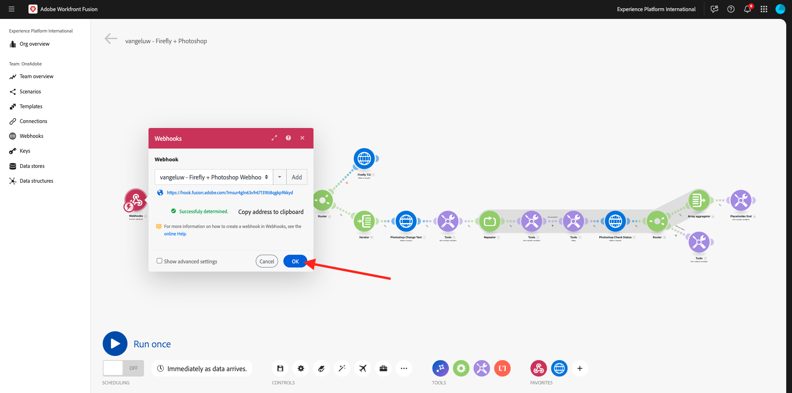
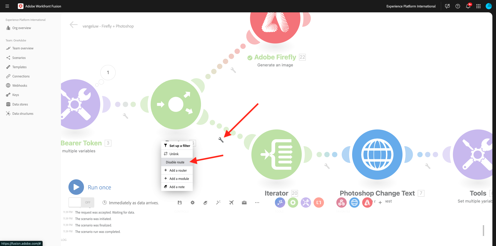
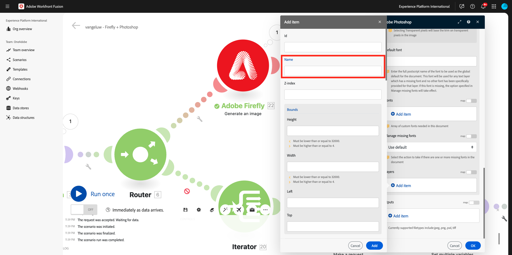
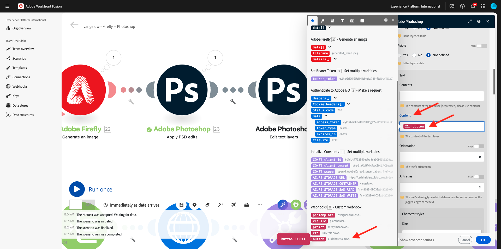

# 1.2.4 Automatisering met behulp van connectors

U gaat nu de out-of-the-box connectors gebruiken in Workfront Fusion for Photoshop en u gaat de Firefly Text-2-Image-aanvraag en de Photoshop-aanvragen verbinden met één scenario.

## 1.2.4.1 Uw scenario dupliceren en voorbereiden

In het linkermenu, ga naar **Scenario&#39;s** en selecteer uw omslag `--aepUserLdap--`. Vervolgens ziet u het scenario dat u eerder hebt gemaakt, met de naam `--aepUserLdap-- - Adobe I/O Authentication` .


Klik de pijl om het dropdown menu te openen en **Kloon** te selecteren.


Plaats de **Naam** van het gekloonde scenario aan `--aepUserLdap-- - Firefly + Photoshop` en selecteer het aangewezen **team van het Doel**. Klik **toevoegen** om een nieuwe webhaak toe te voegen.


Plaats de **naam van Webhaak** aan `--aepUserLdap-- - Firefly + Photoshop Webhook`. Klik **sparen**.


Dan moet je dit zien. Klik **sparen**.


Dan moet je dit zien. Klik de **module Webhaak**.


Klik **adres van het Exemplaar aan klembord** en klik dan **opnieuw bepalen gegevensstructuur**.


Open Postman. Voeg een nieuw verzoek toe in de map die u eerder gebruikte.


Controleer of de volgende instellingen zijn toegepast:

- Naam aanvraag: `POST - Send Request to Workfront Fusion Webhook Firefly + Photoshop`
- Type aanvraag: `POST`
- Verzoek-URL: plak de URL die u van de webhaak van het Workfront Fusion-scenario hebt gekopieerd.

Ga naar **Lichaam** en plaats het **Type van Lichaam** aan **onbewerkt** - **JSON**. Plak de volgende nuttige lading in het **Lichaam**.

```json
{
    "psdTemplate": "citisignal-fiber.psd",
    "xlsFile": "placeholder",
    "prompt":"misty meadows",
    "cta": "Buy this now!",
    "button": "Click here to buy!"
}
```

Deze nieuwe lading zal ervoor zorgen dat alle veranderlijke informatie van buiten het scenario wordt verstrekt in plaats van het die in het scenario wordt gecodeerd. In een ondernemingsscenario, moet een organisatie een scenario worden bepaald op een herbruikbare manier, zo betekent het dat een aantal variabelen als inputvariabelen moeten worden verstrekt in plaats van het hebben van hen in het scenario worden verankerd.

Dan moet je dit hebben. Klik **verzenden**.


De Workfront Fusion-webhaak wacht nog steeds op invoer.


Zodra u **hebt geklikt verzend**, zou het bericht tp **met succes moeten veranderen bepaald**. Klik **OK**.



## 1.2.4.2 Firefly T2I-module bijwerken

Klik de module **Firefly T2I** met de rechtermuisknop aan en selecteer **module van de Schrapping**.


Klik **+** pictogram, ga de onderzoekstermijn `firefly` in en selecteer dan **Adobe Firefly**.


Selecteer **produceer een beeld**.


Sleep en laat vallen de **Adobe Firefly** module zodat het met de **Router** module verbindt.


Klik de **Adobe Firefly** module om het te openen, en dan te klikken **voeg** toe om een nieuwe verbinding tot stand te brengen.


Vul de volgende velden in:

- **naam van de Verbinding**: gebruik `--aepUserLdap-- - Firefly connection`.
- **Milieu**: gebruik **Productie**.
- **Type**: gebruik **Persoonlijke rekening**.
- **identiteitskaart van de Cliënt**: kopieer **identiteitskaart van de Cliënt** van uw project van Adobe I/O dat `--aepUserLdap-- - One Adobe tutorial` wordt genoemd.
- **Geheim van de Cliënt**: kopieer het **Geheime Cliënt** van uw project van Adobe I/O dat `--aepUserLdap-- - One Adobe tutorial` wordt genoemd.

U kunt **identiteitskaart van de Cliënt** en **Geheime Cliënt** van uw project van Adobe I/O [ hier ](https://developer.adobe.com/console/projects.){target="_blank"} vinden.


Zodra u alle gebieden hebt ingevuld, gaat de klik **** verder. Uw verbinding wordt dan automatisch gevalideerd.


Daarna, selecteer de veranderlijke **herinnering** die aan het scenario door de inkomende **Douane webhaak** wordt verstrekt. Klik **OK**.


Alvorens u verdergaat, moet u de oude route in het scenario zoals voor deze oefening onbruikbaar maken, zult u slechts de nieuwe route gebruiken die u op het ogenblik vormt. Om dat te doen, klik het **moersleutelpictogram** tussen de **module van de Router** en de **Iterator** module, en selecteer **maak route** onbruikbaar.



Klik **sparen** om uw veranderingen op te slaan en dan **in werking te stellen eens** om uw configuratie te testen.


Ga naar Postman, verifieer de herinnering in uw verzoek en klik dan **verzenden**.


Zodra u hebt geklikt verzend, ga terug naar de Fusie van Workfront en klik het borstelpictogram op de **Adobe Firefly** module om de details te verifiëren.


Ga in **UITVOER** naar **Details** > **url** om URl van het beeld te vinden dat door **Adobe Firefly** werd geproduceerd.


U zou nu een beeld moeten zien dat de herinnering vertegenwoordigt u binnen van het verzoek van Postman, in dit geval **misty graslanden** verzond.


## 1.2.4.2 De achtergrond van een PSD-bestand wijzigen

U zult nu uw scenario bijwerken om het slimmer te maken door meer uit-van-de-doos schakelaars te gebruiken. U gaat ook de uitvoer van Firefly naar Photoshop verbinden, zodat de achtergrondafbeelding van het PSD-bestand dynamisch verandert door de uitvoer van de actie Afbeelding genereren door Firefly te gebruiken.

Dan moet je dit zien. Daarna, beweegt over de **Adobe Firefly** module en klikt **+** pictogram.


In het onderzoeksmenu, ga `Photoshop` in en klik dan de **Adobe Photoshop** actie.


Selecteer **toepassen PSD geeft uit**.


Dan moet je dit zien. Klik **toevoegen** om een nieuwe verbinding aan Adobe Photoshop toe te voegen.


Configureer de verbinding als volgt:

- Het type van verbinding: selecteer **Adobe Photoshop (Server-aan-Server)**
- Naam van verbinding: enter `--aepUserLdap-- - Adobe IO`
- Client-id: uw client-id plakken
- Clientgeheim: plak uw clientgeheim

Klik **verdergaan**.


Om uw **identiteitskaart van de Cliënt te vinden** en **Geheim van de Cliënt**, ga [ https://developer.adobe.com/console/home ](https://developer.adobe.com/console/home){target="_blank"} en open uw project van Adobe I/O, dat `--aepUserLdap-- One Adobe tutorial` wordt genoemd. Ga naar **OAuth Server-aan-Server** om uw identiteitskaart van de Cliënt en Geheime cliënt te vinden. Kopieer deze waarden en plak ze in de verbindingsinstelling in Workfront Fusion.


Na het klikken **ga** verder, zal een popup venster kort worden getoond terwijl uw geloofsbrieven worden geverifieerd. Als je klaar bent, moet je dit zien.


U moet nu de bestandslocatie invoeren van het PSD-bestand waarmee u Fusion wilt gebruiken. Voor **Opslag**, uitgezochte **Azure** en voor **plaats van het Dossier**, ga `{{1.AZURE_STORAGE_URL}}/{{1.AZURE_STORAGE_CONTAINER}}/{{1.AZURE_STORAGE_SAS_READ}}` in. Plaats de cursor naast de tweede `/` . Dan, heb een blik op de beschikbare variabelen en scrol neer om veranderlijk **psdTemplate** te vinden. Klik veranderlijk **psdTemplate** om het te selecteren.


Dan moet je dit zien.


Schuif al manier neer tot u **Lagen** ziet. Klik **toevoegen punt**.


Dan moet je dit zien. U moet nu de naam invoeren van de laag in de Photoshop PSD-sjabloon die wordt gebruikt voor de achtergrond van het bestand.



In het dossier **wordt** gebruikt het burgerschap-vezel.psd, zult u de laag vinden die voor de achtergrond gebruikte. In dit voorbeeld, wordt die laag genoemd **2048x2048-background**.


Plak de naam **2048x2048-achtergrond** in de dialoog van de Fusie van Workfront.


De rol neer tot u **Input** ziet. U moet nu definiëren wat op de achtergrondlaag moet worden ingevoegd. In dit geval, moet u de output van de **Adobe Firefly** module selecteren, die het dynamisch geproduceerde beeld bevat.

Voor **Opslag**, uitgezochte **Extern**. Voor **plaats van het Dossier**, kopieer en kleef veranderlijk `{{XX.details[].url}}` van de output van de **Adobe Firefly** module. Vervang **XX** in de variabele door het opeenvolgingsaantal van de **Adobe Firefly** module, die in dit voorbeeld **22** is.


Daarna, scrol neer tot u **ziet uitgeven**. De reeks **geeft** **** uit en plaatst **Type** aan **Laag**. Klik **toevoegen**.


Dan moet je dit zien. Vervolgens moet u de uitvoer van de handeling definiëren. Klik **toevoegen punt** onder **output**.


Selecteer **Azure** voor **Opslag**, kleef dit `{{1.AZURE_STORAGE_URL}}/{{1.AZURE_STORAGE_CONTAINER}}/citisignal-fiber-replacedbg.psd{{1.AZURE_STORAGE_SAS_WRITE}}` onder **Plaats van het Dossier** en selecteer **vnd.adobe.photoshop** onder **Type**. Klik om **toe te laten tonen geavanceerde montages**.


Onder **Geavanceerde Montages**, uitgezochte **ja** om dossiers met de zelfde naam te beschrijven.
Klik **toevoegen**.


Dan moet je dit hebben. Klik **OK**.


Klik **sparen** om uw veranderingen op te slaan en dan **in werking te stellen eens** om uw configuratie te testen.


Ga naar Postman, verifieer de herinnering in uw verzoek en klik dan **verzenden**.


Dan moet je dit zien. Klik de bel op **Adobe Photoshop - pas PSD uit** module uitgeeft.


U ziet nu dat er een nieuw PSD-bestand is gegenereerd en opgeslagen in uw Microsoft Azure Storage Account.


## 1.2.4.3 Tekstlagen van PSD-bestand wijzigen

### Aanroep van handelingstekst

Daarna, beweeg over **Adobe Photoshop - pas PSD uit geeft** module uit en klik **+** pictogram.


Selecteer **Adobe Photoshop**.


Selecteer **tekstlagen** uitgeven.


Dan moet je dit zien. Selecteer eerst de eerder geconfigureerde Adobe Photoshop-verbinding met de naam `--aepUserLdap-- Adobe IO` .

U moet nu de plaats van het **dossier van de Input** bepalen, dat de output van de vorige stap en onder **Lagen** is, moet u de **Naam** van de tekstlaag ingaan u wilt veranderen.


Voor het **dossier van de Input**, uitgezocht **Azure** voor **de opslag van het het dossierdossier van de Input** en zorg ervoor om de output van het vorige verzoek te selecteren, **Adobe Photoshop - pas PSD uit**, wat u van hier kunt nemen: `data[]._links.renditions[].href`


Open het dossier **burgerschap-fiber.psd**. In het dossier, zult u opmerken dat de laag die de vraag aan actie bevat **2048x2048-cta** wordt genoemd.


Ga de naam **2048x2048-cta** onder **Naam** in de dialoog in.


De rol neer tot u **Tekst** > **Inhoud** ziet. Selecteer veranderlijke **cta** van de lading van de Webhaak.


De rol neer tot u **Output** ziet. Voor **Opslag**, uitgezochte **Azure**. Voor **plaats van het Dossier**, ga de hieronder plaats in. Let op de toevoeging van de variabele `{{timestamp}}` aan de bestandsnaam die wordt gebruikt om ervoor te zorgen dat elk bestand dat wordt gegenereerd een unieke naam heeft. Ook, plaats het **Type** aan **vnd.adobe.photoshop**. Klik **OK**.

`{{1.AZURE_STORAGE_URL}}/{{1.AZURE_STORAGE_CONTAINER}}/citisignal-fiber-changed-text-{{timestamp}}.psd{{1.AZURE_STORAGE_SAS_WRITE}}`


### Knoptekst

Klik met de rechtermuisknop op de module die u net hebt gemaakt en selecteer **Klonen** . Hiermee wordt een tweede vergelijkbare module gemaakt.


Verbind de gekloonde module met vorige **Adobe Photoshop - geef tekstlagen** module uit.


Dan moet je dit zien. Selecteer eerst de eerder geconfigureerde Adobe Photoshop-verbinding met de naam `--aepUserLdap-- Adobe IO` .

U moet nu de plaats van het **dossier van de Input** bepalen, dat de output van de vorige stap en onder **Lagen** is, moet u de **Naam** van de tekstlaag ingaan u wilt veranderen.


Voor het **dossier van de Input**, uitgezocht **Azure** voor **het dossieropslag van de Input** en zorg ervoor om de output van het vorige verzoek te selecteren, **Adobe Photoshop - geef tekstlagen** uit, die u van hier kunt nemen: `data[]._links.renditions[].href`

Open het dossier **burgerschap-fiber.psd**. In het dossier, zult u opmerken dat de laag die de vraag aan actie bevat wordt genoemd **2048x2048-knoop-tekst**.


Ga de naam **2048x2048-knoop-tekst** onder **Naam** in de dialoog in.


De rol neer tot u **Tekst** > **Inhoud** ziet. Selecteer de veranderlijke **knoop** van de payload van de Webhaak.



De rol neer tot u **Output** ziet. Voor **Opslag**, uitgezochte **Azure**. Voor **plaats van het Dossier**, ga de hieronder plaats in. Let op de toevoeging van de variabele `{{timestamp}}` aan de bestandsnaam die wordt gebruikt om ervoor te zorgen dat elk bestand dat wordt gegenereerd een unieke naam heeft. Ook, plaats het **Type** aan **vnd.adobe.photoshop**. Klik **OK**.

`{{1.AZURE_STORAGE_URL}}/{{1.AZURE_STORAGE_CONTAINER}}/citisignal-fiber-changed-text-{{timestamp}}.psd{{1.AZURE_STORAGE_SAS_WRITE}}`


Klik **sparen** om uw veranderingen te bewaren.


## 1.2.4.4 Webhacerespons

Na het toepassen van deze veranderingen in uw dossier van Photoshop, moet u nu de reactie van de a **Webhaak** vormen die zal worden teruggestuurd naar welke toepassing dit scenario heeft geactiveerd.

Beweeg over de module **Adobe Photoshop - geef tekstlagen** uit en klik **+** pictogram.


Onderzoek naar `webhooks` en selecteer **Webhaak**.


Selecteer **reactie Webhaak**.


Dan moet je dit zien. Plak hieronder nuttige lading in **Lichaam**.

```json
{
    "newPsdTemplate": ""
}
```


Kopieer en kleef veranderlijk `{{XX.data[]._links.renditions[].href}}` en vervang **XX** door het opeenvolgingsaantal van laatste **Adobe Photoshop - geef tekstlagen** module uit, die in dit geval **25** is. Laat checkbox voor **toe tonen geavanceerde montages** en klik dan **toevoegen punt**.


Op het gebied **Sleutel**, ga `Content-Type` in. Op het gebied **Waarde**, ga `application/json` in. Klik **toevoegen**.


Dan moet je dit hebben. Klik **OK**.


Klik **auto-richt**.


Dan moet je dit zien. Klik **sparen** om uw veranderingen op te slaan en dan **in werking te stellen eens** om uw scenario te testen.


Ga terug naar Postman en klik **verzenden**. De herinnering die hier wordt gebruikt is **slechte graslanden**.


Het scenario wordt vervolgens geactiveerd en na enige tijd wordt een reactie weergegeven in Postman die de URL van het nieuwe PSD-bestand bevat.


Als herinnering: zodra het scenario in Workfront Fusion in werking is gesteld, zult u informatie over elke module kunnen zien door de bel boven elke module te klikken.


Met Azure Storage Explorer kunt u het nieuwe PSD-bestand zoeken en openen door erop te dubbelklikken in Azure Storage Explorer.


Uw dossier zou dan als dit, met de achtergrond moeten kijken die door een achtergrond met **slechte graslanden** wordt vervangen.


Als u uw scenario opnieuw in werking stelt, en dan een nieuw verzoek van Postman verzendt gebruikend een verschillende herinnering, zult u dan zien hoe gemakkelijk en herbruikbaar uw scenario is geworden. In dit voorbeeld, is de nieuwe herinnering die wordt gebruikt **zonnige woestijn**.


Een paar minuten later is er een nieuw PSD-bestand met een nieuwe achtergrond gemaakt.


## Volgende stappen

Ga naar [ 1.2.5 Frame.io en Workfront Fusion ](./ex5.md){target="_blank"}

Ga terug naar [ de Automatisering van het Werkschema van Creative met Workfront Fusion ](./automation.md){target="_blank"}

Ga terug naar [ Alle Modules ](./../../../overview.md){target="_blank"}
