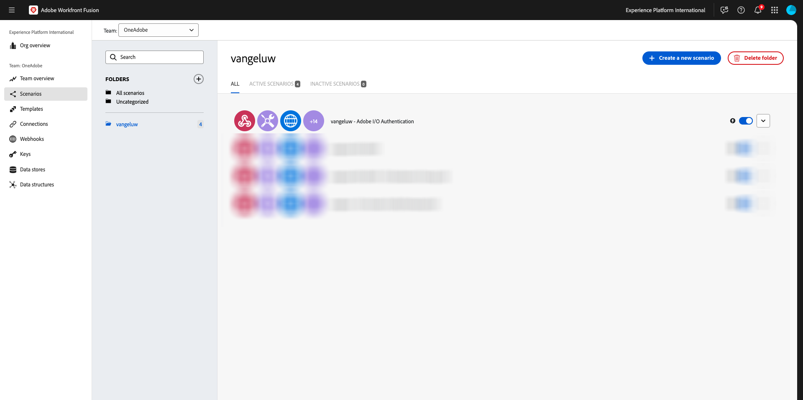
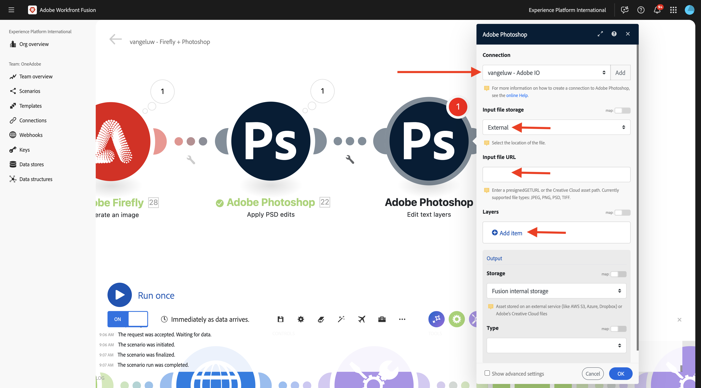

# 1.2.4 Automatisering met behulp van connectors

U gaat nu de out-of-the-box connectors gebruiken in Workfront Fusion for Photoshop en u gaat de Firefly Text-2-Image-aanvraag en de Photoshop-aanvragen verbinden met één scenario.

## 1.2.4.1 Dupliceer en bereid uw scenario voor

Ga in het linkermenu naar **Scenario&#39;s** en selecteer uw map `--aepUserLdap--`. U zou dan het scenario moeten zien dat u eerder hebt gemaakt, met de naam `--aepUSerLdap-- - Adobe I/O Authentication`.



Klik op de pijl om het vervolgkeuzemenu te openen en selecteer **Kloon**.


Plaats de **Naam** van het gekloonde scenario aan `--aepUserLdap-- - Firefly + Photoshop` en selecteer het aangewezen **team van het Doel**. Klik **toevoegen** om een nieuwe webhaak toe te voegen.


Plaats de **naam van Webhaak** aan `--aepUserLdap-- - Firefly + Photoshop Webhook`. Klik **sparen**.


Dan moet je dit zien. Klik **sparen**.


Dan moet je dit zien. Klik de **knoop Webhaak**.


Klik **adres van het Exemplaar aan klembord** en klik dan **opnieuw bepalen gegevensstructuur**.


Open Postman. Voeg een nieuw verzoek toe in de map die u eerder gebruikte.


Controleer of de volgende instellingen zijn toegepast:

- Naam aanvraag: `POST - Send Request to Workfront Fusion Webhook Firefly + Photoshop`
- Type aanvraag: `POST`
- Verzoek-URL: plak de URL die u van de webhaak van het Workfront Fusion-scenario hebt gekopieerd.

Ga naar **Lichaam** en plaats het **Type van Lichaam** aan **onbewerkt** - **JSON**. Plak de volgende nuttige lading in het **Lichaam**.

```json
{
    "psdTemplate": "citisignal-fiber.psd",
    "xlsFile": "placeholder",
    "prompt":"misty meadows",
    "cta": "Buy this now!",
    "button": "Click here to buy!"
}
```

Deze nieuwe lading zal ervoor zorgen dat alle veranderlijke informatie van buiten het scenario wordt verstrekt in plaats van het die in het scenario wordt gecodeerd. In een ondernemingsscenario, moet een organisatie een scenario worden bepaald op een herbruikbare manier, zo betekent het dat een aantal variabelen als inputvariabelen moeten worden verstrekt in plaats van het hebben van hen in het scenario worden verankerd.

Dan moet je dit hebben. Klik **verzenden**.


De Workfront Fusion-webhaak wacht nog steeds op invoer.


Nadat u op Verzenden hebt geklikt **, zou het bericht moeten veranderen in** Succesvol bepaald **.** Klik op **OK.**


## 1.2.4.2 Firefly T2I-knooppunt bijwerken

Klik de knoop **Firefly T2I**. Dan moet je dit zien. De herinnering in dit verzoek werd eerder hard gecodeerd aan **paarden op een gebied**. U verwijdert nu die geharde tekst en vervangt deze door een veld dat van de webhaak komt.


Verwijder de tekst **paarden op een gebied** en vervang het door de veranderlijke **herinnering** die onder de **Webhaak** variabelen kan worden gevonden. Klik **O.K.** om uw veranderingen te bewaren.


## 1.2.4.2 De achtergrond van een PSD-bestand wijzigen

U zult nu uw scenario bijwerken om het slimmer te maken door uit-van-de-doos schakelaars te gebruiken. U gaat ook de uitvoer van Firefly naar Photoshop verbinden, zodat de achtergrondafbeelding van het PSD-bestand dynamisch verandert door de uitvoer van de actie Afbeelding genereren door Firefly te gebruiken.

In de vorige oefening, had u **Firefly T2I** route onbruikbaar gemaakt. Dat moet u nu ongedaan maken. Klik het **eind** - pictogram om de route opnieuw toe te laten.


U zult dan zien dat het **eind** pictogram verdwijnt. Daarna, klik het **moersleutelpictogram** op de andere route naar de configuratie van de vorige oefening en selecteer **route** onbruikbaar maken.


Dit zou je dan moeten zien. Beweeg vervolgens de muisaanwijzer over het **Firefly T2I-knooppunt** en klik op het **+** -pictogram.


In het onderzoeksmenu, ga `Photoshop` in en klik dan de **Adobe Photoshop** actie.


Selecteer **toepassen PSD geeft uit**.


Dan moet je dit zien. Klik **toevoegen** om een nieuwe verbinding aan Adobe Photoshop toe te voegen.


Configureer de verbinding als volgt:

- Het type van verbinding: selecteer **Adobe Photoshop (Server-aan-Server)**
- Naam verbinding: voer in `--aepUserLdap-- - Adobe IO`
- Client-ID: plak uw client-ID
- Klantgeheim: plak je klantgeheim

Klik op **Doorgaan**.


Om uw **identiteitskaart van de Cliënt te vinden** en **Geheim van de Cliënt**, ga [ https://developer.adobe.com/console/home ](https://developer.adobe.com/console/home){target="_blank"} en open uw project van Adobe I/O, dat `--aepUserLdap-- One Adobe tutorial` wordt genoemd. Ga naar **OAuth Server-aan-Server** om uw identiteitskaart van de Cliënt en Geheime cliënt te vinden. Kopieer deze waarden en plak ze in de verbindingsinstelling in Workfront Fusion.


Na het klikken **ga** verder, zal een popup venster kort worden getoond terwijl uw geloofsbrieven worden geverifieerd. Als je klaar bent, moet je dit zien.


U moet nu de bestandslocatie invoeren van het PSD-bestand waarmee u Fusion wilt gebruiken. Voor **Opslag**, uitgezochte **Azure** en voor **plaats van het Dossier**, ga `{{1.AZURE_STORAGE_URL}}/{{1.AZURE_STORAGE_CONTAINER}}/{{1.AZURE_STORAGE_SAS_READ}}` in. Plaats de cursor naast de tweede `/` . Dan, heb een blik op de beschikbare variabelen en scrol neer om veranderlijk **psdTemplate** te vinden. Klik veranderlijk **psdTemplate** om het te selecteren.


Dan moet je dit zien.


Schuif al manier neer tot u **Lagen** ziet. Klik **toevoegen punt**.


Dan moet je dit zien. U moet nu de naam invoeren van de laag in de Photoshop PSD-sjabloon die wordt gebruikt voor de achtergrond van het bestand.


In het dossier **wordt** gebruikt het burgerschap-vezel.psd, zult u de laag vinden die voor de achtergrond gebruikte. In dit voorbeeld, wordt die laag genoemd **2048x2048-background**.


Plak de naam **2048x2048-achtergrond** in de dialoog van de Fusie van Workfront.


De rol neer tot u **Input** ziet. U moet nu definiëren wat op de achtergrondlaag moet worden ingevoegd. In dit geval moet u de uitvoer van het Firefly T2I-object selecteren, dat de dynamisch gegenereerde afbeelding bevat.

Voor **Opslag**, uitgezochte **Extern**. Voor **plaats van het Dossier**, onderzoek en vind de variabele `data.outputs[].image.url` van de output van **Firefly T2I** verzoek.


Daarna, scrol neer tot u **ziet uitgeven**. Stel **Bewerken** in op **Ja** en stel **Type** in op **Laag**. Klik op **Toevoegen**.


Dan moet je dit zien. Vervolgens moet u de uitvoer van de actie definiëren. Klik op **Item** toevoegen onder **uitvoer.**


Selecteer **Azure** voor **opslag**, plak dit `{{1.AZURE_STORAGE_URL}}/{{1.AZURE_STORAGE_CONTAINER}}/citisignal-fiber-replacedbg.psd{{1.AZURE_STORAGE_SAS_WRITE}}` onder  **Bestandslocatie** en selecteer **vnd.adobe.photoshop** onder **Type**. Klik om Geavanceerde instellingen **weergeven in te schakelen**.


Onder **Geavanceerde Montages**, uitgezochte **ja** om dossiers met de zelfde naam te beschrijven.
Klik op **Toevoegen**.


Deze zou je dan moeten hebben. Klik op **OK.**


## 1.2.4.3 Tekstlagen van PSD-bestand wijzigen

### Aanroep van handelingstekst

Daarna, beweeg over **Adobe Photoshop - pas PSD uit geeft** knoop uit en klik **+** pictogram.


Selecteer **Adobe Photoshop**.


Selecteer **Tekstlagen** bewerken.


Dan moet je dit zien. Selecteer eerst de eerder geconfigureerde Adobe Photoshop-verbinding met de naam `--aepUserLdap-- Adobe IO` .

U moet nu de plaats van het **dossier van de Input** bepalen, dat de output van de vorige stap en onder **Lagen** is, moet u de **Naam** van de tekstlaag ingaan u wilt veranderen.



Voor het **dossier van de Input**, uitgezocht **Azure** voor **de opslag van het het dossierdossier van de Input** en zorg ervoor om de output van het vorige verzoek te selecteren, **Adobe Photoshop - pas PSD uit**, wat u van hier kunt nemen: `data[]._links.renditions[].href`


Open het dossier **burgerschap-fiber.psd**. In het dossier, zult u opmerken dat de laag die de vraag aan actie bevat **2048x2048-cta** wordt genoemd.


Ga de naam **2048x2048-cta** onder **Naam** in de dialoog in.


Scroll naar beneden totdat u Tekst **>** inhoud **ziet**. Selecteer de variabele **cta** in de webhook-payload.


Scroll naar beneden totdat u Uitvoer **ziet**. Voor **Opslag**, uitgezochte **Azure**. Voor **plaats van het Dossier**, ga de hieronder plaats in. Let op de toevoeging van de variabele `{{timestamp}}` aan de bestandsnaam die wordt gebruikt om ervoor te zorgen dat elk bestand dat wordt gegenereerd een unieke naam heeft. Ook, plaats het **Type** aan **vnd.adobe.photoshop**. Klik **OK**.

`{{1.AZURE_STORAGE_URL}}/{{1.AZURE_STORAGE_CONTAINER}}/citisignal-fiber-changed-text-{{timestamp}}.psd{{1.AZURE_STORAGE_SAS_WRITE}}`


### Knoptekst

Klik de knoop met de rechtermuisknop aan u enkel creeerde en selecteert **Kloon**. Hiermee wordt een tweede vergelijkbaar object gemaakt.


Dan moet je dit zien. Selecteer eerst de eerder geconfigureerde Adobe Photoshop-verbinding met de naam `--aepUserLdap-- Adobe IO` .

U moet nu de plaats van het **dossier van de Input** bepalen, dat de output van de vorige stap en onder **Lagen** is, moet u de **Naam** van de tekstlaag ingaan u wilt veranderen.


Voor het **dossier van de Input**, uitgezocht **Azure** voor **het dossieropslag van de Input** en zorg ervoor om de output van het vorige verzoek te selecteren, **Adobe Photoshop - geef tekstlagen** uit, die u van hier kunt nemen: `data[]._links.renditions[].href`

Open het dossier **burgerschap-fiber.psd**. In het dossier, zult u opmerken dat de laag die de vraag aan actie bevat wordt genoemd **2048x2048-knoop-tekst**.


Ga de naam **2048x2048-cta** onder **Naam** in de dialoog in.


De rol neer tot u **Tekst** > **Inhoud** ziet. Selecteer veranderlijke **cta** van de lading van de Webhaak.


De rol neer tot u **Output** ziet. Voor **Opslag**, uitgezochte **Azure**. Voor **plaats van het Dossier**, ga de hieronder plaats in. Let op de toevoeging van de variabele `{{timestamp}}` aan de bestandsnaam die wordt gebruikt om ervoor te zorgen dat elk bestand dat wordt gegenereerd een unieke naam heeft. Ook, plaats het **Type** aan **vnd.adobe.photoshop**. Klik **OK**.

`{{1.AZURE_STORAGE_URL}}/{{1.AZURE_STORAGE_CONTAINER}}/citisignal-fiber-changed-text-{{timestamp}}.psd{{1.AZURE_STORAGE_SAS_WRITE}}`


Klik **sparen** om uw veranderingen te bewaren.


## 1.2.4.4 Webhacerespons

Na het toepassen van deze veranderingen in uw dossier van Photoshop, moet u nu de reactie van de a **Webhaak** vormen die zal worden teruggestuurd naar welke toepassing dit scenario heeft geactiveerd.

Beweeg over de knoop **Adobe Photoshop - geef tekstlagen** uit en klik **+** pictogram.


Zoek naar **webhook** en selecteer **Webhook**.


Selecteer **Webhook-reactie**.


Dit zou je dan moeten zien. Plak hieronder nuttige lading in **Lichaam**.

```json
{
    "newPsdTemplate": ""
}
```


Selecteer het pad `data[]._links.renditions[].href` uit de uitvoer van de vorige aanvraag. Schakel het selectievakje voor **Geavanceerde instellingen** weergeven in en klik vervolgens op **Item** toevoegen.


Voer in het veld **Sleutel** .`Content-Type` Voer in het veld **Waarde** .`application/json` Klik **sparen**.


Dan moet je dit hebben. Klik **OK**.


Klik **auto-richt**.


Dan moet je dit zien. Klik **Looppas eens**.


Ga terug naar Postman en klik **verzenden**. De herinnering die hier wordt gebruikt is **slechte graslanden**.


Het scenario wordt vervolgens geactiveerd en na enige tijd wordt een reactie weergegeven in Postman die de URL van het nieuwe PSD-bestand bevat.


Als herinnering: zodra het scenario in Workfront Fusion in werking is gesteld, zult u informatie over elke knoop kunnen zien door de bel boven elke knoop te klikken.


Met Azure Storage Explorer kunt u het nieuwe PSD-bestand zoeken en openen door erop te dubbelklikken in Azure Storage Explorer.


Je bestand zou er dan zo uit moeten zien, met de achtergrond die wordt vervangen door een achtergrond met **mistige weiden**.


Als u het scenario opnieuw uitvoert en vervolgens een nieuw verzoek van Postman verzendt met een andere prompt, ziet u hoe eenvoudig en herbruikbaar het scenario is geworden. In dit voorbeeld, is de nieuwe herinnering die wordt gebruikt **zonnige woestijn**.


Een paar minuten later is er een nieuw PSD-bestand met een nieuwe achtergrond gemaakt.


## Volgende stappen

Ga naar [ 1.2.5 Kader I/O en de Fusie van Workfront ](./ex5.md){target="_blank"}

Ga terug naar [ de Automatisering van het Werkschema van Creative met Workfront Fusion ](./automation.md){target="_blank"}

Ga terug naar [ Alle Modules ](./../../../overview.md){target="_blank"}
