# 1.2.4 Frame I/O naar Workfront Fusion naar AEM Assets

>[!IMPORTANT]
>
>Als u deze bewerking wilt voltooien, hebt u toegang nodig tot een werkende AEM Assets CS Author-omgeving. Als u oefening [ Adobe Experience Manager Cloud Service &amp; Edge Delivery Services ](./../../../modules/asset-mgmt/module2.1/aemcs.md){target="_blank"} volgt zult u toegang tot zulk een milieu hebben.

>[!IMPORTANT]
>
>Als u eerder een AEM Assets CS-programma hebt geconfigureerd met een auteursomgeving, kan het zijn dat de AEM CS-sandbox is geminimaliseerd. Gezien het feit dat het vernietigen van zo&#39;n zandbak 10 tot 15 minuten duurt, zou het een goed idee zijn om nu het ontruimingsproces te beginnen zodat u niet op een later tijdstip vastloopt.

In de vorige oefening vormde u een scenario dat automatisch variaties van een dossier van Adobe Photoshop PSD gebruikend Adobe Firefly, Photoshop APIs en Workfront Fusion produceert. De uitvoer van dat scenario was een nieuw Photoshop PSD-bestand.

De zakelijke teams hebben echter geen PSD-bestand nodig, maar een PNG-bestand of een JPG-bestand. In deze oefening, zult u een nieuwe automatisering vormen die in een PNG- dossier zal resulteren dat wordt geproduceerd zodra de activa in Kader I/O wordt goedgekeurd, en dat PNG- dossier zal automatisch in AEM Assets worden opgeslagen.

## 1.2.4.1 Een nieuw scenario maken

Ga naar [ https://experience.adobe.com/ ](https://experience.adobe.com/){target="_blank"}. Open **de Fusie van Workfront**.

In het linkermenu, ga naar **Scenario&#39;s** en selecteer uw omslag `--aepUserLdap--`. Klik **creeer een nieuw scenario**.

Gebruik de naam `--aepUserLdap-- - Asset Approved PNG AEM Assets` . Klik vervolgens op **?** module, ga de onderzoekstermijn `webhook` in en klik dan **Webhooks**.

Klik **WebHaak van de Douane**.

Klik **toevoegen** om een nieuwe webhaak tot stand te brengen.

Gebruik de naam `--aepUserLdap-- - Frame.io Webhook` . Klik **sparen**.

Dan moet je dit zien. Klik **adres van het Exemplaar aan klembord**.

## 1.2.4.2 Webhaak configureren in Frame.io

Ga naar Postman en open het verzoek **POST - krijg het Symbolische van de Toegang** in de inzameling **Adobe IO - OAuth**. Daarna, verzendt de klik **** om een nieuw **access_token** te verzoeken.

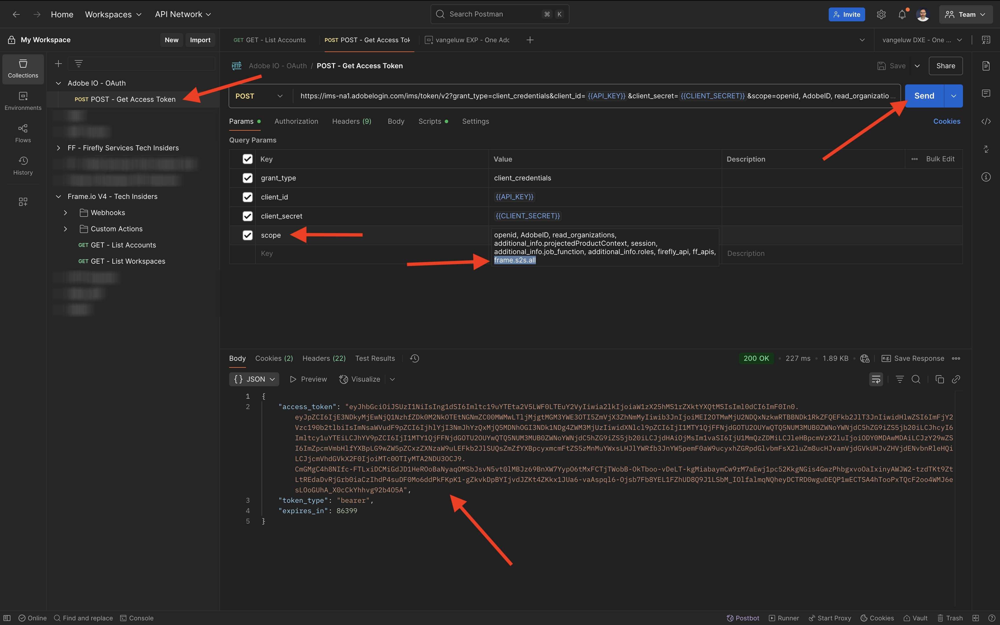

In het linkermenu, ga terug naar **Inzamelingen**. Open het verzoek **POST - creeer Webhaak** in de inzameling **Frame.io V4 - de Instanties van de Tech**, in de omslag **Webhooks**.

Ga naar het **Lichaam** van het verzoek. Verander het gebied **naam** aan `--aepUserLdap--  - Fusion to AEM Assets` en verander dan het gebied **url** in de waarde van Webhaak URL u van de Fusie van Workfront kopieerde.

Klik **verzenden**.

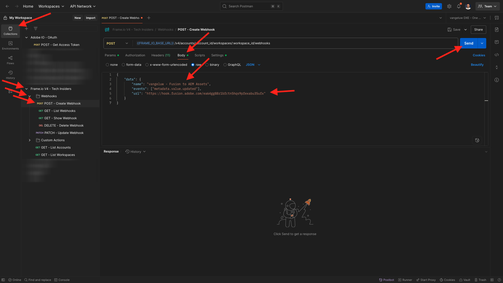

Uw aangepaste actie Frame.io V4 is nu gemaakt.

Ga naar [ https://next.frame.io/project ](https://next.frame.io/project){target="_blank"} en ga naar het project dat u eerder creeerde, die `--aepUserLdap--` zou moeten worden genoemd en de omslag **Campagne van de Vezel CitiSignal** openen. U zou nu de activa moeten zien die in de vorige oefening werden gecreeerd.

Klik het gebied **Status** en verander de status in **Bezig**.

Ga terug naar Workfront Fusion. U zou nu moeten zien dat de verbinding **met succes werd bepaald**.

Klik **sparen** om uw veranderingen te bewaren, en dan **te klikken in werking stellen eens** om een snelle test te doen.

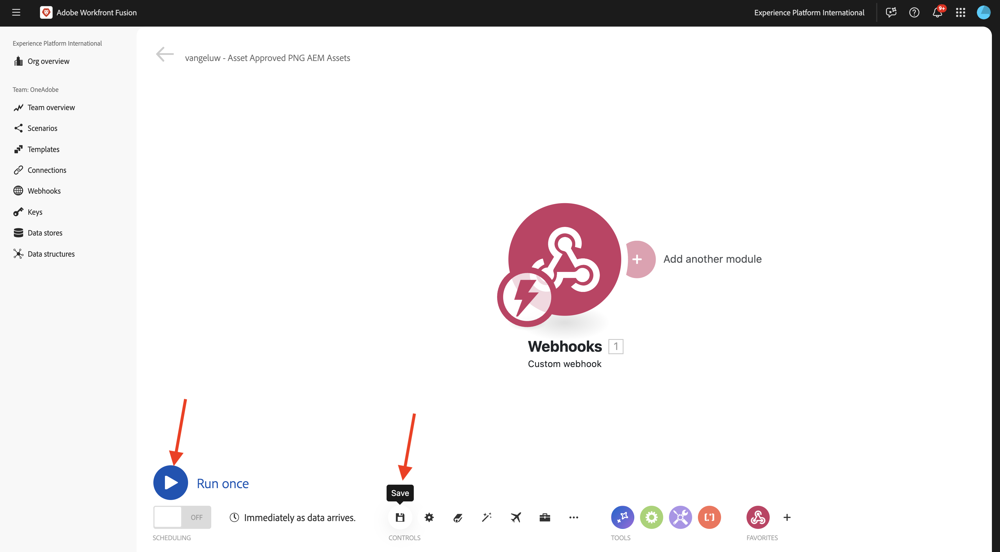

De schakelaar terug naar Frame.io en klikt het gebied **Bezig** en verandert de status in **Overzicht van Behoeften**.

De schakelaar terug naar de Fusie van Workfront en klikt de bel op de **Webhaak van de Douane** module.

De gedetailleerde mening van de bel toont u de gegevens die van Frame.io werden ontvangen. Je moet verschillende id&#39;s zien. Als voorbeeld, toont het gebied **resource.id** unieke identiteitskaart in Frame.io van de activa **burgerschap-fiber.psd**.

## 1.2.4.3 Asset Details ophalen van Frame.io

Nu de communicatie tussen Frame.io en Workfront Fusion via een aangepaste webhaak tot stand is gebracht, dient u meer informatie te krijgen over het element waarvoor het statuslabel is bijgewerkt. Om dit te doen, zult u opnieuw de Schakelaar Frame.io in Workfront Fusion, gelijkend op de vorige oefening gebruiken.

Beweeg over het **Webhaak van de Douane** voorwerp en klik **+** pictogram om een andere module toe te voegen.

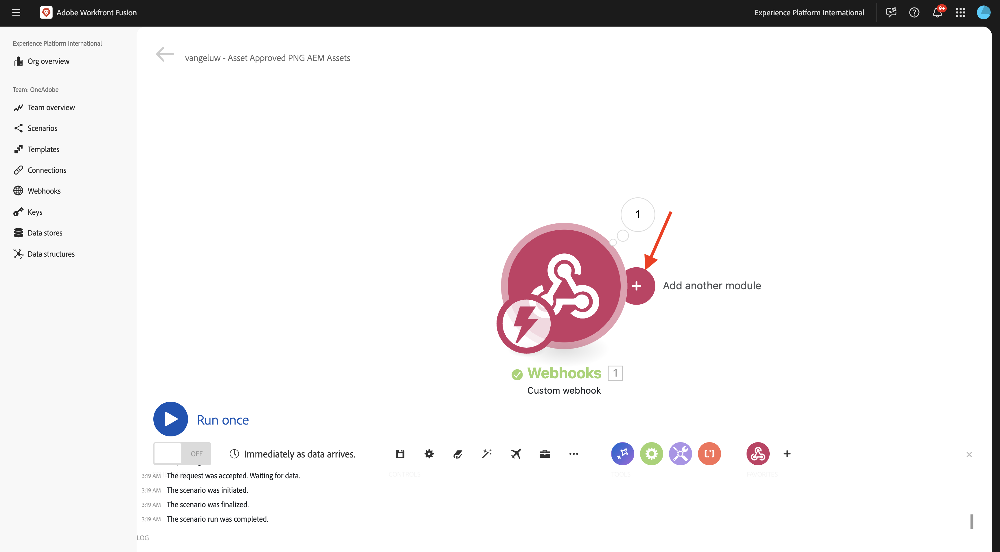

Voer de zoekterm in `frame` . Klik **Frame.io**.

Klik **Frame.io**.

Klik **maak een douane API vraag**.

Controleer of de verbinding is ingesteld op dezelfde verbinding als die u in de vorige oefening hebt gemaakt. Deze moet de naam `--aepUserLdap-- - Adobe I/O - Frame.io S2S` hebben.

Voor de configuratie van de module **Frame.io - maak een douane API vraag**, gebruik URL: `/v4/accounts/{{1.account.id}}/files/{{1.resource.id}}`.

>[!NOTE]
>
>Variabelen in Workfront Fusion kunnen handmatig worden opgegeven met de volgende syntaxis: `{{1.account.id}}` en `{{1.resource.id}}` . Het getal in de variabele verwijst naar de module in het scenario. In dit voorbeeld, kunt u zien dat de eerste module in het scenario **Webhooks** wordt genoemd en een opeenvolgingsaantal van **1** heeft. Dit betekent dat de variabelen `{{1.account.id}}` en `{{1.resource.id}}` tot dat gebied van de module met opeenvolgingsaantal 1 zullen toegang hebben. De aantallen van de opeenvolging kunnen soms verschillend zijn zodat let op wanneer het kopiëren/het kleven van dergelijke variabelen en verifieer altijd dat het gebruikte opeenvolgingsaantal het correcte is.

Daarna, klik **+ voeg punt** onder **Koord van de Vraag** toe.

Ga deze waarden in en klik **toevoegen**.

| Sleutel | Waarde |
|:-------------:| :---------------:| 
| `include` | `media_links.original` |

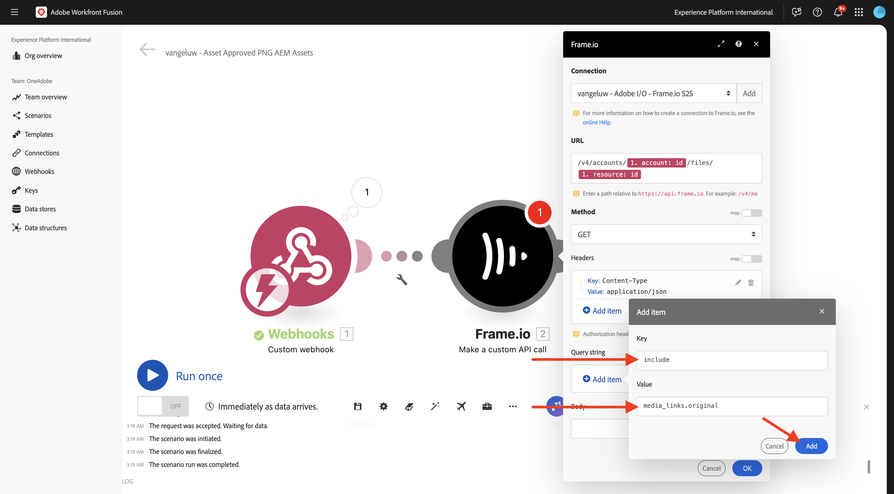

Dat zou u nu moeten doen. Klik **OK**.

Klik **sparen** om uw veranderingen op te slaan en dan **in werking te stellen eens** om uw configuratie te testen.

De schakelaar terug naar Frame.io en verandert de status in **Bezig**.

Ga terug naar de Fusie van Workfront en klik de bel op **Frame.io - maak een douane API vraag** module. Dan zou u een gelijkaardig overzicht moeten zien.

Daarna, zou u opstelling een filter moeten ervoor zorgen dat slechts voor activa die een status hebben die **** wordt goedgekeurd, een PNG- dossier wordt teruggegeven. Om dat te doen, klik het **pictogram van de Sleutel 0} tussen de modules** Douane webhaak **en** Frame.io - maak een douane API vraag **en selecteer dan** Opstelling een filter **.**

Configureer de volgende velden:

- **Etiket**: gebruik `Status = Approved`.
- **Voorwaarde**: `{{1.metadata.value[]}}`.
- **Basisexploitanten**: uitgezochte **Gelijk aan**.
- **Waarde**: `Approved`.

Klik **OK**.

Dan moet je dit hebben. Klik **sparen** om uw veranderingen te bewaren.

## 1.2.4.4 Omzetten in PNG

Beweeg over de module **Frame.io - maak een douane API vraag** en klik **+** pictogram.

Ga de onderzoekstermijn `photoshop` in en klik dan **Adobe Photoshop**.

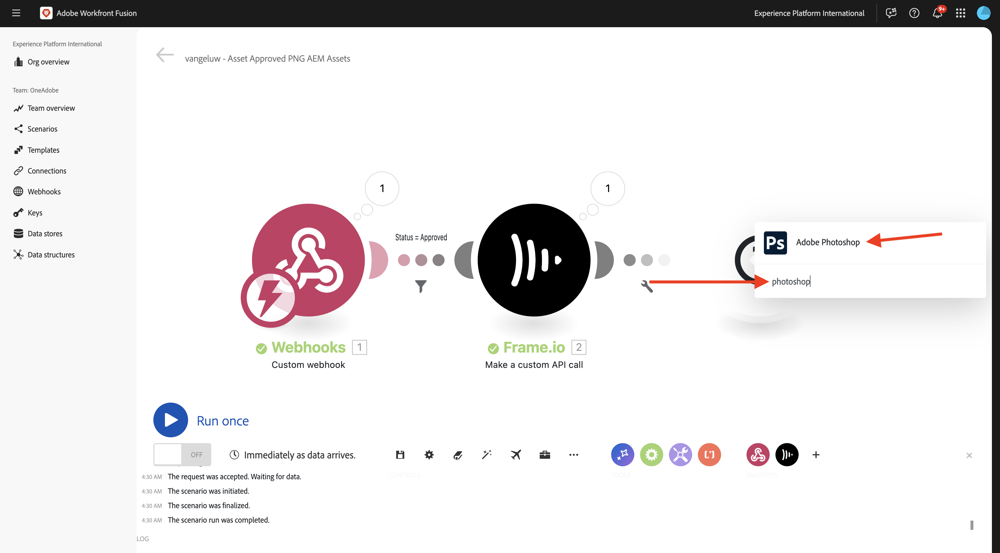

Klik **het Formaat van het Beeld van de Bekeerling**.

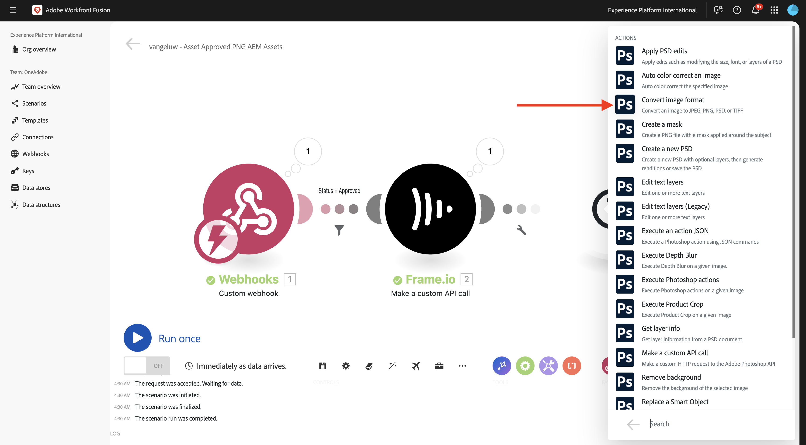

Verifieer dat het gebied **Verbinding** uw eerder gecreeerde verbinding gebruikt, die `--aepUserLdap-- - Adobe IO` wordt genoemd.

Onder **Input**, plaats de gebied **Opslag** aan **Extern** en plaats de **Plaats van het Dossier** om het veranderlijke **Originele** te gebruiken dat door de module **Frame.io is teruggekeerd - maak een douane API vraag**.

Daarna, voegt de klik **punt** onder **Output** toe.

Voor de **configuratie van Output**, plaats de gebied **Opslag** aan **interne opslag van de Fusie** en het **Type** aan **beeld/png**. Klik **toevoegen**.

Klik **OK**.

Klik **sparen** om uw veranderingen op te slaan en dan **in werking te stellen eens** om uw configuratie te testen.

De schakelaar terug naar Frame.io en klikt het gebied **Bezig** en verandert de status aan **Goedgekeurd**.

Ga terug naar Workfront Fusion. U zou nu moeten zien dat alle modules in uw scenario met succes zijn uitgevoerd. Klik de bel op **Adobe Photoshop - zet beeldformaat** module om.

In de details van de uitvoering van **Adobe Photoshop - zet beeldformaat** module om, kunt u zien dat een PNG- dossier nu werd geproduceerd. Vervolgens slaat u dat bestand op in AEM Assets CS.

## 1.2.4.5 PNG opslaan in AEM Assets CS

Beweeg over **Adobe Photoshop - zet beeldformaat** module om en klik **+** pictogram.

Ga de onderzoekstermijn `aem` in en selecteer **AEM Assets**.

Klik **uploaden activa**.

U moet nu uw verbinding met AEM Assets CS configureren. Klik **toevoegen**.

Gebruik de volgende instellingen:

- **Type van Verbinding**: **AEM Assets as a Cloud Service**.
- **Naam van de Verbinding**: `--aepUserLdap-- AEM Assets CS`.
- **Instantie URL**: kopieer de instantie URL van uw milieu van de Auteur van AEM Assets CS, dat als dit zou moeten kijken: `https://author-pXXXXX-eXXXXXXX.adobeaemcloud.com`.
- **de detailvulopties van de Toegang**: selecteer **verstrekken JSON**.

U moet nu de **Technische rekeningsgeloofsbrieven in formaat verstrekken JSON**. Hiervoor moet u een aantal stappen ondernemen met AEM Cloud Manager. Zorg dat dit scherm open blijft terwijl u dat doet.

Ga naar [ https://my.cloudmanager.adobe.com ](https://my.cloudmanager.adobe.com){target="_blank"}. De org die u moet selecteren is `--aepImsOrgName--`. Dan zie je zoiets. Klik om uw programma te openen, dat `--aepUserLdap-- - Citi Signal` zou moeten worden genoemd.

Klik de 3 punten **..** en selecteer **Developer Console**.

Klik **Teken binnen met Adobe**.

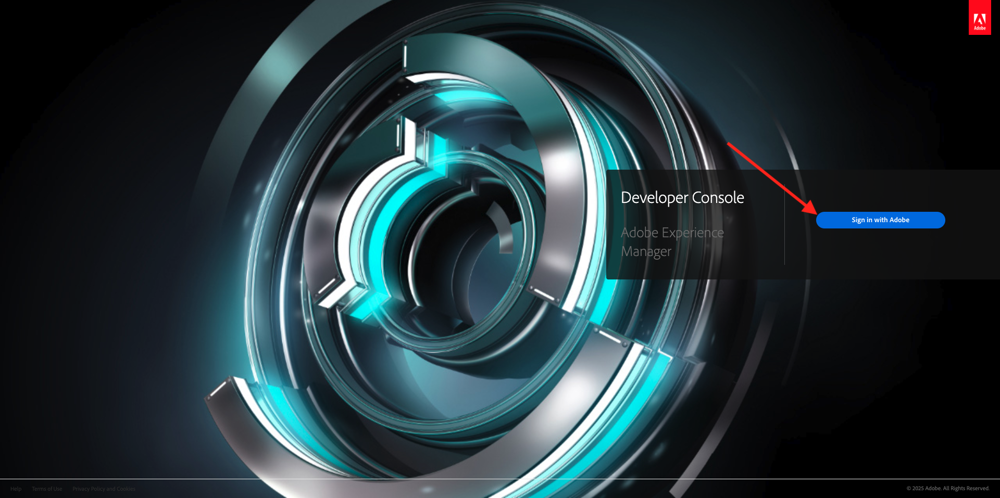

Ga naar **Hulpmiddelen** > **Integraties**.

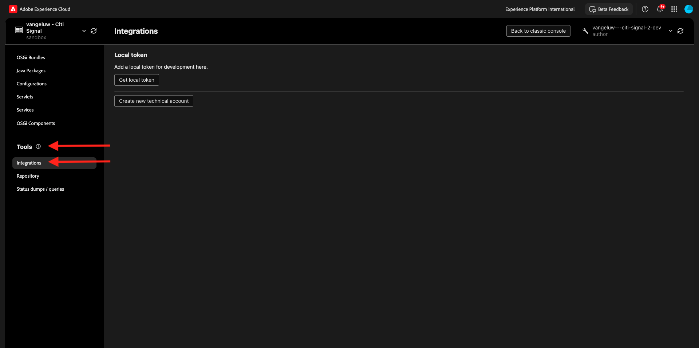

Klik **creëren nieuwe technische rekening**.

Dan moet je iets dergelijks zien. Open de nieuwe technische account. Klik de 3 punten **..** en selecteer dan **Mening**.

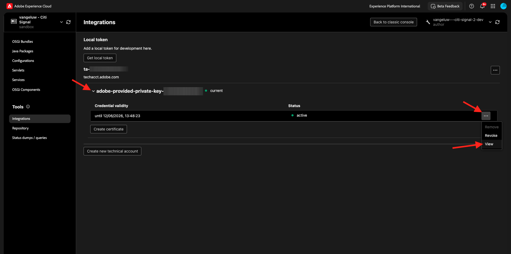

Vervolgens ziet u een vergelijkbare technische tokenlading. Kopieer de volledige JSON-lading naar het klembord.

Ga terug naar de Fusie van Workfront en kleef de volledige nuttige lading JSON in de **Technische rekeningsgeloofsbrieven in JSON formaat** gebied. Klik **verdergaan**.

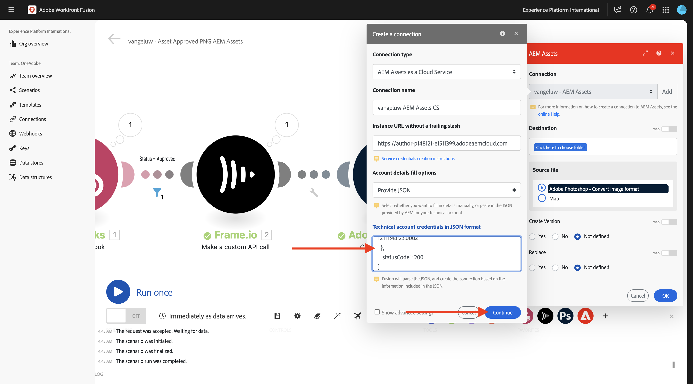

Uw verbinding wordt dan gevalideerd en wanneer de verbinding succesvol is, wordt deze automatisch geselecteerd in de AEM Assets-module. Het volgende te doen moet een omslag vormen. Als onderdeel van de oefening, zou u een nieuwe specifieke omslag moeten tot stand brengen.

Om een nieuwe specifieke omslag tot stand te brengen, ga [ https://experience.adobe.com ](https://experience.adobe.com/){target="_blank"}. Zorg ervoor dat de juiste Experience Cloud-instantie is geselecteerd, die moet zijn ingesteld op `--aepImsOrgName--` . Dan, klik **Experience Manager Assets**.

Klik **Uitgezocht** op uw milieu van AEM Assets CS, dat zou moeten worden genoemd `--aepUserLdap-- - Citi Signal dev`.

Ga naar **Activa** en klik **creeer Omslag**.

Ga de naam `--aepUserLdap-- - CitiSignal Fiber Campaign` in en klik **creeer**.

Uw map wordt vervolgens gemaakt.

Ga terug naar de Fusie van Workfront, uitgezochte **klik hier om omslag** te kiezen en dan de omslag `--aepUserLdap-- - CitiSignal Fiber Campaign` te kiezen.

Controleer of het doel is ingesteld op `--aepUserLdap-- - CitiSignal Fiber Campaign` . Dan, onder **het Dossier van Source**, uitgezochte **Kaart**.

Onder **naam van het Dossier**, kies de variabele `{{3.filenames[1]}}`.

Onder **Gegevens**, kies de variabele `{{3.files[1]}}`.

>[!NOTE]
>
>Variabelen in Workfront Fusion kunnen handmatig worden opgegeven met de volgende syntaxis: `{{3.filenames[1]}}` . Het getal in de variabele verwijst naar de module in het scenario. In dit voorbeeld, kunt u zien dat de derde module in het scenario **Adobe Photoshop wordt genoemd - zet beeldformaat** om en heeft een opeenvolgingsaantal van **3**. Dit betekent dat veranderlijk `{{3.filenames[1]}}` tot het gebied **filenames[]** van de module met opeenvolgingsaantal 3 zal toegang hebben. De aantallen van de opeenvolging kunnen soms verschillend zijn zodat let op wanneer het kopiëren/het kleven van dergelijke variabelen en verifieer altijd dat het gebruikte opeenvolgingsaantal het correcte is.

Klik **OK**.

Klik **sparen** om uw veranderingen te bewaren.

Vervolgens moet u specifieke machtigingen instellen voor de technische account die u zojuist hebt gemaakt. Wanneer de rekening in **Developer Console** in **Cloud Manager** werd gecreeerd, werd het **Gelezen** toegangsrechten gegeven maar voor dit gebruiksgeval, **schrijft** toegangsrechten worden vereist. U kunt dat doen door naar de AEM CS Author-omgeving te gaan.

Ga naar [ https://my.cloudmanager.adobe.com ](https://my.cloudmanager.adobe.com){target="_blank"}. De org die u moet selecteren is `--aepImsOrgName--`. Klik om uw programma te openen, dat `--aepUserLdap-- - Citi Signal` zou moeten worden genoemd. Dan zie je zoiets. Klik op de URL van de auteur.

Klik **Teken binnen met Adobe**.

Ga naar **Montages** > **Veiligheid** > **Gebruikers**.

Klik hierop om de gebruikersaccount voor de technische account te openen.

Ga naar **Groepen** en voeg deze Technische gebruiker van de Rekening aan de groep **DAM-Gebruikers** toe.

Klik **sparen &amp; Sluiten**.

Ga terug naar Workfront Fusion. Klik **Looppas eens** om uw scenario te testen.

De schakelaar terug naar Frame.io en zorgt ervoor dat het statuut van uw activa wordt veranderd in **goedgekeurd** opnieuw.

>[!NOTE]
>
>U kunt het eerst terug naar **moeten veranderen Bezig** of **het Overzicht van Behoeften**, om het dan terug naar **Goedgekeurd** te veranderen.

Uw Workfront Fusion-scenario wordt vervolgens geactiveerd en moet correct worden voltooid. Door de informatie in de bel op de **AEM Assets** module te bekijken, kunt u reeds zien dat het PNG- dossier met succes in AEM Assets CS werd opgeslagen.

Ga terug naar AEM Assets CS en open de map `--aepUserLdap-- - Frame.io PNG` . Het PNG-bestand dat is gegenereerd, wordt nu weergegeven in het Workfront Fusion-scenario. Dubbelklik op het bestand om het te openen.

U ziet nu meer details over de metagegevens van het gegenereerde PNG-bestand.

U hebt deze oefening nu met succes voltooid.

## Volgende stappen

Ga naar [ Samenvatting en Voordelen van de Automatisering van het Werkschema van Creative met Workfront Fusion ](./summary.md){target="_blank"}

Ga terug naar [ de Automatisering van het Werkschema van Creative met Workfront Fusion ](./automation.md){target="_blank"}

Ga terug naar [ Alle Modules ](./../../../overview.md){target="_blank"}
1.2.4.