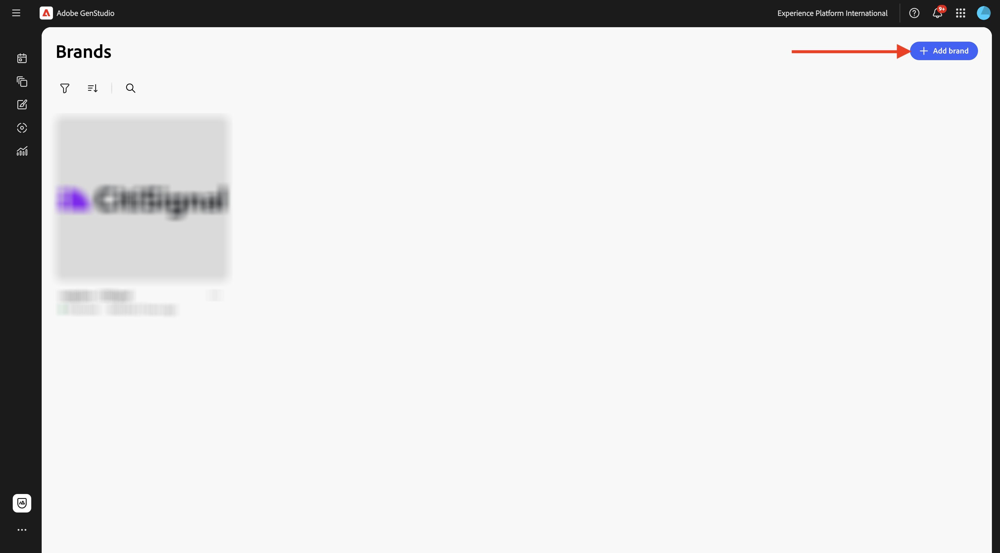
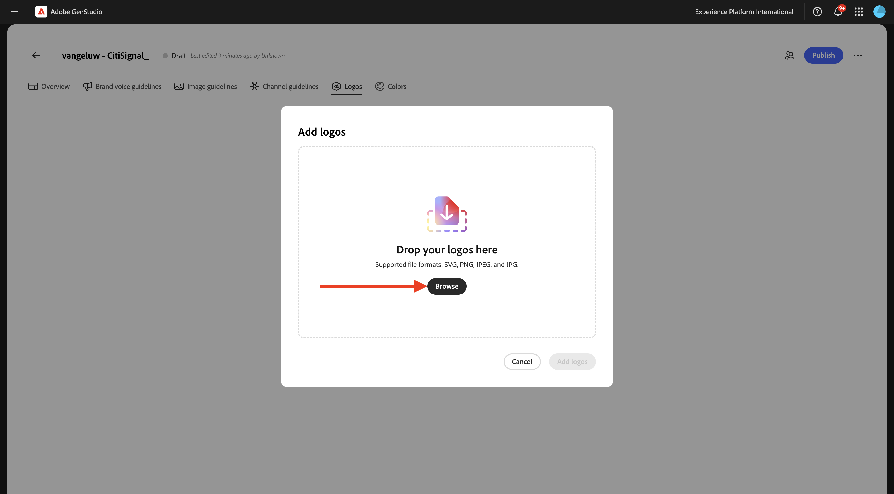
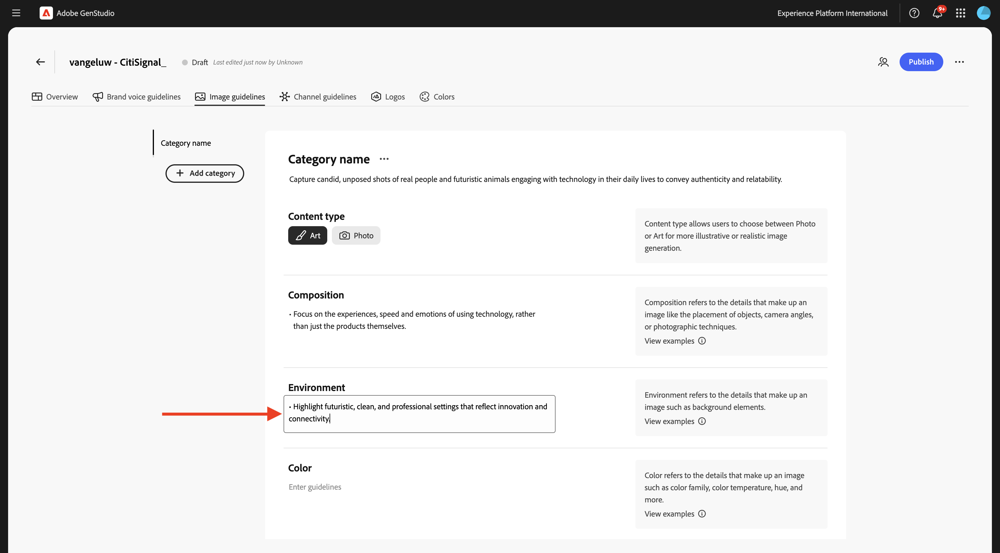
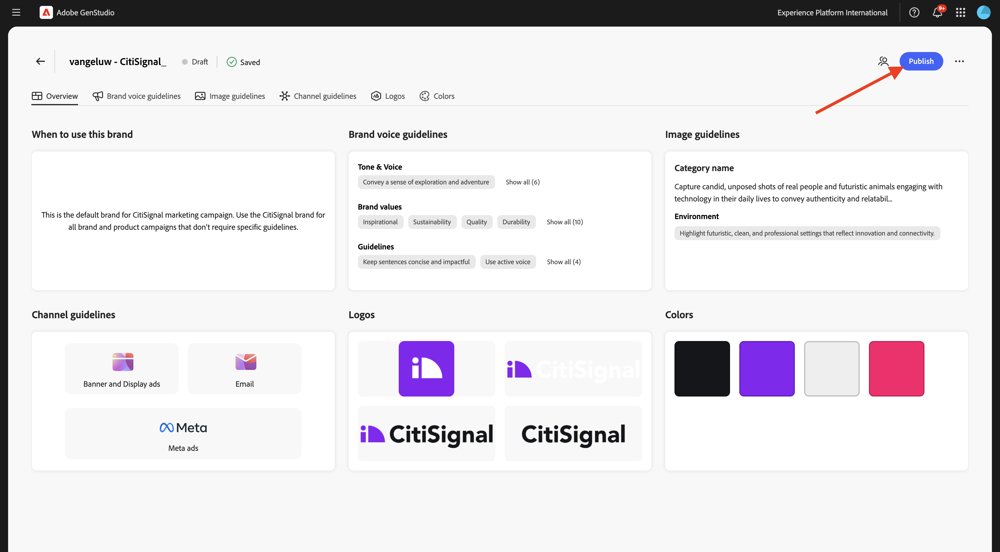

# 1.3.1 Configuratie: Merk

Een merk onderscheidt een organisatie, product, service of concept van anderen. Sommige aspecten van een merk zijn objectief, zoals een logo, terwijl andere subjectief zijn, zoals de toon van stem.

GenStudio for Performance Marketing gebruikt de rijkdom aan merkinformatie van uw merk, koppelt deze aan product- en persoonlijke informatie en bouwt een uitgebreide merkidentiteit uit. Deze merkidentiteit wordt gebruikt om de creatie van on-brand-inhoud te informeren met behulp van de generatieve AI-technologie van Adobe.

Volg onderstaande stappen om uw eigen merk te maken.

Ga naar [ https://experience.adobe.com/ ](https://experience.adobe.com/){target="_blank"}. Open **GenStudio**.


Dan moet je dit zien.


Het eerste wat u moet doen om GenStudio for Performance Marketing te gebruiken, is uw merk configureren. Klik het **pictogram van Banden**.


Klik op **+ Merk toevoegen** .



Voer de naam `--aepUserLdap-- - CitiSignal` voor uw merk in. Selecteer **toevoegen manueel** en klik dan **merk** toevoegen.


## 1.3.1.1 Kleuren

Dan moet je dit zien. Klik **Kleuren**.


Klik op **+ Kleur toevoegen** .


Er zijn vier verschillende kleuren om toe te voegen:

- `#8821F4`
- `#14161A`
- `#EEEEEE`
- `#FF006C`

Voer de hexadecimale code voor de kleur `#8821F4` in. Klik **toevoegen**.


Klik op **+ Kleur toevoegen** .


Voer de hexadecimale code voor de kleur `#14161A` in. Klik **toevoegen**.


Klik op **+ Kleur toevoegen** .


Voer de hexadecimale code voor de kleur `#EEEEEE ` in. Klik **toevoegen**.


Klik op **+ Kleur toevoegen** .


Voer de hexadecimale code voor de kleur `#FF006C ` in. Klik **toevoegen**.


Dat zou u nu moeten doen.


## 1.3.1.2 Logo&#39;s

Download het dossier [ CitiSignal-GSPeM-assets.zip ](../../../assets/gspem/CitiSignal-GSPeM-assets.zip) aan uw Desktop en unzip het.


Daarna, ga naar **Logo&#39;s**. Klik op **+ Logo toevoegen** .


Klik **doorbladeren**.



Ga naar de omslag **CitiSignal-GSPeM-activa** > **logo&#39;s** en selecteer deze dossiers. Klik **Open**.


Dan moet je dit hebben. Klik **toevoegen logo&#39;s**.


Dan moet je dit hebben.


## 1.3.1.3 Richtlijnen voor spraak van merken

Daarna, ga naar **de stemrichtlijnen van het Merk**.


Voor **Toon &amp; Stem**, gebruik dit:

```
• Convey a sense of exploration and adventure
• Be authentic and conversational
• Evoke excitement and curiosity
• Speak honestly and straightforwardly
• Be approachable and relatable
• Use everyday language
```


Voor **Merk waarden**, gebruik dit:

```
• Inspirational
• Sustainability
• Quality
• Durability
• Functionality
• Reliability
• Community-oriented
• Be inclusive and welcome diversity
• Encourage active lifestyles
• Promote discovery
```


Voor **Redactionele richtlijnen**, gebruik dit:

```
• Keep sentences concise and impactful
• Use active voice
• Lists, bullets, and series should be consistent — either they all start with a noun, or they all start with a verb
• Use serial commas
```


Voor **Redactionele beperkingen**, gebruik dit:

```
• Avoid activity-specific jargon unless it’s widely adopted
• Avoid promoting the skill level or experience level of the user of our outdoor equipment
• Avoid technical language or jargon
```


## 1.3.1.4 Richtlijnen voor afbeeldingen

Daarna, ga naar **richtlijnen van het Beeld**.


Plaats **Type van Inhoud** aan **Kunst** en voor **Beschrijving**, gebruik dit:

```
Capture candid, unposed shots of real people and futuristic animals engaging with technology in their daily lives to convey authenticity and relatability.
```


Voor **Samenstelling**, gebruik dit:

```
Focus on the experiences, speed and emotions of using technology, rather than just the products themselves.
```


Voor **Milieu**, gebruik dit:

```
Highlight futuristic, clean, and professional settings that reflect innovation and connectivity.
```



Voor **Kleur**, gebruik dit:

```
Use a palette inspired by technology, including sleek metallics, cool purple and blue, and neutral tones.
```


Voor **Belichting**, gebruik dit:

```
Utilize bright, natural lighting to create a welcoming and dynamic atmosphere.
```


Voor **Hout**, gebruik dit:

```
Each image should evoke a feeling of speed, innovation and being part of the future.
```


Voor **Beperkingen**, gebruik dit:

```
Avoid cluttered or busy backgrounds that detract from the main subject.
```


## 1.3.1.4 Kanaalrichtlijnen

Daarna, ga naar **richtlijnen van het Kanaal**.


Voor **E-mail**, gebruik de volgende waarden:

- **Algemeen**

```
• Use simple, short sentences
• Be clear and concise
• Invoke a sense of adventure and exploration
```

- **Onderwerpregel**

```
• Limit to less than 8 words
• Provide specific details about what’s inside the email
• Use sentence case
• Do not use end punctuation
```

- **Preheader**

```
• Limit to less than 80 characters
• Provide specific details about what’s inside the email
• Use sentence case
• Use ending punctuation
```

- **Titel**

```
• Limit to less than 12 words
• Generate excitement through compelling and exciting statements
• Use sentence case
```

- **Subkop**: verlaten leeg voor nu

- **Lichaam**

```
• Limit to less than 120 words
• Use bullet points for lists containing more than 3 items
• Use between 0 to 4 headings within the body to separate main ideas
• Use sentence case
• Use ending punctuation
```

- **Call-to-action (CTA)**

```
• Limit to between 1 to 3 short words
• Limit to less than 20 characters
• Use an action-oriented verb as the first word and intended action the end-user should take
• Avoid ending punctuation
• Use title case
```


Voor **Meta advertenties**, gebruik de volgende waarden:

- **Algemeen**

```
• Use simple, short sentences
• Be clear and concise
• Invoke a sense of adventure and exploration
• Make product names prominent
• Use community-building concepts and language
```

- **Titel**

```
• Limit  to less than 8 words
• Limit to less than 27 characters
• Make it clear what action the reader should take
• Use sentence case
• Avoid ending punctuation
```

- **Lichaam**

```
• Limit to less than 125 characters
• Use sentence case
• Use ending punctuation
```

- **op beeldtekst**: verlaten leeg voor nu


Voor **Banner en de advertenties van de Vertoning**, gebruik de volgende waarden:

- **Algemeen**

```
• Make readers feel inspired, interested, and sure of the next step
• Avoid word repetition
• Make product names prominent
```

- **Titel**

```
• Clearly state the main benefit of the offer
• Use sentence case
• Use ending punctuation
• Limit to less than 60 characters
```

- **Subkop**: verlaten leeg voor nu

- **Lichaam**

```
• Communicate the benefits of clicking into the offer
• Use sentence case
• Use ending punctuation
```

- **Call-to-action (CTA)**

```
• Limit to between 1 to 3 short words
• Limit to less than 20 characters
• Use an action-oriented verb as the first word
• Use title case
• Avoid ending punctuation
```


Voor **LinkedIn**, gebruik de volgende waarden:

- **Algemeen**: verlaten leeg voor nu

- **Titel**: verlaten leeg voor nu

- **Beschrijving**: verlaten leeg voor nu

- **Inleidende tekst**: verlaten leeg voor nu

- **op beeldtekst**: verlaten leeg voor nu


Tot slot ga naar **Overzicht**. U kunt nu een overzicht van alles zien u vormde. Er is nog één ding te doen. Klik **+ voeg** onder **toe wanneer om dit merk** te gebruiken.


Ga hieronder tekst in en klik **sparen veranderingen**.

```
This is the default brand for CitiSignal marketing campaign. Use the CitiSignal brand for all brand and product campaigns that don't require specific guidelines.
```


Klik **publiceren**.



Klik **publiceren** opnieuw.


Uw merk wordt nu gepubliceerd en dit merk kan nu worden gebruikt om inhoud met een merk te maken. Klik **Gedaan**.


## Volgende stappen

Ga naar [ Configuratie: Personas, Producten en Malplaatjes ](./ex2.md){target="_blank"}

Ga terug naar [ GenStudio for Performance Marketing ](./genstudio.md){target="_blank"}

Ga terug naar [ Alle Modules ](./../../../overview.md){target="_blank"}
