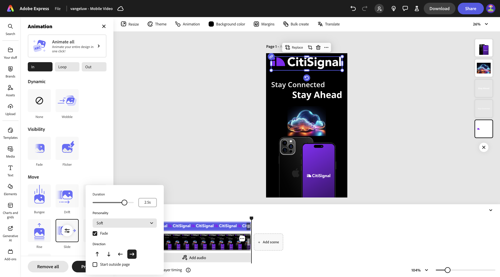
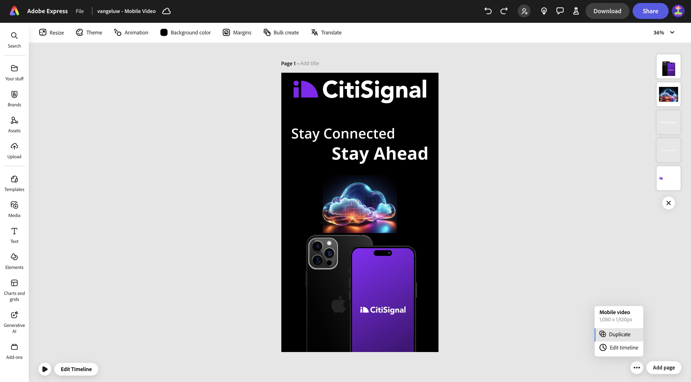

# 1.3.2 Animatie en video in Adobe Express

Alvorens u deze oefening begint, download de vereiste activa van [ https://tech-insiders.s3.us-west-2.amazonaws.com/one-adobe/Adobe_Express.zip ](https://tech-insiders.s3.us-west-2.amazonaws.com/one-adobe/Adobe_Express.zip){target="_blank"} en unzip hen op uw Desktop.

## 1.3.2.1 Een video maken

Ga naar [ https://new.express.adobe.com/ ](https://new.express.adobe.com/){target="_blank"}. Klik **+** pictogram om een nieuw **beeld** tot stand te brengen.

Ga naar **Video** en selecteer dan **Mobiele Video**.

Dan moet je dit zien.

Selecteer **Achtergrondkleur** en kies dan **zwart**.

Daarna, zou u het **CitiSignal** embleem moeten toevoegen. Ga naar **Banden** en selecteer het witte embleem CitiSignal. Klik de 3 punten **..** en selecteer **Plaats**.

Centreer het CitiSignal-logo boven aan de afbeelding.

Ga naar **Tekst** en selecteer dan **uw tekst** toevoegen.

Voer de tekst `Stay Connected` in en plaats het tekstvak op een vergelijkbare locatie als in de onderstaande afbeelding.

Ga naar **Tekst** en selecteer dan **uw tekst** toevoegen. Voer de tekst in `Stay Ahead` .

Plaats het tekstvak op een vergelijkbare locatie als in de onderstaande afbeelding.

Selecteer eerste textbox met de tekst **Verbonden blijven**. Ga naar **Banden**, aan **Doopvonten**. Klik de 3 punten **...** op het eerste doopvont en klik **toepassen**.

Selecteer tweede textbox met de tekst **Ahead**. Ga naar **Banden**, aan **Doopvonten**. Klik de 3 punten **..** op de 3de doopvont en klik **toepassen**.

Dan moet je dit zien. Ga naar **Media** en selecteer **produceer beeld**.

Ga de herinnering `futuristic looking transparent cloud on a black background` in en klik **produceert**.

Selecteer **Liggend (4:3)**.

Dan moet je dit zien. Kies een van de variaties.

De gegenereerde afbeelding centreren. Ga naar **Media** en klik dan **uploaden van apparaat**.

Navigeer aan uw Desktop, aan de omslag **Adobe_Express** die de activa bevat u eerder downloadde. Selecteer het dossier **CitiSignalPhoneLogo.png** en klik **Open**.

Dan moet je dit zien.

Sleep de afbeelding omlaag, zodat deze er net zo uitziet als de afbeelding onder de afbeelding.

Wijzig de naam van het project in `--aepUserLdap-- - Mobile Video` .

Ga naar **Animatie** en klik dan de **animatie van de Glide**.

Klik het **spel** pictogram om uw animatie te testen.

Selecteer het textbox **Ahead**.

Pas de chronologieschuif voor textbox **Ahead** aan zodat het halverwege begint.

Selecteer het **CitiSignal** embleem.

Open de detailmontages op de **Dia** actie en verander de duur in 2.5s.

Daarna, klik **Download**. Selecteer het **formaat van het Dossier** **MP4** en plaats **Video resolutie** aan **1080p**. Klik **Download**.

Uw videobestand wordt vervolgens gegenereerd en vervolgens naar de computer gedownload. Uw eerste video is nu klaar.

## 1.3.2.2 Toevoegen aan uw video

Sluit de **mening van de Chronologie**.

Klik de 3 punten **..** en selecteer **Dupliceren**.

Er wordt dan een nieuwe pagina gegenereerd. Klik **uitgeven Chronologie** beginnen met het werken met de nieuwe pagina.

Klik op **+ Scène toevoegen** .

Er moet dan een nieuwe scène worden toegevoegd.

Navigeer aan uw Desktop, aan de omslag **Adobe_Express** die de activa bevat u eerder downloadde. Selecteer het dossier **`AdobeStock_648887461_trimmed.mp4`** en klik **Open**.

Uw videobestand wordt vervolgens toegevoegd aan de nieuwe scène.

Klik in het midden tussen de 2 scènes en selecteer dan **overgang** toevoegen.

Klik **Scheur aan zwart**.

Verander de **Duur** in 2 seconden. Voel vrij om de **spel** knoop te klikken om uw overgang te testen.

Ga naar **Tekst** en klik dan **uw tekst** toevoegen.

Voer de tekst in `with lightning fast speed from CitiSignal` . Centrum de tekst door **te klikken richt centrum**.

Verander de doopvontgrootte in **60**.

## 1.3.2.3 Invoegtoepassingen gebruiken in Adobe Express

Ga naar **toe:voegen-ons** en onderzoek naar toe:voegen-op **Sociale Previewer**.

Klik op **+ Toevoegen** om de invoegtoepassing toe te voegen.

Selecteer toe:voegen-op **Sociale Previewer** en klik de **3&rbrace; voorproefoptie van de Post van het Installatieschema &lbrace;.** Je kunt nu gemakkelijk bekijken hoe je advertentie eruit zal zien op de meest gangbare sociale media.

## 1.3.2.4 Een nieuwe sjabloon maken in Adobe Express

Daarna, klik de **knoop van het Aandeel** en selecteer dan **maak een malplaatje**.

Gebruik de naam `--aepUserLdap-- - Mobile Video`, selecteer het merk **CitiSignal (Telco)** en klik dan **sparen malplaatje**.

Uw videosjabloon wordt nu opgeslagen in uw Brand-sjabloon.

## 1.3.2.5 Uw video opslaan in AEM Assets CS

Klik **Aandeel** opnieuw en selecteer dan **sparen aan wolk**. Selecteer **AEM Assets**.

Selecteer de **Huidige pagina**. Gebruik de naam `--aepUserLdap-- - Mobile Video` en klik dan **Uitgezochte omslag**.

Selecteer de omslag **`--aepUserLdap-- - Frame.io PNG`** en klik **Uitgezocht**.

Klik **uploaden 1 activa**.

Ga naar [ https://experience.adobe.com/ ](https://experience.adobe.com/){target="_blank"} en klik **Experience Manager Assets**.

Selecteer de AEM Assets CS-omgeving met de naam `--aepUserLdap-- - Citi Signal dev` .

In **Assets**, navigeer aan de omslag **`--aepUserLdap-- - Frame.io PNG`**. Dubbelklik op het element **`--aepUserLdap-- - Mobile Video`** om het te openen.

De video die u in Adobe Express hebt gemaakt, is nu beschikbaar in Adobe Experience Manager Assets.

## Volgende stappen

Ga naar [ Bulk creeert Assets in Adobe Express ](./ex3.md){target="_blank"}

Ga terug naar [ Adobe Express en Adobe Experience Cloud ](./express.md){target="_blank"}

Ga terug naar [ Alle Modules ](./../../../overview.md){target="_blank"}
