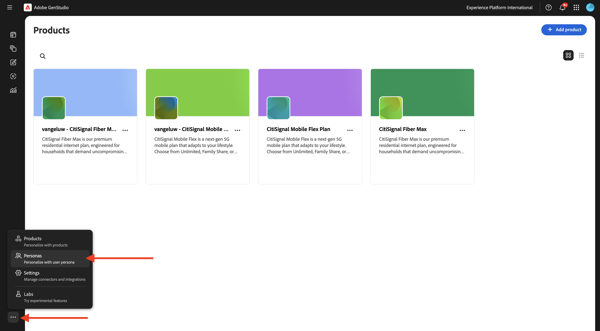
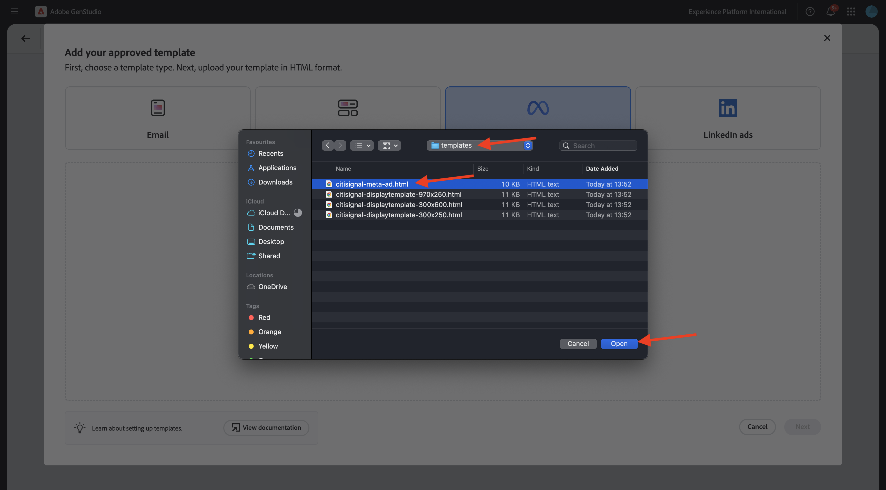

# 1.3.2 Configuratie: persona&#39;s, producten en sjablonen

Ga naar [ https://experience.adobe.com/ ](https://experience.adobe.com/){target="_blank"}. Open **GenStudio**.


## 1.3.2.1 Producten

Producten in GenStudio for Performance Marketing maken gebruik van een diepgaand inzicht in productspecificaties, voordelen en differentiatiefactoren om effectvolle inhoud te genereren.

De producten omvatten alle elementen van een specifiek product, zoals beeldspraak, beschrijvingen, en waardevoorstellen, om een samenhangende merkvertegenwoordiging tot stand te brengen. De hefboomwerking van de geavanceerde technologie van AI van Adobe, GenStudio for Performance Marketing richtlijnen-merken, Producten, en Persoonlijk-werk samen om dwingende inhoud te produceren die de sterke punten van uw producten toont en consistentie over al overseinen verzekert.

Begin creërend uw eigen producten, klik de 3 punten **...** en selecteer dan **Producten**.


Klik op **+ Product toevoegen** .


Selecteer **toevoegen manueel** en klik **verdergaan**.


Dan moet je dit zien.


Voor de productnaam gebruikt u `--aepUserLdap-- - CitiSignal Mobile Flex Plan` .

Voor het gebied **Beschrijving**, gebruik dit:

```
CitiSignal Mobile Flex is a next-gen 5G mobile plan that adapts to your lifestyle. Choose from Unlimited, Family Share, or Data Saver tiers, with optional add-ons like international roaming, hotspot tethering, and SmartFamily™ parental controls. All plans include priority access to CitiSignal’s 5G UltraWide network and seamless integration with CitiSignal Fiber for unified billing, shared data pools, and SmartSwitch™ connectivity. 
```

Voor het gebied **Voorstelling van de Waarde**, gebruik dit:

```
A mobile plan that flexes with your life—fast, fair, and fully connected to your world.
```

Voor het gebied **voorkeur van het Overseinen**, gebruik dit:

```
Remote Professionals: “Work from anywhere with a mobile plan that’s as flexible as your schedule.”
Online Gamers: “Unlimited 5G. No throttling. Just pure performance—on the go.”
Smart Home Families: “One plan. One bill. One less thing to worry about.”
```

Uw productconfiguratie zou nu als dit moeten kijken. Klik het **rug** pictogram.


Klik op **+ Product toevoegen** .


Selecteer **toevoegen manueel** en klik **verdergaan**.


Dan moet je dit zien.


Voor de productnaam gebruikt u `--aepUserLdap-- - CitiSignal Fiber Max` .

Voor het gebied **Beschrijving**, gebruik dit:

```
CitiSignal Fiber Max is our premium residential internet plan, engineered for households that demand uncompromising speed, stability, and coverage. With symmetrical speeds up to 2 Gbps, it’s ideal for remote professionals juggling Zoom calls and cloud apps, gamers chasing millisecond precision, and families running dozens of smart devices. The plan includes a Wi-Fi 6E router, optional mesh extenders for whole-home coverage, and proactive network monitoring. 
```

Voor het gebied **Voorstelling van de Waarde**, gebruik dit:

```
Power your work, play, and home with the fastest, most reliable fiber internet—built for the way you live today and tomorrow.
```

Voor het gebied **voorkeur van het Overseinen**, gebruik dit:

```
Remote Professionals: “Stay connected, stay productive—no matter how many meetings or megabytes your day demands.”
Online Gamers: “Zero lag. Zero mercy. Dominate with 2 Gbps fiber and ultra-low ping.”
Smart Home Families: “Every room. Every device. Always on. Welcome to whole-home harmony.”
```

Uw productconfiguratie zou nu als dit moeten kijken. Klik het **rug** pictogram.


U zou dan de 2 producten moeten zien die u vormde.


## 1.3.2.2 Persoonlijke personen

Persoonlijke gegevens bieden een authentieke weergave van de klantsegmenten, met inbegrip van hun informatie, interesses, pijnpunten, voorkeuren en gedragskenmerken.

GenStudio for Performance Marketing gebruikt de macht van richtlijn-merken, Producten, en Persoonlijk-en generatieve AI van Adobe technologie om gepersonaliseerde marketing inhoud voor uw doelklanten te leiden. &#x200B;

Om uw persona&#39;s te beginnen tot stand te brengen, klik de 3 punten **..** en selecteer dan **Personas**.



Klik op **+ Person toevoegen** .


Selecteer **toevoegen manueel** en klik **verdergaan**.


Dan moet je dit zien.


Gebruik voor de naam van de persoon `--aepUserLdap-- - Smart Home Families` .

Voor het gebied **Beschrijving**, gebruik dit:

```
These are tech-forward households with multiple connected devices—smart TVs, thermostats, security systems, voice assistants, and more. They value convenience, automation, and seamless connectivity across the home. They often have children and are concerned about online safety, parental controls, and whole-home coverage.
```

Voor het gebied **voorkeur van het Overseinen**, gebruik dit:

```
Friendly, family-oriented tone
Visuals showing whole-home coverage and device compatibility
Messaging that highlights security, parental controls, and easy setup
Bundled offers (e.g., mesh Wi-Fi, smart home consultations)
How-to content or setup guides for non-tech-savvy users
```

Uw persoonlijke configuratie zou nu als dit moeten kijken. Klik het **rug** pictogram.


Klik op **+ Person toevoegen** .


Selecteer **toevoegen manueel** en klik **verdergaan**.


Dan moet je dit zien.


Gebruik voor de naam van de persoon `--aepUserLdap-- - Online Gamers` .

Voor het gebied **Beschrijving**, gebruik dit:

```
This persona includes competitive and casual gamers who demand ultra-fast, low-latency internet. They often stream gameplay, participate in multiplayer matches, and use voice chat platforms. They are highly sensitive to lag, jitter, and packet loss, and they’re vocal about their experiences online. Many are early adopters of new tech and value performance above all else.
```

Voor het gebied **voorkeur van het Overseinen**, gebruik dit:

```
Bold, energetic tone with gaming lingo
Metrics like ping time, jitter, and upload/download speeds
Visuals showing latency improvements or side-by-side comparisons
Endorsements from gaming influencers or esports teams
Promotions tied to gaming platforms or bundles (e.g., free months of Xbox Game Pass)
```

Uw persoonlijke configuratie zou nu als dit moeten kijken. Klik het **rug** pictogram.


Klik op **+ Person toevoegen** .


Selecteer **toevoegen manueel** en klik **verdergaan**.


Dan moet je dit zien.


Gebruik voor de naam van de persoon `--aepUserLdap-- - Remote Professionals` .

Voor het gebied **Beschrijving**, gebruik dit:

```
These are knowledge workers, freelancers, consultants, and hybrid employees who rely on a stable, high-speed internet connection to maintain productivity from home. Their workdays are filled with video calls, cloud-based collaboration, and large file transfers. They often use multiple devices simultaneously and expect seamless performance across all of them. Many are tech-savvy and value proactive customer support and service transparency.
```

Voor het gebied **voorkeur van het Overseinen**, gebruik dit:

```
Clear, professional tone with a focus on productivity and reliability
Testimonials or case studies from similar professionals
Visuals like speed comparison charts and uptime guarantees
Emphasis on 24/7 support and service-level agreements
Messaging that highlights “work-from-anywhere” flexibility
```

Uw persoonlijke configuratie zou nu als dit moeten kijken. Klik het **rug** pictogram.


U zou dan de 3 karakters moeten zien die u vormde.


## 1.3.2.3 Sjablonen

Met GenStudio for Performance Marketing kunnen makers van inhoud snel consistente marketinginhoud voor het merk produceren met behulp van sjablonen. Een malplaatje vermindert beduidend de tijd en de inspanning die wordt vereist om nieuwe inhoud te produceren door een uitgangspunt te verstrekken dat pre-gevormde lay-outs en ontwerpelementen omvat.

Hoewel GenStudio for Performance Marketing het rechtstreeks maken van sjablonen in de toepassing niet ondersteunt, kunt u eenvoudig sjablonen ontwerpen en voorbereiden met populaire ontwerpgereedschappen, zoals Adobe InDesign, Illustrator of Express. Zodra uw ontwerp volledig is, kunt u het voor gebruik in GenStudio for Performance Marketing aanpassen. In deze exercitie, zult u een aantal vooraf bepaalde malplaatjes in GenStudio for Performance Marketing invoeren.

In de vorige oefening, downloadde u het dossier [ CitiSignal-GSPeM-assets.zip ](../../../assets/gspem/CitiSignal-GSPeM-assets.zip) aan uw Desktop en unzipped het. Die map bevat vier voorbeeldsjablonen die u nu in GenStudio moet importeren.


Ga naar **Inhoud** > **Malplaatjes**. Klik op **+ Sjabloon toevoegen** .


Selecteer **Meta advertenties** en klik dan **doorbladeren**.


In de omslag die de gedownloade **CitiSignal-GSPeM-activa** dossiers bevat, navigeer aan de omslag **malplaatjes**. Selecteer het dossier **burgersignaal-meta-ad.html** en klik **Open**.



Dan moet je dit zien. Klik **daarna**.


Klik **daarna**.


Gebruik dit voor het gebied **naam van het Malplaatje**:
`--aepUserLdap---citisignal-meta-ad` en plaats de aspectverhouding aan **1:1**. Klik **publiceren malplaatje**.


Uw sjabloon is nu opgeslagen en is beschikbaar in de sjabloonbibliotheek.


Klik op **+ Sjabloon toevoegen** .


Selecteer **Banner en vertoningsadvertenties** en klik dan **doorbladeren**.


In de omslag die de gedownloade **CitiSignal-GSPeM-activa** dossiers bevat, navigeer aan de omslag **malplaatjes**. Selecteer het dossier **burgerschap-displaytemplate-300x250.html** en klik **Open**.


Dan moet je dit zien. Klik **daarna**.


Klik **daarna**.


Gebruik dit voor het gebied **naam van het Malplaatje**:
`--aepUserLdap---citisignal-displaytemplate-300x250` en plaats **Advertentiebreedte** en **Advertentie** aan **300x250**. Klik **publiceren malplaatje**.


Uw sjabloon is nu opgeslagen en is beschikbaar in de sjabloonbibliotheek.


Klik op **+ Sjabloon toevoegen** .


Selecteer **Banner en vertoningsadvertenties** en klik dan **doorbladeren**.


In de omslag die de gedownloade **CitiSignal-GSPeM-activa** dossiers bevat, navigeer aan de omslag **malplaatjes**. Selecteer het dossier **burgerschap-displaytemplate-300x600.html** en klik **Open**.


Dan moet je dit zien. Klik **daarna**.


Klik **daarna**.


Gebruik dit voor het gebied **naam van het Malplaatje**:
`--aepUserLdap---citisignal-displaytemplate-300x600` en plaats **Advertentiebreedte** en **Advertentie** aan **300x600**. Klik **publiceren malplaatje**.


Uw sjabloon is nu opgeslagen en is beschikbaar in de sjabloonbibliotheek.


Klik op **+ Sjabloon toevoegen** .


Selecteer **Banner en vertoningsadvertenties** en klik dan **doorbladeren**.


In de omslag die de gedownloade **CitiSignal-GSPeM-activa** dossiers bevat, navigeer aan de omslag **malplaatjes**. Selecteer het dossier **burgerschap-displaytemplate-970x250.html** en klik **Open**.


Dan moet je dit zien. Klik **daarna**.


Klik **daarna**.


Gebruik dit voor het gebied **naam van het Malplaatje**:
`--aepUserLdap---citisignal-displaytemplate-970x250` en plaats **Advertentiebreedte** en **Advertentie** aan **970x250**. Klik **publiceren malplaatje**.


Uw sjabloon is nu opgeslagen en is beschikbaar in de sjabloonbibliotheek.


U hebt nu de malplaatjes gevormd die u voor de volgende oefening nodig hebt.

## Volgende stappen

Ga naar [ Activering van de Campagne aan Meta ](./ex3.md){target="_blank"}

Ga terug naar [ GenStudio for Performance Marketing ](./genstudio.md){target="_blank"}

Ga terug naar [ Alle Modules ](./../../../overview.md){target="_blank"}
