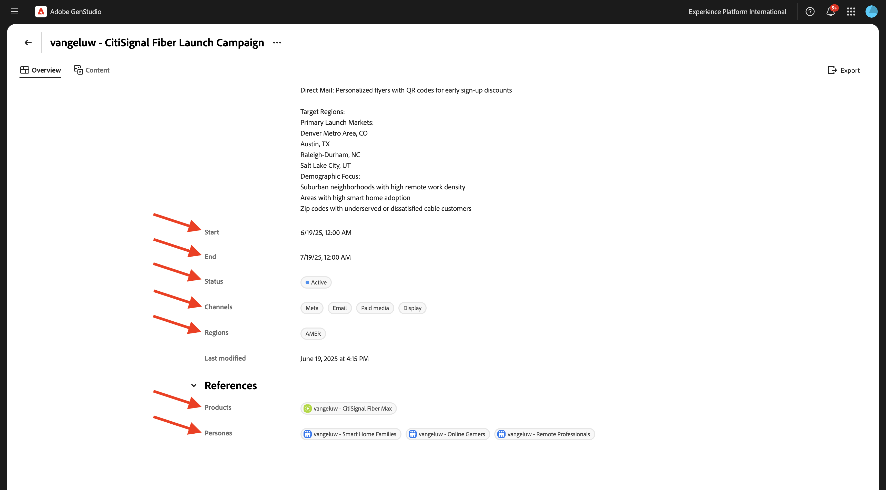
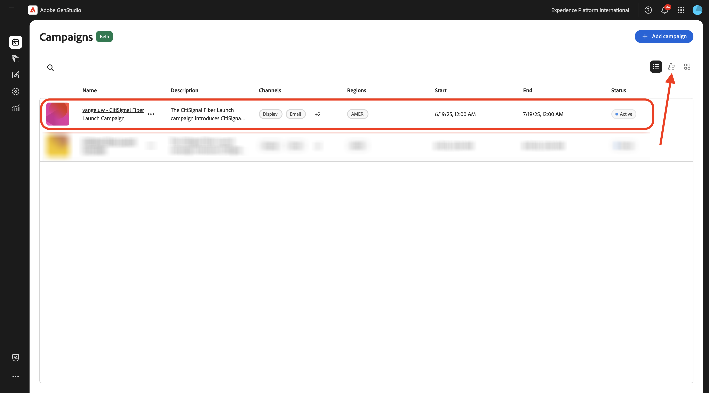
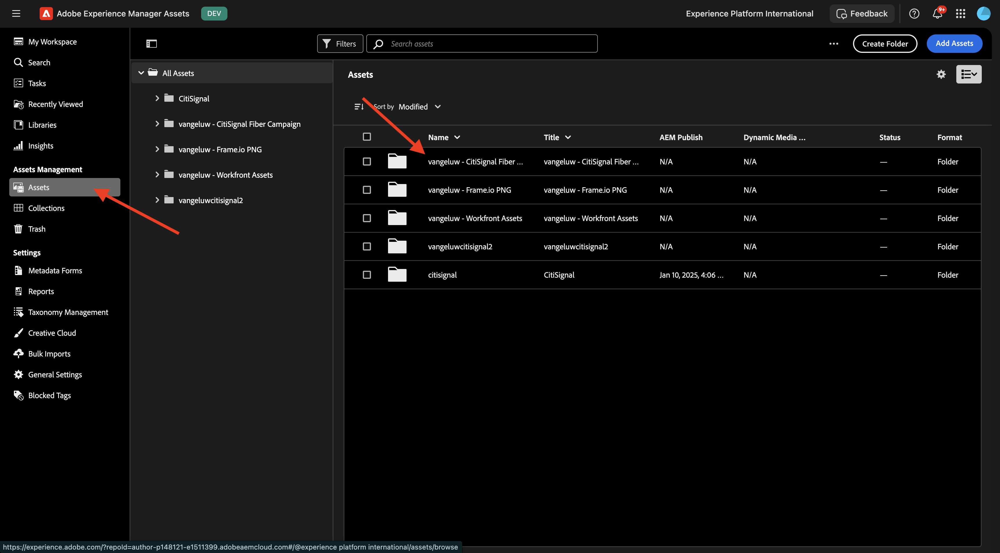

# 1.3.3 Campagne activeren naar Meta

>[!IMPORTANT]
>
>Als u deze bewerking wilt voltooien, hebt u toegang nodig tot een werkende AEM Assets CS Author-omgeving met AEM Assets Content Hub ingeschakeld.
>
>Er zijn twee opties die u kunt overwegen:
>
>- Als u de GenStudio for CSC Technical Enablement workshop bijwoont, hebben uw instructeurs een AEM Assets CS Author-omgeving voor u gemaakt. Controleer bij hen wat de naam is en hoe u verder wilt gaan.
>
>- Als u de volledige Één de zelfstudie van Adobe volgt, ga [&#x200B; Adobe Experience Manager Cloud Service &amp; Edge Delivery Services &#x200B;](./../../../modules/asset-mgmt/module2.1/aemcs.md){target="_blank"} uitoefenen. Volg de instructies daar, en u zult toegang tot zulk een milieu hebben.

>[!IMPORTANT]
>
>Om alle stappen in deze oefening uit te voeren, moet u toegang tot een bestaande milieu van Adobe Workfront hebben, en in die milieu moet u een project en een goedkeuringswerkschema hebben gecreeerd. Als u oefening [&#x200B; Beheer van het Werkschema met Adobe Workfront &#x200B;](./../../../modules/workflow-planning/module1.2/workfront.md){target="_blank"} volgt zult u de vereiste beschikbare opstelling hebben.

>[!IMPORTANT]
>
>Als u eerder een AEM Assets CS-programma hebt geconfigureerd met een auteur- en AEM Assets-omgeving, kan het zijn dat de AEM CS-sandbox is geminimaliseerd. Gezien het feit dat het vernietigen van zo&#39;n zandbak 10 tot 15 minuten duurt, zou het een goed idee zijn om het ontruimingsproces nu te beginnen zodat u niet op een later tijdstip hoeft te wachten.

## 1.3.3.1 Campagne maken

In **GenStudio for Performance Marketing**, ga naar **Campagnes** in het linkermenu. Klik **+ toevoegen campagne**.


Dan zou u een leeg campagneoverzicht moeten zien.


Gebruik `--aepUserLdap-- - CitiSignal Fiber Launch Campaign` voor de veldnaam.

Voor het gebied **Beschrijving**, gebruik de hieronder tekst.

```
The CitiSignal Fiber Launch campaign introduces CitiSignal’s flagship fiber internet service—CitiSignal Fiber Max—to key residential markets. This campaign is designed to build awareness, drive sign-ups, and establish CitiSignal as the go-to provider for ultra-fast, reliable, and future-ready internet. The campaign will highlight the product’s benefits for remote professionals, online gamers, and smart home families, using persona-driven messaging across digital and physical channels.
```

Voor het gebied **Doelstelling**, gebruik de hieronder tekst.

```
Generate brand awareness in target regions
Drive early sign-ups and pre-orders for CitiSignal Fiber Max
Position CitiSignal as a premium, customer-first fiber internet provider
Educate consumers on the benefits of fiber over cable or DSL
```

Voor het gebied **Zeer belangrijke Overseinen**, gebruik de hieronder tekst.

```
Supporting Points:
Symmetrical speeds up to 2 Gbps
Whole-home Wi-Fi 6E coverage
99.99% uptime guarantee
24/7 concierge support
No data caps or throttling
 Channels:
Digital Advertising: Google Display, YouTube pre-roll, Meta (Facebook/Instagram), TikTok (for gamers)
Email Marketing: Persona-segmented drip campaigns
Social Media: Organic and paid posts with testimonials, speed demos, and influencer partnerships
Out-of-Home (OOH): Billboards, transit ads in suburban commuter corridors
Local Events: Pop-up booths at tech expos, family festivals, and gaming tournaments
Direct Mail: Personalized flyers with QR codes for early sign-up discounts
 
Target Regions:
Primary Launch Markets:
Denver Metro Area, CO
Austin, TX
Raleigh-Durham, NC
Salt Lake City, UT
Demographic Focus:
Suburban neighborhoods with high remote work density
Areas with high smart home adoption
Zip codes with underserved or dissatisfied cable customers
```

Dan zou u het volgende moeten hebben:


Schuif omlaag om meer velden weer te geven:


Voor het gebied **Begin**, plaats het aan de datum van vandaag.

Voor het gebied **Eind**, plaats het aan een datum 1 maand van nu.

Voor het gebied **Status**, plaats het aan **Actief**.

Voor het gebied **Kanalen**, plaats het aan **Meta**, **E-mail**, **Betaalde Media**, **Vertoning**.

Voor het gebied **Gebieden**, selecteer een gebied van keus.

Voor het gebied voor het gebied **Verwijzingen** > **Producten**: kies het product `--aepUserLdap-- - CitiSignal Fiber Max`.

**Verwijzingen** > **Personas**: kies de persona&#39;s `--aepUserLdap-- - Remote Professionals`, `--aepUserLdap-- - Online Gamers`, `--aepUserLdap-- - Smart Home Families`

U zou dan dit moeten zien:



Uw campagne is nu klaar. Klik de **pijl** om terug te gaan.


Dan zie je je campagne in de lijst. Klik op het pictogram van de kalenderweergave om de weergave in de campagnecalender te wijzigen.



Dan zou u een campagnemalender moeten zien die een visueel idee geeft van welke campagnes op dat moment actief zijn.


## 1.3.3.2 Verbinding met Meta instellen

>[!IMPORTANT]
>
>Als u uw verbinding met Meta wilt instellen, hebt u een Meta-gebruikersaccount nodig en moet die gebruikersaccount worden toegevoegd aan een Meta Business-account.

Om de verbinding aan Meta te plaatsen, klik de 3 punten **...** en selecteer **Montages**.


Klik **verbinden** voor **Meta Adds**.


Meld u aan met uw Meta-account. Klik **verdergaan**.


Als uw account is gekoppeld aan een Meta Business-account, kunt u de bedrijfsportefeuille selecteren die in Meta is geconfigureerd.


Zodra de verbinding met succes is gevestigd, klik de lijn die **X verbonden rekening(en)** zegt.


U moet dan de gegevens bekijken van de Meta Business Account die is verbonden met GenStudio for Performance Marketing.


## 1.3.3.3 Nieuw element maken

Ga naar [&#x200B; https://firefly.adobe.com/ &#x200B;](https://firefly.adobe.com/){target="_blank"}. Ga de herinnering `a neon rabbit running very fast through space` in en klik **produceert**.


Er worden dan verschillende afbeeldingen gegenereerd. Kies het beeld u van de meesten houdt, klik het **pictogram van het Aandeel** op het beeld en selecteer dan **Open in Adobe Express**.


Vervolgens ziet u dat de afbeelding die u zojuist hebt gegenereerd, beschikbaar is in Adobe Express voor bewerking. U moet nu het CitiSignal-logo aan de afbeelding toevoegen. Om dat te doen, ga naar **Banden**.


Vervolgens wordt de sjabloon van het CitiSignal-merk die u in GenStudio for Performance Marketing hebt gemaakt, weergegeven in Adobe Express. Klik om uw merksjabloon te selecteren met de naam `--aepUserLdap-- - CitiSignal` .


Ga naar **Logo&#39;s** en klik het **witte** embleem van het Citisignaal om het op het beeld te laten vallen.


Plaats het CitiSignal-logo boven aan de afbeelding, niet te ver van het midden.


Daarna, klik **Aandeel**.


Selecteer **AEM Assets**.


Klik **Uitgezochte omslag**.


Selecteer uw AEM Assets CS-opslagplaats met de naam `--aepUserLdap-- - CitiSignal` en selecteer vervolgens de map `--aepUserLdap-- - CitiSignal Fiber Campaign` . Klik **Uitgezocht**.


Dan moet je dit zien. Klik **uploaden 1 activa**. Uw afbeelding wordt nu geüpload naar AEM Assets CS.


Ga naar [&#x200B; https://experience.adobe.com/ &#x200B;](https://experience.adobe.com/){target="_blank"}. Open **Experience Manager Assets**.


Selecteer de AEM Assets CS-omgeving met de naam `--aepUserLdap-- - CitiSignal dev` .


Ga naar **Assets** en klik dan de omslag `--aepUserLdap-- - CitiSignal Fiber Campaign` tweemaal.



Dan zou je iets gelijkaardigs moeten zien. Dubbelklik op de afbeelding `--aepUserLdap-- - neon rabbit` .


De afbeelding `--aepUserLdap-- - neon rabbit` wordt dan weergegeven. Verandering de **Status** aan **Goedgekeurd** en klik dan **sparen**

>[!IMPORTANT]
>
>Als het statuut van een beeld niet aan **Goedgekeurd** wordt geplaatst, dan zal het beeld niet in GenStudio for Performance Marketing zichtbaar zijn. Alleen goedgekeurde middelen zijn toegankelijk in GenStudio for Performance Marketing.


Ga terug naar GenStudio for Performance Marketing. In het linkermenu, ga naar **Assets** en selecteer uw bewaarplaats van AEM Assets CS, die zou moeten worden genoemd `--aepUserLdap-- - CitiSignal`. Vervolgens ziet u dat de afbeelding die u zojuist hebt gemaakt en goedgekeurd, beschikbaar wordt in GenStudio for Performance Marketing.


## 1.3.3.4 Meta-advertentie maken en goedkeuren

In het linkermenu, ga **creëren**. Selecteer **Meta**.


Selecteer het **Meta en** malplaatje dat u vroeger invoerde, dat `--aepUserLdap---citisignal-meta-ad` wordt genoemd. Klik **Gebruik**.


Dan moet je dit zien. Wijzig de naam van de advertentie in `--aepUserLdap-- - Meta Ad Fiber Max` .

Onder **Paramaters**, selecteer de volgende opties:

- **Merk**: `--aepUserLdap-- - CitiSignal`
- **Taal**: `English (US)`
- **Persona**: `--aepUserLdap-- - Smart Home Families`
- **Product**: `--aepUserLdap-- - CitiSignal Fiber Max`

Klik **Uitgezocht van Inhoud**.


Selecteer het element `--aepUserLdap-- - neon rabbit.png` . Klik **Gebruik**.


Ga de herinnering `focus on lightning fast internet for big families` in en klik **produceert**.


Dan moet je iets dergelijks zien. Je advertenties kunnen nu worden gecontroleerd en goedgekeurd. Om dat te doen, klik **Goedkeuring van het Verzoek**, die met Adobe Workfront zal verbinden.


Selecteer uw Adobe Workfront-project met de naam `--aepUserLdap-- - CitiSignal Fiber Launch` . Ga uw eigen e-mailadres onder **in nodigt mensen** uit en verzekert uw rol aan **wordt geplaatst fiatteur**.


U kunt ook een bestaande goedkeuringsworkflow in Adobe Workfront gebruiken. Om dat te doen, klik **malplaatje van het Gebruik** en selecteer het malplaatje `--aepuserLdap-- - Approval Workflow`. Klik **verzenden**.


Klik **commentaren van de Mening in Workfront**, zult u nu naar de UI van het Bewijs van Adobe Workfront worden verzonden.


In het Bewijs van Adobe Workfront UI, klik **besluit van het Merk**.


Selecteer **Goedgekeurd** en klik **besluit** maken.


Klik **publiceren**.


Selecteer uw Campagne `--aepUserLdap-- - CitiSignal Fiber Launch Campaign` en klik **publiceren**.


Klik **Open in Inhoud**.


De 4 Metaadvertenties zijn nu beschikbaar onder **Inhoud** > **Ervaringen**.


## 1.3.3.5 Advertentie publiceren naar Meta

Selecteer één van de advertenties en klik dan **activeren**.


Kies a **Call to action** uit de lijst en ga een voorbeeld URL in. Klik **daarna**.


Selecteer de Meta-account, de gekoppelde Facebook-pagina, de Meta-campagne en de Meta Ad-set.

Gebruik `--aepUserLdap-- Fiber Max Ad` om een naam toe te voegen.

Klik **daarna**.


Klik **publiceren**.


Klik **OK**.


Het statuut van uw advertentie wordt nu geplaatst aan **het Publiceren**, die een paar notulen kan nemen.


Na een paar notulen, zal het statuut van de advertentie in **Gepubliceerd** veranderen. Dit betekent dat de advertentie van GenStudio for Performance Marketing naar Meta is verzonden. Het betekent niet dat de advertentie al in Meta is gepubliceerd! Er zijn nog een aantal stappen te nemen in de Meta Business Account om de advertentie te maken en te publiceren zodat deze door gebruikers op de verschillende Meta-platforms kan worden bekeken.

Klik **details van de Mening**.


Klik **Open**, die u aan uw Van Bedrijfs Meta rekening zal nemen.

>[!IMPORTANT]
>
>Als u geen toegang hebt tot de zakelijke account van Meta die is verbonden met uw omgeving, kunt u deze advertentie niet visualiseren in Meta.


Hier is een overzicht van de advertentie die je net hebt gemaakt, maar nu in Meta.


Je hebt deze oefening nu voltooid.

## Volgende stappen

Ga naar [&#x200B; Samenvatting &amp; voordelen &#x200B;](./summary.md){target="_blank"}

Ga terug naar [&#x200B; GenStudio for Performance Marketing &#x200B;](./genstudio.md){target="_blank"}

Ga terug naar [&#x200B; Alle Modules &#x200B;](./../../../overview.md){target="_blank"}
