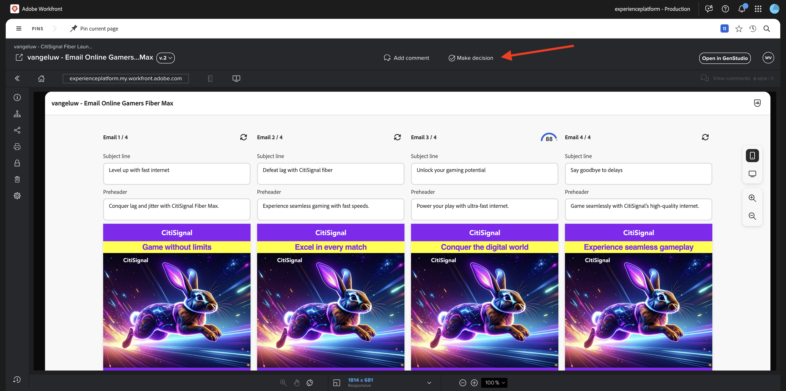
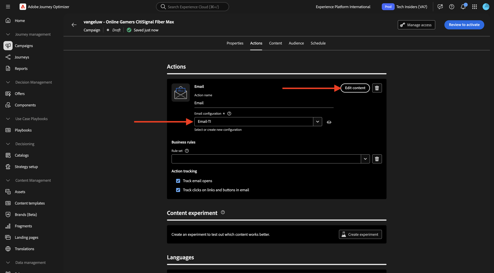

# 1.3.4 E-mailbeleving voor AJO maken

>[!IMPORTANT]
>
>Om deze oefening te voltooien, moet u toegang hebben tot een milieu van Adobe Journey Optimizer dat voor de integratie met GenStudio for Performance Marketing wordt voorzien, die momenteel in bèta is.

>[!IMPORTANT]
>
>Om alle stappen in deze oefening uit te voeren, moet u toegang tot een bestaande milieu van Adobe Workfront hebben, en in die milieu moet u een project en een goedkeuringswerkschema hebben gecreeerd. Als u oefening [ Beheer van het Werkschema met Adobe Workfront ](./../../../modules/workflow-planning/module1.2/workfront.md){target="_blank"} volgt zult u de vereiste beschikbare opstelling hebben.

## 1.3.4.1 E-mailbeleving maken en goedkeuren

In het linkermenu, ga **creëren**. Selecteer **E-mail**.


Selecteer het **E-mail** malplaatje dat u vroeger invoerde, dat `--aepUserLdap---citisignal-email-template` wordt genoemd. Klik **Gebruik**.


Dan moet je dit zien. Wijzig de naam van de advertentie in `--aepUserLdap-- - Email Online Gamers Fiber Max` .


Onder **Paramaters**, selecteer de volgende opties:

- **Merk**: `--aepUserLdap-- - CitiSignal`
- **Taal**: `English (US)`
- **Persona**: `--aepUserLdap-- - Online Gamers`
- **Product**: `--aepUserLdap-- - CitiSignal Fiber Max`

Klik **Uitgezocht van Inhoud**.


Selecteer het element `--aepUserLdap-- - neon rabbit.png` . Klik **Gebruik**.


Ga de herinnering `convince online gamers to start playing online multiplayer games using CitiSignal internet` in en klik **produceert**.


Dan zou je iets als dit moeten zien, met 4 e-mailvariaties die worden gegenereerd. De standaardmening toont de **mobiele** mening, kunt u aan de Desktopmening schakelen door het **computer** pictogram te klikken.


Voor elke e-mail wordt automatisch een compatibiliteitsscore berekend. Klik op de score voor meer details.


Klik **Mening en los kwesties** op.


U kunt dan meer details zien over wat u kunt doen om de compliancescore te optimaliseren.


Daarna, klik **Goedkeuring van het Verzoek**, die met Adobe Workfront zal verbinden.


Selecteer uw Adobe Workfront-project met de naam `--aepUserLdap-- - CitiSignal Fiber Launch` . Ga uw eigen e-mailadres onder **in nodigt mensen** uit en verzekert uw rol aan **wordt geplaatst fiatteur**.


U kunt ook een bestaande goedkeuringsworkflow in Adobe Workfront gebruiken. Om dat te doen, klik **malplaatje van het Gebruik** en selecteer het malplaatje `--aepuserLdap-- - Approval Workflow`. Klik **verzenden**.


Klik **commentaren van de Mening in Workfront**, zult u nu naar de UI van het Bewijs van Adobe Workfront worden verzonden.


In het Bewijs van Adobe Workfront UI, klik **besluit van het Merk**.



Selecteer **Goedgekeurd** en klik **besluit** maken.


Klik **publiceren**.


Selecteer uw Campagne `--aepUserLdap-- - CitiSignal Fiber Launch Campaign` en klik **publiceren**.


Klik **Open in Inhoud**.


De 4 e-mailervaringen zijn nu beschikbaar onder **Inhoud** > **Ervaringen**.


## 1.3.4.2 Een campagne maken in AJO

Login aan Adobe Journey Optimizer door naar [ Adobe Experience Cloud ](https://experience.adobe.com) te gaan. Klik **Journey Optimizer**.


U zult aan de **1&rbrace; mening van het Huis {in Journey Optimizer worden opnieuw gericht.** Eerst, zorg ervoor u de correcte zandbak gebruikt. De sandbox die moet worden gebruikt, wordt `--aepSandboxName--` genoemd. U zult dan in de **1} mening van het Huis &lbrace;van uw zandbak** zijn.`--aepSandboxName--`


U maakt nu een campagne. In tegenstelling tot de op een gebeurtenis gebaseerde reis van de vorige oefening die op inkomende ervaringsgebeurtenissen of publieksingangen of uitgang baseert om een reis voor één specifieke klant teweeg te brengen, richten de campagnes één keer een heel publiek met unieke inhoud zoals nieuwsbrieven, eenmalige bevorderingen, of generische informatie of periodiek met gelijkaardige inhoud die op een regelmatige basis wordt verzonden zoals bijvoorbeeld verjaardagscampagnes en herinneringen.

In het menu, ga naar **Campagnes** en klik **creeer campagne**.


Selecteer **Gepland - Op de markt brengend** en klik **creeer**.


Voor het scherm van de campagneverwezenlijking, vorm het volgende:

- **Naam**: `--aepUserLdap--  - Online Gamers CitiSignal Fiber Max`.
- **Beschrijving**: De campagne van de Vezel voor Online Gamers

Klik **Acties**.


Klik **+ voeg Actie** toe en selecteer dan **E-mail**.


Dan, selecteer een bestaande **E-mailconfiguratie** en klik dan **uitgeven inhoud**.



Dan zie je dit. Voor de **lijn van het Onderwerp**, gebruik dit:

```
{{profile.person.name.firstName}}, say goodbye to delays!
```

Daarna, klik **uitgeven inhoud**.


Klik **de Invoer HTML**.


Daarna, klik de knoop voor **Adobe GenStudio for Performance Marketing**.


Vervolgens wordt een pop-upvenster weergegeven met alle e-mailervaringen die in GenStudio for Performance Marketing zijn gepubliceerd. Selecteer één van de beschikbare e-mailervaringen en klik **Gebruik**.


Selecteer uw eigen bewaarplaats van AEM Assets CS, die `--aepUserLdap-- - CitiSignal dev` zou moeten worden genoemd, en **de Invoer** klikken.


Dan moet je dit zien. Selecteer de ontbrekende beeldknoop en klik **Selecteer een activa**.


Ga naar de omslag die als dit kijkt, beginnend met **GenStudio.zip....** en selecteert u de afbeelding `--aepUserLdap-- - neon rabbit.png` . CLick **Uitgezochte**


Dan moet je dit zien.


De rol neer aan footer, selecteert het woord **Unsubscribe** en klikt het **verbindings** pictogram.


Plaats het **Type** aan **Externe Opt-out/Unsubscription** en plaats url aan `https://techinsiders.org/unsubscribe.html` (het is niet toegestaan om een lege URL voor te hebben unsubscribe verbinding).

Klik **sparen** en klik dan de **pijl** in de hoogste linkerhoek van uw scherm om terug naar de campagneconfiguratie te gaan.


Ga naar **Publiek**.


Klik **Uitgezochte publiek**.


Selecteer het publiek van de abonnementenlijst voor Online gamers, die `--aepUserLdap--_SL_Interest_Online_Gaming` zou moeten worden genoemd. Klik **sparen**.


Klik **Overzicht om** te activeren.


Als uw campagneconfiguratie geen kwesties heeft, zult u **kunnen klikken activeert**.


Uw campagne wordt dan geactiveerd, wat een paar minuten in beslag neemt.


Na een paar minuten is de campagne live en wordt het e-mailbericht verzonden naar de abonnementenlijst die u hebt geselecteerd.


Je hebt deze oefening nu voltooid.

## Volgende stappen

Ga naar [ Samenvatting &amp; voordelen ](./summary.md){target="_blank"}

Ga terug naar [ GenStudio for Performance Marketing ](./genstudio.md){target="_blank"}

Ga terug naar [ Alle Modules ](./../../../overview.md){target="_blank"}
