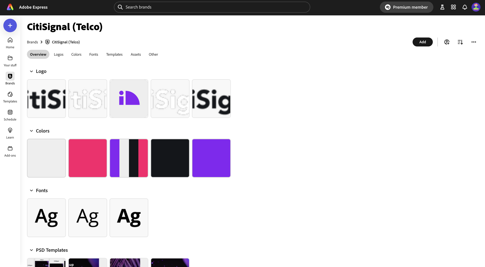
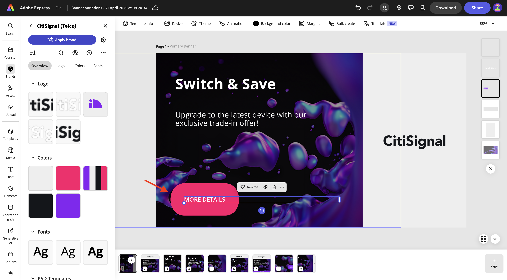
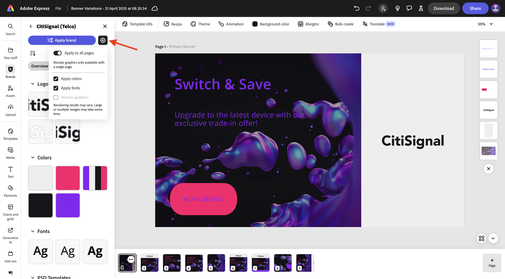
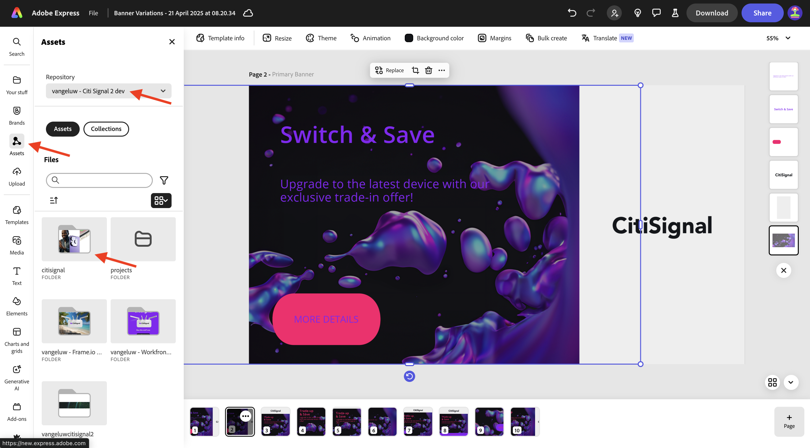
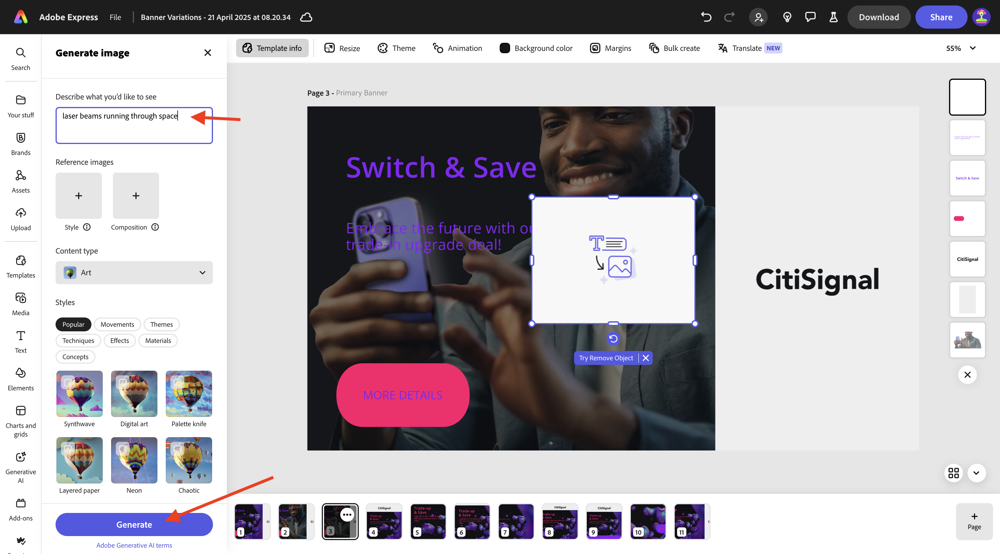
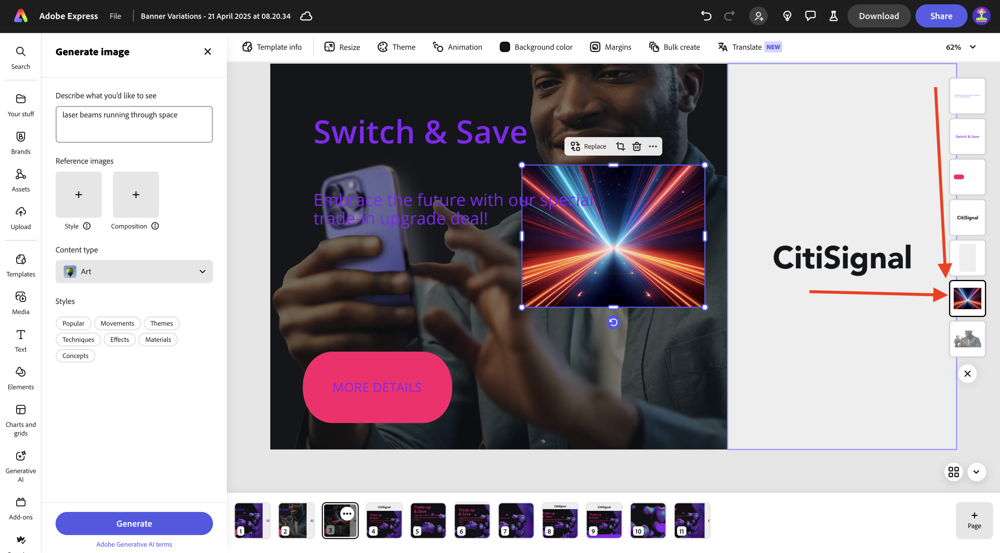
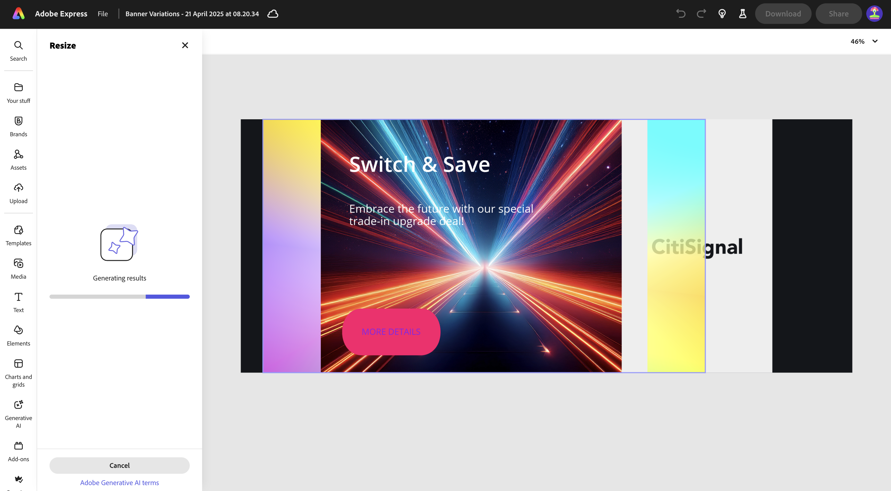

# 1.4.1 Aan de slag met Adobe Express

## 1.4.1.1 Aanmelden bij Adobe Express

Open een nieuw Incognito browser venster en ga naar [&#x200B; https://www.adobe.com/home &#x200B;](https://www.adobe.com/home){target="_blank"}. Login die uw **van het Bedrijf of van de School rekening** gebruiken en dan de rekening **`--aepImsOrgName--`** selecteren.

Adobe Express is beschikbaar voor u als onderdeel van de licenties voor uw organisatie. Om ervoor te zorgen dat u toegang hebt tot Adobe Express, moet u controleren of u bent aangemeld bij de juiste organisatie. Om dat te doen, klik het **profiel** pictogram en verifieer welke rekening actief is. De account die u moet gebruiken, heeft de naam `--aepImsOrgName--` .

Klik **profiel van de Schakelaar** om rekening te veranderen.

Kies de juiste rekening van het menu, in dit geval **Experience Platform Internationaal** (maar dat kan verschillende org voor u zijn).

Zodra de juiste rekening actief is, ga naar **Apps** en klik **Begonnen** op de **Adobe Express** kaart.

U wordt nu het programma geopend aan **Adobe Express**.

## 1.4.1.2 Aan de slag met een merksjabloon

In Adobe Express, ga naar **Banden**. De sjabloonbibliotheek van uw merk is momenteel waarschijnlijk leeg. CitiSignal heeft al eerder een merksjabloon gedefinieerd en u moet die bestaande sjabloon nu opnieuw gebruiken.

Om dat te doen, ga naar [&#x200B; https://www.adobe.com/files/link/1c2f92cf-17bc-4d11-6031-dbd251e6cb57 &#x200B;](https://www.adobe.com/files/link/1c2f92cf-17bc-4d11-6031-dbd251e6cb57).

Dan moet je dit zien. Klik op de drie stippen **..** .

Selecteer **maak een exemplaar**.

Na ongeveer een minuut, zou u een bericht moeten zien bevestigend dat u een persoonlijk exemplaar van het merkmalplaatje hebt gemaakt.

Ga terug naar Adobe Express, aan **Kerkant**, en vernieuw de pagina. U zou nu het **CitiSignal (Telco)** merkmalplaatje moeten zien. Klik om het **CitiSignal (Telco)** merkmalplaatje te openen.

Vervolgens ziet u een bibliotheek met elementen zoals logo&#39;s, lettertypen, kleuren, sjablonen, enzovoort.

Ga naar **Uitdrukkelijke Malplaatjes** en klik om het malplaatje **Variaties van de Banner** te openen.

Klik **Begin een nieuw dossier**.

Dan moet je dit zien.

Klik textbox die **handel-op &amp; sparen** zegt. Dan, herschrijf **&#x200B;**&#x200B;en kies een stijl, dan klik **&#x200B;**&#x200B;produceren.

Kies een variatie en klik **vervangen**.

De bijgewerkte tekst wordt dan weergegeven.

Daarna, klik de tekst **MEER DETAILS**.

Selecteer **Gevolgen**.

Ga naar **Vorm** en klik **Mening allen**.

Klik de **definitieve** knoop. Verander de **grootte van de Vorm** en klik dan de kleurenknoop.

Verander de kleur door een andere kleur van het **CitiSignal kleurenthema** te kiezen.

Vervolgens ziet u de gewijzigde knop.

Daarna, ga naar **Merken** en klik dan **merken** toepassen. Vervolgens ziet u de vormgeving van de afbeelding.

Merk op dat u **ook kunt detail toepassen merk** montages door het **vistuig** pictogram te klikken.

Daarna, klik de 3 punten **...** op het beeld u aan werkt en klik dan **Dupliceren**.

Vervolgens ziet u een nieuwe, identieke afbeelding. Klik op de achtergrondlaag aan de rechterkant van het scherm.

>[!IMPORTANT]
>
>Als u deze bewerking wilt voltooien, hebt u toegang nodig tot een werkende AEM Assets CS Author-omgeving. Als u oefening [&#x200B; Adobe Experience Manager Cloud Service &amp; Edge Delivery Services &#x200B;](./../../../modules/asset-mgmt/module2.1/aemcs.md){target="_blank"} volgt zult u toegang tot zulk een milieu hebben.

Ga naar **Assets** in het linkermenu, selecteer uw bewaarplaats van AEM Assets CS die `--aepUserLdap-- - CitiSignal dev` zou moeten worden genoemd. Daarna, ga naar de omslag **burgersignaal**.

Selecteer het beeld **homepage-held-1.png**. Vervolgens ziet u de wijziging van de achtergrondlaag.

Selecteer textbox zoals vermeld en klik **herschrijven**. Selecteer **herhaal** en selecteer dan een specifieke stijl. Klik **produceren**.

Selecteer een variant en klik **vervangen**.

Dan moet je dit zien. Daarna, klik de 3 punten **...** op de pagina bij de bodem van de pagina en klik **Dupliceren**.

Op het onlangs gecreeerde beeld, ga **media** en klik **produceer beeld**.

Selecteer **Liggend (4:3)**.

Ga de herinnering `laser beams running through space` in en klik **produceren**.

Vervolgens ziet u een afbeelding die door Adobe Firefly is gegenereerd. De laag waarin de afbeelding is gegenereerd, bevindt zich helemaal bovenaan.

Verplaats de nieuw gegenereerde afbeelding omlaag en plaats deze net boven op de vorige achtergrondlaag.

Verwijder de oude achtergrondlaag door het te klikken en te selecteren **Schrapping**.

Pas de afbeelding aan, zodat deze het hele canvas bedekt.

Selecteer de textbox **Schakelaar &amp; sparen** om de doopvontkleur in **wit** te veranderen.

Verander de doopvontkleur in **wit**.

Selecteer andere textbox om de doopvontkleur in **wit** ook te veranderen.

Verander de doopvontkleur in **wit**.

Daarna, klik **resize** en ga een douaneresolutie van **2600** x **1080** in. Zorg ervoor dat checkbox voor **beeld** wordt gecontroleerd uitbreidt. Klik **Resize**.

Dan moet je dit zien.

Na een paar minuten zie je enkele nieuwe variaties van de afbeelding. Kies één en klik dan **houden**.

Dan moet je dit zien.

Verplaats en pas de afbeelding aan, zodat deze de beschikbare ruimte vult.

Daarna, klik **Vertaal**.

Kies sommige talen zoals **Frans**, **Nederlands** en **Spaans**. Zorg ervoor dat slechts de specifieke pagina u aan werkt wordt geselecteerd, die in dit geval **Pagina 3** is. Klik **Vertaal**.

Vervolgens worden vertalingen gegenereerd.

Er wordt dan een aantal nieuwe pagina&#39;s gemaakt. Klik het **dichte** pictogram.

Verifieer de vertalingen en verander hen indien nodig, zoals in dit voorbeeld waar de vertaling niet optimaal is.

Werk de tekst zo nodig bij.

Uw middelen zijn nu klaar.

## Volgende stappen

Ga naar [&#x200B; Animatie en Video in Adobe Express &#x200B;](./ex2.md){target="_blank"}

Ga terug naar [&#x200B; Adobe Express en Adobe Experience Cloud &#x200B;](./express.md){target="_blank"}

Ga terug naar [&#x200B; Alle Modules &#x200B;](./../../../overview.md){target="_blank"}
