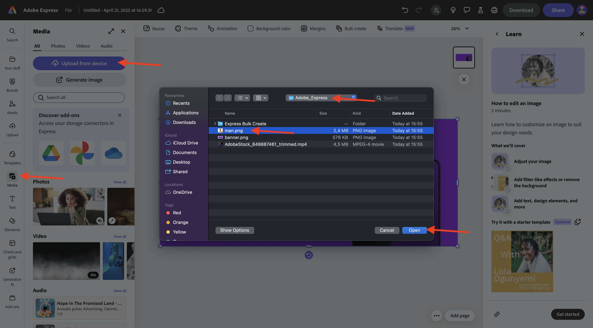
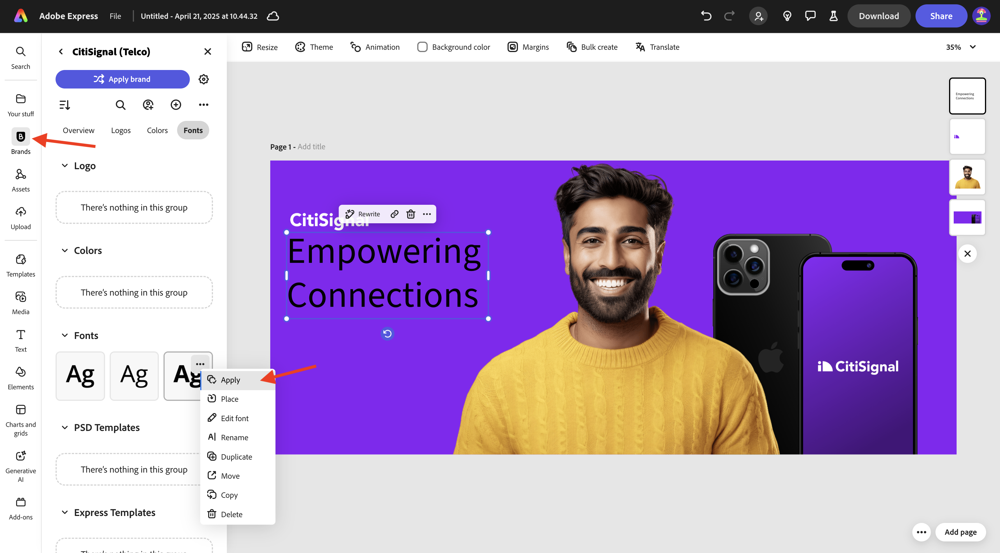
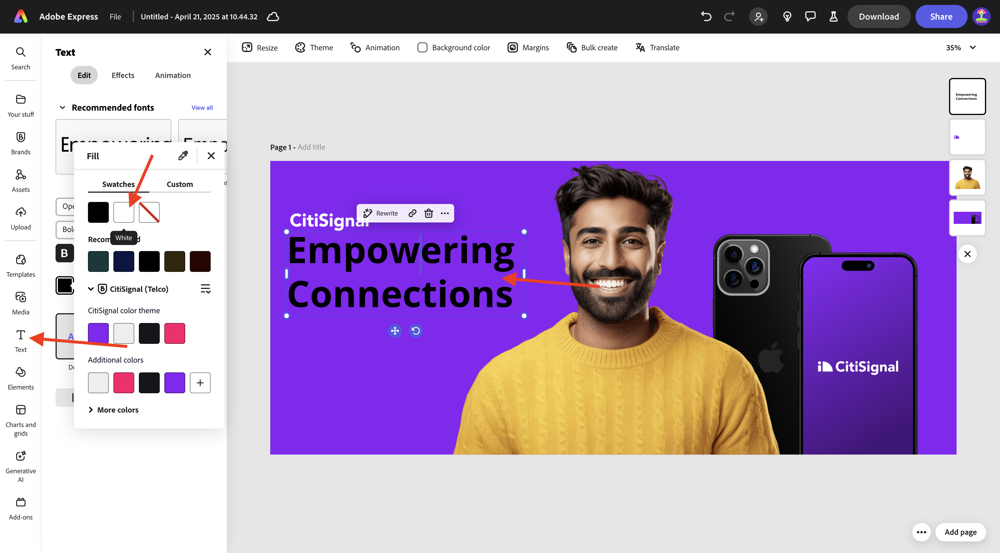
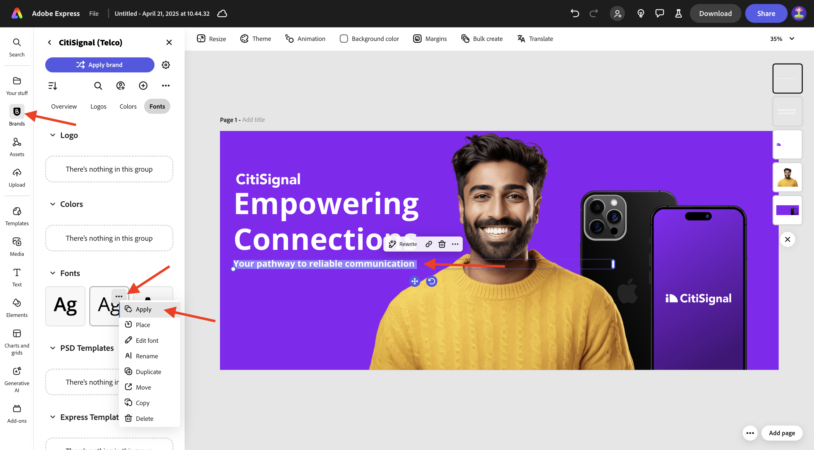

# 1.4.3 Bulk Assets maken in Adobe Express

Alvorens u deze oefening begint, download de vereiste activa van [ https://tech-insiders.s3.us-west-2.amazonaws.com/one-adobe/Adobe_Express.zip ](https://tech-insiders.s3.us-west-2.amazonaws.com/one-adobe/Adobe_Express.zip){target="_blank"} en unzip hen op uw Desktop.

## 1.4.3.1 Eenvoudig element maken

Ga naar [ https://new.express.adobe.com/ ](https://new.express.adobe.com/){target="_blank"}. Klik **+** pictogram om een nieuw **beeld** tot stand te brengen.

Selecteer **Foto** en kies dan **media** uploaden.

Navigeer aan uw Desktop, aan de omslag **Adobe_Express** die de activa bevat u eerder downloadde. Selecteer het dossier **banner.png** en klik **Open**.

Dan moet je dit zien. Selecteer **uitgeven beeld**.

Daarna, ga naar **Media** en selecteer **beeld** uploaden. Navigeer aan uw Desktop, aan de omslag **Adobe_Express** die de activa bevat u eerder downloadde. Selecteer het dossier **man.png** en klik **Open**.

Dan moet je dit zien.

Daarna, zou u het **CitiSignal** embleem moeten toevoegen. Ga naar **Banden** en selecteer het witte embleem CitiSignal. Klik de 3 punten **..** en selecteer **Plaats**.

Pas de locatie van de afbeelding van het CitiSignal-logo aan zodat deze dezelfde positie in de onderstaande afbeelding weerspiegelt.

Ga naar **Tekst** en klik **voeg uw tekst** toe.

Voeg de tekst `Empowering Connections` toe in het nieuwe tekstvak. Sleep het tekstvak naar een vergelijkbare locatie als in de onderstaande afbeelding. Daarna, ga naar **Velen**, aan **Doopvonten**. Klik de 3 punten **..** op de 3de doopvont en klik **toepassen**.

Daarna, verander de doopvontkleur in **wit**.

Ga naar **Tekst** opnieuw en klik **voeg uw tekst** toe.

Voer in het nieuwe tekstvak de tekst `Your pathway to reliable communication` in. Pas de locatie van het tekstvak aan, zodat dit zich onder het vorige tekstvak bevindt, net als de afbeelding hieronder.

Ga naar **Velen**, aan **Doopvonten**, en klik de 3 punten **...** op de tweede doopvont. Dan, klik **toepassen**.

Dan moet je dit hebben. Daarna, ga naar **Elementen**, naar **Vormen** en klik de afgeronde rechthoekvorm.

Vervolgens hebt u een nieuwe afgeronde rechthoekvorm op de afbeelding. Pas de grootte en de locatie aan, zodat deze er als een knop uitziet. Dan, verander de kleur van de afgeronde rechthoek in **zwart**.

Ga naar **Tekst** opnieuw en klik **voeg uw tekst** toe.

Typ de tekst `Shop now` in het nieuwe tekstvak en wijzig de locatie van het tekstvak dat op de knop moet worden gecentreerd. Ga naar **Velen**, aan **Doopvonten**, en klik de 3 punten **...** op de derde doopvont. Dan, klik **toepassen**.

Dan moet je dit zien.

## 1.4.3.2 Bulk maken in Adobe Express

Daarna, creeert de klik **Bulk**.

Dan moet je dit zien. Klik **doorbladeren**.

Navigeer aan uw Desktop, aan de omslag **Uitdrukkelijke Bulk leidt** in de omslag **Adobe_Express** die de activa bevat u eerder downloadde. Selecteer het dossier **CTA-options.csv** en klik **Open**.

Dan moet je dit zien. Klik **daarna**.

Klik **verbinden Element**.

Selecteer textbox die de tekst **Uw weg aan betrouwbare mededeling** bevat. Dan klik het **Element 1** knoop en verbind het met een gebied van het Csv- dossier, in dit geval, het gebied **Subhead**.

Daarna, selecteer textbox die de tekst **bevat nu** Shop.

Dan klik het **Element 1** knoop en verbind het met een gebied van het Csv- dossier, in dit geval, het gebied **CTA**.

Dan moet je dit zien. Klik vervolgens op de afbeelding van de persoon.

Klik het knoop **Element 1**.

Dan zie je deze popup. Klik **doorbladeren**.

Navigeer aan uw Desktop, aan de omslag **Uitdrukkelijke Bulk leidt** in de omslag **Adobe_Express** die de activa bevat u eerder downloadde. Selecteer 6-7 beelddossiers en klik **Open**.

Dan zie je dit. Sleep een andere afbeelding naar elke variatie van het element. Klik **Gereed**

Vervolgens ziet u de variaties van de afbeelding die worden gegenereerd. Klik **creëren pagina(s)**.

Uw variaties zijn nu gereed en u kunt elke variatie afzonderlijk inspecteren om te controleren en te valideren.

Je hebt deze oefening nu voltooid.

## Volgende stappen

Ga naar [ Samenvatting &amp; voordelen ](./summary.md){target="_blank"}

Ga terug naar [ Adobe Express en Adobe Experience Cloud ](./express.md){target="_blank"}

Ga terug naar [ Alle Modules ](./../../../overview.md){target="_blank"}