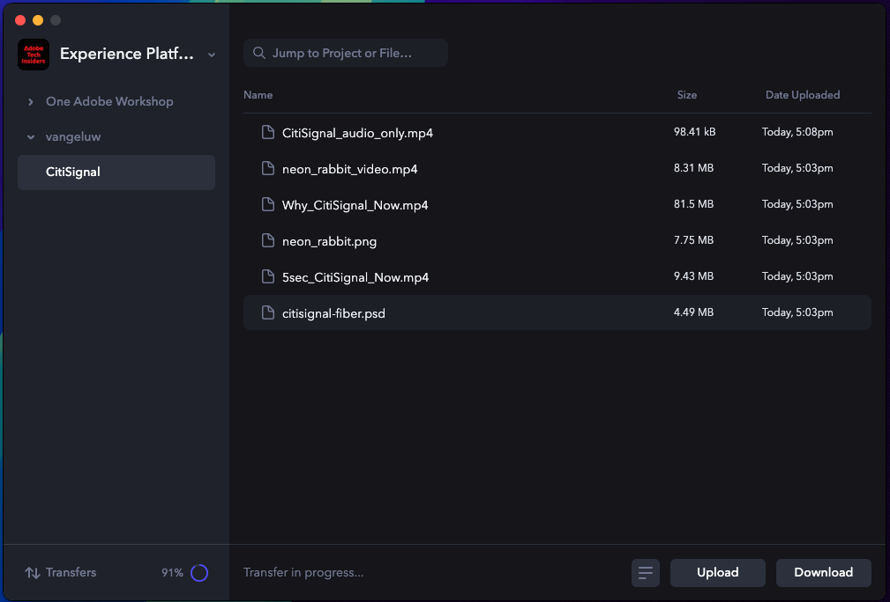
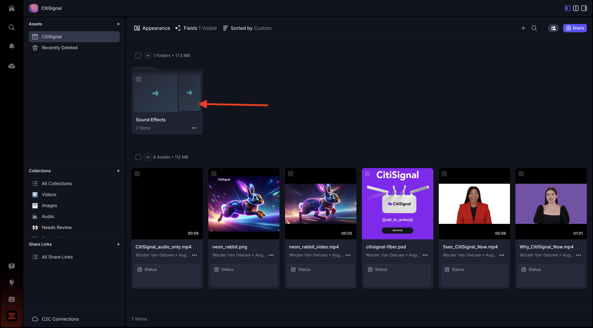

# 1.5.1 Aan de slag met Frame.io

>[!NOTE]
>
> In de onderstaande schermafbeelding ziet u een specifieke omgeving die wordt gebruikt. Wanneer u deze zelfstudie doorloopt, is het zeer waarschijnlijk dat uw omgeving een andere naam heeft. Wanneer u zich hebt aangemeld voor deze zelfstudie, hebt u de te gebruiken omgevingsdetails ontvangen. Volg deze instructies.

Ga naar [ https://next.frame.io/ ](https://next.frame.io/). Controleer of u bent aangemeld bij de omgeving `--aepImsOrgName--` .

Als u niet in het juiste milieu wordt aangemeld, klik het embleem in de bodem linkerhoek en klik om het milieu te selecteren dat u moet gebruiken.

## 1.5.1.1 Uw werkruimte en project maken

Klik **+ Nieuwe Workspace**.

Gebruik: `--aepUserLdap--` voor de naam van de werkruimte. Klik **sparen**.

Uw werkruimte is nu gemaakt. Vervolgens moet u een nieuw project maken. Klik **+ Nieuw Project**.

Selecteer **Lege** en gebruik de naam `CitiSignal`. Klik **creëren Nieuw Project**.

Uw project is nu gemaakt. U moet nu elementen in uw project uploaden. Klik **uploaden**.

Download deze dossiers: [ https://one-adobe-tech-insiders.s3.us-west-2.amazonaws.com/Frame.io_Assets.zip ](https://one-adobe-tech-insiders.s3.us-west-2.amazonaws.com/Frame.io_Assets.zip) aan uw Desktop en unzip hen op uw Desktop.

Selecteer alle dossiers en klik **Open**.

>[!NOTE]
>
>Aangezien u in het schermafbeelding kunt zien, wordt de omslag **Correcte Gevolgen** niet geselecteerd op dit ogenblik. Dit omdat het handmatig uploaden het uploaden van mappen niet ondersteunt. Over een paar minuten installeert u de toepassing Frame.io Transfer, die u gebruikt om die map en de bijbehorende bestanden te uploaden.

Na een paar minuten zult u zien uw dossiers beschikbaar in Frame.io worden.

U hebt bestanden nu handmatig geüpload, maar u kunt bestanden nu beter en sneller uploaden naar en downloaden van Frame.io. De beste manier om dit te doen is de toepassing Frame.io Transfer te gebruiken.

## 1.5.1.2 De toepassing Frame.io-overdracht downloaden en configureren

Ga naar [ https://frame.io/transfer ](https://frame.io/transfer) en download de versie voor uw computer.

Installeer de toepassing en open deze.

Wanneer de toepassing wordt geopend, moet u zich aanmelden. Klik **login**.

Ga het e-mailadres van uw rekening van Adobe in en klik **gaan**.

Na succesvolle authentificatie, klik **Open Frame.io Overdracht app**.

Dan moet je dit zien. Klik om de vervolgkeuzelijst te openen en de juiste omgeving te selecteren.

Selecteer de omgeving die u voor deze zelfstudie nodig hebt, namelijk `--aepImsOrgName--` .

Vervolgens ziet u de werkruimte en het project die u eerder hebt gemaakt, samen met de bestanden die u handmatig hebt geüpload.

Klik **uploaden**.

Ga naar de map die u eerder hebt gebruikt, die de ongecomprimeerde bestanden bevat die u eerder hebt gedownload. Selecteer de omslag **Correcte Gevolgen** en klik **uploaden**.

Uw bestanden worden vervolgens geüpload.

Nadat de nieuwe map is geüpload, wordt deze beschikbaar in Frame.io.

## Volgende stappen

Ga naar [ 1.5.2 Goedkeuringen met Frame.io ](./ex2.md){target="_blank"}

Ga terug naar [ stroomlijn uw werkschema met Frame.io ](./frameio.md){target="_blank"}

Ga terug naar [ Alle Modules ](./../../../overview.md){target="_blank"}
