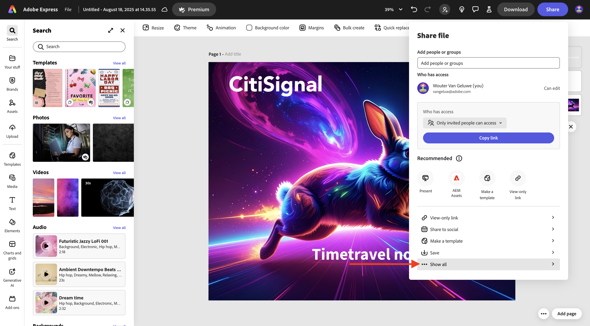
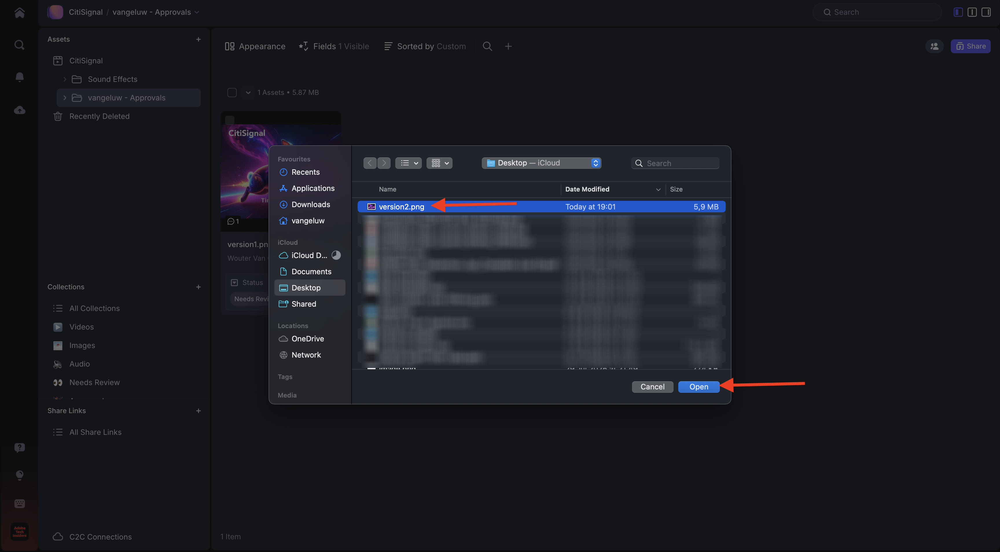

# 1.5.2 Goedkeuringen met Frame.io

>[!NOTE]
>
> In de onderstaande schermafbeelding ziet u een specifieke omgeving die wordt gebruikt. Wanneer u deze zelfstudie doorloopt, is het zeer waarschijnlijk dat uw omgeving een andere naam heeft. Wanneer u zich hebt aangemeld voor deze zelfstudie, hebt u de te gebruiken omgevingsdetails ontvangen. Volg deze instructies.

Om door het goedkeuringswerkschema in Frame.io te lopen, moet u activa hebben. In deze oefening, zult u beginnen door dat middel zelf te creëren gebruikend Adobe Firefly en Adobe Express. Zodra u het middel hebt, zult u het in Frame.io uploaden en dan uiteindelijk goedkeuren.

## 1.5.2.1 Asset maken met Adobe Firefly Services en Adobe Express

Ga naar [&#x200B; https://firefly.adobe.com/ &#x200B;](https://firefly.adobe.com/){target="_blank"}. Ga de herinnering `a neon rabbit running very fast through space` in en klik **produceert**.

Er worden dan verschillende afbeeldingen gegenereerd. Kies het beeld u van de meesten houdt, klik het **pictogram van het Aandeel** op het beeld en selecteer dan **Open in Adobe Express**.

Vervolgens ziet u dat de afbeelding die u zojuist hebt gegenereerd, beschikbaar is in Adobe Express voor bewerking. U moet nu het CitiSignal-logo aan de afbeelding toevoegen. Om dat te doen, ga naar **Banden**.

Vervolgens ziet u een CitiSignal-merksjabloon. die in GenStudio for Performance Marketing is gemaakt, wordt weergegeven in Adobe Express. Klik om een merksjabloon te selecteren die `CitiSignal` in de naam heeft.

Ga naar **Logo&#39;s** en klik het **witte** embleem van het Citisignaal om het op het beeld te laten vallen.

Plaats het CitiSignal-logo boven aan de afbeelding, niet te ver van het midden.

Ga naar **Tekst**.

Klik **toevoegen uw tekst**.

Ga de tekst `Timetravel now!` in, verander de doopvontkleur en de doopvontgrootte, plaats de tekst aan **Vet** zodat u een beeld gelijkend op dit hebt.

Daarna, klik **Aandeel**.

Klik op **.. Alles tonen** .

De rol neer en selecteert **Download**.

Klik **Download**.

Vervolgens hebt u uw middelen op uw lokale computer.

## 1.5.2.2 Uw middel goedkeuren in Frame.io

Ga naar [&#x200B; https://next.frame.io/ &#x200B;](https://next.frame.io/). Controleer of u bent aangemeld bij de omgeving `--aepImsOrgName--` .

Als u niet in het juiste milieu wordt aangemeld, klik het embleem in de bodem linkerhoek en klik om het milieu te selecteren dat u moet gebruiken.

Ga naar uw werkruimte, die `--aepUserLdap--` zou moeten worden genoemd en dan de omslag **CitiSignal** openen. Klik **+** pictogram en selecteer dan **Nieuwe Omslag**.

Geef de map een naam `--aepUserLdap-- - Approvals` . Dubbelklik op de map om deze te openen.

U uploadt nu het bestand dat u in de vorige exercitie hebt gemaakt naar deze map. Klik **uploaden**.

Selecteer het dossier en klik **Open**.

Dan moet je dit hebben. Dubbelklik op het bestand om het te openen.

Schakel het pictogram in om een verankerde opmerking te achterlaten.

Voer een opmerking in, bijvoorbeeld `Change CTA to "Get on board now!"` . Klik **verzenden** pictogram om uw commentaar te delen.

Dan moet je dit hebben. Ga naar **Gebieden**.

Op het **gebied van de Status**, verander de status in **het Overzicht van Behoeften**.

Dan moet je dit hebben. Ga terug naar de map door op de pijl te klikken om terug te gaan.

Klik de 3 punten **..** en selecteer **anders noemen**.

Wijzig de bestandsnaam in `version1.png` .

## 1.5.2.3 Ontwerpwijzigingen aanbrengen in Adobe Express

Ga naar [&#x200B; https://new.express.adobe.com/your-stuff/files &#x200B;](https://new.express.adobe.com/your-stuff/files) en open het beeld u vroeger opnieuw creeerde.

Wijzig de CTA-tekst in `Get On Board Now!` .

Klik **Aandeel** en selecteer dan **Download**.

Klik **Download**.

Vervolgens wordt een nieuwe afbeelding gedownload op uw lokale computer. Wijzig de naam van het bestand in `version2.png` .

## 1.5.2.4 Versie2 in Frame.io goedkeuren

In uw omslag in Frame.io, klik **+** pictogram en selecteer **activa** uploaden.

Selecteer het dossier **version2.png** en klik **Open**.

Daarna, sleep het dossier **version2.png** bovenop het dossier **version1.png**. Met deze handeling wordt het stapelen van versies in Frame.io ingeschakeld.

Dan moet je dit zien.

Klik de 3 punten **..** op het beeld en selecteer dan **Versies** vergelijken.

Vervolgens ziet u deze vergelijkingsweergave waarin beide versies van het bestand worden weergegeven. Ga naar **Gebieden**.

Verander het gebied **Status** aan **Goedgekeurd**.

Dan moet je dit hebben. Klik op het pijlpictogram om terug te gaan naar de mappenweergave.

Klik de 3 punten **..** en selecteer **Download** voor het geval u dit dossier in een andere toepassing zou willen gebruiken.

## Volgende stappen

[&#x200B; 1.5.3 Frame.io en Premiere Pro &#x200B;](./ex3.md){target="_blank"}

Ga terug naar [&#x200B; stroomlijn uw werkschema met Frame.io &#x200B;](./frameio.md){target="_blank"}

Ga terug naar [&#x200B; Alle Modules &#x200B;](./../../../overview.md){target="_blank"}
