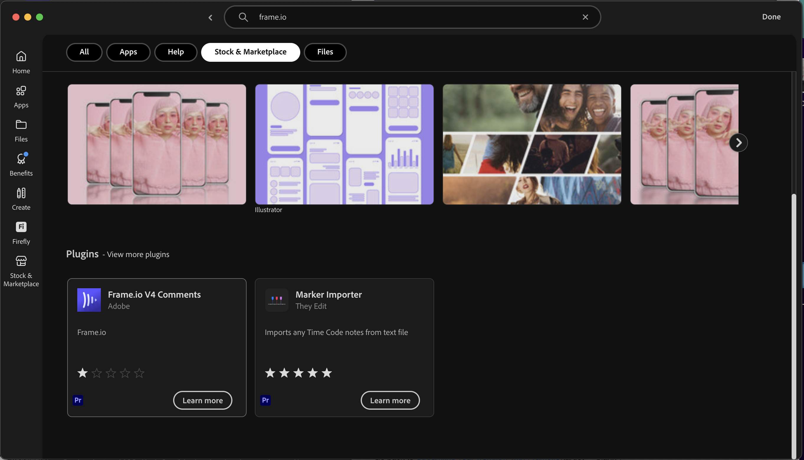

# 1.5.3 Frame.io en Premiere Pro

>[!NOTE]
>
> In de onderstaande schermafbeelding ziet u een specifieke omgeving die wordt gebruikt. Wanneer u deze zelfstudie doorloopt, is het zeer waarschijnlijk dat uw omgeving een andere naam heeft. Wanneer u zich hebt aangemeld voor deze zelfstudie, hebt u de te gebruiken omgevingsdetails ontvangen. Volg deze instructies.

Ga naar [&#x200B; https://next.frame.io/ &#x200B;](https://next.frame.io/). Controleer of u bent aangemeld bij de omgeving `--aepImsOrgName--` .

Als u niet in het juiste milieu wordt aangemeld, klik het embleem in de bodem linkerhoek en klik om het milieu te selecteren dat u moet gebruiken.

## 1.5.3.1 Adobe Premiere Pro Beta instellen

U hebt Adobe Premiere Pro Beta al geïnstalleerd als onderdeel van de module Aan de slag. Als u Frame.io in combinatie met Adobe Premiere Pro Beta wilt gebruiken, kunt u ons de plug-in maken die voor deze integratie is ontwikkeld.

Open de Creative Cloud-toepassing en zoek naar `frame.io` .

De rol neer in de onderzoeksresultaten om de stop te vinden **Frame.io V4 Commentaren**. Klik erop.

Dan moet je dit zien. Klik **installeren**.

Als Adobe Premiere Pro Beta open is, zult u **dicht** het moeten eerst sluiten alvorens u de stop kunt installeren.

Klik **OK**. De plug-in wordt nu geïnstalleerd.

Als de plug-in is geïnstalleerd, opent u Adobe Premiere Pro Beta op uw computer.

## Volgende stappen

Ga naar [&#x200B; Samenvatting &amp; Voordelen &#x200B;](./summary.md){target="_blank"}

Ga terug naar [&#x200B; stroomlijn uw werkschema met Frame.io &#x200B;](./frameio.md){target="_blank"}

Ga terug naar [&#x200B; Alle Modules &#x200B;](./../../../overview.md){target="_blank"}
