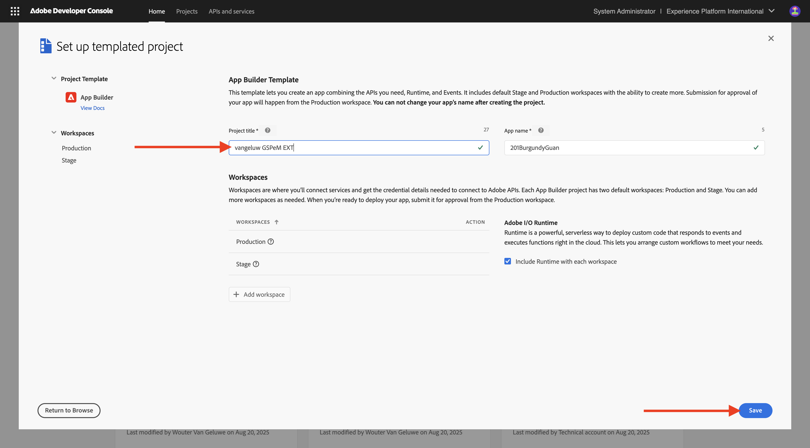

# 1.6.1 Adobe IO en App Builder

## 1.6.1.1 Uw Adobe I/O-project maken

Ga naar [&#x200B; https://developer.adobe.com/console/home &#x200B;](https://developer.adobe.com/console/home){target="_blank"}.

Selecteer de juiste instantie in de rechterbovenhoek van het scherm. Uw instantie is `--aepImsOrgName--` .

>[!NOTE]
>
> In de onderstaande schermafbeelding ziet u een specifieke org die wordt geselecteerd. Wanneer u door dit leerprogramma gaat, is het zeer waarschijnlijk dat uw org een verschillende naam heeft. Wanneer u zich hebt aangemeld voor deze zelfstudie, hebt u de te gebruiken omgevingsdetails ontvangen. Volg deze instructies.

Daarna, uitgezochte **creeer project van malplaatje**.

Selecteer **App Builder**.

Voer de naam `--aepUserLdap-- GSPeM EXT` in. Klik **sparen**.

Dan moet je iets dergelijks zien.

## 1.6.1.2 De ontwikkelomgeving configureren

Als u een uitbreidbare app wilt maken, verzenden en implementeren, moet in uw lokale ontwikkelomgeving de volgende toepassingen en pakketten zijn geïnstalleerd:

- Node.js (versie 20.x of hoger)
- npm (verpakt met Node.js)
- Adobe Developer command-line interface (CLI)

Voer de volgende stappen uit als deze toepassingen of pakketten nog niet op uw computer zijn geïnstalleerd.

### Node.js &amp; npm

Ga naar [&#x200B; https://nodejs.org/en/download &#x200B;](https://nodejs.org/en/download). U zou dit, met een aantal eindbevelen dan moeten zien die moeten worden uitgevoerd om Node.js en npm geïnstalleerd te hebben. De hier getoonde opdrachten zijn van toepassing op MacBook.

Open eerst een nieuw terminalvenster. Plak en voer de opdracht op regel 2 in de schermafbeelding uit:

`curl -o- https://raw.githubusercontent.com/nvm-sh/nvm/v0.40.3/install.sh | bash`

Voer vervolgens de opdracht op regel 5 uit in de schermafbeelding:

`\. "$HOME/.nvm/nvm.sh"`

Nadat beide opdrachten zijn uitgevoerd, voert u deze opdracht uit:

`node -v`

Er wordt een versienummer weergegeven.

Voer vervolgens deze opdracht uit:

`npm -v`

Er wordt een versienummer weergegeven.

Als de laatste 2 bevelen met succes een versieaantal terugkeerde, dan is uw configuratie van deze 2 mogelijkheden succesvol.

### Adobe Developer command-line interface (CLI)

Om Adobe Developer bevel-lijn interface (CLI) te installeren, stel het volgende bevel in een eindvenster in werking:

`npm install -g @adobe/aio-cli`

Het uitvoeren van deze opdracht kan een paar minuten duren. Het eindresultaat moet er ongeveer als volgt uitzien:

De opdrachtregelinterface (CLI) van Adobe Developer is nu ook geïnstalleerd.

U hebt nu de basiselementen ingesteld om een App Builder-project te kunnen uitvoeren.

## Volgende stappen

Ga naar [&#x200B; creeer uw AWS S3 emmertje &#x200B;](./ex2.md){target="_blank"}

Ga terug naar [&#x200B; GenStudio for Performance Marketing - Uitbreidbaarheid &#x200B;](./genstudioext.md){target="_blank"}

Ga terug naar [&#x200B; Alle Modules &#x200B;](./../../../overview.md){target="_blank"}
