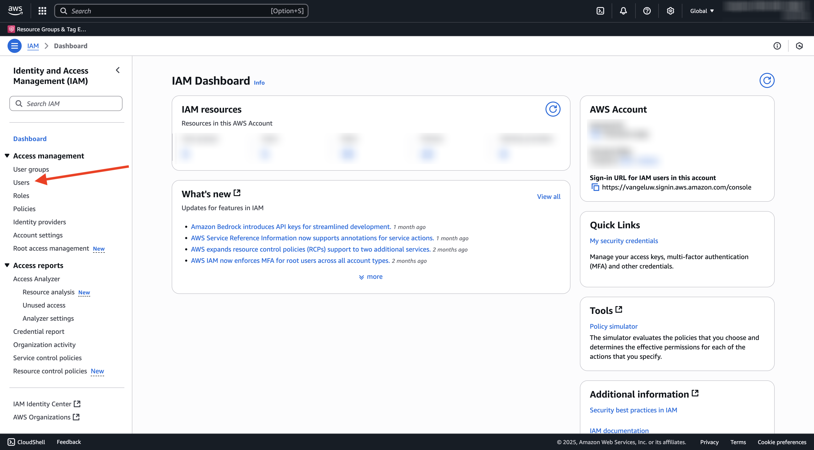
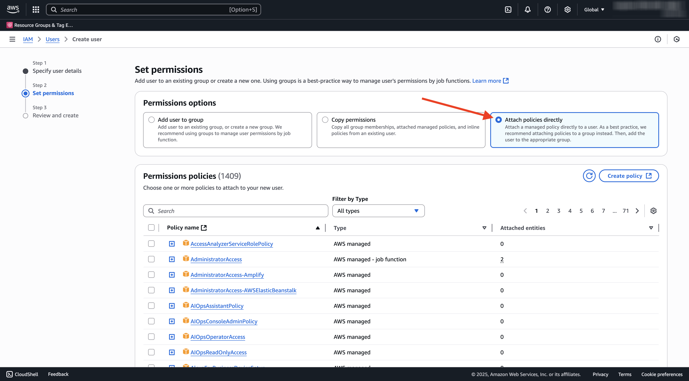
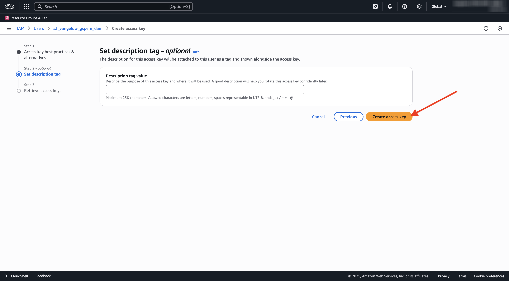
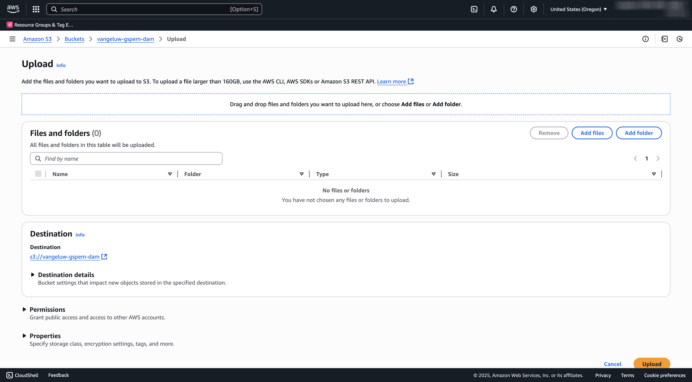

# 1.6.2 Een AWS S3-emmertje maken

## 1.6.2.1 Een S3-emmertje maken

Ga naar [&#x200B; https://console.aws.amazon.com &#x200B;](https://console.aws.amazon.com) en teken binnen.

>[!NOTE]
>
>Als je nog geen AWS-account hebt, maak dan een nieuwe AWS-account aan met je persoonlijke e-mailadres.

Na het programma openen, zult u aan de **Console van het Beheer van AWS** opnieuw worden gericht.

In de onderzoeksbar, onderzoek naar **s3**. Klik het eerste onderzoeksresultaat: **S3 - Schaalbare Opslag in de Wolk**.

U zult dan de **homepage van Amazon S3** zien. Klik **creëren Emmertje**.

In **creeer het 1&rbrace; scherm van het Emmertje &lbrace;, gebruik de naam**.`--aepUserLdap---gspem-dam`

Laat alle andere standaardinstellingen ongewijzigd. De rol neer en klikt **creeert emmer**.

Vervolgens ziet u dat uw emmer is gemaakt en wordt deze omgeleid naar de startpagina van Amazon S3.

## Toestemmingen plaatsen om tot uw S3 emmertje toegang te hebben

De volgende stap is toegang tot uw S3 emmertje te plaatsen.

Om dat te doen, ga naar [&#x200B; https://console.aws.amazon.com/iam/home &#x200B;](https://console.aws.amazon.com/iam/home).

De toegang tot AWS-bronnen wordt beheerd door Amazon Identity and Access Management (IAM).

U ziet deze pagina nu.

In het linkermenu, klik **Gebruikers**. U zult dan het **scherm van Gebruikers** zien. Klik **creëren gebruiker**.

Configureer vervolgens de gebruiker:

- Gebruikersnaam: gebruik `s3_--aepUserLdap--_gspem_dam`

Klik **daarna**.

U zult dan dit toestemmingenscherm zien. Klik **beleid van de Band direct**.

Ga de onderzoekstermijn **s3** in om al verwant S3 beleid te zien. Selecteer het beleid **AmazonS3FullAccess**. De rol neer en klikt **daarna**.

Controleer uw configuratie. Klik **creëren Gebruiker**.

Dan zie je dit. Klik **Gebruiker van de Mening**.

Klik **geloofsbrieven van de Veiligheid** en klik dan **creeer toegangssleutel**.

Selecteer **Toepassing die buiten AWS** loopt. De rol neer en klikt **daarna**.

Klik **creëren toegangssleutel**

Dan zie je dit. Klik **tonen** om uw Geheime toegangstoets te zien:

Uw **Geheime toegangssleutel** wordt nu getoond.

>[!IMPORTANT]
>
>Sla uw gegevens op in een tekstbestand op uw computer.
>
> - Toegang sleutel-id: ...
> - Geheime toegangssleutel: ...
>
> Zodra u **Gedaan** klikt zult u uw geloofsbrieven nooit meer zien!

Klik **Gedaan**.

U hebt nu een AWS S3 emmertje met succes gecreeerd en u hebt een gebruiker met toestemmingen gecreeerd om tot dit emmertje toegang te hebben.

## 1.6.2.2 Assets uploaden naar uw S3-emmertje

In de onderzoeksbar, onderzoek naar **s3**. Klik het eerste onderzoeksresultaat: **S3 - Schaalbare Opslag in de Wolk**.

Klik om het nieuwe S3 emmertje te openen, dat `--aepUserLdap---gspem-dam` zou moeten worden genoemd.

Klik **uploaden**.

Dan moet je dit zien.

U kunt CitiSignal beelddossiers [&#x200B; hier downloaden &#x200B;](./images/package.zip){target="_blank"}.

Exporteer de bestanden naar uw bureaublad.

Klik **toevoegen Omslag**.

Selecteer de omslag **activa** van het pakket van de downloadomslag **&#x200B;**. Klik **uploaden**.

Dan moet je dit zien. Klik **voeg opnieuw Omslag** toe.

Selecteer de omslag **duimnagels** van het pakket van de downloadomslag **&#x200B;**. Klik **uploaden**.

Dan moet je dit zien. Klik **uploaden**.

Het uploaden is nu voltooid. Klik **dicht**.

U zou deze omslagstructuur in uw S3 emmertje nu moeten hebben.

## Volgende stappen

Ga naar [&#x200B; creeer uw externe toepassing DAM &#x200B;](./ex3.md){target="_blank"}

Ga terug naar [&#x200B; GenStudio for Performance Marketing - Uitbreidbaarheid &#x200B;](./genstudioext.md){target="_blank"}

Ga terug naar [&#x200B; Alle Modules &#x200B;](./../../../overview.md){target="_blank"}
