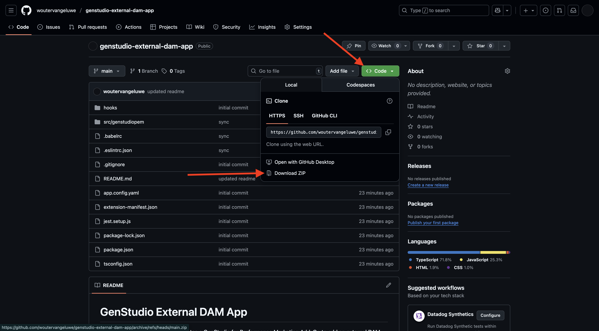

# 1.6.3 Een externe DAM-app maken en implementeren

## 1.6.3.1 Download voorbeeldbestanden voor de app

Ga naar [ https://github.com/woutervangeluwe/genstudio-external-dam-app ](https://github.com/woutervangeluwe/genstudio-external-dam-app). Klik **Code** en selecteer dan **ZIP van de Download**.



Pak het ZIP-bestand uit op uw bureaublad.


## 1.6.3.2 De Adobe Developer-opdrachtregelinterface configureren

Klik met de rechtermuisknop op de **genstudio-extern-dam-app-main** omslag en selecteer **Nieuwe Terminal bij Omslag**.


Dan moet je dit zien. Voer de opdracht `aio login` in. Deze opdracht wordt omgeleid naar uw browser en u wordt verwacht dat u zich aanmeldt.


Na succesvolle login, zou u dit in browser moeten zien.


De browser zal dan naar het eindvenster opnieuw richten. U zou een bericht moeten zien dat **succesvolle Login** en een lang teken zegt dat door browser is teruggekeerd.


De volgende stap bestaat uit het configureren van de instantie en het Adobe IO-project dat u wilt gebruiken voor de externe DAM-app.

Hiervoor moet u een bestand downloaden van het Adobe IO-project dat u eerder hebt geconfigureerd.

Ga naar [ https://developer.adobe.com/console/home ](https://developer.adobe.com/console/home){target="_blank"} en open het project u eerder creeerde, dat `--aepUserLdap-- GSPeM EXT` wordt genoemd. Open de **Werkruimte van de Productie**.


Klik **Download allen**. Hiermee wordt een JSON-bestand gedownload.


Kopieer het JSON- dossier van uw **Downloads** folder in de wortelfolder van externe DAM app.


Ga terug naar uw eindvenster. Voer de opdracht `aio app use XXX-YYY-Production.json` in.

>[!NOTE]
>
>U moet de naam van het bestand in de bovenstaande opdracht wijzigen, zodat deze overeenkomt met de naam van het bestand.

Nadat de opdracht is uitgevoerd, wordt uw externe DAM-toepassing nu verbonden met het eerder gemaakte Adobe IO-project met App Builder.


## 1.6.3.3 Installeer de GenStudio Extenability SDK

Daarna, moet u **SDK van de Uitbreidbaarheid van GenStudio** installeren. U kunt meer details over SDK hier vinden: [ https://github.com/adobe/genstudio-extensibility-sdk ](https://github.com/adobe/genstudio-extensibility-sdk).

Als u de SDK wilt installeren, voert u deze opdracht uit in uw terminalvenster:

`npm install @adobe/genstudio-extensibility-sdk`


Na een paar minuten wordt de SDK geïnstalleerd.


## 1.6.3.4 Controleer de externe DAM-toepassing in Visual Studio Code

Open Visual Studio Code. Klik **Open...** om een omslag te openen.


Selecteer de omslag **genstudio-extern-dam-app-main** die app bevat u vóór downloadde. Klik **Open**.


Klik om het bestand **.env** te openen.


Het bestand **.env** is gemaakt met de opdracht `aio app use` die u in de vorige stap hebt uitgevoerd en bevat de informatie die nodig is om verbinding te maken met uw Adobe IO-project met App Builder.


U moet nu de volgende details toevoegen aan het bestand **.env** , zodat de externe DAM-toepassing verbinding kan maken met de eerder gemaakte AWS S3-emmertje.

```
AWS_ACCESS_KEY_ID=
AWS_SECRET_ACCESS_KEY=
AWS_REGION=
AWS_BUCKET_NAME=
```

Het veld **`AWS_ACCESS_KEY_ID`** en **`AWS_SECRET_ACCESS_KEY`** waren beschikbaar nadat de IAM-gebruiker in de vorige exercitie was gemaakt. U werd gevraagd om hen neer te schrijven, kunt u nu de waarden kopiëren.


Het veld **`AWS_REGION`** kan naast de naam van het emmertje uit de weergave AWS S3 Home worden genomen. In dit voorbeeld, is het gebied **us-west-2**.


Het veld **`AWS_BUCKET_NAME`** moet `--aepUserLdap---gspem-dam` zijn.

Met deze informatie kunt u de waarden van elk van deze variabelen bijwerken.

```
AWS_ACCESS_KEY_ID=XXX
AWS_SECRET_ACCESS_KEY=YYY
AWS_REGION=us-west-2
AWS_BUCKET_NAME=--aepUserLdap---gspem-dam
```

U moet deze tekst nu in beide bestanden plakken, `.env.dev` en `.env.prod` . Vergeet niet uw wijzigingen op te slaan.


Ga vervolgens terug naar uw terminalvenster. Voer deze opdracht uit:

`export $(grep -v '^#' .env | xargs)`


Ten slotte moet u het label wijzigen dat in GenStudio for Performance Marketing wordt weergegeven, zodat u uw externe DAM-toepassing kunt onderscheiden van andere integraties. Om dat te doen, open het dossier **Constants.ts** dat u kunt vinden door neer in ontdekkingsreiziger te boren aan **src/genstudiopem > web-src > src**.

Regel 14 moet worden gewijzigd in

`export const extensionLabel: string = "--aepUserLdap-- - External S3 DAM";`

Vergeet niet uw wijzigingen op te slaan.


## 1.6.3.5 De externe DAM-app uitvoeren

Voer de opdracht `aio app run` uit in uw terminalvenster. U moet dit na 1-2 minuten zien.


U hebt nu bevestigd dat uw app wordt uitgevoerd. De volgende stap is het opstellen.

Eerst, duw **CTRL+C** om app tegen het lopen te houden. Voer vervolgens de opdracht `aio app deploy` in. Met deze opdracht wordt uw code geïmplementeerd op Adobe IO.

Dientengevolge, zult u een gelijkaardige URL ontvangen om tot uw opgestelde toepassing toegang te hebben:

`https://133309-201burgundyguan.adobeio-static.net/index.html`


Voor testdoeleinden kunt u die URL nu gebruiken als parameter voor een querytekenreeks door `?ext=` als voorvoegsel toe te voegen aan de bovenstaande URL. Dit resulteert in deze parameter van het vraagkoord:

`?ext=https://133309-201burgundyguan.adobeio-static.net/index.html`

Ga naar [ https://experience.adobe.com/genstudio/create ](https://experience.adobe.com/genstudio/create).


Voeg vervolgens de parameter voor de querytekenreeks toe vlak voor **#** . Uw nieuwe URL moet er als volgt uitzien:

`https://experience.adobe.com/?ext=https://133309-201burgundyguan.adobeio-static.net/index.html#/@experienceplatform/genstudio/create`

De pagina wordt normaal geladen. Klik **Banners** beginnen een nieuwe banner te creëren.


Selecteer een malplaatje en klik **Gebruik**.


Klik **Uitgezocht van inhoud**.


Vervolgens kunt u de externe DAM selecteren. Deze krijgt de naam `--aepUserLdap-- - External S3 DAM` uit de vervolgkeuzelijst.


Dan moet je dit zien. Selecteer het beeld **neon_rabbit_banner.jpg** en klik **Gebruik**.


U hebt nu een afbeelding uit uw externe DAM geselecteerd die in een S3-emmertje wordt uitgevoerd. Als de afbeelding is geselecteerd, kunt u nu de normale workflow volgen die wordt beschreven in [1.3.3.4 Meta-advertentie maken en goedkeuren ](./../module1.3/ex3.md#create--approve-meta-ad) .


Wanneer u wijzigingen aanbrengt in de code op uw lokale computer, moet u uw app opnieuw implementeren. Wanneer u herstelt, gebruik dit eindbevel:

`aio app deploy --force-build --force-deploy`


Uw app is nu klaar om te worden gepubliceerd.

## Volgende stappen

Ga naar [ publiceer uw app privé ](./ex4.md){target="_blank"}

Ga terug naar [ GenStudio for Performance Marketing - Uitbreidbaarheid ](./genstudioext.md){target="_blank"}

Ga terug naar [ Alle Modules ](./../../../overview.md){target="_blank"}
