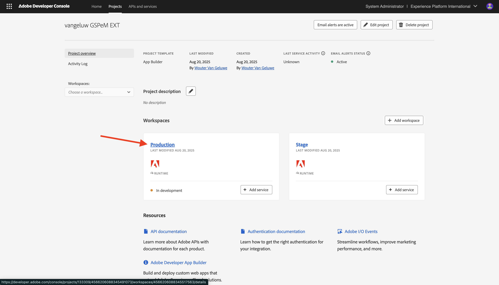

# 1.6.4 Implementeer uw code en publiceer uw app persoonlijk

Als u uw app privé publiceert, is uw app beschikbaar in GenStudio for Performance Marketing zonder dat u de parameter voor de queryreeks hoeft te gebruiken.

## 1.6.4.1 Uw app publiceren

Ga naar [&#x200B; https://developer.adobe.com/console/projects &#x200B;](https://developer.adobe.com/console/projects){target="_blank"}.

>[!NOTE]
>
> In de onderstaande schermafbeelding ziet u een specifieke org die wordt geselecteerd. Wanneer u door dit leerprogramma gaat, is het zeer waarschijnlijk dat uw org een verschillende naam heeft. Wanneer u zich hebt aangemeld voor deze zelfstudie, hebt u de te gebruiken omgevingsdetails ontvangen. Volg deze instructies.

Open het Adobe IO-project met App Builder, die de naam `--aepUserLdap-- GSPeM EXT` zou moeten hebben.

Ga naar **Productie**.

Klik **publiceren privé**.

Vervolgens moet u een aantal velden invullen.

Vul de volgende velden als volgt in:

- **Titel van toepassing**: `--aepUserLdap-- - External DAM AWS S3`.
- **Beschrijving van toepassing**: `External DAM AWS S3`
- **E-mail van het Contact**: ga uw e-mailadres in
- **Pictogram van de Toepassing**: download en gebruik dit beeld: [&#x200B; S3 beeld &#x200B;](./images/s3.jpeg)
- **Nota aan recensent**: Externe DAM AWS S3

Klik **voorleggen**.

Klik **voorleggen**.

## 1.6.4.2 Uw app goedkeuren

>[!IMPORTANT]
>
>Deze stap kan slechts door de Beheerders van het Systeem in Adobe Admin Console worden uitgevoerd. Als u geen Beheerder van het Systeem bent, zult u niet dit kunnen uitvoeren. Neem contact op met uw systeembeheerder om goedkeuring van uw toepassing aan te vragen.

Zodra een ontwikkelaar een nieuwe app voor publicatie indient, zullen de systeembeheerders van uw org op de hoogte worden gesteld en worden gevraagd deze te beoordelen en goed te keuren.

Als u een systeembeheerder bent, zult u deze e-mail ontvangen en dan kunt u **Mijn Uitwisseling** klikken om dat proces te beginnen.

Op **Adobe Exchange**, worden de toepassingen van App Builder getoond en app die enkel werd voorgelegd is nu in afwachting van een overzicht. Klik de **knoop van het Overzicht** voor app `--aepUserLdap-- - External DAM AWS S3`.

Voeg in een commentaar toe en klik **goedkeuren**.

Uw app is nu goedgekeurd en werkt automatisch in GenStudio for Performance Marketing, zonder dat u de parameter voor de queryreeks hoeft op te geven.

## Volgende stappen

Ga naar [&#x200B; Samenvatting &amp; Voordelen &#x200B;](./summary.md){target="_blank"}

Ga terug naar [&#x200B; GenStudio for Performance Marketing - Uitbreidbaarheid &#x200B;](./genstudioext.md){target="_blank"}

Ga terug naar [&#x200B; Alle Modules &#x200B;](./../../../overview.md){target="_blank"}
