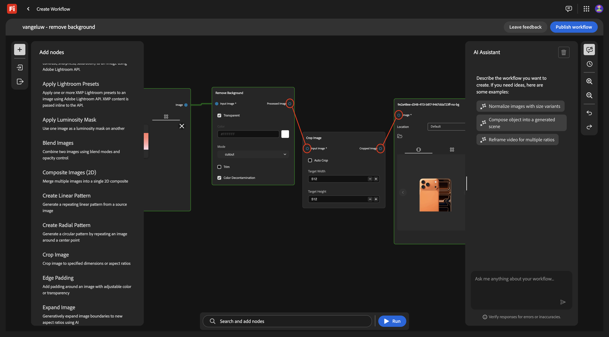
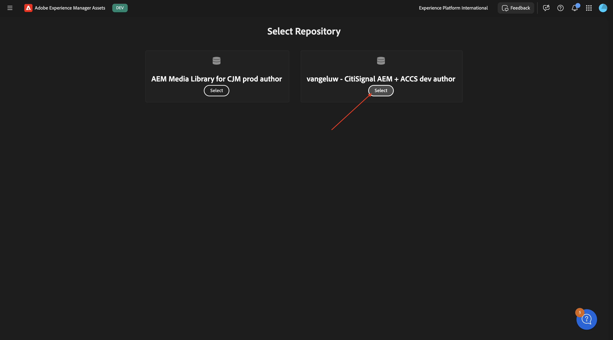
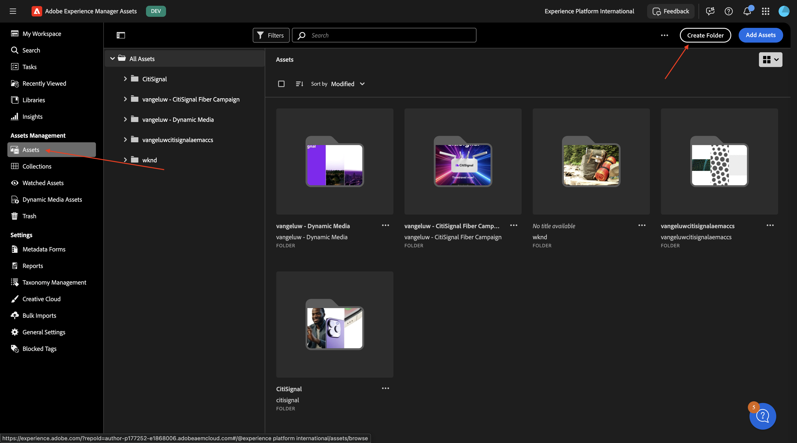
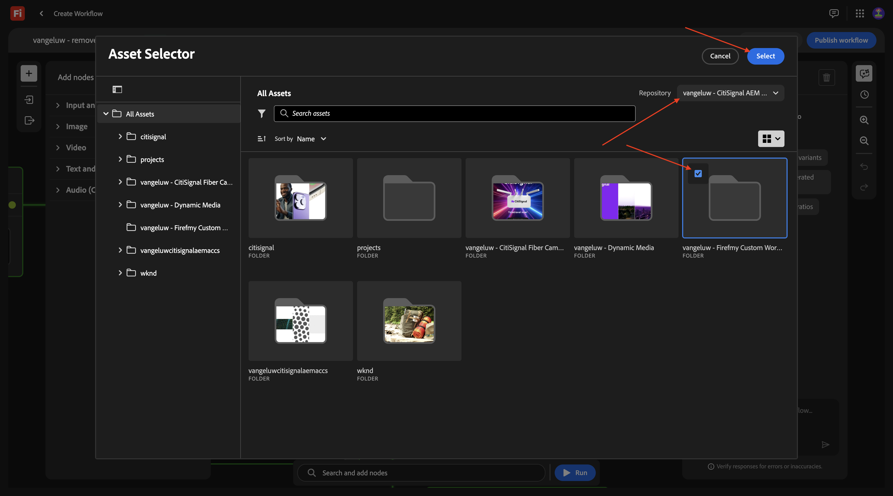

# 1.7.1 Aan de slag met aangepaste Firefly-workflows

[!BADGE Bèta]

+++Beta-gegevens
Door de Firefly Custom Workflows Beta te gebruiken, bevestigt u hierbij dat de Beta &quot;as is&quot; wordt geleverd zonder enige garantie. Adobe is niet verplicht de Beta te onderhouden, te corrigeren, bij te werken, te wijzigen, te wijzigen of anderszins te ondersteunen. U wordt aangeraden voorzichtig te zijn en op geen enkele wijze te vertrouwen op de juiste werking of prestaties van dergelijke Beta en/of begeleidende materialen. De Beta wordt beschouwd als vertrouwelijke informatie van Adobe.  Alle &quot;Feedback&quot; (informatie over de Beta, inclusief maar niet beperkt tot problemen of defecten die u tegenkomt bij het gebruik van de Beta, suggesties, verbeteringen en aanbevelingen) die u aan Adobe verstrekt, worden hierbij aan Adobe toegewezen, inclusief alle rechten, titel en interesse in en voor dergelijke feedback.

+++

Ga naar [&#x200B; https://firefly.adobe.com &#x200B;](https://firefly.adobe.com). Klik op het profielpictogram in de rechterbovenhoek en controleer of u de juiste instantie hebt geselecteerd, die `--aepImsOrgName--` moet zijn.

Ga naar **Productie**.

Dan moet je dit zien. Klik **creeer werkschema (bèta)**.

## 1.7.1.1 Achtergrond verwijderen

Om de aangepaste workflows van Firefly te leren kennen, implementeert u nu een standaardpraktijkgeval dat gericht is op het verwijderen van de achtergrond van een specifieke afbeelding.

Wijzig de naam van de workflow in `vangeluw - remove background` .

Open het **Beeld**

Selecteer **verwijderen Achtergrond**, dan belemmering en laat vallen deze knoop op het canvas.

U moet nu een knoop van het inputbeeld en een knoop van het outputbeeld met **verbinden verwijdert Achtergrond**.

De rol omhoog en gaat naar **Input en Output**. Klik de **knoop van de Beelden van de Input** en sleep het op het canvas.

Dan moet je dit hebben. Verbind de **knoop van de Beelden van de Input** met **verwijder Achtergrond** knoop door over de blauwe punt naast **Beeld** op de **7&rbrace; knoop van de Beelden van de Input, en tekenend een lijn aan de blauwe punt naast** Beeld van de Input **op** verwijdert Achtergrond **knoop.**

Dan moet je dit hebben. Daarna, klik de **knoop van de Beelden van de Output** en sleep het op het canvas.

Dan moet je dit hebben. Verbind de **verwijder Achtergrond** knoop met de **3&rbrace; knoop van de Beelden van de Output door over de blauwe punt naast** Beeld van de Output **op** verwijdert Achtergrond **knoop, en tekenend een lijn aan de blauwe punt naast** Beeld **op de** knoop van de Beelden van de Output **.**

Dan moet je dit hebben.

Uw basisworkflow kan nu worden getest. Download het beeld [&#x200B; phone.png &#x200B;](./assets/phone.png) aan uw Desktop.

Ga terug naar uw workflow. Klik het **belemmering en dalings** gebied van de **3&rbrace; knoop van de Beelden van de Input &lbrace;.**

Selecteer het dossier **phone.png**. Klik **Open**.

Dan moet je dit zien. Klik **Looppas**.

Na 1-2 minuten moet dit resultaat zichtbaar zijn.

## 1.7.1.2 Achtergrond verwijderen + Uitsnijden

U zou a **knoop van het Gewas {nu moeten toevoegen 0} &lbrace;aan het canvas.** In het menu, ga naar **Beeld** en scrol neer om **Uitsnijden** te vinden. Sleep het naar het canvas.

Plaats de **knoop van het Gewas** tussen **verwijdert Achtergrond** knoop en de **knoop van het Beeld van de Output**.

U moet nu de verbinding tussen **verwijderen verwijdert Achtergrond** knoop en de **knoop van het Beeld van de Output**. U kunt dat doen door op de lijn tussen beide knooppunten te dubbelklikken.

Dan moet je dit hebben. Verbind **Achtergrond** knoop aan de **knoop van het Gewas** verwijdert, en sluit dan de **knoop van het Gewas** aan de **knoop van het Beeld van de Output** aan.

Controle checkbox aan **AutoUitsnijden**, en dan kunt u uw werkschema testen door **Looppas** te klikken.

Na 1-2 minuten, zou u dit moeten zien, die een beeld met een verschillende resolutie nu toont.

## 1.7.1.3 Achtergrond verwijderen + Uitsnijden + Samengestelde afbeelding

In het menu, onder **Beeld** selecteer a **Samengestelde Beelden (2D)** knoop en sleep het op het canvas.

Voeg een tweede verbinding aan de **knoop van het Gewas** toe, door de blauwe punt naast **Uitgesneden beeld** aan de blauwe punt naast **beeld van de Input** op de **Samengestelde Beelden (2D)** knoop aan te sluiten.

In het menu, onder **Input en Output**, selecteer een **3&rbrace; knoop van de Tekst van de Input &lbrace;en sleep het op het canvas.**

Verbind de groene punt naast **Tekst** op de **3&rbrace; knoop van de Tekst van de Input &lbrace;met de groene punt naast** Herinnering **op de** Samengestelde Beelden (2D) **knoop.**

Dan moet je dit hebben. Ga hieronder herinnering in de **knoop van de Tekst van de Input** in.

`magazine quality photo of a phone on a red pedestal with a pink background surrounded by origami style pink paper hearts`

In het menu, onder **Input en Output**, selecteer een **knoop van de Beelden van de Output** en sleep het op het canvas.

Verbind de blauwe punt naast **Samengesteld beeld** op de **Samengestelde Beelden (2D)** knoop met de blauwe punt naast **beeld van de Input** op de **knoop van het Beeld van de Output**.

Klik **Looppas**.

Na een paar minuten, zou u iets als dit moeten zien, die uw originele beeld in een samenstelling toont die op de herinnering wordt gebaseerd die, in een specifieke resolutie werd verstrekt.

## 1.7.1.4 Achtergrond verwijderen + Uitsnijden + Samengestelde afbeelding + Video genereren

In het menu, ga naar **Video**. Selecteer **produceer Video** knoop en sleep het op het canvas.

Verbind de blauwe punt naast **Samengesteld beeld** van de **Samengestelde Beelden (2D)** knoop met de blauwe punt naast **beeld van de Input** van **produceer Video** knoop.

In het menu, ga naar **Input en Output**. Selecteer de **knoop van de Tekst van de Input** en sleep het op het canvas.

Verbind de groene punt naast **Tekst** op de **3&rbrace; knoop van de Tekst van de Input &lbrace;aan de groene punt naast** Herinnering **van** produceer Video **knoop.**

Ga de herinnering `background hearts fluttering` in de **tekst van de Input** knoop in.

In het menu, ga naar **Input en Output**. Selecteer de **Video van de Output** knoop en sleep het op het canvas.

Verbind de paarse punt naast **VideoOutput** van **produceer Video** knoop aan de paarse punt naast **Video** op de **Video van de Output** knoop.

Klik **Looppas**.

Na een paar video&#39;s, zou u dit moeten zien die een video toont die op de combinatie van het verstrekte beeld en de herinnering wordt gebaseerd.

## 1.7.1.5 Schalen

U hebt dit nu gedaan voor 1 afbeelding. Laten we deze workflow nu gebruiken, maar voor meerdere afbeeldingen.

Download deze afbeeldingen naar uw bureaublad:

- [&#x200B; watch.jpg &#x200B;](./assets/watch.jpg)
- [&#x200B; airpods.jpg &#x200B;](./assets/airpods.jpg)

In uw werkschema, ga terug naar de eerste knoop, **Beelden van de Input**. Verwijder de momenteel geselecteerde afbeelding.

Klik het **belemmering en dalings** gebied.

Selecteer de 3 afbeeldingen die u hebt gedownload. Klik **Open**.

Dan moet je dit zien. klik **Looppas**.

Na enkele minuten ziet u een vergelijkbare uitvoer, met 3 afbeeldingen die worden gegenereerd en 3 video&#39;s.

## 1.7.1.5 Opslaan in AEM Assets CS

In deze oefening, zult u de activa opslaan die als deel van uw douanewerkschema in AEM Assets CS worden gecreeerd.

Maak eerst een nieuwe map in de AEM Assets CS-omgeving.

Om dat te doen, ga naar [&#x200B; https://experience.adobe.com &#x200B;](https://experience.adobe.com). Klik om **Experience Manager Assets** te openen.

Selecteer de AEM Assets CS-omgeving met de naam `--aepUserLdap-- - CitiSignal AEM + ACCS` .

Ga naar **Assets** en klik **creeer Omslag**.

Voer de naam in: `--aepUserLdap-- - Firefly Custom Workflows`. Klik **creëren**.

Ga terug naar uw douanewerkschema en ga naar de **knoop van de Beelden van de Output**. Klik **Gebrek** en selecteer dan **AEM Assets**.

Dan zie je deze popup. Selecteer uw AEM Assets CS-opslagplaats en selecteer vervolgens de map die u net hebt gemaakt en die u de volgende naam moet geven: `--aepUserLdap-- - Firefly Custom Workflows` . Klik **Uitgezocht**.

Ga naar de **Video van de Output** knoop. Klik **Gebrek** en selecteer dan **AEM Assets**.

Dan zie je deze popup. Selecteer uw AEM Assets CS-opslagplaats en selecteer vervolgens de map die u net hebt gemaakt en die u de volgende naam moet geven: `--aepUserLdap-- - Firefly Custom Workflows` . Klik **Uitgezocht**.

Dan moet je dit hebben. Klik **Looppas**.

Na een paar minuten worden de gemaakte middelen beschikbaar in de map in AEM Assets CS.

## Volgende stappen

Ga terug naar [&#x200B; Bouwer van het Werkschema &#x200B;](./workflowbuilder.md){target="_blank"}

Ga terug naar [&#x200B; Alle Modules &#x200B;](./../../../overview.md){target="_blank"}
