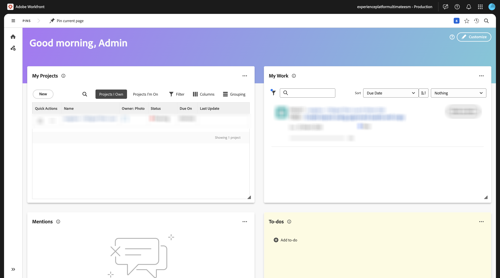
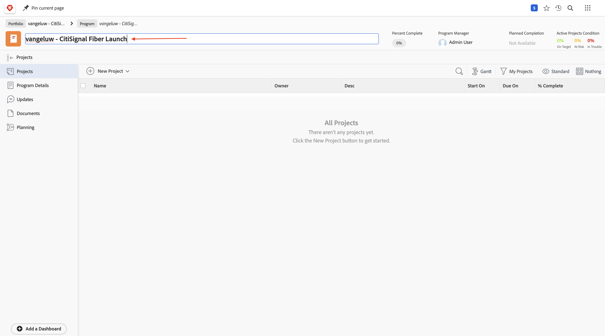
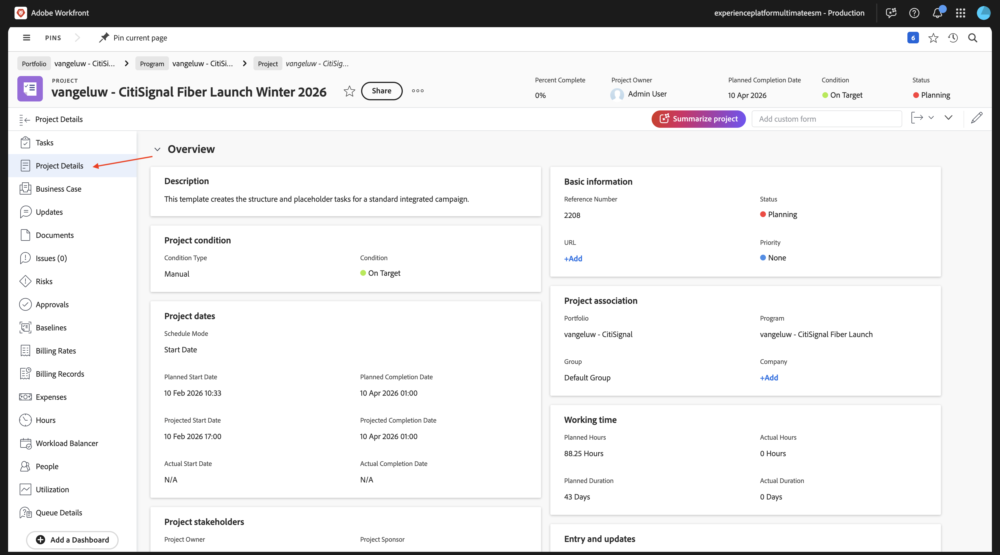
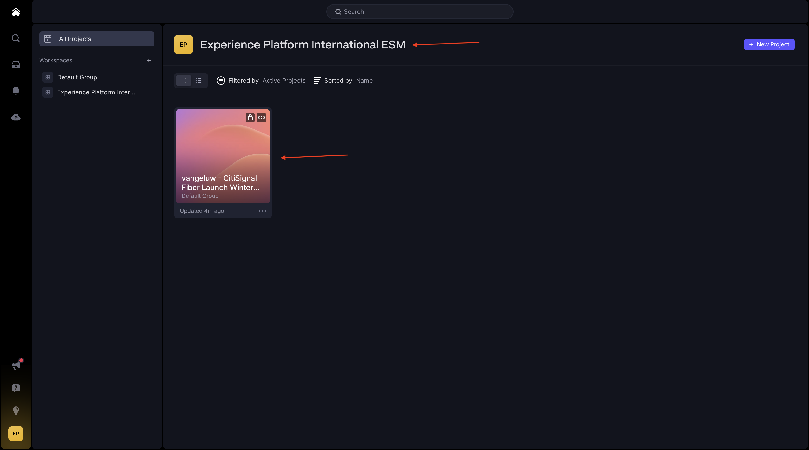
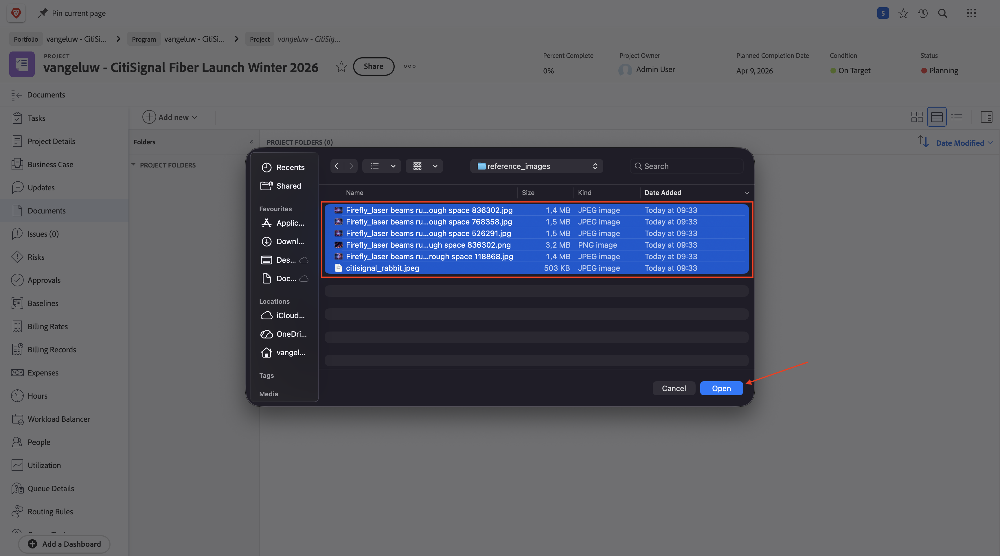

# 1.8.1 Aan de slag met Workfront, Frame.io en ESM

## 1.8.1.1 Workfront Workflow Terminology

Hier volgen de belangrijkste Workfront-objecten en -concepten:

| Naam | Laatste update |
| ---------------------- | ------------ | 
| Portfolio | Een verzameling projecten met verenigende kenmerken. Deze projecten concurreren doorgaans met dezelfde middelen, hetzelfde budget of dezelfde tijd. |
| Programma | Een subset binnen een portefeuille, waar soortgelijke projecten kunnen worden gegroepeerd om een welomschreven voordeel te behalen. |
| Project | Een groot deel van de werkzaamheden moet binnen een bepaald tijdsbestek worden voltooid en moet een specifiek budget en een bepaald aantal middelen gebruiken. Om het beheersbaar te maken, verdeelt u het project in een reeks taken. Als u alle taken uitvoert, wordt het project voltooid. |
| Projectsjabloon | U kunt projectmalplaatjes gebruiken om de meeste herhaalbare processen, informatie, en montages te vangen verbonden aan de projecten in uw organisatie. Na het creëren van malplaatjes, kunt u hen aan bestaande projecten vastmaken, of u kunt hen gebruiken om nieuwe projecten te bouwen. |
| Taak | Een activiteit die als stap naar het bereiken van een definitief doel (het voltooien van het Project) moet worden uitgevoerd. Taken kunnen nooit zelfstandig bestaan. Ze maken altijd deel uit van een project. |
| Toewijzing | Een gebruiker, taakrol of team die is toegewezen aan een uitgave of een taak. Projecten, portfolio&#39;s of programma&#39;s kunnen geen toewijzingen hebben. |
| Document/versie | Elk bestand dat binnen Workfront aan een object is gekoppeld. Telkens wanneer hetzelfde document naar hetzelfde object wordt geüpload, wordt er een versienummer aan toegewezen. Gebruikers kunnen verschillende opties voor een vorige versie van een document weergeven en wijzigen. |
| Goedkeuring | Een bepaald het werkpunt, zoals een taak, een document, of een timesheet, kunnen vereisen dat een supervisor of een andere gebruiker weg op het het werkpunt ondertekent. Dit proces van het ondertekenen van weg wordt genoemd goedkeuring. |

Ga naar [ https://experience.adobe.com/ ](https://experience.adobe.com/){target="_blank"}. Klik om **Workfront** te openen.

Dan zie je dit.

## 1.8.1.2 Workfront-vervaging inschakelen

In de volgende stap maakt u een nieuw project met een sjabloon. Adobe Workfront biedt u een aantal beschikbare blauwdrukken die u alleen moet activeren.

Voor het gebruiksgeval van CitiSignal, is de blauwdruk **Geïntegreerde Uitvoering van de Campagne** één u moet gebruiken.

Om die blauwdruk te installeren, open het menu en selecteer **Vervagen**.

Selecteer de filter **Marketing** en scrol neer om de blauwdruk **Geïntegreerde Uitvoering van de Campagne** te vinden. Klik **installeren**.

Klik **verdergaan**.

Verander de **Naam van het Malplaatje van het Project** in `--aepUserLdap-- - Integrated Campaign Execution`.

Klik **installeer Vervaging**.

Na een paar minuten wordt de blauwdruk geïnstalleerd.

## 1.8.1.3 Een nieuw project maken

Open het **menu** en ga naar **Porftolios**.

Klik **+ Nieuwe Portfolio**.

Voer de naam van het portfolio in `--aepUserLdap-- - CitiSignal` .

Ga naar **Programma&#39;s** en klik **+ Nieuw Programma**. Selecteer **Nieuw Programma**.

Voer de programmanaam in: `--aepUserLdap-- - CitiSignal Fiber Launch`.

In uw programma, ga naar **Projecten**. Klik **+ Nieuw Project** en selecteer dan **Nieuw Project van Malplaatje**.

Selecteer het malplaatje `--aepUserLdap-- - Integrated Campaign Execution` en klik **malplaatje van het Gebruik**.

Dan moet je dit zien. Verander de naam in `--aepUserLdap-- - CitiSignal Fiber Launch Winter 2026` en klik **creeer project**.

Uw project is nu gemaakt. Ga naar **Details van het Project**.

Ga naar **Details van het Project**. Klik om de huidige tekst onder **Beschrijving** te selecteren.

De beschrijving instellen op `The CitiSignal Fiber Launch project is used to plan the upcoming launch of CitiSignal Fiber.`

Klik **sparen Veranderingen**.

Uw project is nu klaar om te worden gebruikt.

De taken en gebiedsdelen in het project zijn gecreeerd gebaseerd op het malplaatje dat u koos en u is geplaatst als. eigenaar van het project. Het statuut van het project is geplaatst aan **Planning**. U kunt de status van het project wijzigen door een andere waarde in de lijst te selecteren.

## 1.8.1.4 Projectweergave in Frame.io

Ga naar [ https://next.frame.io/ ](https://next.frame.io/){target="_blank"}. Login, en selecteer de instantie aan gebruik, in dit voorbeeld **Experience Platform Internationaal ESM**. U zult merken dat een omslag reeds in Frame.io voor het project bestaat dat u enkel creeerde. De map krijgt de naam van het project dat u eerder hebt ingevoerd.

Dit is een functie van Enterprise Storage Management, een op cloud gebaseerde opslagoplossing die fungeert als centrale opslagplaats voor bedrijfsmiddelen in Adobe, waaronder Workfront en Frame.io.

De belangrijkste voordelen van Adobe Enterprise Storage zijn:

- Geïntegreerde opslaglaag voor creatieve middelen en bedrijfsbeheermiddelen
- Gecentraliseerde machtigingen via het Adobe Identity Management-systeem (IMS) voor veilig toegangsbeheer
- De zichtbaarheid van end-to-end middelen in Workfront en Frame.io
- Schaalbare opslag en quotabeheer voor bedrijfsbehoeften

## 1.8.1.5 Een nieuwe taak maken

Ga terug naar Workfront. Ga naar **Taken**, houd over de taak **beginnen om de Malplaatjes van het Ontwerp** tot stand te brengen en de 3 punten **te klikken...**.

Selecteer de optie **Taak van het Tussenvoegsel onder**.

Voer deze naam in voor uw taak: `Create layout using approved assets and copy` .

Plaats de gebied **Taken** aan de rol **Designer**.
Plaats de gebied **Duur** aan **5 dagen**.
Plaats het gebiedsvoorganger aan **9**.
Ga een datum voor de gebieden **Begin op** en **Geldig op** in (de begindatum van deze taak zou na de einddatum van de vorige taak moeten worden gepland).

Klik ergens anders op het scherm om de nieuwe taak op te slaan.

Dan moet je dit zien. Klik op de taak om deze te openen.

Ga naar **taakdetails** en plaats het gebied **Beschrijving** aan: `This task is used to track the progress of the creation of the assets for the CitiSignal Fiber Launch Campaign.`

Klik **sparen Veranderingen**.

Dan moet je dit zien. Klik het **gebied van Taken** en selecteer **toewijzen aan me**.

Klik **sparen**.

Klik **Werk op het**.

Dan moet je dit zien.

In het kader van deze taak moet een nieuw middel worden gecreëerd. In de volgende stap geeft u eerst referentieafbeeldingen op in Workfront, zodat de ontwerper weet wat er wordt verwacht. Vervolgens verandert u de rol van Designer en maakt u die asset zelf met Adobe Express.

## 1.8.1.6 Referentieafbeeldingen uploaden

Download de verwijzingsbeelden [ hier ](./assets/reference_images.zip) aan uw Desktop en unzip hen.

In Workfront, navigeer aan het **niveau van het Project**.

Ga naar **Documenten**, klik **+ voeg nieuw** toe en selecteer dan **Document**.

Navigeer naar de map die u hebt gedownload en die de referentieafbeeldingen bevat. Selecteer alle beelden en klik **Open**.

Na een paar minuten worden alle afbeeldingen geüpload en aan het project gekoppeld.

Met de referentieafbeeldingen op zijn plaats kan de ontwerper nu het nieuwe middel voor deze campagne maken.

## Volgende stappen

Volgende Stap: [ creeer een nieuw middel, herzie en keur het ](./ex2.md){target="_blank"} goed

Ga terug naar [ Verenigde Overzicht &amp; Goedkeuring met Workfront, Frame.io en het Beheer van de Opslag van de Onderneming ](./esm.md){target="_blank"}

Ga terug naar [ Alle Modules ](./../../../overview.md){target="_blank"}
