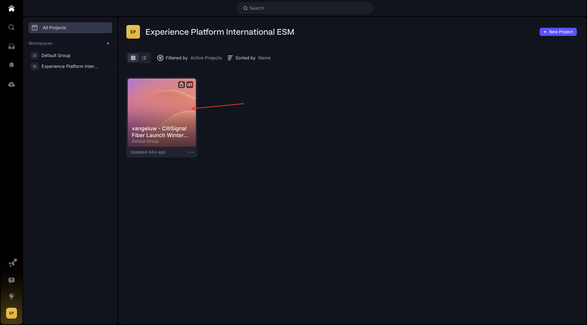
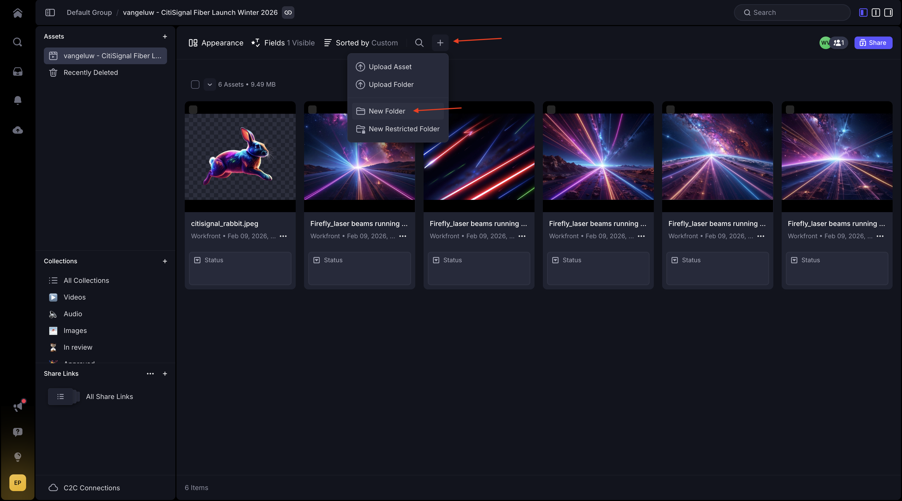
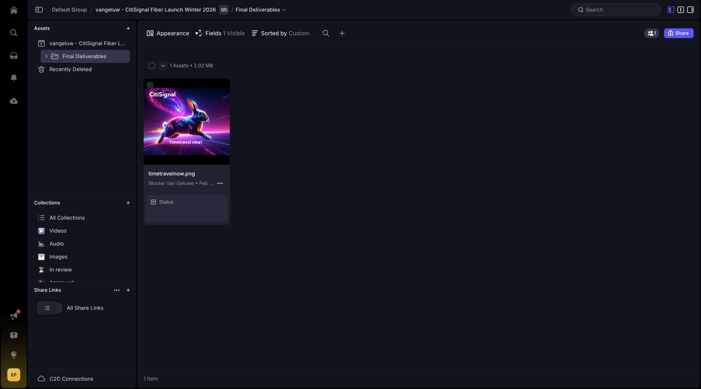
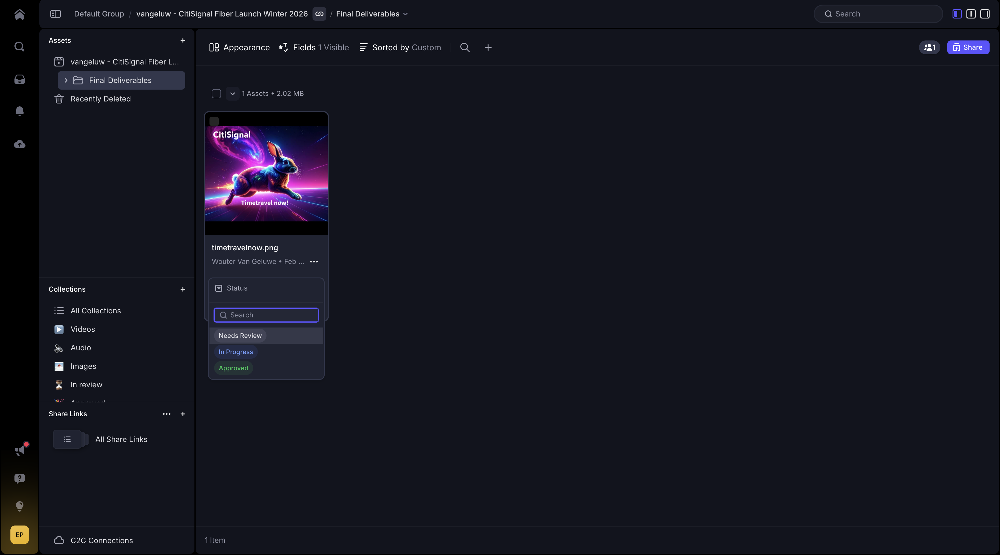
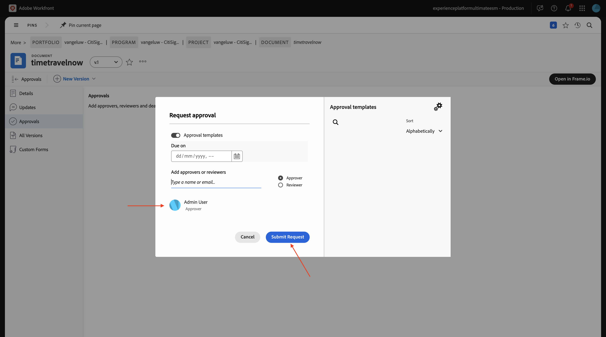

# 1.8.2 Een nieuw middel maken, dit beoordelen en goedkeuren

## 1.8.2.1 Referentieafbeeldingen verifiëren in Frame.io

Ga naar [ https://next.frame.io/ ](https://next.frame.io/){target="_blank"}. Klik om de map van uw project te openen.

Alle referentieafbeeldingen die in Workfront zijn opgegeven, worden nu weergegeven. De ontwerper heeft nu automatisch toegang tot alle bestanden die in Workfront zijn geüpload, in een veilige omgeving.

Klik **+** en selecteer dan **Nieuwe Omslag**.

Ga de naam in: `Final Deliverables` en de slag **gaat** binnen. Deze map wordt gebruikt voor het uploaden van het uiteindelijke document dat wordt gemaakt door de ontwerperL

## 1.8.2.2 Nieuw element maken met Adobe Firefly en Adobe Express

>[!NOTE]
>
>Voor het geval u verkiest om het nieuwe middel niet zelf tot stand te brengen, kunt u de gebeëindigde versie [ hier ](./images/timetravelnow.png) downloaden.

Ga naar [ https://firefly.adobe.com/ ](https://firefly.adobe.com/){target="_blank"}. Ga de herinnering `a neon rabbit running very fast through space` in en klik **produceert**.

Er worden dan verschillende afbeeldingen gegenereerd. Kies het beeld u van de meesten houdt, klik het **pictogram van het Aandeel** op het beeld en selecteer dan **Open in Adobe Express**.

Vervolgens ziet u dat de afbeelding die u zojuist hebt gegenereerd, beschikbaar is in Adobe Express voor bewerking. U moet nu het CitiSignal-logo aan de afbeelding toevoegen. Om dat te doen, ga naar **Banden**.

Vervolgens ziet u een CitiSignal-merksjabloon. die in GenStudio for Performance Marketing is gemaakt, wordt weergegeven in Adobe Express. Klik om een merksjabloon te selecteren die `CitiSignal` in de naam heeft.

Ga naar **Logo&#39;s** en klik het **witte** embleem van het Citisignaal om het op het beeld te laten vallen.

Plaats het CitiSignal-logo boven aan de afbeelding, niet te ver van het midden.

Ga naar **Tekst**.

Klik **toevoegen uw tekst**.

Ga de tekst `Timetravel now!` in, verander de doopvontkleur en de doopvontgrootte, plaats de tekst aan **Vet** zodat u een beeld gelijkend op dit hebt.

Daarna, klik **Aandeel**.

Klik op **.. Alles tonen** .

De rol neer en selecteert **Download**.

Klik **Download**.

Vervolgens hebt u uw middelen op uw lokale computer.

Wijzig de naam van het bestand in `timetravelnow.png` .

## 1.8.2.3 Het element in Frame.io bekijken

Ga terug naar [ https://next.frame.io/ ](https://next.frame.io/){target="_blank"} en open de omslag van uw project.

Klik **uploaden**.

Selecteer het dossier **timetravelnow.png** en klik **Open**.

Dan moet je dit zien.

Verander de status in **het Overzicht van Vereist** en klik dan het beeld tweemaal om het te openen.

Label een van de revisoren in uw omgeving en voeg een bericht toe zoals: `ready for your feedback on this one` .

De controleur kan dan opmerkingen maken om wijzigingen aan te brengen of om te bevestigen dat het er goed uitziet.

## 1.8.2.4 Raadpleeg het middel in Workfront

Terwijl het ontwerpteam zich herhaalt over de middelen die ze maken, kan de projectmanager in Workfront de gebeurtenissen volgen. Ga terug naar Workfront. Vernieuw de pagina.

De map die is gemaakt in Frame.io wordt nu weergegeven in Workfront. Klik erop om het te openen.

Dan moet je dit zien. Beweeg over het dossier **timetravelnow.png** en klik **Details van het Document**.

Als projectmanager, kunt u de huidige versie van dat beeld nu zien zodat u weet wat gebeurt en dat dit actief wordt gewerkt aan. Klik **Open in Frame.io**.

Er wordt dan een nieuw venster geopend met het element Frame.io.

## 1.8.2.5 Het element goedkeuren

In Workfront, ga **Goedkeuringen** en klik **toevoegen**.

Voeg me als fiatteur toe en klik dan **voorleggen Verzoek**.

Dan moet je dit zien. Klik **Open overzicht**, die u aan Frame.io zal nemen.

In Frame.io kunt u alle opmerkingen bekijken en het element bekijken. Klik om het **Uw besluit** gebied te openen.

Selecteer **Goedgekeurd**.

Ga terug naar Workfront en vernieuw de pagina. U ziet nu dat de status hier ook is gewijzigd. Het middel wordt goedgekeurd en kan voor levering en activering daarna worden gebruikt.

## Volgende stappen

Ga terug naar [ Verenigde Overzicht &amp; Goedkeuring met Workfront, Frame.io en het Beheer van de Opslag van de Onderneming ](./esm.md){target="_blank"}

Ga terug naar [ Alle Modules ](./../../../overview.md){target="_blank"}
