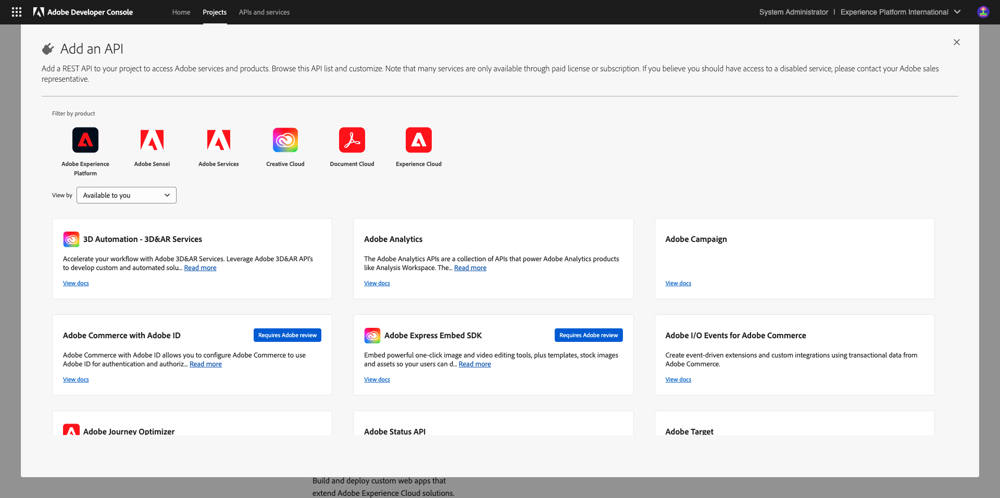
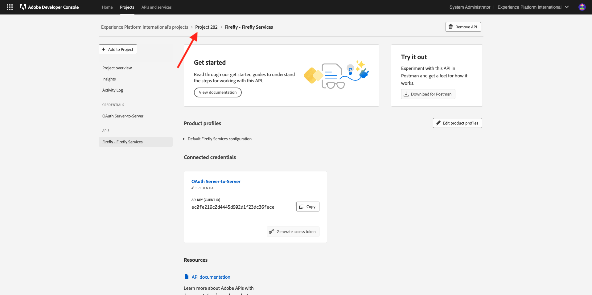
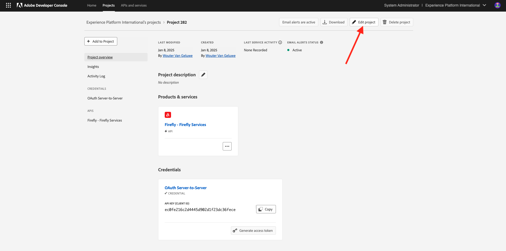

# Aan de slag met Firefly Services

Leer hoe u Postman en Adobe I/O gebruikt om query&#39;s uit te voeren op Adobe Firefly Services API&#39;s.

## Uw Adobe I/O-project configureren

In deze oefening, wordt Adobe I/O gebruikt aan vraag tegen Firefly de Diensten APIs. Voer de volgende stappen uit om Adobe I/O in te stellen.

1. Ga naar [ https://developer.adobe.com/console/home ](https://developer.adobe.com/console/home) {target="_blank"}.

1. Selecteer de juiste instantie in de rechterbovenhoek van het scherm. Uw instantie is `--aepImsOrgName--` . Daarna, uitgezochte **creeer nieuw project**.

1. Selecteer **+ toevoegen aan Project** en kies **API**.

Het scherm moet er zo uitzien.

1. Selecteer **Creative Cloud** en kies **Firefly - de Diensten van de Firefly**, dan selecteren **daarna**.

1. Verstrek een naam voor uw referentie: `--aepUserLdap-- - Firefly Services OAuth credential` en selecteer **daarna**.

1. Selecteer de standaardprofiel **Configuratie Standaard van de Diensten van de Firefly** en selecteer **sparen Gevormde API**.

Uw Adobe I/O-integratie is nu klaar.

## De Postman-omgeving downloaden

1. Selecteer **Download voor Postman**, dan kies **Server-aan-Server** om een milieu van Postman te downloaden.

1. Selecteer de projectnaam.

1. Selecteer **uitgeven Project**.

1. Ga een vriendschappelijke naam voor uw integratie in: `--aepUserLdap-- Firefly` en selecteer **sparen**.

De instellingen van uw Adobe I/O-integratie zijn nu voltooid.

## Postman-verificatie naar Adobe I/O

1. De download en installeert de relevante versie van Postman voor uw OS bij [ Downloads van Postman ](https://www.postman.com/downloads/) {target="_blank"}.

1. Start de toepassing.

In Postman zijn er twee concepten: omgevingen en verzamelingen.

- Het omgevingsbestand bevat al uw omgevingsvariabelen die min of meer consistent zijn. In het milieu, zult u dingen zoals IMSOrg van uw milieu van de Adobe, naast veiligheidsgeloofsbrieven zoals uw identiteitskaart van de Cliënt en anderen vinden. U hebt het omgevingsbestand tijdens de Adobe I/O-installatie eerder gedownload en de naam is **`oauth_server_to_server.postman_environment.json`** .

- De verzameling bevat een aantal API-aanvragen die u kunt gebruiken. We gebruiken twee verzamelingen
   - 1 Verzameling voor Authentificatie aan Adobe I/O
   - 1 Verzameling voor de oefeningen in deze module

1. Download [ postman.zip ](./../../../assets/postman/postman-ff.zip) aan uw lokale Desktop.

In **postman.zip** dossier zijn de volgende dossiers:

     - ` Adobe IO - OAuth.postman_collection.json ` 
     - ` FF - de Diensten van de Firefly Tech Insiders.postman_collection.json ` 

1. Unzip **postman-ff.zip** en sla de volgende 2 dossiers in een omslag op uw Desktop op:
- Adobe IO - OAuth.postman_collection.json
- FF - Firefly Services Tech Insiders.postman_collection.json
- oauth_server_to_server.postman_environment.json

1. In Postman, uitgezochte **Invoer**.

1. Selecteer **Dossiers**.

1. Kies de drie dossiers van de omslag, dan selecteren **Open** en **Invoer**.

U hebt niet alles wat u in Postman nodig hebt om via de API&#39;s te gaan communiceren met Firefly Services.

## Een toegangstoken aanvragen

Daarna, om ervoor te zorgen u behoorlijk voor authentiek wordt verklaard, moet u om een toegangstoken verzoeken.

1. Zorg ervoor dat u het juiste milieu hebt geselecteerd alvorens om het even welk verzoek uit te voeren door milieu-dropdown lijst in de hoogste juiste hoek te verifiëren. De geselecteerde omgeving moet een naam hebben die vergelijkbaar is met deze, `--aepUserLdap-- Firefly Services OAuth Credential` .

De geselecteerde omgeving moet een naam hebben die vergelijkbaar is met deze, `--aepUserLdap-- Firefly Services OAuth Credential` .

Nu uw Postman-omgeving en -verzamelingen zijn geconfigureerd en werken, kunt u verificatie uitvoeren van Postman naar Adobe I/O.

1. In de **Adobe IO - OAuth** inzameling, selecteer het verzoek genoemd **POST - krijg het Token van de Toegang** en selecteer **verzend**.

Bericht onder **de Params van de Vraag**, worden twee variabelen van verwijzingen voorzien, `API_KEY` en `CLIENT_SECRET`. Deze variabelen zijn afkomstig uit de geselecteerde omgeving, `--aepUserLdap-- Firefly Services OAuth Credential` .

Als succesvol, een reactie die een dragerteken, een toegangstoken, en een vervalsingsvenster bevat verschijnt in de **sectie van het Lichaam** {van Postman.

U zou een gelijkaardige reactie moeten zien die de volgende informatie bevat:

| Sleutel | Waarde |
|:-------------:| :---------------:| 
| token_type | **drager** |
| access_token | **eyJhbGciOiJSU...** |
| verloopt_in | **86399** |

Het Adobe I/O **drager-teken** heeft een specifieke waarde (zeer lange access_token) en een vervalvenster en is nu geldig voor 24 uren. Dit betekent dat na 24 uur, als u Postman wilt gebruiken om aan Adobe I/O voor authentiek te verklaren, u een nieuw teken zult moeten produceren door dit verzoek opnieuw in werking te stellen.

## Firefly Services API, Text 2 Image

Nu bent u klaar om uw eerste verzoek naar de APIs van de Diensten van de Firefly te verzenden.

1. Selecteer het verzoek genoemd **POST - Firefly - T2I V3** van **FF - de inzameling van Tech Insiders van de Diensten van de Firefly**.

1. Kopieer de URL van de afbeelding uit het antwoord en open deze in uw webbrowser om de afbeelding weer te geven.

Er moet een mooie afbeelding worden afgebeeld `horses in a field` .

U kunt vrij spelen met de API-aanvraag voordat u verdergaat met de volgende oefening.

## Volgende stappen

Ga naar [ optimaliseer uw proces van de Firefly gebruikend Microsoft Azure en presigned URLs ](./ex2.md){target="_blank"}

Ga terug naar [ Overzicht van de Diensten van de Adobe Firefly ](./firefly-services.md){target="_blank"}

Ga terug naar [ Alle modules ](./../../../overview.md){target="_blank"}
