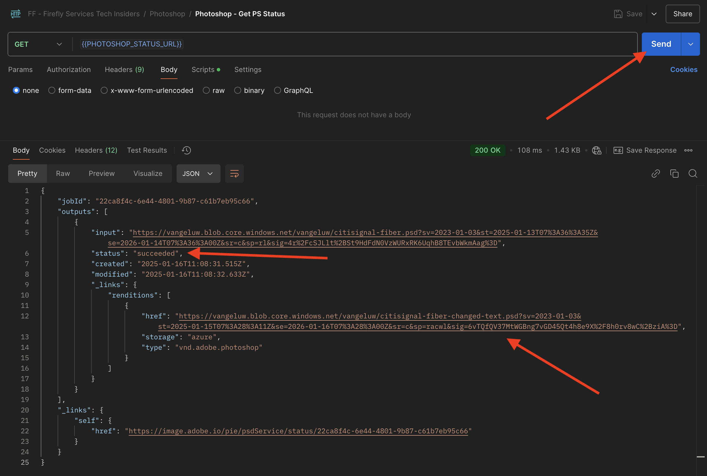

# 1.1.3 Werken met Photoshop API&#39;s

## 1.1.3.1 De Adobe I/O-integratie bijwerken

Ga naar [ https://developer.adobe.com/console/home ](https://developer.adobe.com/console/home).


Ga naar **Projecten** en klik om het project te openen u in de vorige oefening creeerde, die `--aepUserLdap-- Firefly` wordt geroepen.


Klik **+ toevoegen aan Project** en klik dan **API**.


Selecteer **Creative Cloud** en klik **Photoshop - de Diensten van de Firefly**. Klik **daarna**.


Klik **daarna**.


Vervolgens moet u een productprofiel selecteren waarmee wordt gedefinieerd welke machtigingen beschikbaar zijn voor deze integratie.

Selecteer de Configuratie van de Diensten van de Firefly van het profiel **Standaard** en **Configuratie van de Diensten van de Automatisering van het Standaard Creative Cloud**.

Klik **sparen Vormde API**.


Uw Adobe I/O-project wordt nu bijgewerkt en werkt nu met Photoshop &amp; Firefly Services-API&#39;s.


## 1.1.3.2 Programmatische interactie met een PSD-bestand

Download het dossier gaat naar [ burgerschap-fiber.psd ](./../../../assets/ff/citisignal-fiber.psd) aan uw Desktop.

Open het dossier **burgersignaal-fiber.psd** in Photoshop. Dan moet je dit hebben.


In de **ruit van Lagen**, zult u zien dat de ontwerper van het dossier een unieke naam aan elke laag heeft gegeven. U kunt de laaginformatie zien door het dossier van de PSD in Photoshop te openen, maar u kunt dat ook programmatically doen.

Stuur uw eerste API-aanvraag naar Photoshop API&#39;s.

Ga naar Postman. Voordat u API-aanvragen naar Photoshop verzendt, moet u de aanvraag verifiëren bij Adobe I/O. OPen het verzoek dat u vóór met de naam **gebruikte POST - krijg het Symbolische van de Toegang**.

Ga naar **Params** en verifieer dat de parameter **Reikwijdte** behoorlijk wordt geplaatst. De **Waarde** voor **Reikwijdte** zou als dit moeten kijken:

`openid,session,AdobeID,read_organizations,additional_info.projectedProductContext, ff_apis, firefly_api`

Dan, klik **verzenden**.


U hebt dan een geldig toegangstoken om met Photoshop APIs in wisselwerking te staan.


### 1.1.3.2.1 Photoshop API - Hello World

Laten we nu de groeten overbrengen aan Photoshop API&#39;s om te testen of alle machtigingen en toegangsrechten correct zijn ingesteld. In de inzameling **Photoshop**, open het verzoek met de naam **Photoshop Hello (de Auteur van de Test.)**. Klik **verzenden**.


U zou deze reactie dan moeten ontvangen: **Onthaal aan Photoshop API!**.


Daarna, om programmatically met het dossier van PSD **te interactie aan te gaan** wordt  gebruikt   , moet u het aan uw opslagrekening uploaden. Dat kunt u handmatig doen door het bestand met Azure Storage Explorer naar uw container te slepen, maar dit keer moet u het doen via de API.

### 1.1.3.2.2 Upload PSD naar Azure

In Postman, open het verzoek **uploadt PSD naar de Rekening van de Opslag Azure**. In de vorige oefening, vormde u deze milieuvariabelen in Postman, die u nu zult gebruiken:

- `AZURE_STORAGE_URL`
- `AZURE_STORAGE_CONTAINER`
- `AZURE_STORAGE_SAS_READ`
- `AZURE_STORAGE_SAS_WRITE`

Aangezien u in het verzoek **kunt zien uploadt PSD aan de Rekening van de Opslag Azure**, wordt URL gevormd om deze variabelen te gebruiken.


In **Lichaam**, zou u het dossier **moeten nu toevoegen burgerschap-fiber.psd**.


Dan moet je dit hebben. Klik **verzenden**.


U moet deze lege reactie dan terugkrijgen van Azure, wat betekent dat uw bestand in uw container in uw Azure Storage-account wordt opgeslagen.


Als u Azure Storage Explorer gebruikt voor een look, ziet u uw bestand nadat u de map hebt vernieuwd.


### 1.1.3.2.3 Photoshop API - Get Manifest

Vervolgens moet u het manifestbestand van uw PSD-bestand ophalen. In Postman, open het verzoek **Photoshop - krijg PSD Manifest**. Ga naar **Lichaam**.

Het lichaam moet er als volgt uitzien:

```json
{
  "inputs": [
    {
      "storage": "external",
      "href": "{{AZURE_STORAGE_URL}}/{{AZURE_STORAGE_CONTAINER}}/citisignal-fiber.psd{{AZURE_STORAGE_SAS_READ}}"
    }
  ],
  "options": {
    "thumbnails": {
      "type": "image/jpeg"
    }
  }
}
```

Klik **verzenden**.

In het antwoord ziet u nu een koppeling. Aangezien het soms enige tijd kan duren om bewerkingen in Photoshop uit te voeren, levert Photoshop een statusbestand als antwoord op de meeste binnenkomende aanvragen. Als u wilt weten wat er met uw verzoek gebeurt, moet u het statusbestand lezen.


Om het statusdossier te lezen, open het verzoek **Photoshop - krijgt PS Status**. U ziet dan dat dit verzoek een variabele als URL gebruikt, die een variabele is die door het vorige verzoek wordt geplaatst dat u verzendt, **Photoshop - krijgt PSD Manifest**. De variabelen worden geplaatst in **Manuscripten** van elk verzoek.

Klik **verzenden**.


Dan moet je dit zien. Momenteel, wordt de status geplaatst aan **hangend**, wat betekent dat het proces nog niet heeft voltooid.


U kunt klikken verzendt een paar meer tijden op **Photoshop - krijgt PS Status** verzoek, tot de statusveranderingen in **succesvol**. Dit kan een paar minuten duren.

Wanneer de reactie beschikbaar is, zult u een JSON dossier dat informatie over alle lagen van het dossier van de PSD bevat. Dit is nuttige informatie, aangezien dingen zoals de laagnaam of laagidentiteitskaart hier kunnen worden gezien.


Zoek bijvoorbeeld naar de tekst `2048x2048-cta` . Dan moet je dit zien.


### 1.1.3.2.4 Photoshop API - Tekst wijzigen

Vervolgens moet u nu de tekst wijzigen voor de oproep tot actie met de API&#39;s. In Postman, open het verzoek **Photoshop - de Tekst van de Verandering** en ga naar **Lichaam**.

Dan moet je dit zien. U kunt zien dat:

- eerst wordt een invoerbestand opgegeven: `citisignal-fiber.psd`
- vervolgens wordt de te wijzigen laag opgegeven, waarbij de tekst moet worden gewijzigd in
- ten derde wordt een uitvoerbestand opgegeven: `citisignal-fiber-changed-text.psd`

```json
{
  "inputs": [
    {
      "storage": "external",
      "href": "{{AZURE_STORAGE_URL}}/{{AZURE_STORAGE_CONTAINER}}/citisignal-fiber.psd{{AZURE_STORAGE_SAS_READ}}"
    }
  ],
  "options": {
    "layers": [
      {
        "name": "2048x2048-cta",
        "text": {
          "content": "Get Fiber now!"
        }
      }
    ]
  },
  "outputs": [
    {
      "storage": "azure",
      "href": "{{AZURE_STORAGE_URL}}/{{AZURE_STORAGE_CONTAINER}}/citisignal-fiber-changed-text.psd{{AZURE_STORAGE_SAS_WRITE}}",
      "type": "vnd.adobe.photoshop",
      "overwrite": true
    }
  ]
}
```

Het uitvoerbestand heeft een andere naam, omdat u het oorspronkelijke invoerbestand niet wilt overschrijven.

Klik **verzenden**.


Net als voorheen bevat het antwoord een koppeling die verwijst naar het statusbestand en de voortgang bijhoudt.


Om het statusdossier te lezen, open het verzoek **Photoshop - krijg PS Status** opnieuw en klik **verzenden**. Als de status niet aan **wordt geplaatst slaagde** onmiddellijk, wacht een paar seconden en klik dan **** opnieuw verzenden.

Zodra de status aan **wordt geplaatst slaagde**, zou u dit dan moeten zien. In het pad `outputs[0]._links.renditions[0].href` ziet u de URL van het uitvoerbestand dat door Photoshop is gemaakt en de gewijzigde tekst bevat.

Klik op de URL om het uitvoerbestand te downloaden.



Het dossier **burgerschap-vezel-veranderd-text.psd** zal dan aan uw computer worden gedownload, waarna u het kunt openen. U zou dan moeten zien dat placeholder voor de vraag aan actie is vervangen door de tekst **krijgt nu Vezel!**.


Tot slot ziet u dat bestand ook in uw container met Azure Storage Explorer.


Je hebt deze oefening nu voltooid.

Volgende Stap: [ Samenvatting &amp; Voordelen ](./summary.md)

[Terug naar module 1.1](./firefly-services.md)

[Terug naar alle modules](./../../../overview.md)
