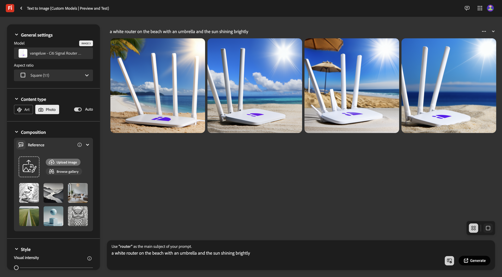
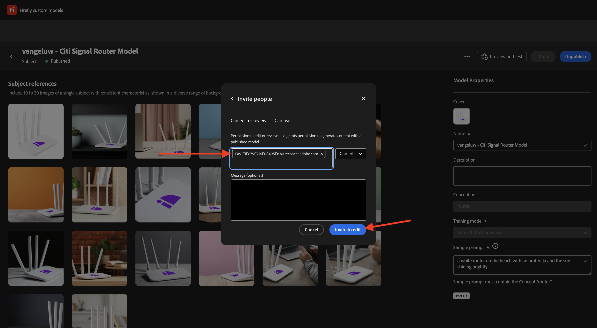

# 1.1.4 Firefly API voor aangepaste modellen

## 1.1.4.1 Uw aangepaste model configureren

Ga naar [ https://firefly.adobe.com/ ](https://firefly.adobe.com/). Klik **Modellen van de Douane**.

{zoomable="yes"}

Dit bericht wordt mogelijk weergegeven. Als u doet, klik **akkoord** om verder te gaan.

{zoomable="yes"}

Dan moet je dit zien. Klik **Lijn een model**.

{zoomable="yes"}

Configureer de volgende velden:

- **Naam**: gebruik `--aepUserLdap-- - Citi Signal Router Model`
- **Wijze van de Opleiding**: uitgezochte **Onderwerp (technologievoorproef)**
- **Concept**: enter `router`
- **sparen aan**: open de dropdown lijst en klik **+ creeer Nieuw Project**

{zoomable="yes"}

Geef het nieuwe project de naam: `--aepUserLdap-- - Custom Models`. Klik **creëren**.

{zoomable="yes"}

Dan moet je dit zien. Klik **creëren**.

{zoomable="yes"}

U moet nu de referentieafbeeldingen opgeven die worden getraind in het aangepaste model. Klik **Uitgezochte beelden van uw computer**.

{zoomable="yes"}

Download de verwijzingsbeelden [ hier ](https://tech-insiders.s3.us-west-2.amazonaws.com/CitiSignal_router.zip). Pak het downloadbestand uit, wat u dit kan geven.

{zoomable="yes"}

Navigeer naar de map met de bestanden met downloadafbeeldingen. Selecteer hen allen en klik **Open**.

{zoomable="yes"}

Vervolgens ziet u dat de afbeeldingen worden geladen.

{zoomable="yes"}

Na een paar minuten worden de afbeeldingen correct geladen. Sommige afbeeldingen hebben mogelijk een fout. Dit wordt veroorzaakt door het feit dat het bijschrift voor de afbeelding niet is gegenereerd of niet lang genoeg is. Bekijk elke afbeelding met een fout en voer een bijschrift in dat aan de vereisten voldoet en beschrijf de afbeelding.

{zoomable="yes"}

Als alle afbeeldingen bijschriften hebben die aan de vereisten voldoen, moet u toch een voorbeeldprompt weergeven. Ga om het even welke herinnering in die het woord &quot;router&quot;gebruikt. Zodra je dat hebt gedaan, kun je beginnen met het trainen van je model. Klik **Lijn**.

{zoomable="yes"}

Dan zie je dit. De training voor uw model kan 20 tot 30 minuten of langer duren.

{zoomable="yes"}

Na 20 tot 30 minuten is uw model nu opgeleid en kan het worden gepubliceerd. Klik **publiceren**.

{zoomable="yes"}

Klik **publiceren** opnieuw.

{zoomable="yes"}

Sluit het **aangepaste model van het Aandeel** popup.

{zoomable="yes"}

## 1.1.4.2 Gebruik uw aangepaste model in de gebruikersinterface

Ga naar [ https://firefly.adobe.com/cme/train ](https://firefly.adobe.com/cme/train). Klik op het aangepaste model om het te openen.

{zoomable="yes"}

Klik **Voorproef en test**.

{zoomable="yes"}

U zult dan de steekproefherinnering zien die u alvorens wordt uitgevoerd inging.

{zoomable="yes"}

## 1.1.4.3 Schakel uw aangepaste model voor de API voor aangepaste modellen van Firefly Services in

Als uw aangepaste model is opgeleid, kan het ook worden gebruikt via de API. In oefening 1.1.1 reeds vormde u uw Adobe I/O project voor interactie met de Diensten van Firefly door API.

Ga naar [ https://firefly.adobe.com/cme/train ](https://firefly.adobe.com/cme/train). Klik op het aangepaste model om het te openen.

{zoomable="yes"}

Klik de 3 punten **..** en klik dan **Aandeel**.

{zoomable="yes"}

Om tot een Model van de Douane van Firefly toegang te hebben, moet het Model van de Douane aan **Technische identiteitskaart van de Rekening** van ons Project van Adobe I/O worden gedeeld.

Om uw **Technische identiteitskaart van de Rekening** terug te winnen, ga [ https://developer.adobe.com/console/projects ](https://developer.adobe.com/console/projects). Klik om het project met de naam `--aepUserLdap-- Firefly` te openen.

{zoomable="yes"}

Klik **Server-aan-Server**.

{zoomable="yes"}

Klik om uw **identiteitskaart van de Technische Rekening te kopiëren**.

{zoomable="yes"}

Plak uw **identiteitskaart van de Technische Rekening** en klik **Uitnodiging om** uit te geven.

{zoomable="yes"}

**identiteitskaart van de Technische Rekening** zou tot het Model van de Douane nu moeten kunnen toegang hebben.

{zoomable="yes"}

## 1.1.4.4 Interactie met de API voor aangepaste modellen van Firefly Services

In Oefening 1.1.1 die met de Diensten van Firefly begonnen wordt, downloadde u dit dossier: [ postman-ff.zip ](./../../../assets/postman/postman-ff.zip) aan uw lokale Desktop en u toen invoerde die inzameling in Postman.

Open Postman en ga naar de omslag **FF - de Modellen API van de Douane**.

{zoomable="yes"}

Open het verzoek **1. FF - getCustomModels** en klik **verzenden**.

{zoomable="yes"}

Het aangepaste model dat u eerder hebt gemaakt, met de naam `--aepUserLdap-- - Citi Signal Router Model`, wordt weergegeven als onderdeel van het antwoord. Het gebied **assetId** is het unieke herkenningsteken van uw Model van de Douane, dat in het volgende verzoek van verwijzingen zal worden voorzien.

{zoomable="yes"}

Open het verzoek **2. Afbeeldingen synchroniseren genereren**. In dit voorbeeld wilt u twee variaties genereren op basis van uw aangepaste model. U kunt de vraag die in dit geval `a white router on a volcano in Africa` is, altijd bijwerken.

Klik **verzenden**.

{zoomable="yes"}

De reactie bevat een gebied **jobId**. De taak om deze twee afbeeldingen te genereren, wordt nu uitgevoerd en u kunt de status controleren met de volgende aanvraag.

{zoomable="yes"}

Open het verzoek **3. Krijg de Status van CM** en klik **verzenden**. Vervolgens ziet u dat de status is ingesteld op actief.

{zoomable="yes"}

Na een paar notulen, verzend **** opnieuw voor het verzoek **. Krijg de Status van CM**. U zou dan moeten zien dat de status die in **werd veranderd succesvol** was en u zou twee beeld URLs als deel van de output moeten zien. Klik om beide bestanden te openen.

{zoomable="yes"}

Dit is de eerste afbeelding die in dit voorbeeld is gegenereerd.

{zoomable="yes"}

Dit is de tweede afbeelding die in dit voorbeeld is gegenereerd.

{zoomable="yes"}

Je hebt deze oefening nu voltooid.

## Volgende stappen

Ga naar [ Samenvatting &amp; voordelen ](./summary.md){target="_blank"}

Ga terug naar [ Werkend met Photoshop APIs ](./ex3.md){target="_blank"}

Ga terug naar [ Overzicht van de Diensten van Adobe Firefly ](./firefly-services.md){target="_blank"}
