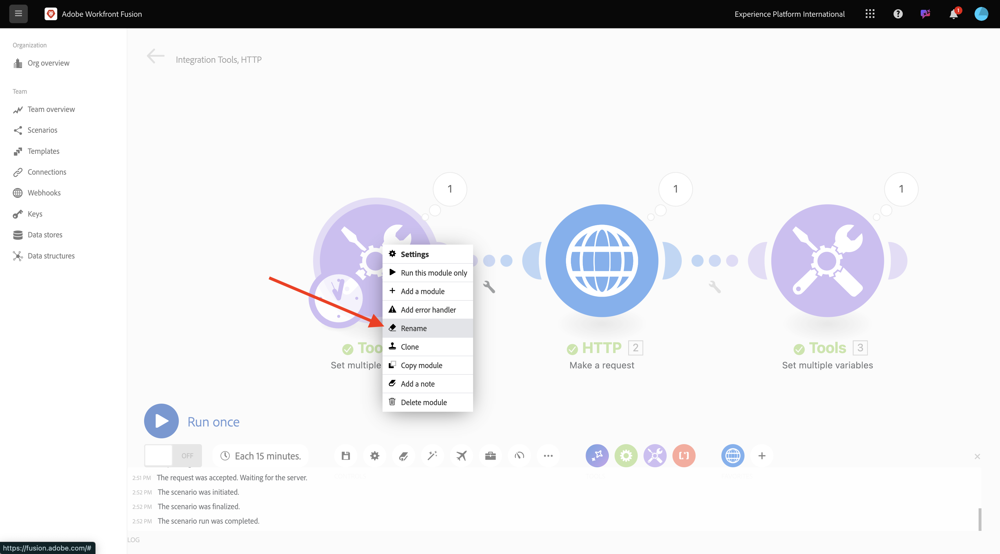

# 1.2.1 Aan de slag met Workfront Fusion

In deze oefening, zult u Workfront Fusion en Adobe I/O gebruiken om de Diensten APIs van de Adobe Firefly te vragen.

## 1.2.1.1 Nieuwe scenario&#39;s maken

Ga naar [ https://experience.adobe.com/ ](https://experience.adobe.com/). Klik om **de Fusie van Workfront** te openen.

Dan moet je dit zien. Ga naar **Scenario&#39;s**.

Klik **creëren nieuw scenario**.

U zult dan een leeg scenario zien. Klik het **hulpmiddelen** pictogram en selecteer **Vastgestelde veelvoudige variabelen**.

U moet nu het **klok** pictogram op de onlangs toegevoegde **Reeks veelvoudige variabelen** bewegen.

Dan zie je dit.

Dan, klik op het vraagteken met de rechtermuisknop aan en selecteer **module van de Schrapping**.

Daarna, klik op het **Vastgestelde veelvoudige variabelen** voorwerp met de rechtermuisknop aan en selecteer **Montages**.

## 1.2.1.2 Adobe I/O-verificatie configureren

U moet nu de variabelen vormen die nodig zijn om tegen Adobe I/O voor authentiek te verklaren. In de vorige oefening, creeerde u een project van Adobe I/O. De variabelen van dat Adobe I/O-project moeten nu worden gedefinieerd in Workfront Fusion.

De volgende variabelen moeten worden gedefinieerd:

| Sleutel | Waarde |
|:-------------:| :---------------:| 
| `CONST_client_id` | uw Adobe I/O project Client-id |
| `CONST_client_secret` | uw Adobe I/O project Client Secret |
| `CONST_scope` | bereik van uw Adobe I/O-project |

U kunt deze variabelen vinden door [ https://developer.adobe.com/console/projects ](https://developer.adobe.com/console/projects) te gaan en uw Adobe I/O project te openen, dat `--aepUserLdap-- Firefly` wordt genoemd.

In uw project, klik **OAuth server-Server** om de waarden voor de bovengenoemde sleutels te zien.

Met de bovengenoemde sleutels en de waarden, kunt u **vormen Vastgestelde veelvoudige variabelen** voorwerp. Klik **toevoegen punt**.

Ga de **Veranderlijke naam** in: **CONST_client_id** en zijn **Veranderlijke waarde**, klik **toevoegen**.

Klik **toevoegen punt**.

Ga de **Veranderlijke naam** in: **CONST_client_geheime** en zijn **Veranderlijke waarde**, klik **toevoegen**.

Klik **toevoegen punt**.

Ga de **Veranderlijke naam** in: **CONST_scope** en zijn **Veranderlijke waarde**, klik **toevoegen**.

Klik **OK**.

Beweeg over uw **Vastgestelde veelvoudige variabelen** voorwerp en klik het grote **+** pictogram om een andere module toe te voegen.

Dan moet je dit zien.

In de onderzoeksbar, ga **http** in. Selecteer **HTTP** om het te openen.

en selecteer dan **maak een verzoek**.

| Sleutel | Waarde |
|:-------------:| :---------------:| 
| `URL` | `https://ims-na1.adobelogin.com/ims/token/v3` |
| `Method` | `POST` |
| `Body Type` | `x-www-form-urlencoded` |

Klik **toevoegen punt**.

Voeg items toe voor elk van de onderstaande waarden:

| Sleutel | Waarde |
|:-------------:| :---------------:| 
| `client_id` | de vooraf gedefinieerde variabele voor `CONST_client_id` |
| `client_secret` | de vooraf gedefinieerde variabele voor `CONST_client_secret` |
| `scope` | de vooraf gedefinieerde variabele voor `CONST_scope` |
| `grant_type` | `client_credentials` |

Configuratie voor `client_id` .

Configuratie voor `client_secret` .

Configuratie voor `scope` .

Configuratie voor `grant_type` .

Overzicht van configuratie. De rol neer en controleert checkbox voor **ontleedt reactie**. Klik **OK**.

Dan moet je dit zien. Klik **Looppas eens**.

Zodra het scenario is gelopen, zou u dit moeten zien.

Klik het **vraagteken** pictogram op het **Vastgestelde veelvoudige variabelen** voorwerp om te zien wat gebeurde toen dat voorwerp in werking werd gesteld.

Klik het **vraagteken** pictogram op **HTTP - doe een verzoek** voorwerp om te zien wat gebeurde toen dat voorwerp in werking werd gesteld. In **OUTPUT**, zult u **access_token** zien die door Adobe I/O wordt teruggekeerd.

Beweeg over **HTTP - doe een verzoek** voorwerp en klik **+** pictogram om een andere module toe te voegen.

Zoek in de zoekbalk naar `tools` . Selecteer **Hulpmiddelen**.

Selecteer **Vastgestelde veelvoudige variabelen**.

Selecteer **toevoegen punt**.

Plaats de **naam van de Variabele** aan `bearer_token`. Selecteer `access_token` als dynamische **Variabele waarde**. CLick **voegt** toe.

Dan moet je dit hebben. Klik **OK**.

Klik **Looppas eens** opnieuw.

Zodra het scenario in werking is gesteld, klik het **vraagteken** pictogram op het laatste **Vastgestelde veelvoudige variabelen** voorwerp. Vervolgens moet u zien dat het access_token wordt opgeslagen in de variabele `bearer_token` .

Daarna, klik met de rechtermuisknop op het eerste voorwerp **plaats veelvoudige waarden** en selecteer **anders noemen**.

Plaats de naam aan **initialiseert Constanten**. Klik **OK**.

Wijzig de naam van het tweede voorwerp en plaats de naam aan **voor authentiek verklaren aan Adobe I/O**. Klik **OK**.

Wijzig de naam van het derde voorwerp en plaats de naam aan **plaats Token van de Drager**. Klik **OK**.

Dan moet je dit hebben.

Wijzig vervolgens de naam van het scenario in `--aepUSerLdap-- - Adobe I/O Authentication` .

Klik **sparen**.

Volgende Stap: [ 1.2.2 Gebruik Adobe APIs binnen de Fusie van Workfront ](./ex2.md)

[Terug naar module 1.2](./automation.md)

[Terug naar alle modules](./../../../overview.md)
