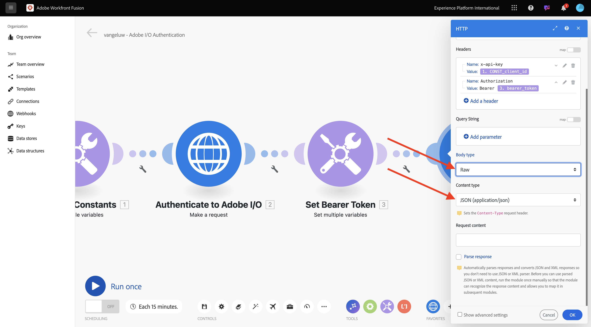
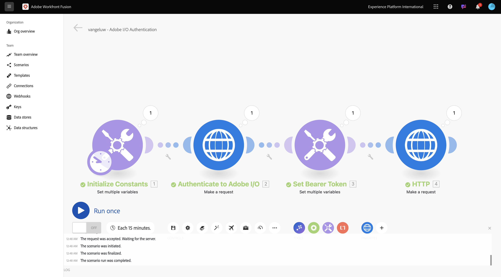
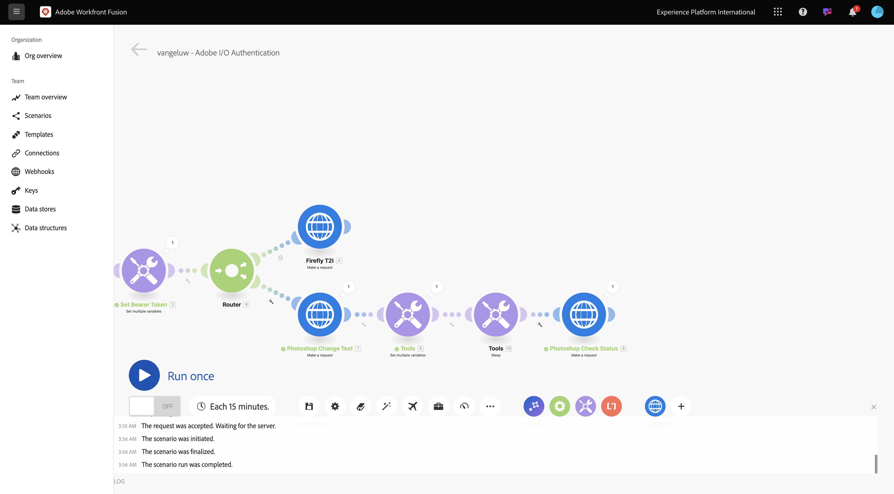
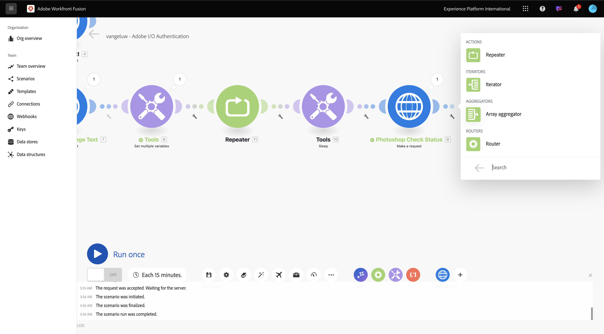
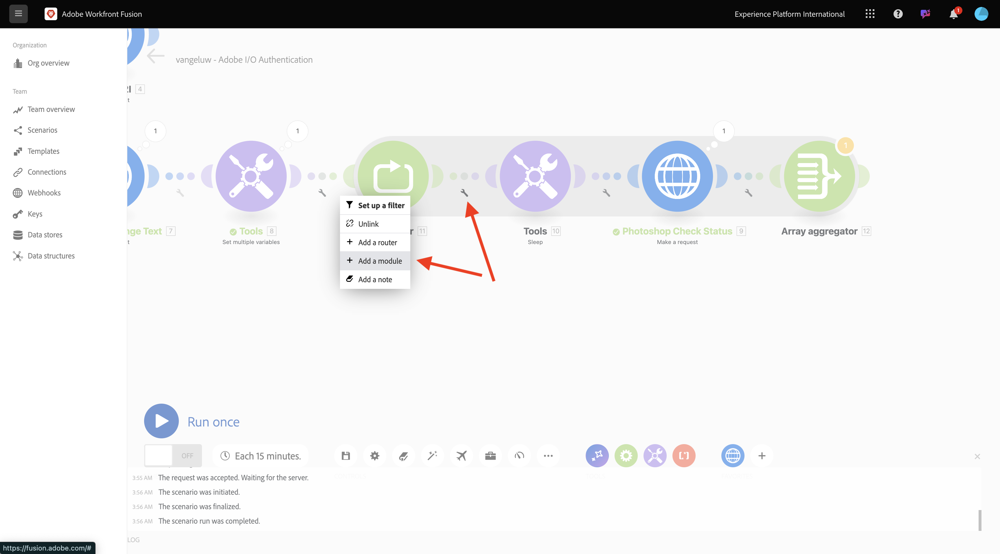
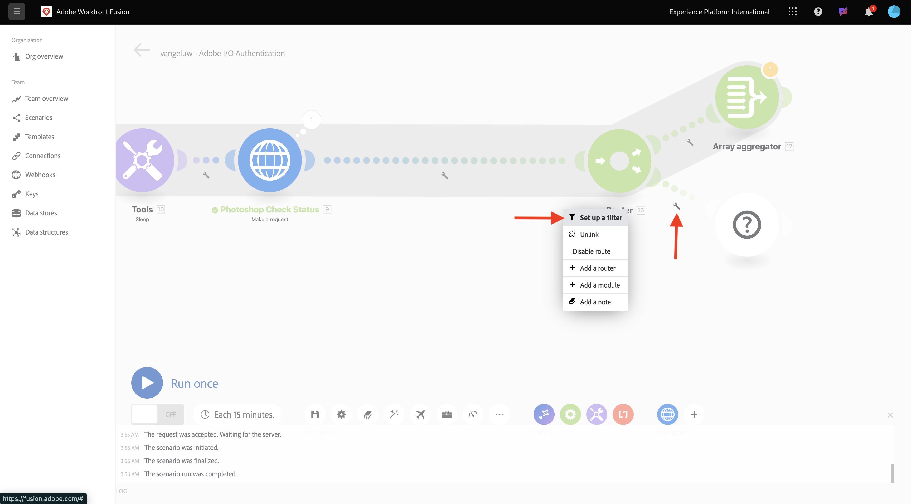
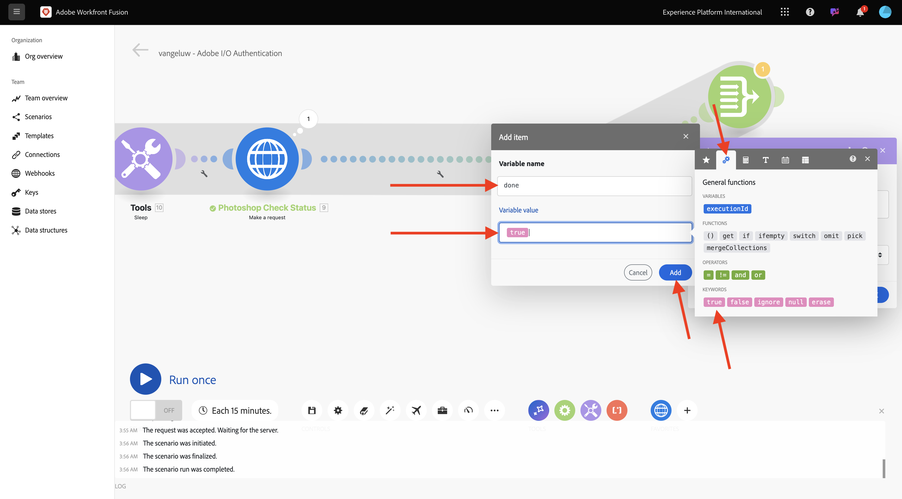

# 1.2.2 Adobe-API&#39;s gebruiken in Workfront Fusion

## 1.2.2.1 Gebruik Firefly Text To Image API met Workfront Fusion

Plaats over de tweede **plaats veelvoudige variabelen** knoop en klik **+** om een andere module toe te voegen.


Onderzoek naar **http**, dan uitgezocht **HTTP**.


Selecteer **maak een verzoek**.


Selecteer deze variabelen:

- **URL**: `https://firefly-api.adobe.io/v3/images/generate`
- **Methode**: `POST`

Klik **toevoegen een kopbal**.


U moet de volgende kopteksten ingaan:

| Sleutel | Waarde |
|:-------------:| :---------------:| 
| `x-api-key` | opgeslagen variabele voor `CONST_client_id` |
| `Authorization` | `Bearer ` + de opgeslagen variabele voor `bearer_token` |
| `Content-Type` | `application/json` |
| `Accept` | `*/*` |

Voer de details in voor `x-api-key` . Klik **toevoegen**.


Klik **toevoegen een kopbal**.


Voer de details in voor `Authorization` . Klik **toevoegen**.


Klik **toevoegen een kopbal**. Voer de details in voor `Content-Type` . Klik **toevoegen**.


Klik **toevoegen een kopbal**. Voer de details in voor `Accept` . Klik **toevoegen**.


Plaats het **type van Lichaam** aan **Onbewerkte**. Voor **inhoudstype**, uitgezochte **JSON (toepassing/json)**.



Plak deze nuttige lading in het **inhoud van het Verzoek** gebied.

```json
{
  "numVariations": 1,
  "size": {
    "width": 2048,
    "height": 2048
  },
  "prompt": "Horses in a field",
  "promptBiasingLocaleCode": "en-US"
}
```

Controle checkbox voor **ontleed reactie**. Klik **OK**.


Klik **Looppas eens**.


Zodra uw scenario in werking is gesteld, zou u dit moeten zien.



Klik op **?** op het vierde knooppunt, HTTP, om het antwoord te zien. Er wordt een afbeeldingsbestand weergegeven in het antwoord.


Kopieer de URL van de afbeelding en open deze in een browservenster. Dan zou je iets als dit moeten zien:


Klik het **voorwerp van HTTP** met de rechtermuisknop aan en noem het aan **Firefly T2I** anders.


Klik **sparen** om uw veranderingen te bewaren.


## 1.2.2.2 Photoshop API gebruiken met Workfront Fusion

Klik het **moersleutelpictogram** tussen de knopen **plaats Token van de Drager** en **Firefly T2I**. Selecteer **een router** toevoegen.


Klik het **Firefly T2I** voorwerp met de rechtermuisknop aan en selecteer **Kloon**.


Sleep en laat vallen het gekloonde voorwerp dicht bij het **voorwerp van de Router**, en het zal auto-verbinden met de **Router**. Dan moet je dit hebben.


U hebt nu een identiek exemplaar gebaseerd op het **Firefly T2I** HTTP- verzoek. Sommige montages van de **Firefly T2I** HTTP- verzoek zijn gelijkaardig aan wat u met **Photoshop API** moet in wisselwerking staan, die een tijdspaarder is. U hoeft nu alleen de variabelen te wijzigen die niet gelijk zijn, zoals de aanvraag-URL en de payload.

Verander **URL** in `https://image.adobe.io/pie/psdService/text`.


Vervang de **inhoud van het Verzoek** door de hieronder nuttige lading:

```json
{
  "inputs": [
    {
      "storage": "external",
      "href": "{{AZURE_STORAGE_URL}}/{{AZURE_STORAGE_CONTAINER}}/citisignal-fiber.psd{{AZURE_STORAGE_SAS_READ}}"
    }
  ],
  "options": {
    "layers": [
      {
        "name": "2048x2048-button-text",
        "text": {
          "content": "Click here"
        }
      },
      {
        "name": "2048x2048-cta",
        "text": {
          "content": "Buy this stuff"
        }
      }
    ]
  },
  "outputs": [
    {
      "storage": "azure",
      "href": "{{AZURE_STORAGE_URL}}/{{AZURE_STORAGE_CONTAINER}}/citisignal-fiber-changed-text.psd{{AZURE_STORAGE_SAS_WRITE}}",
      "type": "vnd.adobe.photoshop",
      "overwrite": true
    }
  ]
}
```


Opdat dit **inhoud van het Verzoek** om behoorlijk te functioneren, zijn er sommige variabelen die ontbreken:

- `AZURE_STORAGE_URL`
- `AZURE_STORAGE_CONTAINER`
- `AZURE_STORAGE_SAS_READ`
- `AZURE_STORAGE_SAS_WRITE`

Ga terug naar uw eerste knoop, klik **initialiseert Constanten** en selecteer dan **punt** voor elk van deze variabelen toevoegen.


| Sleutel | Voorbeeldwaarde |
|:-------------:| :---------------:| 
| `AZURE_STORAGE_URL` | `https://vangeluw.blob.core.windows.net` |
| `AZURE_STORAGE_CONTAINER` | `vangeluw` |
| `AZURE_STORAGE_SAS_READ` | `?sv=2023-01-03&st=2025-01-13T07%3A36%3A35Z&se=2026-01-14T07%3A36%3A00Z&sr=c&sp=rl&sig=4r%2FcSJLlt%2BSt9HdFdN0VzWURxRK6UqhB8TEvbWkmAag%3D` |
| `AZURE_STORAGE_SAS_WRITE` | `?sv=2023-01-03&st=2025-01-13T17%3A21%3A09Z&se=2025-01-14T17%3A21%3A09Z&sr=c&sp=racwl&sig=FD4m0YyyqUj%2B5T8YyTFJDi55RiTDC9xKtLTgW0CShps%3D` |

U kunt uw variabelen vinden door terug naar Postman te gaan, en uw **Variabelen van het Milieu** te openen.


Kopieer deze waarden naar Workfront Fusion en voeg een nieuw item toe voor elk van deze 4 variabelen.

Dan moet je dit hebben. Klik **OK**.


Daarna, ga terug naar het gekloonde verzoek van HTTP om de **inhoud van het Verzoek** bij te werken. U zult deze zwarte variabelen in de **inhoud van het Verzoek** opmerken, die de variabelen zijn u over van Postman kopieerde. U moet deze nu wijzigen in de variabelen die u zojuist hebt gedefinieerd in Workfront Fusion. Vervang elke variabele één door één door de zwarte tekst te schrappen en het te vervangen door de correcte variabele.


Er zijn 3 veranderingen in de **input** sectie aan te brengen.


Er zijn ook 3 verandering in de **output** sectie aan te brengen. Klik **OK**.


Klik de gekloonde knoop met de rechtermuisknop aan, en selecteer **anders noemen**. Verander de naam in **de Tekst van de Verandering van Photoshop**.


Dan moet je dit hebben.


Klik **Looppas eens**.


Klik het **onderzoek** pictogram op de **knoop van de Tekst van de Verandering van Photoshop** om de reactie te zien. U moet een reactie hebben die er als volgt uitziet, met een koppeling naar een statusbestand.


Alvorens met de interactie van Photoshop API verder te gaan, laten wij de route aan de **Firefly T2I** knoop onbruikbaar maken om onnodige API vraag aan dat API eindpunt niet te verzenden. Klik het **moersleutelpictogram**, en selecteer dan **maak route** onbruikbaar.


Dan moet je dit hebben.


Daarna, voeg een andere **Vastgestelde veelvoudige variabelen** knoop toe.


Plaats het na de **knoop van de Tekst van de Verandering van Photoshop**.


Klik de **Vastgestelde veelvoudige variabelen** knoop, uitgezocht **punt** toevoegen. Selecteer de waarde van de variabele in het antwoord op de vorige aanvraag.

| Naam variabele | Waarde variabele |
|:-------------:| :---------------:| 
| `psdStatusUrl` | `data > _links > self > href` |

Klik **toevoegen**.


Klik **OK**.


Klik op de **knoop van de Tekst van de Verandering van Photoshop** met de rechtermuisknop aan en selecteer **Kloon**.


Sleep het gekloonde HTTP- verzoek na de **Vastgestelde veelvoudige variabelen** knoop die u enkel creeerde.


Klik met de rechtermuisknop op de gekloonde HTTP-aanvraag, selecteer **Naam wijzigen** en wijzig de naam in **Photoshop Check Status** .


Klik om de HTTP-aanvraag te openen. Verander URL zodat het verwijzingen de variabele die u in de vorige stap creeerde, en plaats de **Methode** aan **GET**.


Verwijder het **Lichaam** door de lege optie te selecteren.


Klik **OK**.


Klik **Looppas eens**.


U zou dan een reactie moeten krijgen die het gebied **status**, met status bevat die aan **wordt geplaatst die** in werking stellen. Het duurt een paar seconden voordat Photoshop het proces heeft voltooid.


Nu u weet dat de reactie iets meer tijd nodig heeft om te worden gebeëindigd, kan het een goed idee zijn om een tijdopnemer vóór deze HTTP- verzoek toe te voegen zodat het niet onmiddellijk loopt.

Klik de **knoop van Hulpmiddelen** en selecteer dan **Slaap**.


Plaats de **Slaap** knoop binnen tussen **vastgestelde veelvoudige variabelen** en **Status van de Controle van Photoshop**. Plaats de **Vertraging** aan **5** seconden. Klik **OK**.


Dan heb je dit. De uitdaging met de onderstaande configuratie is dat 5 seconden wachten genoeg kan zijn, maar misschien is het niet genoeg. In werkelijkheid, zou het beter zijn om een intelligentere oplossing zoals een do.. terwijl lijn te hebben die de status om de 5 seconden controleert tot de status **** wordt geëist. U zult nu zo&#39;n tactiek in de volgende stappen uitvoeren.



Klik het **moersleutelpictogram** binnen tussen **plaats veelvoudige variabelen** en **Slaap**. Selecteer **module** toevoegen.


Onderzoek naar `flow` en selecteer dan **de Controle van de Stroom**.


Selecteer **Repeater**.


Plaats **herhaalt** aan **20**. Klik **OK**.


Daarna, klik **+** op de **Status van de Controle van Photoshop** om een andere module toe te voegen.


Onderzoek naar **stroom** en selecteer **de Controle van de Stroom**.


Selecteer **de Samenvoegaar van de Serie**.



Plaats **Module van Source** aan **Repeater**. CLick **OK**.


Dan zou u het volgende moeten hebben:


Klik het **moersleutelpictogram** en selecteer **een module** toevoegen.



Onderzoek naar **hulpmiddelen** en selecteer **Hulpmiddelen**.


Selecteer **krijgen veelvoudige variabelen**.


Klik **+ voeg punt** toe en plaats **Veranderlijke naam** aan `done`.


Klik **OK**.


Klik de **Vastgestelde veelvoudige variabelen** knoop die u vóór vormde. Om veranderlijk **te initialiseren gedaan**, moet u het aan `false` hier plaatsen. Klik **+ voeg punt** toe.


Voor de **naam van de Variabele**, gebruik `done`. Voor het instellen van de status is een booleaanse waarde nodig. Om de booleaanse waarde te vinden, klik het **tandwiel** pictogram en selecteer dan `false`. Klik **toevoegen**.


Klik **OK**.


Daarna, klik het **moersleutelpictogram** na **krijgt veelvoudige variabelen** knoop die u vormde.


Selecteer **Opstelling een filter**. U moet nu de waarde van veranderlijk controleren **gedaan**. Als die waarde aan **vals** wordt geplaatst, dan moet het volgende deel van de lijn worden uitgevoerd. Als de waarde aan **waar** wordt geplaatst, betekent het dat het proces reeds met succes heeft voltooid zodat is er geen behoefte om met het volgende deel van de lijn verder te gaan.


Voor het etiket, gebruik **zijn wij gedaan?**. Plaats de **Voorwaarde** gebruikend reeds bestaande variabele **gereed**, zou de exploitant aan **Gelijk aan** moeten worden geplaatst en de waarde zou de booleaanse variabele `false` moeten zijn. Klik **OK**.


Daarna, maak één of andere ruimte tussen de knopen **Status van de Controle van Photoshop** en **de aggregator van de Serie**. Dan, klik het **moersleutelpictogram** en selecteer **een router** toevoegen. U doet dit omdat er na het controleren van de status van het Photoshop-bestand twee paden moeten zijn. Als de status `succeeded` is, dan zou de variabele van **gedaan** aan `true` moeten worden geplaatst. Als de status niet gelijk is aan `succeeded` , moet de lus worden voortgezet. De router zal het mogelijk maken om dit te controleren en te plaatsen.


Na het toevoegen van de router, klik het **moersleutelpictogram** en selecteer **Opstelling een filter**.



Voor het etiket, gebruik **wij worden gedaan**. Plaats de **Voorwaarde** gebruikend de reactie van de **3} knoop van de Status van de Controle van Photoshop door het antwoordgebied te kiezen** data.outputs [] .status **, zou de exploitant aan** Gelijk aan **moeten worden geplaatst en de waarde zou `succeeded` moeten zijn.** Klik **OK**.


Daarna, klik de lege knoop met het vraagteken en onderzoek naar **hulpmiddelen**. Dan, selecteer **Hulpmiddelen**.


Selecteer **Vastgestelde veelvoudige variabelen**.


Wanneer deze tak van de router wordt gebruikt, betekent het de status van het het dossierverwezenlijking van Photoshop met succes heeft voltooid. Dit betekent dat de lus do.. while niet langer de status in Photoshop hoeft te controleren, dus u moet de variabele `done` instellen op `true` .

Voor de **naam van de Variabele**, gebruik `done`. Voor de **Variabele waarde**, zou u de booleaanse waarde `true` moeten gebruiken. Klik het **versnelling** pictogram en selecteer dan `true`. Klik **toevoegen**.



Klik **OK**.


Daarna, klik de **Reeks veelvoudige variabelen** knoop met de rechtermuisknop aan u enkel creeerde en **Kloon** selecteert.


Sleep de gekloonde knoop zodat het met de **aggregator van de Serie** verbindt. Dan, klik de knoop met de rechtermuisknop aan en selecteer **anders noemen**, en verander de naam in `Placeholder End`.


Verwijder de bestaande variabele en klik op **+ Item toevoegen** . Voor de **Veranderlijke naam**, gebruik `placeholder`, voor de **Variabele waarde**, gebruik `end`. Klik **toevoegen** en klik dan O.K. ****.


Klik **sparen** om uw scenario te bewaren. Daarna, klik **Looppas eens**.


Uw scenario wordt vervolgens uitgevoerd en voltooid. U zult opmerken dat de do.. terwijl lijn die u vormde fijn werkte. In de onderste looppas, kunt u zien dat de **Repeater** 20 keer liep die op de bel op **wordt gebaseerd Hulpmiddelen > krijgt veelvoudige variabelen** knoop. Na die knoop, vormde u een filter dat de status controleerde en slechts als de status niet gelijk was aan **succesvol**, werden de volgende knopen uitgevoerd. In deze looppas, liep het deel na de filter slechts eenmaal, omdat de status reeds **** in de eerste looppas werd succesvol.


U kunt het statuut van de verwezenlijking van uw nieuw dossier van Photoshop verifiëren door de bel op het **verzoek van HTTP van de Status van de Controle van Photoshop** te klikken en neer te boren aan het **status** gebied.


U hebt nu de basisversie van een herhaalbaar scenario gevormd dat een aantal stappen automatiseert. In de volgende oefening, zult u op dat herhalen door ingewikkeldheid toe te voegen.

Volgende Stap: [ 1.2.3 de automatisering van het Proces met de Fusie van Workfront ](./ex3.md)

[Terug naar module 1.2](./automation.md)

[Terug naar alle modules](./../../../overview.md)
