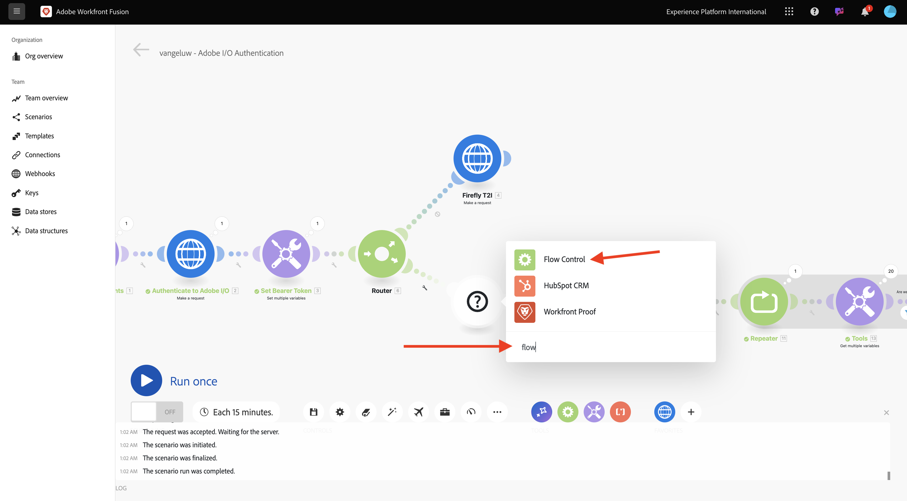
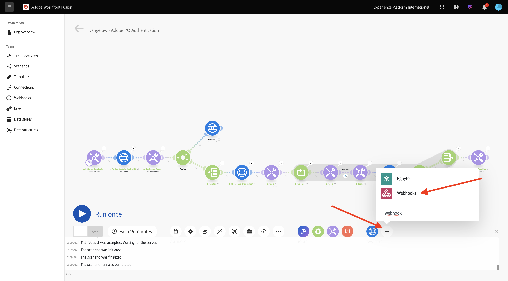

# 1.2.3 Procesautomatisering met Workfront Fusion

Uw scenario ziet er nu zo uit.


## 1.2.3.1 Iteratie over meerdere waarden

Tot nu toe hebt u tekst in een Photoshop-bestand gewijzigd met een statische waarde. Als u uw workflows voor het maken van inhoud wilt schalen en automatiseren, moet u de lijst met waarden doorlopen en deze waarden dynamisch invoegen in het Photoshop-bestand. In de volgende stappen voegt u een herhaling toe over waarden in uw bestaande scenario.

In tussen de **knoop van de Router** en de **knoop van de Tekst van de Verandering van Photoshop**, klik het **moersleutelpictogram** en selecteer **voeg een module** toe.


Onderzoek naar `flow` en selecteer **de Controle van de Stroom**.



Selecteer **Teller**.


Dan moet je dit hebben.


Terwijl het mogelijk is om inputdossiers zoals Csv- dossiers te lezen, moet u momenteel een basisversie van een Csv- dossier gebruiken door een tekstkoord te bepalen en dat tekstdossier te verdelen.

U kunt de **gespleten** functie vinden door het **t** pictogram te klikken, waar u alle beschikbare functies ziet om tekstwaarden te manipuleren. Klik de **gespleten** functie, en u zou dit dan moeten zien.


De splitsfunctie verwacht een array van waarden voor de puntkomma en verwacht dat u het scheidingsteken na de puntkomma opgeeft. Voor deze test, zou u een eenvoudige serie met 2 gebieden moeten gebruiken, **kopen nu** en **klikt hier**, en de separator aan gebruik is **,**.

Ga dit op het **gebied van de Serie** door de momenteel lege **gespleten** functie te vervangen: `{{split("Buy now, Click here "; ",")}}`. Klik **OK**.


Uw iterator wordt nu gevormd en als u uw scenario nu in werking zou stellen, zou het het tweemaal uitvoeren. Er is niettemin nog een probleem, aangezien u momenteel statische waarden in uw **knoop van de Tekst van de Verandering van Photoshop** gebruikt. Klik **de Tekst van de Verandering van Photoshop** om in sommige variabelen in plaats van statische waarden voor de input en outputgebieden toe te voegen.


In de **inhoud van het Verzoek**, zult u de tekst **hier** zien klikken. Deze tekst moet worden vervangen door de waarden uit uw array.


Schrap de tekst **hier** klikt, en vervangt het door de veranderlijke **Waarde** van de **Iterator** knoop te selecteren. Zo zorgt u ervoor dat de tekst op de knop in uw Photoshop-document dynamisch wordt bijgewerkt.


U moet ook de bestandsnaam bijwerken waarmee het bestand in uw Azure Storage Account wordt geschreven. Als de bestandsnaam statisch is, wordt het vorige bestand door elke nieuwe versie overschreven en gaan de aangepaste bestanden verloren. Huidige statische filename is **burgerschap-vezel-veranderd-text.psd**, en u moet nu dat bijwerken. Plaats de cursor achter het woord `text` .


Eerst, voeg een afbreekstreepje `-` toe en selecteer dan de waarde **Positie van de Volgorde van de Bundel**. Zo zorgt u ervoor dat Workfront Fusion voor de eerste iteratie `-1` toevoegt aan de bestandsnaam, voor de tweede iteratie `-2` enzovoort. Klik **OK**.


Sparen uw scenario en klik dan **Looppas eens**.


Als het scenario eenmaal is uitgevoerd, gaat u terug naar uw Azure Storage Explorer en vernieuwt u de map. De twee nieuwe bestanden worden dan weergegeven.


Download en open elk bestand. Vervolgens ziet u de verschillende teksten op de knoppen. Dit is bestand `citisignal-fiber-changed-text-1.psd` .


Dit is bestand `citisignal-fiber-changed-text-2.psd` .


## 1.2.3.2 Actief uw scenario gebruikend een webhaak

Tot dusver, hebt u uw scenario manueel in werking gesteld om te testen. Werk nu uw scenario bij met een webhaak, zodat het vanuit een externe omgeving kan worden geactiveerd.

Klik **+** pictogram, onderzoek naar **webhaak** en selecteer dan **Webhooks**.



Selecteer **Webhaak van de Douane**.

Sleep en verbind de **knoop van de Douane webhaak** zodat het met de eerste knoop op het canvas verbindt, die **wordt genoemd initialiseert Constanten**.


Klik de **knoop van de Webhaak van de Douane**. Dan, klik **toevoegen**.


Plaats de **naam van Webhaak** aan `--aepUserLdap-- - Tutorial 1.2`.


Controle checkbox voor **krijgt verzoekkopballen**. Klik **sparen**.


De URL van uw webhaak is nu beschikbaar. De URL kopiëren.


Open Postman en voeg een nieuwe omslag in de inzameling **toe FF - Firefly van de Diensten de Technologie Insiders van de Diensten**.


Geef de map een naam `--aepUserLdap-- - Workfront Fusion` .


In de omslag die u enkel creeerde, klik de 3 punten **...** en selecteer **verzoek** toevoegen.


Plaats het **type van Methode** aan **POST** en kleef URL van uw webhaak in de adresbar.


U moet een douanelichaam verzenden, zodat de veranderlijke elementen van een externe bron aan uw scenario van de Fusie van Workfront kunnen worden verstrekt. Ga naar **Lichaam** en selecteer **onbewerkt**.


Plak de onderstaande tekst in de hoofdtekst van uw verzoek. Klik **verzenden**.

```json
{
    "psdTemplate": "placeholder",
    "xlsFile": "placeholder"
}
```


Ga terug naar Workfront Fusion. U zult nu een bericht op uw douane webhaak zien die zegt: **met succes bepaalde**.


Klik **sparen** en klik dan **in werking stellen eens**. Uw scenario zal nu actief zijn maar zal niet lopen tot u **klikt verzendt** opnieuw in Postman.


Ga naar Postman, en klik **verzenden** opnieuw.


Uw scenario zal dan opnieuw lopen, en creeer de 2 dossiers enkel als voordien.


Wijzig de naam van uw Postman-aanvraag in `POST - Send Request to Workfront Fusion Webhook` .


U moet nu beginnen veranderlijk **psdTemplate** te gebruiken. In plaats van hardcoding de plaats van het inputdossier in de **knoop van de Tekst van de Verandering van Photoshop**, zult u nu de inkomende variabele van het verzoek van Postman gebruiken.

Open de **knoop van de Tekst van de Verandering van Photoshop** en ga naar **inhoud van het Verzoek**. Selecteer hardcoded filename **burgerschap-fiber.psd** onder **input** en schrap het.


Selecteer veranderlijk **psdTemplate**. Klik **O.K.** en bewaar dan uw scenario.


Klik **AAN** om uw scenario aan te zetten. Uw scenario zal nu zonder stop lopen.


Ga terug naar Postman. Ga filename `citisignal-fiber.psd` als waarde voor veranderlijke **psdTemplate** in en klik **verzend** opnieuw om uw scenario opnieuw in werking te stellen.


Door het malplaatje van de PSD als variabele te specificeren die door een extern systeem wordt verstrekt, hebt u nu een herbruikbaar scenario gebouwd.

Je hebt deze oefening nu afgerond.

Volgende Stap: [ Samenvatting &amp; Voordelen ](./summary.md)

[Terug naar module 1.2](./automation.md)

[Terug naar alle modules](./../../../overview.md)
