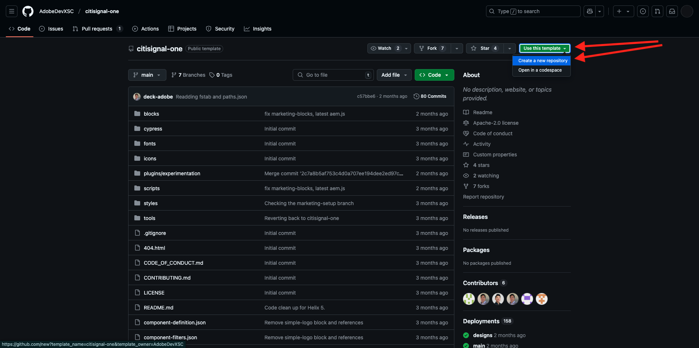
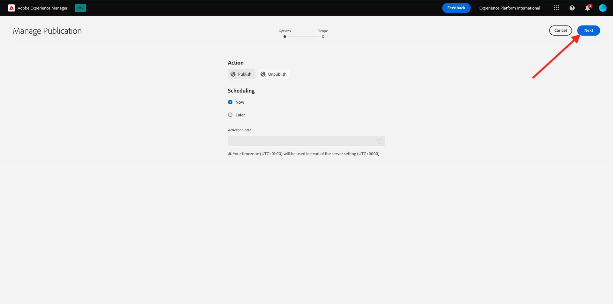

# 2.1.2 De AEM CS-omgeving instellen

## 2.1.2.1 Opstelling uw repo van GitHub

Ga naar [ https://github.com ](https://github.com). Klik **Teken binnen**.

Voer uw referenties in. Klik **Teken binnen**.

Zodra binnen ondertekend, zult u uw dashboard zien GitHub.

Ga naar [ https://github.com/AdobeDevXSC/citisignal-one ](https://github.com/AdobeDevXSC/citisignal-one). Dan zie je dit. Klik **Gebruik dit malplaatje** en klik dan **creeer een nieuwe bewaarplaats**.

Voor de **naam van de Bewaarplaats**, gebruik `citisignal`. Plaats het zicht aan **Privé**. Klik **creeer bewaarplaats**.

Na een paar seconden wordt de repository gemaakt.

Daarna, ga naar [ https://github.com/apps/aem-code-sync ](https://github.com/apps/aem-code-sync). Klik **vormen**.

Klik op uw GitHub-account.

Klik **slechts uitgezochte bewaarplaatsen** en voeg dan de bewaarplaats toe die u enkel creeerde. Daarna, klik **installeren**.

Je krijgt deze bevestiging.

## 2.1.2.2 Bestand fstab.yaml bijwerken

Klik in uw GitHub-repo om het bestand `fstab.yaml` te openen.

Klik **uitgeven** pictogram.

U moet nu de waarde voor het gebied **url** op lijn 4 bijwerken.

U moet de huidige waarde door URL van uw specifiek milieu van AEMCS in combinatie met de montages van uw reactie vervangen GitHub.

Dit is de huidige waarde van de URL: `https://author-p131639-e1282833.adobeaemcloud.com/bin/franklin.delivery/adobedevxsc/citisignal-one/main` .

Er zijn 3 delen van de URL die moeten worden bijgewerkt

`https://XXX/bin/franklin.delivery/YYY/ZZZ/main`

XXX moet worden vervangen door de URL van de AEM CS Author-omgeving.

YYYY zou door uw GitHub gebruiksrekening moeten worden vervangen.

ZZZ zou door de naam van de bewaarplaats moeten worden vervangen GitHub die u in de vorige oefening gebruikte.

U kunt URL van uw AEM milieu van de Auteur van CS vinden door [ https://my.cloudmanager.adobe.com ](https://my.cloudmanager.adobe.com) te gaan. Klik uw **Programma** om het te openen.

Daarna, klik de 3 punten **..** op het **milieu&#39;s** lusje en klik **Details van de Mening**.

U zult dan uw milieudetails, met inbegrip van URL van uw **milieu van de Auteur** zien. De URL kopiëren.

XXX = `author-p148073-e1511503.adobeaemcloud.com`

Voor de naam van de GitHub-gebruikersaccount kunt u dat gemakkelijk vinden in de URL van uw browser. In dit voorbeeld is de naam van de gebruikersaccount `woutervangeluwe` .

YYY = `woutervangeluwe`

Voor de bewaarplaatsnaam GitHub, kunt u het in het browser venster ook vinden dat u in GitHub hebt geopend. In dit geval is de naam van de gegevensopslagruimte `citisignal` .

ZZZ = `citisignal`

Deze drie waarden samen leiden tot deze nieuwe URL die moet worden geconfigureerd in het bestand `fstab.yaml` .

`https://author-p148073-e1511503.adobeaemcloud.com/bin/franklin.delivery/woutervangeluwe/citisignal/main`

Klik **Veranderingen vastleggen...**.

Klik **veranderingen** vastleggen.

Het bestand `fstab.yaml` is nu bijgewerkt.

## 2.1.2.3 CitiSignal-middelen uploaden

Ga naar [ https://my.cloudmanager.adobe.com ](https://my.cloudmanager.adobe.com). Klik uw **Programma** om het te openen.

Klik vervolgens op de URL van de omgeving van uw auteur.

Klik **Teken binnen met Adobe**.

U ziet dan de omgeving van uw auteur.

Uw URL ziet er als volgt uit: `https://author-p148073-e1511503.adobeaemcloud.com/ui#/aem/aem/start.html?appId=aemshell`

U moet nu tot het **milieu van de Manager van het Pakket van CRX** van AEM toegang hebben. U doet dit door `ui#/aem/aem/start.html?appId=aemshell` te verwijderen van de URL en deze te vervangen door `crx/packmgr` . Dit houdt in dat uw URL er nu als volgt moet uitzien:
`https://author-p148073-e1511503.adobeaemcloud.com/crx/packmgr` .
Het greep **gaat** binnen om het milieu van de pakketmanager te laden

Daarna, klik **uploadt pakket**.

Klik **doorbladeren** om van het te uploaden pakket de plaats te bepalen.

Het te uploaden pakket wordt genoemd **burgersignaal-assets.zip** en kan hier worden gedownload: [ https://tech-insiders.s3.us-west-2.amazonaws.com/one-adobe/citisignal-assets.zip ](https://tech-insiders.s3.us-west-2.amazonaws.com/one-adobe/citisignal-assets.zip).

Selecteer het pakket en klik **Open**.

Daarna, klik O.K. ****.

Het pakket wordt vervolgens geüpload.

Daarna, klik **installeer** op het pakket u enkel uploadde.

Klik **installeren**.

Na een paar minuten wordt uw pakket geïnstalleerd.

U kunt dit venster nu sluiten.

## 2.1.2.4 Publish CitiSignal-activa

Ga naar [ https://my.cloudmanager.adobe.com ](https://my.cloudmanager.adobe.com). Klik uw **Programma** om het te openen.

Klik vervolgens op de URL van de omgeving van uw auteur.

Klik **Teken binnen met Adobe**.

U ziet dan de omgeving van uw auteur. Klik **Plaatsen**.

Klik **Dossiers**.

Klik om de omslag **te selecteren CitiSignal** en dan **te klikken leidt Publicatie**.

Klik **daarna**.

Klik **Publish**.

Uw middelen zijn nu gepubliceerd.

## 2.1.2.5 CitiSignal-website maken

Ga naar [ https://my.cloudmanager.adobe.com ](https://my.cloudmanager.adobe.com). Klik uw **Programma** om het te openen.

Klik vervolgens op de URL van de omgeving van uw auteur.

Klik **Teken binnen met Adobe**.

U ziet dan de omgeving van uw auteur. Klik **Plaatsen**.

Klik **creëren** en klik dan **Plaats van malplaatje**.

Klik **Invoer**.

U moet nu een vooraf geconfigureerde sjabloon voor uw site importeren. U kunt het malplaatje [ hier ](./../../../assets/aem/citisignal-edge-delivery-services-template-0.0.4.zip) downloaden. Sla het bestand op uw bureaublad op.

Daarna, selecteer het dossier `citisignal-edge-delivery-services-template-0.0.4.zip` en klik **Open**.

Dan zie je dit. Klik om het malplaatje te selecteren u enkel uploadde en dan, klik **daarna**.

U moet nu enkele details invullen.

- Plaats titel: gebruik **CitiSignal**
- De naam van de plaats: gebruik **burgersignaal-één**
- GitHub URL: kopieer URL van de reactie GitHub u vóór gebruikte

Dan heb je dit. Klik **creëren**.

Uw site wordt nu gemaakt. Dit kan een paar minuten duren. Klik **OK**.

Vernieuw het scherm na een paar minuten en dan ziet u de zojuist gemaakte CitiSignal-website.

## 2.1.2.6 Publish CitiSignal-website

Daarna, klik checkbox vóór **CitiSignal**. Dan, klik **leiden Publicatie**.

Klik **daarna**.

Klik **omvatten de Montages van Kinderen**.

Klik om checkbox **te selecteren omvat kinderen** en klik dan om andere checkboxes te deselecteren. Klik **OK**.

Klik **Publish**.

Je wordt hier teruggestuurd. Navigeer aan **CitiSignal** > **gebruiken** > **en**. Klik checkbox voor **index** en klik dan **uitgeven**.

Uw website zal dan in de **Universele Redacteur** openen.

U kunt nu ook naar uw website navigeren door naar `main--citisignal--woutervangeluwe.aem.live/us/en` te gaan

[Terug naar module 2.1](./aemcs.md)

[Terug naar alle modules](./../../../overview.md)
