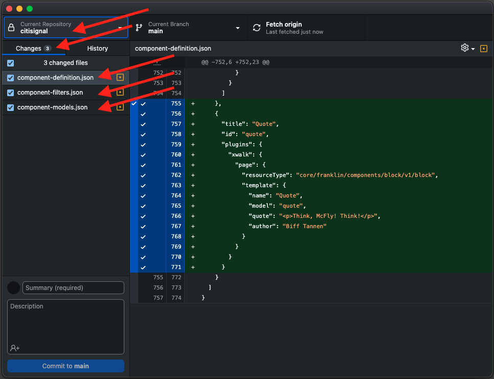
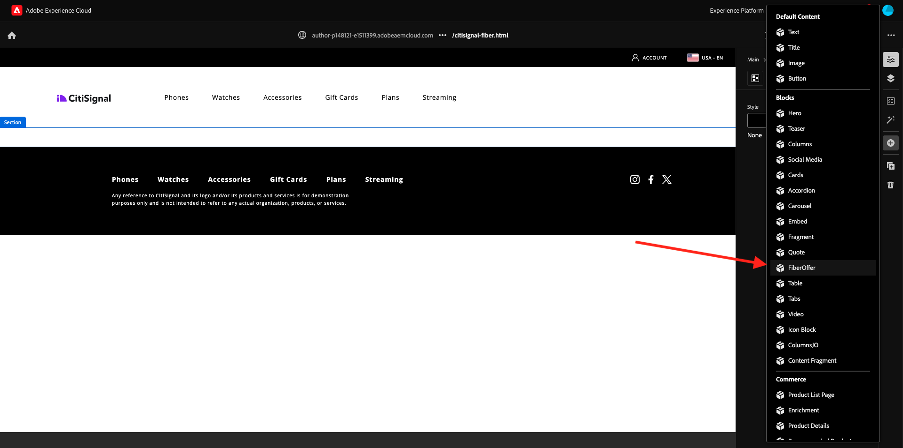
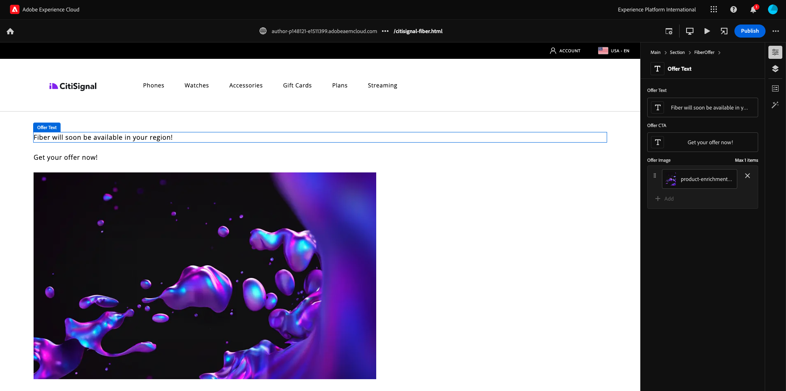
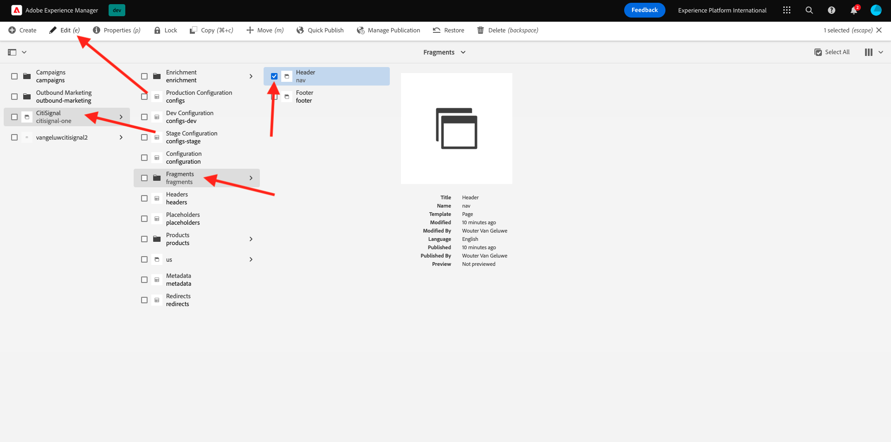

# 2.1.4 Een basisblok met aangepaste inhoud ontwikkelen

## 2.1.4.1 De lokale ontwikkelomgeving instellen

Ga naar [ https://desktop.github.com/download/ ](https://desktop.github.com/download/) {target="_blank"}, download en installeer **Desktop van Github**.


Zodra de Desktop van Github geïnstalleerd is, ga naar de reactie GitHub u in de vorige oefening creeerde. Klik **&lt;> Code** en klik dan **Open met Desktop GitHub**.


Uw reactie GitHub zal dan in de Desktop worden geopend GitHub. Voel vrij om de **Lokale Weg** te veranderen. Klik **Kloon**.


Er wordt nu een lokale map gemaakt.


Open Visual Studio Code. Ga naar **Dossier** > **Open Omslag**.


Selecteer de omslag die door uw opstelling GitHub voor **burgersignaal** wordt gebruikt.


U zult nu die omslag open in de Code van Visual Studio zien, bent u nu bereid om een nieuw blok tot stand te brengen.


## 2.1.4.2 Een basisblok voor aangepaste documenten maken

De Adobe beveelt aan dat u blokken in een driefasenaanpak ontwikkelt:

- Maak de definitie en het model voor het blok, herzie het, en breng het aan productie.
- Maak inhoud met het nieuwe blok.
- Implementeer de decoratie en stijlen voor het nieuwe blok.

### component-definition.json

In de Code van Visual Studio, open het dossier **component-definition.json**.


De rol neer tot u de component **Citaat** ziet. Plaats uw curseur naast de sluitende steun van de laatste component.


Plak deze code en voer een komma **** na het codeblok in:

```json
{
  "title": "FiberOffer",
  "id": "fiberoffer",
  "plugins": {
    "xwalk": {
      "page": {
        "resourceType": "core/franklin/components/block/v1/block",
        "template": {
          "name": "FiberOffer",
          "model": "fiberoffer",
          "offerText": "<p>Fiber will soon be available in your region!</p>",
          "offerCallToAction": "Get your offer now!",
          "offerImage": ""
        }
      }
    }
  }
}
```

Sla uw wijzigingen op.


### component-models.json

In de Code van Visual Studio, open het dossier **component-models.json**.


Schuif omlaag totdat u het laatste item ziet. Plaats uw curseur naast de sluitende steun van de laatste component.


Voer een komma **** in en druk op Enter en op de volgende regel en plak deze code:

```json
{
  "id": "fiberoffer",
  "fields": [
     {
       "component": "richtext",
       "name": "offerText",
       "value": "",
       "label": "Offer Text",
       "valueType": "string"
     },
     {
       "component": "richtext",
       "valueType": "string",
       "name": "offerCallToAction",
       "label": "Offer CTA",
       "value": ""
     },
     {
       "component": "reference",
       "valueType": "string",
       "name": "offerImage",
       "label": "Offer Image",
        "multi": false
     }
   ]
}
```

Sla uw wijzigingen op.


### component-filters.json

In de Code van Visual Studio, open het dossier **component-filters.json**.


Onder **sectie**, ga een komma **in,** en identiteitskaart van uw component **fiberaanbieding** na de huidige laatste lijn.

Sla uw wijzigingen op.


## 2.1.4.3 Uw wijzigingen vastleggen

U hebt nu verscheidene veranderingen in uw project aangebracht die terug naar uw bewaarplaats moeten worden geëngageerd GitHub. Om dat te doen, open **Desktop GitHub**.

U zou dan de 3 dossiers moeten zien die u enkel onder **Veranderingen** uitgeeft. Controleer uw wijzigingen.



Voer een naam in voor uw PR, `Fiber Offer custom block` . Klik **Vastleggen aan hoofd**.


Dan moet je dit zien. Klik **Push oorsprong**.


Na een paar seconden, zijn uw veranderingen geduwd aan uw bewaarplaats GitHub.


Ga in uw browser naar uw GitHub-account en naar de opslagplaats die u voor CitiSignal hebt gemaakt. Dan zou je iets dergelijks moeten zien, waaruit blijkt dat je wijzigingen zijn ontvangen.


## 2.1.4.4 Voeg uw blok aan een pagina toe

Nu uw basis citaatblok wordt bepaald en aan het project CitiSignal geëngageerd, kunt u a **fiberbied** blok aan een bestaande pagina toevoegen.

Ga naar [ https://my.cloudmanager.adobe.com ](https://my.cloudmanager.adobe.com) {target="_blank"}. Klik uw **Programma** om het te openen.


Daarna, klik de 3 punten **..** op het **milieu&#39;s** lusje en klik **Details van de Mening**.


Dan zie je de omgevingsdetails. Klik URL van uw **milieu van de Auteur**.

>[!NOTE]
>
>Het is mogelijk dat uw omgeving gehiberd is. Als dat het geval is, zult u uw milieu eerst moeten ontberen.


U moet dan de omgeving van uw AEM zien. Ga naar **Plaatsen**.


Ga naar **CitiSignal** > **gebruiken** > **en**.


Klik **creëren** en selecteren **Pagina**.


Selecteer **Pagina** en klik **daarna**.


Voer de volgende waarden in:

- Titel: **CitiSignal Fiber**
- Naam: **burgerschap-vezel**
- De Titel van de pagina: **CitiSignal Vezel**

Klik **creëren**.


Dan moet je dit zien.


Klik op het lege gebied om de **sectie** component te selecteren. Klik vervolgens op de plusknop **+** in het rechtermenu.


Vervolgens wordt het aangepaste blok weergegeven in de lijst met beschikbare blokken. Klik om het te selecteren.



U zult dan gebieden als **Tekst van de Aanbieding** zien, **CTA van de Aanbieding** en **Beeld van de Aanbieding** wordt toegevoegd aan de redacteur. Klik **+ voeg** op het **gebied van het Beeld van de Aanbieding** toe om een beeld te selecteren.


Dan moet je dit zien. Klik om de omslag **burgersignaal** te openen.


Selecteer het beeld **product-verrijking-1.png**. Klik **Uitgezocht**.


Dan moet je dit hebben. Klik **Publish**.



Klik **opnieuw Publish**.


Uw nieuwe pagina is nu gepubliceerd.

## 2.1.4.5 De nieuwe pagina toevoegen aan het navigatiemenu

In uw overzicht van AEM Sites, ga **CitiSignal** > **Fragments** en controleer checkbox voor **Kopbal**. Klik **uitgeven**.



Voeg met de tekst `Fiber` een menuoptie toe aan het navigatiemenu. Selecteer de tekst **Vezel** en klik het **verbindings** pictogram.


Ga dit voor **URL** in `/us/en/citisignal-fiber` en klik het **V** pictogram om te bevestigen.


Dan moet je dit hebben. Klik **Publish**.


Klik **opnieuw Publish**.


U kunt nu de wijzigingen in uw website bekijken door naar `main--citisignal--XXX.aem.page/us/en` en/of `main--citisignal--XXX.aem.live/us/en` te gaan, nadat u XXX hebt vervangen door uw GitHub-gebruikersaccount, die in dit voorbeeld `woutervangeluwe` is.

In dit voorbeeld wordt de volledige URL als volgt:
`https://main--citisignal--woutervangeluwe.aem.page/us/en` en/of `https://main--citisignal--woutervangeluwe.aem.live/us/en` .

Dan moet je dit zien. Klik **Vezel**.


Hier is uw standaard aangepaste blok, maar nu weergegeven op de website.


Volgende Stap: [ 2.1.5 Geavanceerd Blok van de Douane ](./ex5.md){target="_blank"}

[ ga terug naar Module 2.1 ](./aemcs.md){target="_blank"}

[ ga terug naar Alle Modules ](./../../../overview.md){target="_blank"}
