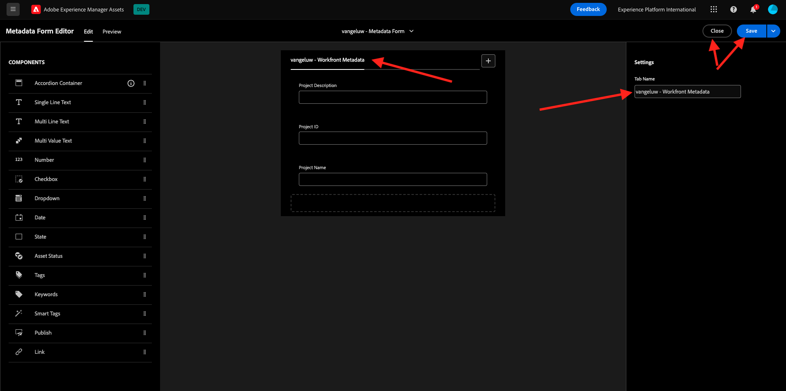
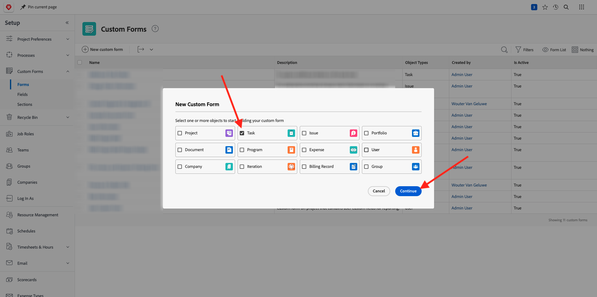
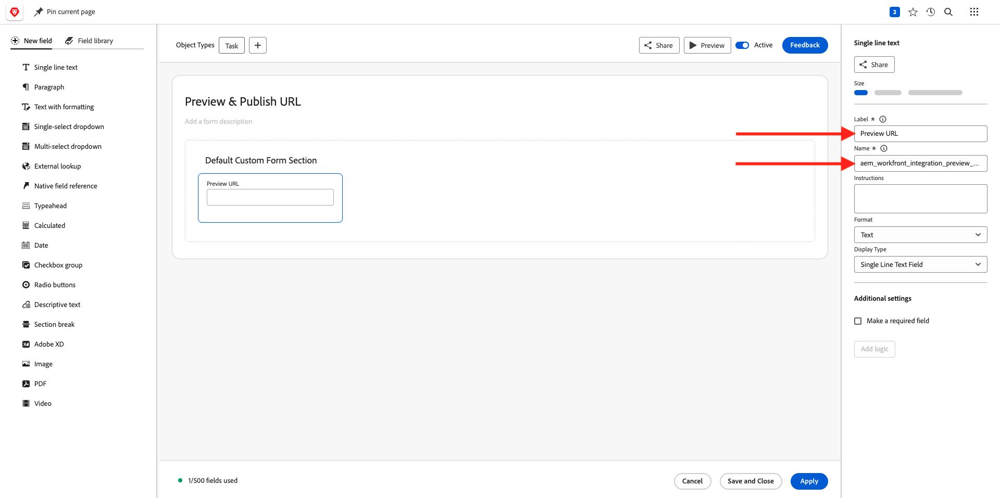

# 2.2.1 Aan de slag met Workfront

Login aan Adobe Workfront door naar [ https://experienceplatform.my.workfront.com/ ](https://experienceplatform.my.workfront.com/) te gaan {target="_blank"}.

Dan zie je dit.

## 2.2.1.1 De AEM Assets-integratie configureren

Klik het 9 punten **hamburger** pictogram en selecteer dan **Opstelling**.

In het linkermenu, scrol neer aan **Documenten** en klik dan **Experience Manager Assets**.

Klik op **+ Integratie van Experience Manager toevoegen** .

Gebruik `--aepUserLdap-- - Citi Signal AEM` voor de naam van uw integratie.

Open de **dropdown plaats van de Experience Manager** en selecteer uw AEMinstantie CS, die zou moeten worden genoemd `--aepUserLdap-- - Citi Signal`.

Onder **Meta-gegevens**, vorm de volgende afbeelding:

| Workfront-veld | Experience Manager Assets-veld |
| --------------- | ------------------------------ | 
| **Document** > **Naam** | **wm:documentName** |
| **Project** > **Beschrijving** | **wm:projectDescription** |
| **Taak** > **Naam** | **wm:taskName** |
| **Taak** > **Beschrijving** | **wm:taskDescription** |

Laat de schakelaar voor **objecten meta-gegevens van de Synchronisatie** toe.

Klik **sparen**.

Uw integratie van Workfront naar AEM Assets CS is nu geconfigureerd.

## 2.2.1.2 Integratie van metagegevens met AEM Assets configureren

Vervolgens moet u AEM Assets zodanig configureren dat de metagegevensvelden van het element in Workfront worden gedeeld met AEM.

Om dat te doen, ga naar [ https://experience.adobe.com/ ](https://experience.adobe.com/). Klik **Experience Manager Assets**.

Klik om de AEM Assets-omgeving te selecteren. Deze moet de naam `--aepUserLdap-- - Citi Signal dev` hebben.

Dan moet je dit zien. In het linkermenu, ga naar **Assets** en klik **creeer Omslag**.

Noem uw omslag `--aepUserLdap-- - Workfront Assets` en klik **creëren**.

Daarna, ga naar **Meta-gegevens Forms** in het linkermenu en klik dan **creeer**.

Gebruik de naam `--aepUserLdap-- - Metadata Form` en klik **creëren**.

Voeg 3 nieuwe **Enige gebieden van de Tekst van de Lijn** aan de vorm toe en selecteer het eerste gebied. Dan, klik het **pictogram van het Schema** naast het **bezit van Meta-gegevens** gebied.

Op het onderzoeksgebied, ga `wm:project` in en selecteer dan de gebied **Beschrijving van het Project**. Klik **Uitgezocht**.

Verander het etiket van het gebied in **Beschrijving van het Project**.

Daarna, selecteer het tweede **Enige gebied van de Tekst van de Lijn** en klik opnieuw het **pictogram van het Schema** naast het **bezit van Meta-gegevens**.

Dan zie je deze popup weer. Op het onderzoeksgebied, ga `wm:project` in en selecteer dan identiteitskaart van het gebied **Project**. Klik **Uitgezocht**.

Verander het etiket van het gebied in **identiteitskaart van het Project**.

Selecteer het 3de **Enige gebied van de Tekst van de Lijn** en klik opnieuw het **Schema** pictogram naast het **bezit van Meta-gegevens** gebied.

Dan zie je deze popup weer. Op het onderzoeksgebied, ga `wm:project` in en selecteer dan de gebied **Naam van het Project**. Klik **Uitgezocht**.

Verander het etiket van het gebied in **Naam van het Project**. Klik **sparen**.

Verander de **naam van het Lusje** op de vorm in `--aepUserLdap-- - Workfront Metadata`. Klik **sparen** en **dicht**.

Uw **Vorm van Meta-gegevens** wordt nu gevormd.

Vervolgens moet u het metagegevensformulier toewijzen aan de map die u eerder hebt gemaakt. Controleer checkbox voor uw Vorm van Meta-gegevens en klik **toewijzen aan Omslag(s)**.

Selecteer de map met de naam `--aepUserLdap-- - Workfront Assets` . Klik **toewijzen**.

Het metagegevensformulier is nu toegewezen aan uw map.

## 2.2.1.2 De AEM Sites-integratie configureren

>[!NOTE]
>
>Deze insteekmodule is momenteel op **Vroege wijze van de Toegang** en is over het algemeen nog niet beschikbaar.
>
>Deze insteekmodule is mogelijk al geïnstalleerd in het Workfront-exemplaar dat u gebruikt. Als deze al is geïnstalleerd, kunt u de onderstaande instructies bekijken, maar hoeft u niets te wijzigen in uw configuratie.

Ga naar [ https://experience.adobe.com/#/@experienceplatform/aem/extension-manager/universal-editor ](https://experience.adobe.com/#/@experienceplatform/aem/extension-manager/universal-editor) {target="_blank"}.

Zorg ervoor de **knevel** voor deze stop wordt geplaatst aan **Toegelaten**. Dan, klik het **versnelling** pictogram.

U zult een **configuratie van de Uitbreiding** popup zien. Configureer de volgende velden om deze insteekmodule te gebruiken.

| Sleutel | Waarde |
| --------------- | ------------------------------ | 
| **`IMS_ENV`** | **PROD** |
| **`WORKFRONT_INSTANCE_URL`** | **https://experienceplatform.my.workfront.com** |
| **`SHOW_CUSTOM_FORMS`** | **&#39;{&quot;previewUrl&quot;: true, &quot;publishUrl&quot;: true}&#39;** |

Klik **sparen**.

Ga terug naar uw Workfront UI en klik het 9 punten **hamburger** pictogram. Selecteer **Opstelling**.

In het linkermenu, ga naar **Douane Forms** en selecteer **Vorm**. Klik op **+ Nieuw aangepast formulier** .

Selecteer **Taak** en klik **verdergaan**.

Vervolgens ziet u een leeg aangepast formulier. Voer de formuliernaam in `Content Fragment & Integration ID` .

De belemmering en laat vallen een nieuw **Enige lijntekst** gebied op het canvas.

Vorm het nieuwe gebied als dit:

- **Etiket**: **het Fragment van de Inhoud**
- **Naam**: **`aem_workfront_integration_content_fragment`**

Voeg een nieuw **Enige lijntekst** gebied op het canvas toe en vorm het nieuwe gebied als dit:

- **Etiket**: **identiteitskaart van de Integratie**
- **Naam**: **`aem_workfront_integration_id`**

Klik **toepassen**.

U moet nu een tweede aangepast formulier configureren. Klik op **+ Nieuw aangepast formulier** .

Selecteer **Taak** en klik **verdergaan**.

Vervolgens ziet u een leeg aangepast formulier. Voer de formuliernaam in `Preview & Publish URL` .

De belemmering en laat vallen een nieuw **Enige lijntekst** gebied op het canvas.

Vorm het nieuwe gebied als dit:

- **Etiket**: **Voorproef URL**
- **Naam**: **`aem_workfront_integration_preview_url`**

Voeg een nieuw **Enige lijntekst** gebied op het canvas toe en vorm het nieuwe gebied als dit:

- **Etiket**: **Publish URL**
- **Naam**: **`aem_workfront_integration_publish_url`**

Klik **toepassen**.

U hebt dan twee aangepaste formulieren beschikbaar.

Volgende Stap: [ 2.2.2 het Bewijzen met Workfront ](./ex2.md){target="_blank"}

[ ga terug naar Module 2.2 ](./workfront.md){target="_blank"}

[ ga terug naar Alle Modules ](./../../../overview.md){target="_blank"}
