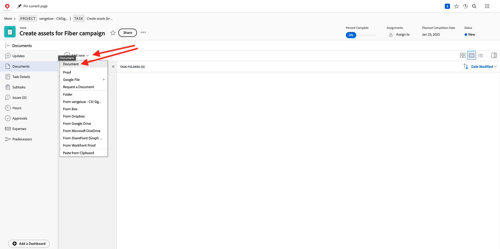
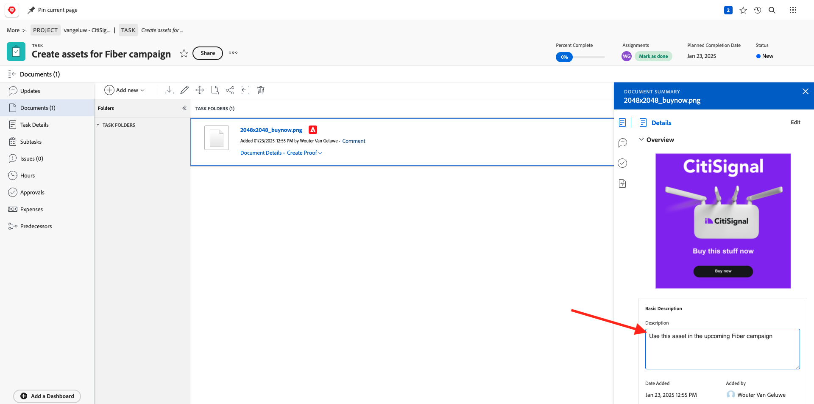
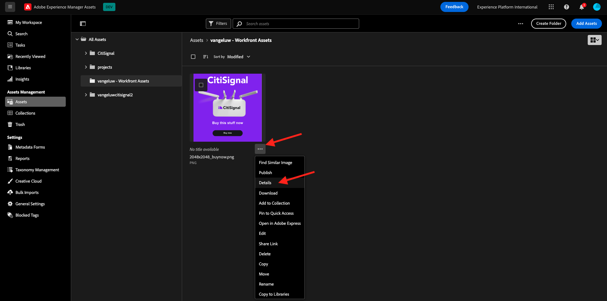
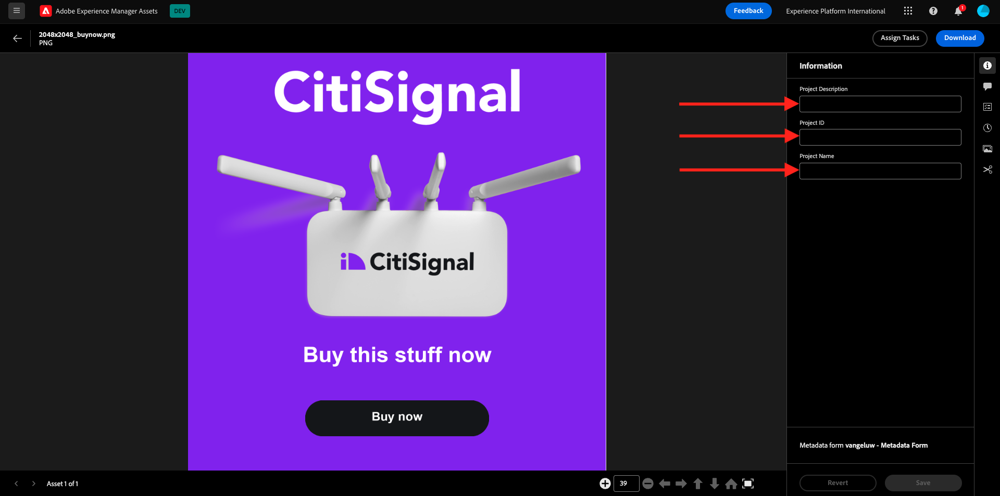

# 2.2.2 Proofing met Workfront

## 2.2.2.1 Nieuwe goedkeuringsstroom maken

Ga naar [ https://experienceplatform.my.workfront.com/ ](https://experienceplatform.my.workfront.com/) {target="_blank"}.

Klik het 9 punten **hamburger** pictogram en selecteren **het Bewijzen**.

Ga naar **Werkschema&#39;s**, klik **+ Nieuw** en selecteer dan **Nieuw malplaatje**.

Plaats de **naam van het Malplaatje** aan `--aepUserLdap-- - Approval Workflow` en plaats de **eigenaar van het Malplaatje** aan zich.

De rol neer, en onder **Staven** > **Stadium 1**, voegt **Wouter van Geluwe** met de **Rol** van **Reviewer &amp; Approver** toe.

Klik **creëren**.

Uw basisgoedkeuringswerkstroom is nu klaar om te worden gebruikt.

## 2.2.2.2 Een nieuw project maken

Van de homepage van Workfront, klik **Nieuw** in **Mijn Projecten** tabel. Selecteer **Leeg Project**.

Dan moet je dit zien. Wijzig de naam in `--aepUserLdap-- - CitiSignal Fiber Launch` .

Uw project is nu gemaakt.

## 2.2.2.3 Nieuwe taak maken

Ga deze naam voor uw taak in: **creeer activa voor de campagne van de Vezel**. Klik **creëren Taak**.

Dan moet je dit zien.

## 2.2.2.4 Voeg een nieuw Document aan uw Taak toe gaat door de goedkeuringsstroom

Klik **+ voeg nieuw** toe en selecteer dan **Document**.

Download [ dit dossier ](./images/2048x2048.png) aan uw Desktop.

{width="50px" align="left"}

Selecteer het dossier **2048x2048.png** en klik **Open**.

Dan moet je dit hebben. Klik **creeer proef** en kies dan **Geavanceerde Bewijs**.

In het **nieuwe proefdruk** venster, selecteer het werkschemamalplaatje dat u eerder creeerde, dat zou moeten worden genoemd `--aepuserLdap-- - Approval Workflow`. Klik **creëren Bewijs**.

Dan ben je weer aan het werk. Klik **toewijzen aan** knoop en selecteer **toewijzen aan me**.

Klik **sparen**.

Klik **Werk op het**.

Klik **Open Bewijs**

U kunt de proefdruk nu controleren. Selecteer **toevoegen commentaar** om een opmerking toe te voegen die het document vereist om worden veranderd.

Ga uw commentaar in en klik **Post**. Klik **dicht**.

Daarna, moet u uw rol van **Recensent** in **Recensent &amp; Approver** veranderen. Om dat te doen, ga terug naar uw Taak en klik **het Beproeven Werkschema**.

Verander uw rol van **Recensent** in **Recensent &amp; Fiatteur**.

Ga terug naar je taak en open de proefdruk opnieuw. U ziet nu een nieuwe knoop, **besluit van het Merk**. Klik erop.

Selecteer **vereiste Veranderingen** en klik **besluit** nemen.

Dan moet je hier weer zijn. U moet nu een tweede afbeelding uploaden die rekening houdt met de opmerkingen die zijn opgegeven.

Download [ dit dossier ](./images/2048x2048_buynow.png) aan uw Desktop.

{width="50px" align="left"}

Selecteer in de taakweergave het oude afbeeldingsbestand dat niet is goedgekeurd. Dan, klik **+ voeg nieuw** toe, selecteer **Versie** en selecteer dan **Document**.

Selecteer het dossier **2048x2048_buynow.png** en klik **Open**.

Dan moet je dit hebben. Klik **creeer proef** en selecteer dan **Geavanceerde Bewijs** opnieuw.

Dan zie je dit. Het **malplaatje van het Werkschema** wordt nu vooraf geselecteerd aangezien Workfront veronderstelt dat het vorige goedkeuringswerkschema nog geldig is. Klik **creëren Bewijs**.

Selecteer **Open Bewijs**.

U ziet nu twee versies van het bestand naast elkaar.

Klik **besluit van het Merk**, selecteer **Goedgekeurd** en klik **besluit** opnieuw maken.

Sluit de proefdrukvoorvertoning.

U zult dan terug in uw mening van de Taak, met goedgekeurd activa zijn. Dit middel moet nu worden gedeeld met AEM Assets.

Klik het **pijlpictogram van het Aandeel** en selecteer uw integratie van AEM Assets, die zou moeten worden genoemd `--aepUserLdap-- - Citi Signal AEM`.

Dubbelklik op de map die u eerder hebt gemaakt en die u de naam `--aepUserLdap-- - Workfront Assets` moet geven.

Klik **Uitgezochte omslag**.

Na 1-2 minuten wordt uw document nu gepubliceerd in AEM Assets. Er verschijnt een AEM naast de documentnaam.

Klik **Open samenvatting**.

Ga naar **Meta-gegevens**, zou u dit moeten zien:

Ga naar **Overzicht** en klik **+** toevoegen om een beschrijving toe te voegen.

Voer je beschrijving in. Uw proefdruk- en documentinstellingen zijn nu klaar.

## 2.2.2.5 Bekijk uw bestand in AEM Assets

Ga naar de map in AEM Assets met de naam `--aepUserLdap - Workfront Assets` .

Klik de 3 punten onder uw beeld, en selecteer dan **Details**.

Vervolgens ziet u het eerder gemaakte metagegevensformulier met de waarden die automatisch zijn ingevuld door de integratie tussen Workfront en AEM Assets.

[ ga terug naar Module 2.2 ](./workfront.md){target="_blank"}

[ ga terug naar Alle Modules ](./../../../overview.md){target="_blank"}
