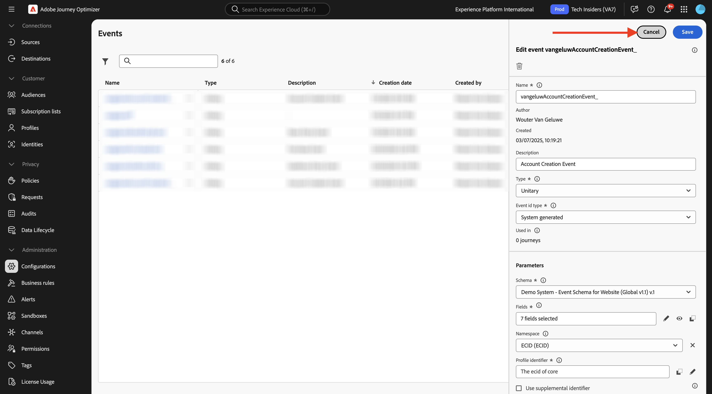

# 3.1.1 Een gebeurtenis maken

Login aan Adobe Journey Optimizer door naar [ Adobe Experience Cloud ](https://experience.adobe.com) te gaan. Klik **Journey Optimizer**.

U zult aan de **1} mening van het Huis {in Journey Optimizer worden opnieuw gericht.** Eerst, zorg ervoor u de correcte zandbak gebruikt. De sandbox die moet worden gebruikt, wordt `--aepSandboxName--` genoemd.

In het linkermenu, scrol neer en klik **Configuraties**. Daarna, klik **leiden** knoop onder **Gebeurtenissen**.

Vervolgens ziet u een overzicht van alle beschikbare gebeurtenissen. Klik **creëren Gebeurtenis** beginnen uw eigen gebeurtenis te creëren.

Er verschijnt dan een nieuw, leeg gebeurtenisvenster.

Geef uw gebeurtenis eerst een naam zoals deze: `--aepUserLdap--AccountCreationEvent` .
Plaats de beschrijving aan `Account Creation Event`, zorg ervoor het **Type** aan **Eenheids** wordt geplaatst en voor de **Identiteitskaart van de Gebeurtenis** selectie, uitgezocht **Gegenereerd Systeem**.

Nu de selectie van het schema. Gebruik het schema `Demo System - Event Schema for Website (Global v1.1) v.1` .

Na het selecteren van het Schema, zult u een aantal gebieden zien die in de **sectie van de Lading** worden geselecteerd. U zou nu over de **sectie van de Payload** moeten bewegen en u zult 3 pictogrammen popup zien. Klik op **uitgeven** pictogram.

U zult het venster van a **Gebieden** popup zien, waarin u enkele gebieden moet selecteren die wij e-mail moeten personaliseren.  We kiezen later andere profielkenmerken met de gegevens die al in Adobe Experience Platform staan.

In het voorwerp `--aepTenantId--.demoEnvironment`, zorg gelieve ervoor om de gebieden **brandLogo** en **brandName** te selecteren.

In het voorwerp `--aepTenantId--.identification.core`, gelieve ervoor te zorgen om het gebied **e-mail** te selecteren. Klik **O.K.** om uw veranderingen te bewaren.

Dan moet je dit zien. Plaats **Namespace** aan **ECID (ECID)**. Klik **sparen**.

Uw gebeurtenis is nu geconfigureerd en opgeslagen.

Klik opnieuw uw gebeurtenis om **te openen geef het 1} scherm van de Gebeurtenis {opnieuw uit.** Beweeg over het **gebied van de Lading** opnieuw om de 3 pictogrammen opnieuw te zien. Klik op het **pictogram van de Payload van de Mening**.

U zult nu een voorbeeld van de verwachte nuttige lading zien.

Uw gebeurtenis heeft een unieke orchestration eventID, die u kunt vinden door neer in die lading te scrollen tot u `_experience.campaign.orchestration.eventID` ziet.

De gebeurtenis-id is wat naar Adobe Experience Platform moet worden verzonden om de volgende reis te activeren. Herinner deze eventID, aangezien u het in één van de volgende oefeningen zult nodig hebben.
`"eventID": "5ae9b8d3f68eb555502b0c07d03ef71780600c4bd0373a4065c692ae0bfbd34d"`

Klik **OK**.

Klik **annuleren**.

Je hebt deze oefening nu afgerond.

## Volgende stappen

Ga naar [ 3.1.2 creeer fragmenten in uw bericht moeten worden gebruikt ](./ex2.md){target="_blank"}

Ga terug naar [ Adobe Journey Optimizer: Orchestratie ](./journey-orchestration-create-account.md){target="_blank"}

Ga terug naar [ Alle modules ](./../../../../overview.md){target="_blank"}
