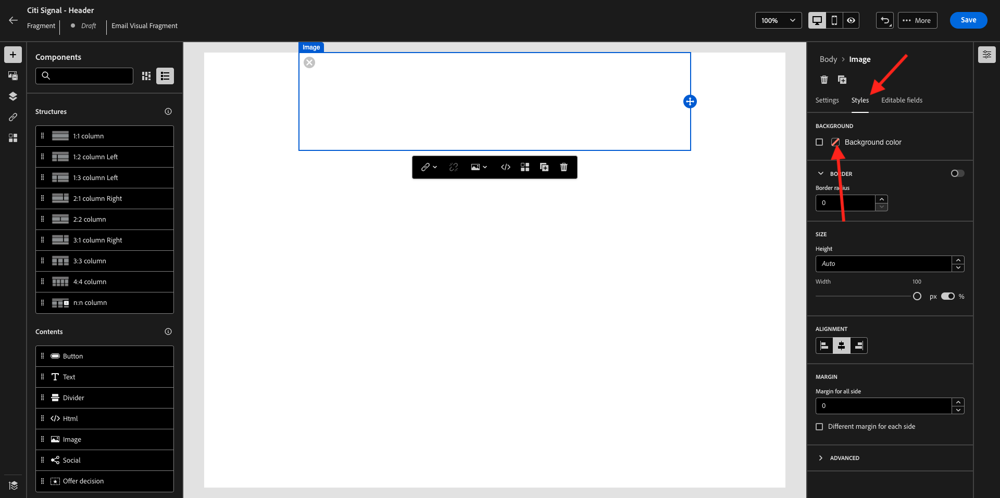
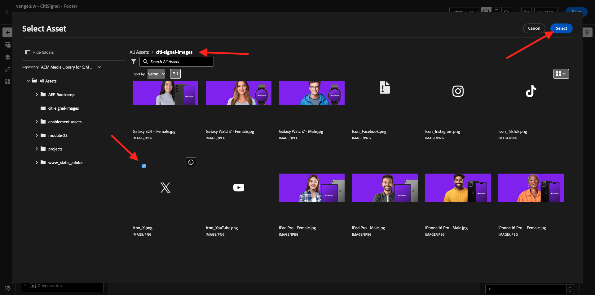

# 3.1.2 Fragmenten maken voor gebruik in uw bericht

In deze oefening, zult u 2 fragmenten, 1 voor een herbruikbare kopbal en 1 voor herbruikbare footer vormen.

Login aan Adobe Journey Optimizer door naar [ Adobe Experience Cloud ](https://experience.adobe.com) te gaan. Klik **Journey Optimizer**.


U zult aan de **1} mening van het Huis {in Journey Optimizer worden opnieuw gericht.** Eerst, zorg ervoor u de correcte zandbak gebruikt. De sandbox die moet worden gebruikt, wordt `--aepSandboxName--` genoemd.


## 3.1.2.1 Een koptekstfragment maken

In het linkermenu, klik **Fragmenten**. Een fragment is een herbruikbare component in Journey Optimizer die dubbel werk voorkomt en toekomstige wijzigingen vergemakkelijkt die van invloed zijn op alle berichten, zoals wijzigingen in een kop- of voettekst in een e-mailbericht.

Klik **tot fragment** leiden.


Ga de naam `--aepUserLdap-- - CitiSignal - Header` in en selecteer het **Type: Visuele Fragment**. Klik **creëren**.


Dan zie je dit. In het linkermenu vindt u de structuurcomponenten die u kunt gebruiken om de structuur van de e-mail (rijen en kolommen) te definiëren.

De belemmering en laat vallen a **1:1 kolom** van het menu in het canvas. Dit is de plaatsaanduiding voor de logoafbeelding.


Vervolgens kunt u Inhoud-componenten gebruiken om inhoud binnen deze blokken toe te voegen. De belemmering en laat vallen een **component van het Beeld** in de eerste cel op de eerste rij. Klik **doorbladeren**.


U ziet dan een popup opening, die u uw Bibliotheek van de Media van AEM Assets toont. Ga naar de omslag **citi-signaal-beelden**, klik om het beeld **te selecteren CitiSignal-Logo-White.png** en **Uitgezocht** te klikken.

>[!NOTE]
>
>Als u niet de beelden van het Signaal van Citi in uw Bibliotheek van AEM Assets ziet, kunt u hen [ hier ](./../../../../assets/ajo/CitiSignal-images.zip) vinden. Download hen aan uw Desktop, creeer de omslag **citi-signaal-beelden** en upload alle beelden in die omslag.


Dan zie je dit. Uw afbeelding is wit en wordt nog niet weergegeven. U moet nu een achtergrondkleur definiëren om de afbeelding correct weer te geven. Klik **Stijlen**, dan klik de **Achtergrondkleur** doos.



In popup, verander de **kleurencode 0} Hex {in** #8821F4 **en verander dan nadruk door in het** 100% **gebied te klikken.** Vervolgens ziet u de nieuwe kleur die op de afbeelding is toegepast.


De afbeelding is nu ook een beetje te groot. Laat ons de breedte veranderen door de **schakelaar van de Breedte** aan **40%** te schuiven.


Het koptekstfragment is nu gereed. Klik **sparen** en klik dan de pijl om terug naar het vorige scherm te gaan.


Uw fragment moet worden gepubliceerd voordat het kan worden gebruikt. Klik **publiceren**.


Na een paar notulen, zult u zien dat u de status van het fragment in **Levend** is veranderd.
Maak vervolgens een nieuw fragment voor de voettekst van uw e-mailberichten. Klik **tot fragment** leiden.


## 3.1.2.2 Een voettekstfragment maken

Klik **tot fragment** leiden.


Ga de naam `--aepUserLdap-- - CitiSignal - Footer` in en selecteer het **Type: Visuele Fragment**. Klik **creëren**.


Dan zie je dit. In het linkermenu vindt u de structuurcomponenten die u kunt gebruiken om de structuur van de e-mail (rijen en kolommen) te definiëren.

De belemmering en laat vallen a **1:1 kolom** van het menu in het canvas. Dit is de plaatsaanduiding voor de voettekstinhoud.


Vervolgens kunt u Inhoud-componenten gebruiken om inhoud binnen deze blokken toe te voegen. De belemmering en laat vallen een **HTML** component in de eerste cel op de eerste rij. Klik de component om het te selecteren en dan, klik **&lt;/>** pictogram om de HTML broncode uit te geven.


Dan zie je dit.


Kopieer het hieronder codefragment van HTML en kleef het in **HTML** venster in Journey Optimizer uitgeven.

```html
<!--[if mso]><table cellpadding="0" cellspacing="0" border="0" width="100%"><tr><td style="text-align: center;" ><![endif]-->
<table style="width: auto; display: inline-block;">
  <tbody>
    <tr class="component-social-container">
      <td style="padding: 5px">
        <a style="text-decoration: none;" href="https://www.facebook.com" data-component-social-icon-id="facebook">
        
        </a>
      </td>
      <td style="padding: 5px">
        <a style="text-decoration: none;" href="https://x.com" data-component-social-icon-id="twitter">
        
        </a>
      </td>
      <td style="padding: 5px">
        <a style="text-decoration: none;" href="https://www.instagram.com" data-component-social-icon-id="instagram">
         
        </a>
      </td>
    </tr>
  </tbody>
</table>
<!--[if mso]></td></tr></table><![endif]-->
```

Dan heb je dit. Op de regels 7, 12 en 17 moet u nu een afbeeldingsbestand invoegen met de elementen in uw AEM Assets-bibliotheek.


Zorg ervoor dat uw curseur op lijn 7 wordt gevestigd, en klik dan **Assets** in het linkermenu. Klik **Open activa selecteur** om uw beeld te selecteren.


Open de omslag **citi-signaal-beelden** en klik om het beeld **Icon_Facebook.png** te selecteren. Klik **Uitgezocht**.


Zorg ervoor dat uw curseur op lijn 12 wordt gevestigd, en klik dan **Open activaselecteur** om uw beeld te selecteren.


Open de omslag **citi-signaal-beelden** en klik om het beeld **Icon_X.png** te selecteren. Klik **Uitgezocht**.



Zorg ervoor dat uw curseur op lijn 17 wordt gevestigd, en klik dan **Open activaselecteur** om uw beeld te selecteren.


Open de omslag **citi-signaal-beelden** en klik om het beeld **Icon_Instagram.png** te selecteren. Klik **Uitgezocht**.


Dan zie je dit. Klik **sparen**.


Dan ben je weer in de editor. De pictogrammen zijn nog niet zichtbaar omdat de achtergrond en de afbeeldingsbestanden allemaal wit zijn. Om de achtergrondkleur te veranderen, ga naar **Stijlen** en klik **de achtergrondkleur** checkbox.


Verander de **kleurencode 0} Hex {in** #000000 **.**


De uitlijning wijzigen die moet worden gecentreerd.


Laten we andere onderdelen toevoegen aan de voettekst. De belemmering en laat vallen een **component van het Beeld** boven de component van HTML u enkel creeerde. Klik **doorbladeren**.


Klik om het beelddossier **`CitiSignal_Footer_Logo.png`** te selecteren en **Uitgezocht** te klikken.


Ga naar **Stijlen** en klik **de kleur van de Achtergrond** checkbox, veranderen het opnieuw in zwart. Verander de **kleurencode 0} Hex {in** #000000 **.**


Verander de breedte in **20%** en verifieer dat de groepering wordt geplaatst om worden gecentreerd.


Daarna, belemmering en laat vallen de component van de a **Tekst** onder de component van HTML u creeerde. Klik **doorbladeren**.


Kopieer en plak de onderste tekst door de plaatsaanduidingstekst te vervangen.

```
1234 N. South Street, Anywhere, US 12345

Unsubscribe

©2024 CitiSignal, Inc and its affiliates. All rights reserved.
```

Plaats de **uitlijning van de Tekst** om worden gecentreerd.


Verander de **kleur van de Doopvont** in wit, **#FFFFFF**.


Verander de **Achtergrondkleur** in zwart, **#000000**.


Selecteer de tekst **Unsubscribe** in footer, en klik het **pictogram van de Verbinding** in de menubar. Plaats het **Type** aan **Externe Opt-out/Unsubscription** en plaats URL aan **https://aepdemo.net/unsubscribe.html** (het is niet toegestaan om een lege URL voor unsubscribe verbinding te hebben).


Dan heb je dit. Uw voettekst is nu klaar. Klik **sparen** en klik dan de pijl om terug naar de vorige pagina te gaan.


Klik **publiceren** om uw footer te publiceren zodat kan het in e-mail worden gebruikt.


Na een paar notulen, zult u zien dat het statuut van uw footer is veranderd in **Levend**.


Je hebt deze oefening nu afgerond.

## Volgende stappen

Ga naar [ 3.1.3 creeer uw reis en e-mailbericht ](./ex3.md){target="_blank"}

Ga terug naar [ Adobe Journey Optimizer: Orchestratie ](./journey-orchestration-create-account.md){target="_blank"}

Ga terug naar [ Alle modules ](./../../../../overview.md){target="_blank"}
