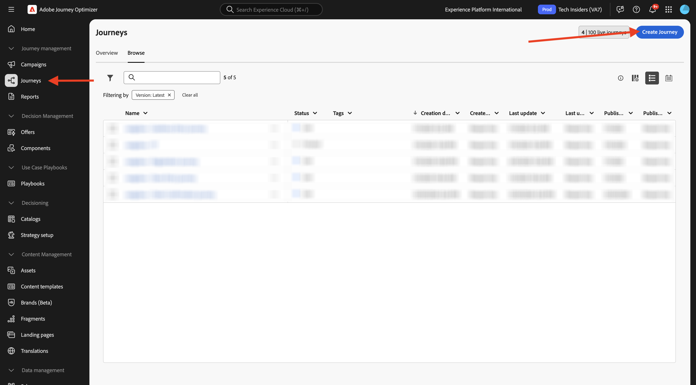
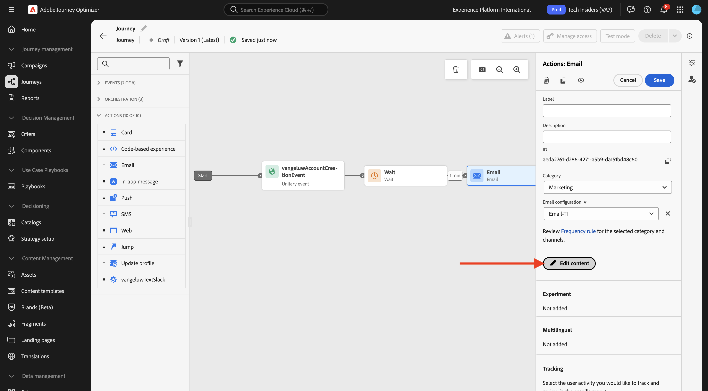
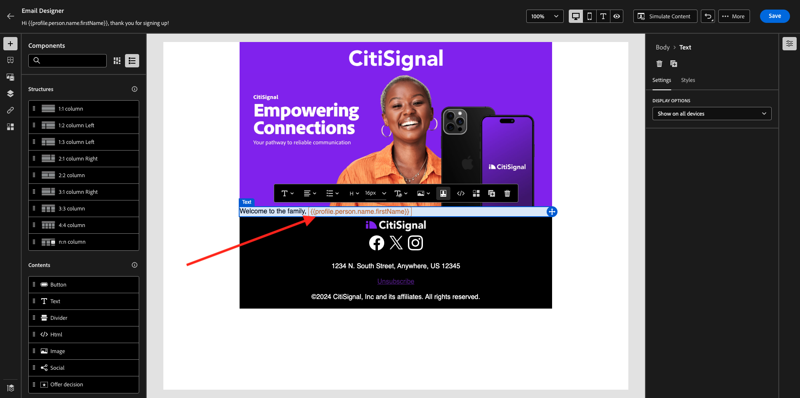

# 3.1.3 Maak uw reis en e-mailbericht

In deze oefening, zult u de reis en het bericht vormen die moeten worden teweeggebracht wanneer iemand een rekening op de demowebsite creeert.

Login aan Adobe Journey Optimizer door naar [ Adobe Experience Cloud ](https://experience.adobe.com) te gaan. Klik **Journey Optimizer**.


U zult aan de **1} mening van het Huis {in Journey Optimizer worden opnieuw gericht.** Eerst, zorg ervoor u de correcte zandbak gebruikt. De sandbox die moet worden gebruikt, wordt `--aepSandboxName--` genoemd.


## 3.1.3.1 Uw reis maken

In het linkermenu, klik **Reizen**. Daarna, klik **creeer Reis** om een nieuwe reis tot stand te brengen.



Dan zie je een leeg reisscherm.


In de vorige oefening, creeerde u een nieuwe **Gebeurtenis**. U noemde het zo `--aepUserLdap--AccountCreationEvent` . Dit was het resultaat van het maken van de gebeurtenis:


U moet deze gebeurtenis nu als begin van deze reis nemen. U kunt dit doen door naar de linkerkant van het scherm te gaan en naar uw gebeurtenis in de lijst met gebeurtenissen te zoeken.


Selecteer de gebeurtenis, sleep deze naar het canvas van de reis. Uw reis ziet er nu als volgt uit:


Als tweede stap in de reis, moet u een korte **toevoegen wacht** stap. Ga naar de linkerkant van uw scherm aan de **sectie van het Orchestration** om dit te vinden. U zult profielattributen gebruiken en moet ervoor zorgen zij in het Profiel van de Klant in real time worden bevolkt.


Je reis ziet er nu zo uit. Aan de rechterkant van het scherm moet u de wachttijd configureren. Stel dit in op 1 minuut. Dit geeft voldoende tijd om de profielkenmerken beschikbaar te maken nadat de gebeurtenis is gestart. Klik **sparen** om uw veranderingen te bewaren.


Als derde stap in de reis, moet u een **E-mail** actie toevoegen. Ga naar de linkerkant van uw scherm aan **Acties**, selecteer de **E-mail** actie, dan belemmering en laat vallen het op de tweede knoop in uw reis. U ziet dit nu.


Plaats de **Categorie** aan **Marketing** en selecteer een e-mailconfiguratie die u toelaat om e-mail te verzenden. In dit geval, is de e-mailconfiguratie om te selecteren **e-mail-Ti**.


## 3.1.3.2 Uw bericht maken

Om uw bericht tot stand te brengen, klik **geef inhoud** uit.



U ziet dit nu.


Klik het **Open pictogram van de verpersoonlijkingsdialoog**.


Schrijf de tekst `Hi ` . Daarna moet u het verpersoonlijkingstoken voor het gebied **Eerste naam** brengen die onder `profile.person.name.firstName` wordt opgeslagen. In het linkermenu, navigeer om **Persoon > Volledige Naam > Voornaam** gebied te vinden en op **+** pictogram te klikken. Vervolgens ziet u het personalisatietoken in het tekstveld.


Voeg vervolgens de tekst **toe. Hartelijk dank voor uw aanmelding.**. Klik **sparen**.


U kunt nu de hoofdtekst van uw e-mail configureren. Klik **uitgeeft e-maillichaam**.


Voordat u begint met het maken van de inhoud van de boodschap zelf, is het een goed idee om na te denken over de inhoud van de boodschap. Sommige inhoud in het bericht is uniek voor het bericht zelf, maar andere delen zijn standaardcomponenten die waarschijnlijk het zelfde voor elke e-mail zullen zijn u naar klanten zult verzenden.

In de vorige oefening, creeerde u reeds deze standaardcomponenten als Fragments in Journey Optimizer, die u in dit bericht en alle andere toekomstige berichten kunt nu van verwijzingen voorzien u zult creëren.

In het volgende scherm krijgt u drie verschillende methoden om de inhoud van de e-mail te verschaffen:

- **Ontwerp van kras**: Begin met een leeg canvas en gebruik WYSIWYG-redacteur om structuur en inhoudscomponenten te slepen en neer te zetten om de inhoud van e-mail visueel op te bouwen.
- **Code uw eigen**: Creeer uw eigen e-mailmalplaatje door het te coderen gebruikend HTML
- **de Invoer HTML**: De invoer een bestaand malplaatje van HTML, dat u zult kunnen uitgeven.

Klik **Ontwerp van kras**.


In het linkermenu vindt u de structuurcomponenten die u kunt gebruiken om de structuur van de e-mail (rijen en kolommen) te definiëren.


U zult ook **Fragmenten** in het linkermenu vinden, waar u de fragmenten zult zien u vroeger creeerde.


Voordat u de kop- en voettekst op het canvas kunt plaatsen, moet u twee structuren aan de e-mail toevoegen. Klik het **+** pictogram in het linkermenu, en sleep 2 **1:1 kolomcomponenten** op het canvas.


In het linkermenu, ga terug naar **Fragments**. Sleep het koptekstfragment naar de eerste component en het voettekstfragment naar de tweede component. Dan zie je dit.


Klik het **+** pictogram in het linkermenu en belemmering en laat vallen 2 meer **1:1 kolomcomponenten** op het canvas, binnen tussen de kopbal en footer.


De belemmering en laat vallen een **component van het Beeld** in eerste **1:1 kolom** component. Klik **doorbladeren**.


In de **citi-signaal-beelden** omslag. Selecteer het beeld **`welcome_email_image.png`** en klik **Uitgezocht**.


Dan heb je het volgende:


Daarna, ga naar **Inhoud** en sleep en laat vallen a **** component van de Tekst in de structuurcomponent op de vierde rij.


Selecteer de standaardtekst **Gelieve te typen hier uw tekst.** zoals u met een teksteditor zou doen. Schrijf **Onthaal aan de familie,** in plaats daarvan. In de toolbar, klik **verpersoonlijking** pictogram toevoegen.


Daarna, moet u het **Voornaam** verpersoonlijkingstoken brengen dat onder `profile.person.name.firstName` wordt opgeslagen. In het menu, vind het **element van de Persoon**, boor neer aan het **Volledige element van de Naam**, en klik dan het **+** pictogram om het Eerste gebied van de Naam op uitdrukkingsredacteur toe te voegen.

Klik **sparen**.


U zult nu zien hoe het verpersoonlijkingsgebied aan uw tekst is toegevoegd.



Op het zelfde tekstgebied, duik **** binnen tweemaal om twee lijnen toe te voegen en de volgende tekst te kopiëren en te kleven:

```
Welcome aboard! We're thrilled to have you join the CitiSignal family. 
As a valued member of our community, you're now poised to experience top-notch telecommunications services that cater to your every need.

At CitiSignal, we understand that staying connected is more than just a convenience - it's a necessity. Whether you're browsing the web, streaming your favourite content, or keeping in touch with loved ones, we're here to ensure you have the best tools and resources at your fingertips.
```


Plaats de **groepering van de Tekst** om worden gecentreerd, en voel vrij om de blik en het gevoel van het bericht aan te passen om aan uw eigen behoeften te voldoen. Wanneer u wordt gedaan, klik **sparen**.


De definitieve controle om uit te voeren om uw e-mail te verzekeren is klaar om het voor te vertonen, klik op de **Simuleer Inhoud** knoop.


Voordat u het e-mailbericht kunt simuleren, moet u een testprofiel toevoegen. Klik **leiden testprofielen**.


Selecteer **e-mail** namespace door op het pictogram naast **te klikken ingaat identiteit namespace** gebied.

In de lijst van identiteit namespaces, selecteer **E-mail** namespace. Op het **waarde van de Identiteit** gebied, ga het e-mailadres van een vorig profiel in dat u in een vorige oefening gebruikte, en dat reeds in Adobe Experience Platform wordt opgeslagen. Klik **toevoegen profiel**. Ga terug naar het vorige scherm.


U ziet dan uw e-mailbericht, nu gesimuleerd voor dit klantprofiel. U kunt nu de personalisatie op de onderwerpregel en de hoofdtekst valideren en desgewenst een e-mail met een proefdruk verzenden.

Klik **dicht** om de voorproef te sluiten.


Klik **sparen** om uw bericht te bewaren en terug naar het berichtdashboard te gaan door de **pijl** naast de onderwerpregel tekst in de top-left hoek te klikken.


Klik de **pijl** om terug naar uw reis te gaan.


## 3.1.3.3 Uw reis publiceren

Klik **sparen**.


Je moet je reis nog steeds een naam geven. U kunt dat doen door het **pictogram van Eigenschappen** in de hoogste rechterkant van uw scherm te klikken.


Je kunt hier de naam van de reis invoeren. Gebruik `--aepUserLdap-- - Registration Journey` . Klik **sparen**.


U kunt uw reis nu publiceren door **te klikken publiceert**.


Klik **publiceren** opnieuw.


Na een paar notulen, zal het statuut van uw reis in **Levend** veranderen en u zult een dashboard in real time van de prestaties van uw reis zien.


Je hebt deze oefening nu afgerond.

## Volgende stappen

Ga naar [ 3.1.4 Werk uw bezit van de Inzameling van Gegevens bij en test uw reis ](./ex4.md){target="_blank"}

Ga terug naar [ Adobe Journey Optimizer: Orchestratie ](./journey-orchestration-create-account.md){target="_blank"}

Ga terug naar [ Alle modules ](./../../../../overview.md){target="_blank"}
