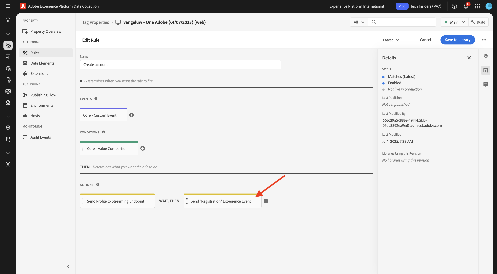
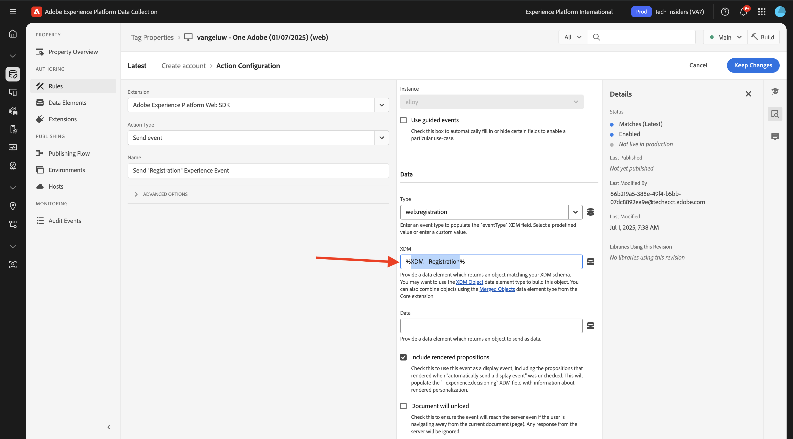
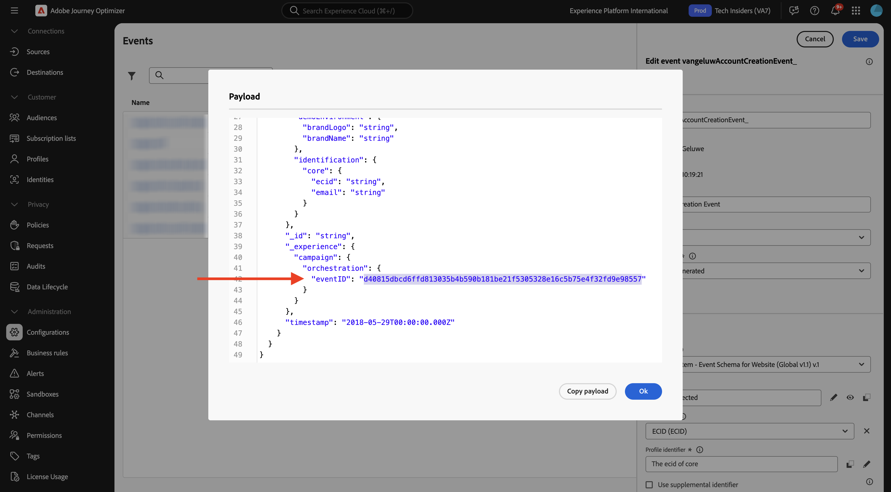
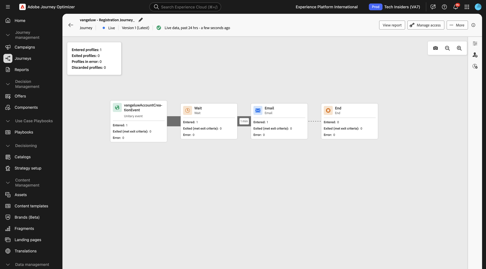

# 3.1.3 Werk uw bezit van de Inzameling van Gegevens bij en test uw reis

## 3.1.3.1 Werk uw bezit van de Gegevensverzameling bij

Ga naar [ de Inzameling van Gegevens van Adobe Experience Platform ](https://experience.adobe.com/launch/) en selecteer **Markeringen**.

In **Aan de slag**, leidde het Systeem van de Demo tot twee eigenschappen van de Cliënt voor u: voor de website en voor mobiele app. Zoek naar `--aepUserLdap--` in het vak **[!UICONTROL Search]** . Klik om het **bezit te openen 0} van het Web {.**

Dan zie je dit.

In het linkermenu, ga naar **Regels** en onderzoek naar de regel **Create rekening**. Klik de regel **creeer rekening** om het te openen.

U zult dan de details van deze regel zien. Klik om de actie **te openen verzend de Gebeurtenis van de Ervaring van de Registratie**.

U zult dan zien dat wanneer deze actie wordt teweeggebracht, een specifiek gegevenselement wordt gebruikt om de XDM gegevensstructuur te bepalen. U moet dat gegevenselement bijwerken, en u moet **identiteitskaart van de Gebeurtenis** van de gebeurtenis bepalen die u in [ Uitoefening 3.1.1 ](./ex1.md) vormde.

U moet nu gaan bijwerken het gegevenselement **XDM - de Gebeurtenis van de Registratie**. Om dit te doen, ga naar **Elementen van Gegevens**. Onderzoek naar **XDM - Registratie** en klik om dat gegevenselement te openen.

U zult dan dit zien:

Navigeer naar het veld `_experience.campaign.orchestration.eventID` . Verwijder de huidige waarde en plak de eventID daar.

Als herinnering, identiteitskaart van de Gebeurtenis kan in Adobe Journey Optimizer onder **Configuraties > Gebeurtenissen** worden gevonden en u zult gebeurtenistidentiteitskaart in de steekproeflading van uw even vinden, die als dit kijkt: `"eventID": "5ae9b8d3f68eb555502b0c07d03ef71780600c4bd0373a4065c692ae0bfbd34d"`.

Na het plakken van eventID, zou uw scherm als dit moeten kijken. Daarna, klik **sparen** of **sparen aan Bibliotheek**.

Tot slot moet u uw wijzigingen publiceren. Ga naar **het Publiceren Stroom** in het linkermenu en klik om uw **Belangrijkste** bibliotheek te openen.

Klik **toevoegen Alle Gewijzigde Middelen** en klik dan **sparen &amp; bouwen aan Ontwikkeling**.

Uw bibliotheek wordt dan bijgewerkt en na 1-2 minuten kunt u uw configuratie testen.

## 3.1.3.2 Uw reis testen

Ga naar [ https://dsn.adobe.com ](https://dsn.adobe.com). Nadat je je hebt aangemeld bij je Adobe ID, kun je dit zien. Klik de 3 punten **..** op uw websiteproject en klik dan **Looppas** om het te openen.

Vervolgens wordt uw demowebsite geopend. Selecteer de URL en kopieer deze naar het klembord.

Open een nieuw Incognito-browservenster.

Plak de URL van uw demowebsite, die u in de vorige stap hebt gekopieerd. Vervolgens wordt u gevraagd u aan te melden met uw Adobe ID.

Selecteer uw accounttype en voltooi het aanmeldingsproces.

Uw website wordt vervolgens geladen in een Incognito-browservenster. Voor elke oefening, zult u een vers, incognito browser venster moeten gebruiken om uw demowebsite URL te laden.

Klik op het Adobe-logopictogram in de linkerbovenhoek van het scherm om de Profile Viewer te openen.

Heb een blik bij het paneel van de Kijker van het Profiel en het Profiel van de Klant in real time met **identiteitskaart van Experience Cloud** als primaire herkenningsteken voor deze momenteel onbekende klant. Klik **Teken binnen**.

Klik **CREËREN EEN ACCOUNT**.

Vul uw details in en klik **Register** waarna u aan de vorige pagina opnieuw zult worden gericht.

Open het deelvenster Profielviewer en ga naar Klantprofiel in realtime. In het deelvenster Profielviewer worden al uw persoonlijke gegevens weergegeven, zoals de zojuist toegevoegde e-mail- en telefoon-id&#39;s.

1 minuut nadat je je account hebt gemaakt, ontvang je een e-mail over het aanmaken van je account van Adobe Journey Optimizer.

Je ziet ook de reis en de vooruitgang door de reis op het dashboard van de reis in Journey Optimizer.

## Volgende stappen

Ga naar [ Samenvatting en voordelen ](./summary.md){target="_blank"}

Ga terug naar [ Adobe Journey Optimizer: Orchestratie ](./journey-orchestration-create-account.md){target="_blank"}

Ga terug naar [ Alle modules ](./../../../../overview.md){target="_blank"}
