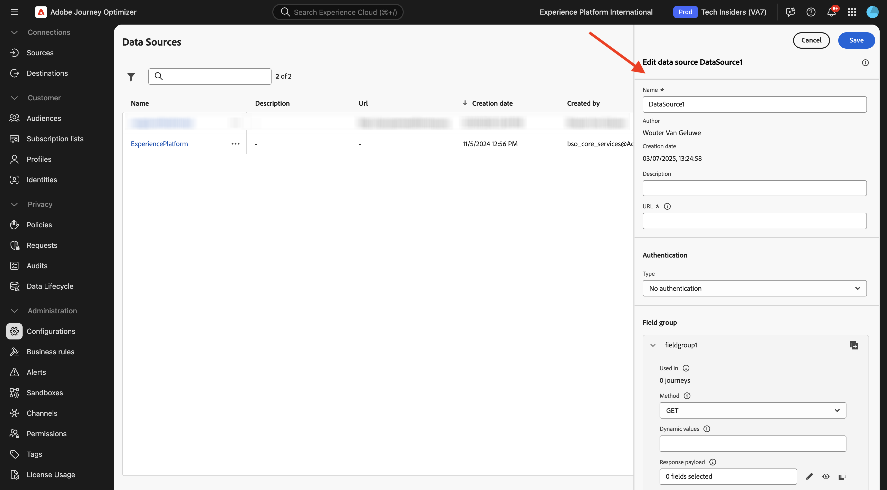
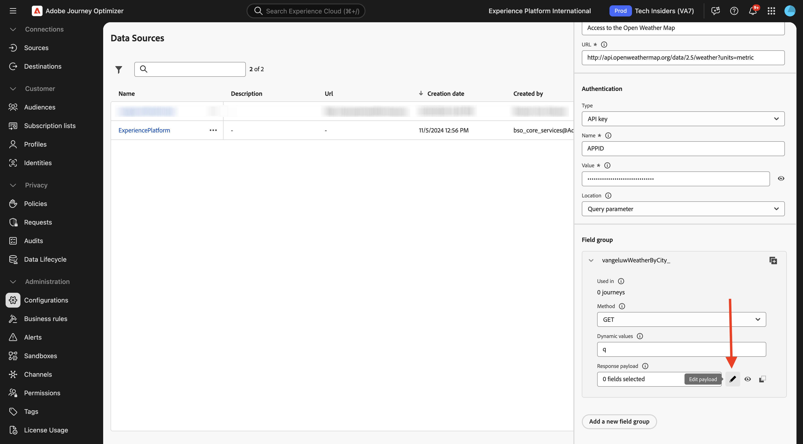

# 3.2.2 Een externe gegevensbron definiëren

In deze oefening, zult u een douane externe gegevensbron tot stand brengen door gebruik van Adobe Journey Optimizer te maken.

Login aan Adobe Journey Optimizer door naar [&#x200B; Adobe Experience Cloud &#x200B;](https://experience.adobe.com) te gaan. Klik **Journey Optimizer**.


U zult aan de **1&rbrace; mening van het Huis {in Journey Optimizer worden opnieuw gericht.** Eerst, zorg ervoor u de correcte zandbak gebruikt. De sandbox die moet worden gebruikt, wordt `--aepSandboxName--` genoemd. U zult dan in de **1} mening van het Huis &lbrace;van uw zandbak** zijn.`--aepSandboxName--`


In het linkermenu, scrol neer en klik **Configuraties**. Daarna, klik **leiden** knoop onder **Gegevensbronnen**.


U zult dan de **Bronnen van Gegevens** lijst zien.
Klik **creëren Gegevens Source** beginnen uw gegevensbron toe te voegen.


Er verschijnt een lege pop-up voor de gegevensbron.



Alvorens u kunt beginnen dit te vormen, zult u een rekening met de **Open Weather Kaart** dienst nodig hebben. Voer de volgende stappen uit om uw account te maken en uw API-sleutel op te halen.

Ga naar [&#x200B; https://openweathermap.org/ &#x200B;](https://openweathermap.org/). Voor de homepage, klik **Teken binnen**.


Klik **creeer een Rekening**.


Vul de details in. Klik **creëren Rekening**.


U wordt vervolgens omgeleid naar uw accountpagina.


In het menu, klik **API Sleutels** om uw API Sleutel terug te winnen, die u uw douane externe gegevensbron zult moeten plaatsen.


Een **Sleutel van API** kijkt als dit: `b2c4c36b6bb59c3458d6686b05311dc3`.

U kunt de **API Documentatie** voor **Huidige Weer** [&#x200B; hier &#x200B;](https://openweathermap.org/current) vinden.

Voor dit gebruik-geval, zult u de verbinding met Open Weather Kaart uitvoeren die op de plaats wordt gebaseerd de klant binnen is, gebruikend het **ingebouwde API verzoek door plaatsnaam**.


Ga terug naar **Adobe Journey Optimizer**, aan uw lege **Externe Gegevens Source** popup.


Gebruik `--aepUserLdap--WeatherApi` als naam voor de gegevensbron.

Stel Beschrijving in op: `Access to the Open Weather Map` .

De URL voor de Open Weather Map API is: `http://api.openweathermap.org/data/2.5/weather?units=metric` .


Vervolgens moet u de verificatie selecteren die u wilt gebruiken.

Gebruik de volgende variabelen:

| Veld | Waarde |
|:-----------------------:| :-----------------------|
| Type | **API sleutel** |
| Naam | **APPID** |
| Waarde | **uw API Sleutel** |
| Locatie | **Parameter van de Vraag** |


Tot slot moet u a **FieldGroup** bepalen, die fundamenteel het verzoek is u naar het Weer API zult verzenden. In ons geval, willen wij de naam van de Stad gebruiken om het Huidige Weer voor die Stad te verzoeken.


Volgens de Weather API-documentatie moet u een parameter `q=City` verzenden.


Configureer uw FieldGroup als volgt om de verwachte API-aanvraag af te stemmen:

>[!IMPORTANT]
>
>De naam van de veldgroep moet uniek zijn. Gebruik de volgende naamgevingsconventie: `--aepUserLdap--WeatherByCity`


Voor de Payload van de Reactie, moet u een voorbeeld van de Reactie kleven die door Weather API zal worden verzonden.

U kunt de verwachte Reactie van API JSON op de API documentatiepagina [&#x200B; hier &#x200B;](https://openweathermap.org/current) vinden, onder het **JSON** onderwerp.


Of u kunt de JSON-reactie hier kopiëren:

```json
{
   "coord": {
      "lon": 7.367,
      "lat": 45.133
   },
   "weather": [
      {
         "id": 501,
         "main": "Rain",
         "description": "moderate rain",
         "icon": "10d"
      }
   ],
   "base": "stations",
   "main": {
      "temp": 284.2,
      "feels_like": 282.93,
      "temp_min": 283.06,
      "temp_max": 286.82,
      "pressure": 1021,
      "humidity": 60,
      "sea_level": 1021,
      "grnd_level": 910
   },
   "visibility": 10000,
   "wind": {
      "speed": 4.09,
      "deg": 121,
      "gust": 3.47
   },
   "rain": {
      "1h": 2.73
   },
   "clouds": {
      "all": 83
   },
   "dt": 1726660758,
   "sys": {
      "type": 1,
      "id": 6736,
      "country": "IT",
      "sunrise": 1726636384,
      "sunset": 1726680975
   },
   "timezone": 7200,
   "id": 3165523,
   "name": "Province of Turin",
   "cod": 200
}    
```

Kopieer de bovenstaande JSON-reactie naar het klembord en ga vervolgens naar het configuratiescherm van de aangepaste gegevensbron.

Klik **uitgeven het pictogram van de Lading**.



U ziet een popup waar u nu de bovengenoemde Reactie van JSON moet kleven.


Plak uw JSON-reactie, waarna u dit ziet. Klik **sparen**.


De aangepaste configuratie van de gegevensbron is nu voltooid. De rol omhoog en klikt **sparen**.


Uw gegevensbron is nu met succes gecreeerd en maakt deel uit van de **Bronnen van Gegevens** lijst.


## Volgende stappen

Ga naar [&#x200B; 3.2.3 bepalen een douaneactie &#x200B;](./ex3.md){target="_blank"}

Ga terug naar [&#x200B; Adobe Journey Optimizer: Externe gegevensbronnen en douaneacties &#x200B;](journey-orchestration-external-weather-api-sms.md){target="_blank"}

Ga terug naar [&#x200B; Alle modules &#x200B;](./../../../../overview.md){target="_blank"}
