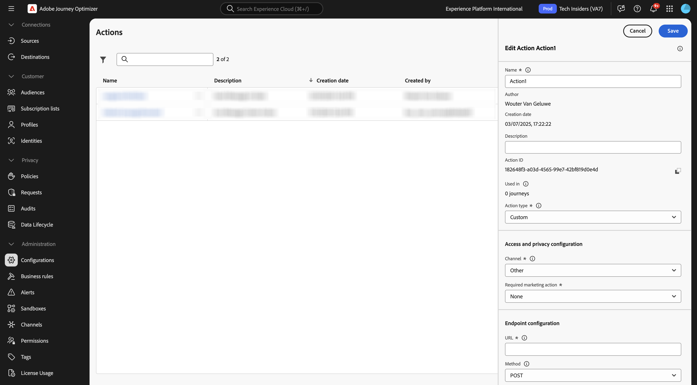
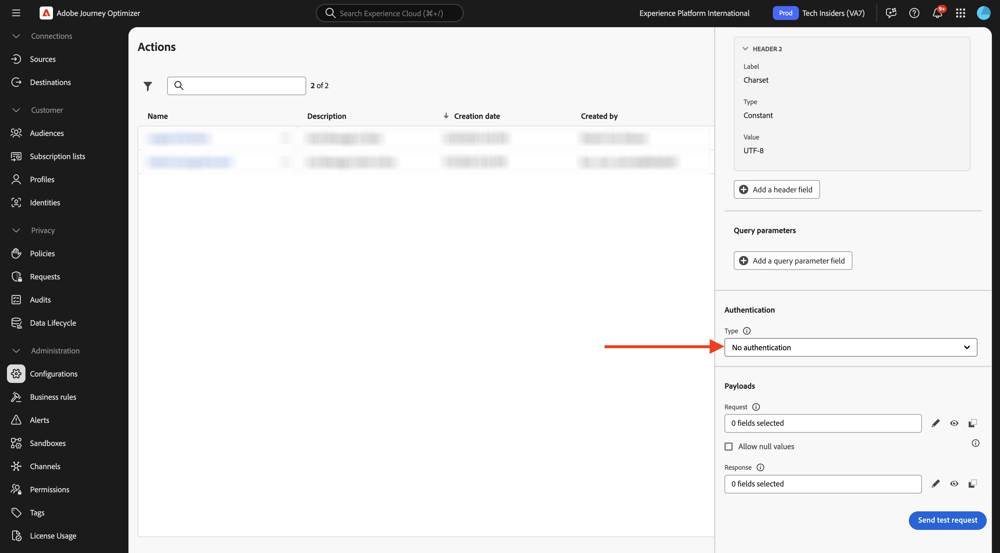
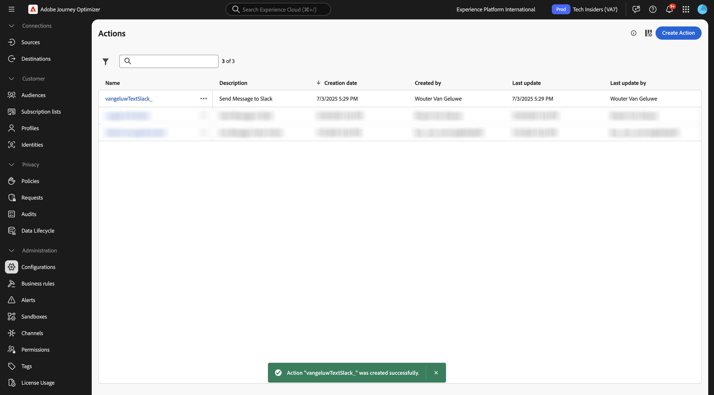

# 3.2.3 Een aangepaste handeling definiëren

In deze oefening, zult u een douaneactie creëren om een bericht naar een kanaal van Slack te verzenden.

Login aan Adobe Journey Optimizer door naar [ Adobe Experience Cloud ](https://experience.adobe.com) te gaan. Klik **Journey Optimizer**.


U zult aan de **1} mening van het Huis {in Journey Optimizer worden opnieuw gericht.** Eerst, zorg ervoor u de correcte zandbak gebruikt. De sandbox die moet worden gebruikt, wordt `--aepSandboxName--` genoemd. U zult dan in de **1} mening van het Huis {van uw zandbak `--aepSandboxName--` zijn.**


U gebruikt nu een bestaand Slack-kanaal en verzendt berichten naar dat Slack-kanaal. Slack heeft een gebruiksvriendelijke API en u gebruikt Adobe Journey Optimizer om de API te activeren.


In het linkermenu, scrol neer en klik **Configuraties**. Daarna, klik **leiden** knoop onder **Acties**.


U zult dan de **lijst van Acties** zien. Klik **tot Actie** leiden.


Er verschijnt een leeg actiepopup.



Gebruik `--aepUserLdap--TextSlack` als naam voor de handeling.

Stel Beschrijving in op: `Send Message to Slack` .

Voor de **Configuratie URL**, gebruik dit:

- URL: `https://2mnbfjyrre.execute-api.us-west-2.amazonaws.com/prod`
- Methode: **POST**

>[!NOTE]
>
>De bovenstaande URL verwijst naar een AWS Lambda-functie die uw verzoek doorstuurt naar het Slack-kanaal zoals hierboven vermeld. Dit wordt gedaan om de toegang tot een Slack-kanaal in eigendom van Adobe te beschermen. Als u uw eigen kanaal van Slack hebt, zou u een Slack App door [ https://api.slack.com/ ](https://api.slack.com/) moeten tot stand brengen, dan moet u een Inkomende Webhaak in die app van Slack tot stand brengen, en dan bovengenoemde URL door uw Inkomende URL van Webhaak vervangen.


U hoeft de koptekstvelden niet te wijzigen.


**Authentificatie** zou aan **Geen Authentificatie** moeten worden geplaatst.



Onder **Payloads**, moet u bepalen welke gebieden naar Slack zouden moeten worden verzonden. Logischerwijze wil je dat Adobe Journey Optimizer en Adobe Experience Platform het brein van personalisatie zijn, dus de tekst die naar Slack moet worden verzonden, moet door Adobe Journey Optimizer worden gedefinieerd en vervolgens naar Slack worden gestuurd voor uitvoering.

Voor het **Verzoek**, klik **uitgeven het pictogram van de Lading**.


Dan zie je een leeg popup-venster.


Kopieer de onderste tekst en plak deze in het lege pop-upvenster.

```json
{
 "text": {
  "toBeMapped": true,
  "dataType": "string",
  "label": "textToSlack"
 }
}
```

U zult dan dit zien:


De rol omhoog en klikt **sparen** één meer tijd om uw actie te bewaren.


Uw douaneactie is nu een deel van de **lijst van Acties**.



U hebt gebeurtenissen, externe gegevensbronnen en acties gedefinieerd. Laten we dat allemaal op één reis consolideren.

## Volgende stappen

Ga naar [ 3.2.4 creeer uw reis en berichten ](./ex4.md){target="_blank"}

Ga terug naar [ Adobe Journey Optimizer: Externe gegevensbronnen en douaneacties ](journey-orchestration-external-weather-api-sms.md){target="_blank"}

Ga terug naar [ Alle modules ](./../../../../overview.md){target="_blank"}
