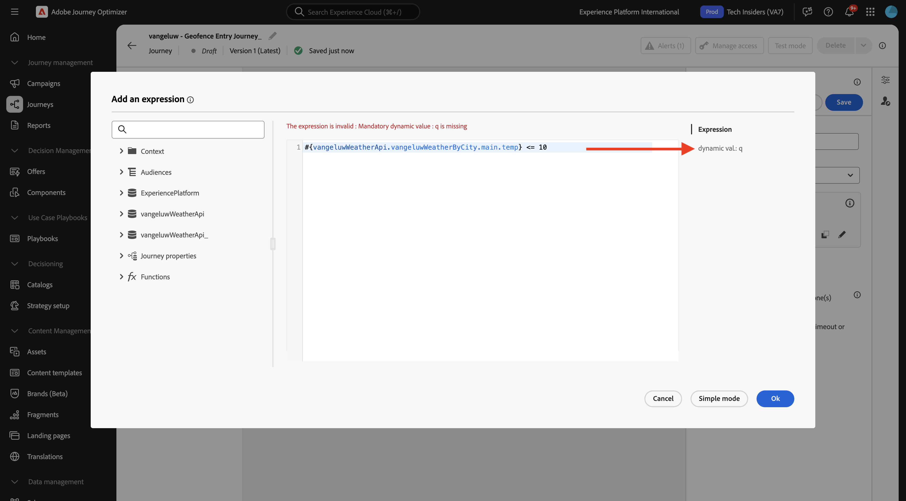
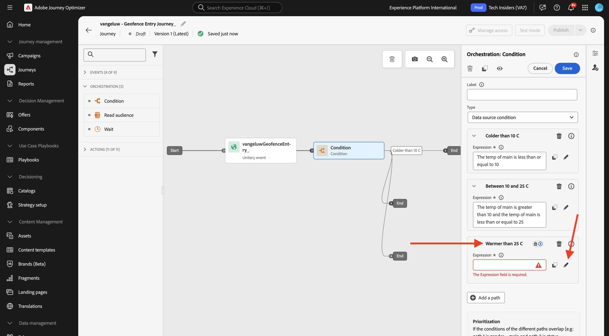
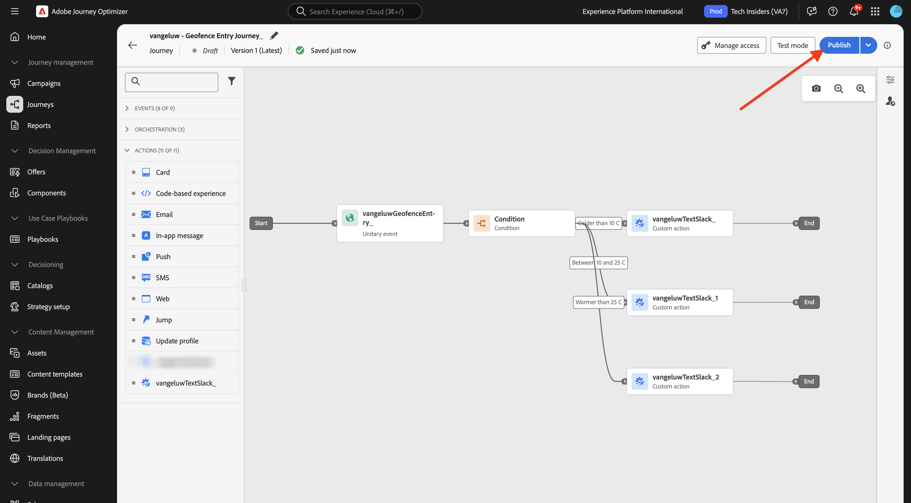
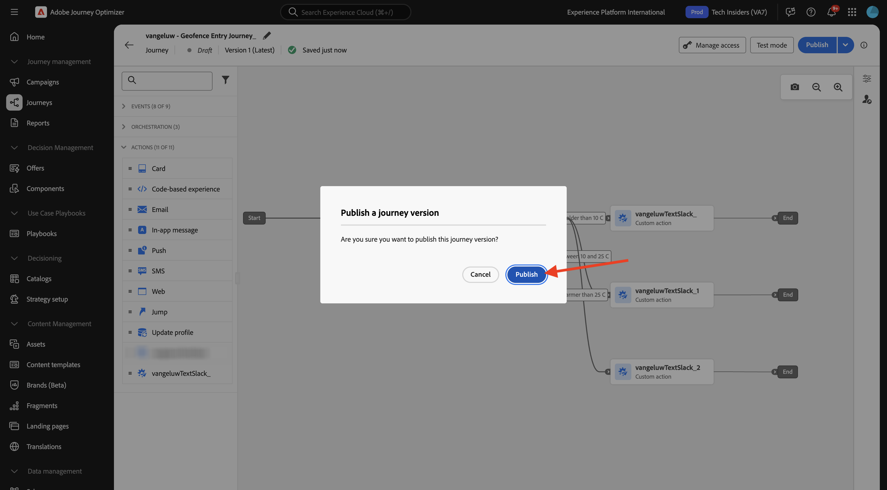

# 3.2.4 Maak uw reis en uw berichten

In deze oefening, zult u een reis en verscheidene tekstberichten creëren door Adobe Journey Optimizer te gebruiken.

Voor dit gebruiksgeval, is het doel verschillende berichten te verzenden die op de weersomstandigheden van de plaats van uw klant worden gebaseerd. Er zijn drie scenario&#39;s vastgesteld:

- Kleiner dan 10° Celsius
- Tussen 10° en 25° Celsius
- Warmer dan 25° Celsius

Voor deze 3 voorwaarden moet u 3 berichten definiëren in Adobe Journey Optimizer.

## 3.2.4.1 Maak uw reis

Login aan Adobe Journey Optimizer door naar [ Adobe Experience Cloud ](https://experience.adobe.com) te gaan. Klik **Journey Optimizer**.


U zult aan de **1} mening van het Huis {in Journey Optimizer worden opnieuw gericht.** Eerst, zorg ervoor u de correcte zandbak gebruikt. De sandbox die moet worden gebruikt, wordt `--aepSandboxName--` genoemd. U zult dan in de **1} mening van het Huis {van uw zandbak `--aepSandboxName--` zijn.**


In het linkermenu, ga naar **Reizen** en klik **creeer Reis** beginnen uw Reis te creëren.


Je moet eerst je reis benoemen.

Gebruik `--aepUserLdap-- - Geofence Entry Journey` als naam voor de rit. Er mogen op dit moment geen andere waarden worden ingesteld. Klik **sparen**.


Op de linkerkant van uw scherm, heb een blik bij **Gebeurtenissen**. De eerder gemaakte gebeurtenis wordt in die lijst weergegeven. Selecteer het, sleep het en laat vallen het op het reiscanvas. Uw reis ziet er dan zo uit. Klik **sparen**.


Daarna, klik op **Orchestration**. U ziet nu de beschikbare **mogelijkheden van 0} Orchestratie {.** Selecteer **Voorwaarde**, dan belemmering en laat vallen het op het Canvas van de Reis.


U moet nu drie paden configureren voor deze voorwaarde:

- Het is kouder dan 10° Celsius
- Het ligt tussen 10° en 25° Celsius
- Het is warmer dan 25° Celsius

Laten we de eerste voorwaarde definiëren.

### Voorwaarde 1: van minder dan 10° Celsius

Klik op de **Voorwaarde**.  Klik op **Path1** en geef de naam van de weg aan **Kleur uit dan 10 C**. Klik op **uitgeven** pictogram voor de uitdrukking van Path1.


U zult dan een leeg **Eenvoudige** scherm van de Redacteur {zien. Uw vraag zal een beetje geavanceerder zijn, zodat zult u de **Geavanceerde Wijze** nodig hebben. Klik **Geavanceerde Wijze**.


U zult dan de **Geavanceerde Redacteur** zien die codeingang toestaat.


Selecteer de hieronder code en kleef het in de **Geavanceerde Redacteur**.

`#{--aepUserLdap--WeatherApi.--aepUserLdap--WeatherByCity.main.temp} <= 10`

Dan zie je dit.


Om de temperatuur als deel van deze voorwaarde terug te winnen, moet u de stad verstrekken waarin de klant momenteel is.
De **Stad** moet met de dynamische parameter `q` worden verbonden, enkel zoals u eerder in de Open Weather API Documentatie zag.

Klik het gebied **dynamische val: q** zoals die in het schermafbeelding wordt vermeld.



U moet dan het gebied vinden dat de huidige stad van de klant in één van de beschikbare Gegevensbronnen bevat, in dit geval, moet u het onder **Context** vinden.


U kunt het veld vinden door naar `--aepUserLdap--GeofenceEntry.placeContext.geo.city` te navigeren.

Door op dat veld te klikken of op **+** te klikken, wordt het veld toegevoegd als de dynamische waarde voor de parameter `q` . Dit veld wordt gevuld met bijvoorbeeld de geolocatieservice die u in uw mobiele app hebt geïmplementeerd. In dit geval simuleert u dit met de eigenschap voor gegevensverzameling van de demo-website. Klik **OK**.


### Voorwaarde 2: tussen 10° en 25° Celsius

Nadat u de eerste voorwaarde hebt toegevoegd, ziet u dit scherm. Klik **toevoegen een weg**.


Dubbelklik op **Path1** en geef de wegnaam aan **tussen 10 en 25 C** uit. Klik **uitgeven** pictogram voor de uitdrukking dit weg.


U zult dan een leeg **Eenvoudige** scherm van de Redacteur {zien. Uw vraag zal een beetje geavanceerder zijn, zodat zult u de **Geavanceerde Wijze** nodig hebben. Klik **Geavanceerde Wijze**.


U zult dan de **Geavanceerde Redacteur** zien die codeingang toestaat.


Selecteer de hieronder code en kleef het in de **Geavanceerde Redacteur**.

`#{--aepUserLdap--WeatherApi.--aepUserLdap--WeatherByCity.main.temp} > 10 and #{--aepUserLdap--WeatherApi.--aepUserLdap--WeatherByCity.main.temp} <= 25`

Dan zie je dit.


Om de temperatuur als deel van deze Voorwaarde terug te winnen, moet u de stad verstrekken waarin de klant momenteel is.
De **Stad** moet met de dynamische parameter **q** worden verbonden, enkel als u eerder in de Open Weather API Documentatie zag.

Klik het gebied **dynamische val: q** zoals die in het schermafbeelding wordt vermeld.


Dan moet u het gebied vinden dat de huidige plaats van de klant in één van de beschikbare Gegevensbronnen bevat.


U kunt het veld vinden door naar `--aepUserLdap--GeofenceEntry.placeContext.geo.city` te navigeren. Door dat gebied te klikken, zal het als dynamische waarde voor de parameter **q** worden toegevoegd. Dit veld wordt gevuld met bijvoorbeeld de geolocatieservice die u in uw mobiele app hebt geïmplementeerd. In dit geval simuleert u dit met de eigenschap voor gegevensverzameling van de demo-website. Klik **OK**.


Vervolgens voegt u de derde voorwaarde toe.

### Voorwaarde 3: Warmer dan 25° Celsius

Nadat u de tweede voorwaarde hebt toegevoegd, ziet u dit scherm. Klik **toevoegen een weg**.


Dubbelklik op Path1 om de naam in **Warmer te veranderen dan 25 C**.
Dan klik op **uitgeven** pictogram voor de uitdrukking dit weg.



U zult dan een leeg **Eenvoudige** scherm van de Redacteur {zien. Uw vraag zal een beetje geavanceerder zijn, zodat zult u de **Geavanceerde Wijze** nodig hebben. Klik **Geavanceerde Wijze**.


U zult dan de **Geavanceerde Redacteur** zien die codeingang toestaat.


Selecteer de hieronder code en kleef het in de **Geavanceerde Redacteur**.

`#{--aepUserLdap--WeatherApi.--aepUserLdap--WeatherByCity.main.temp} > 25`

Dan zie je dit.


Om de temperatuur als deel van deze Voorwaarde terug te winnen, moet u de stad verstrekken waarin de klant momenteel is.
De **Stad** moet met de dynamische parameter **q** worden verbonden, enkel als u eerder in de Open Weather API Documentatie zag.

Klik het gebied **dynamische val: q** zoals die in het schermafbeelding wordt vermeld.


Dan moet u het gebied vinden dat de huidige plaats van de klant in één van de beschikbare Gegevensbronnen bevat.


U kunt het veld vinden door naar ```--aepUserLdap--GeofenceEntry.placeContext.geo.city``` te navigeren. Door dat gebied te klikken, zal het als dynamische waarde voor de parameter **q** worden toegevoegd. Dit veld wordt gevuld met bijvoorbeeld de geolocatieservice die u in uw mobiele app hebt geïmplementeerd. In dit geval simuleert u dit met de eigenschap voor gegevensverzameling van de demo-website. Klik **OK**.


U hebt nu drie geconfigureerde paden. Klik **sparen**.


Aangezien dit een reis voor het leren doel is, zult u nu een paar acties vormen om de verscheidenheid van opties te tonen moeten de verkopers nu berichten leveren.

## 3.2.4.2 Berichten verzenden voor een pad: lager dan 10° Celsius

Voor elk van de temperatuurcontexten, zult u proberen om een tekstbericht naar een klant te verzenden. Hiervoor stuurt u een echt bericht naar een Slack-kanaal in plaats van een mobiel telefoonnummer.

Laten de nadruk op de weg **Kleur dan 10 C**.


In het linkermenu, ga terug naar **Acties**, selecteer de Actie `--aepUserLdap--TextSlack`, dan belemmering en laat vallen het na de **actie van het Bericht**.


Ga naar **Parameters van de Actie** en klik **uitgeven** pictogram voor de parameter `textToSlack`.


In popup-venster, klik **Geavanceerde Wijze**.


Selecteer de hieronder code, kopieer het en kleef het in de **Geavanceerde Redacteur van de Wijze**. Klik **OK**.

`"Brrrr..." + #{ExperiencePlatform.ProfileFieldGroup.profile.person.name.firstName} + ",  it's cold and freezing outside. Get comfortable at home with a 20% discount on a Disney+ subscription!"`


Je ziet de voltooide actie. Klik **sparen**.


Deze weg van de reis is nu gereed.

## 3.2.4.3 Berichten verzenden voor een pad: tussen 10° en 25° Celsius

Voor elk van de temperatuurcontexten, zult u proberen om een bericht naar uw klant te verzenden. Hiervoor stuurt u een echt bericht naar een Slack-kanaal in plaats van een mobiel telefoonnummer.

Laten wij op **tussen 10 en 25 de weg van C** concentreren.


In het linkermenu, ga terug naar **Acties**, selecteer de Actie `--aepUserLdap--TextSlack`, dan belemmering en laat vallen het na de **actie van het Bericht**.


Ga naar **Parameters van de Actie** en klik **uitgeven** pictogram voor de parameter `textToSlack`.


In popup-venster, klik **Geavanceerde Wijze**.


Selecteer de hieronder code, kopieer het en kleef het in de **Geavanceerde Redacteur van de Wijze**. Klik **OK**.

`"What nice weather for the time of year, " + #{ExperiencePlatform.ProfileFieldGroup.profile.person.name.firstName} + " 20% discount on Apple AirPods so you can go for a walk and listen to your favorite podcast!"`


Je ziet de voltooide actie. Klik **OK**.


Deze weg van de reis is nu gereed.

## 3.2.4.4 Berichten verzenden voor een pad: Warmer dan 25° Celsius

Voor elk van de temperatuurcontexten, zult u proberen om een bericht naar uw klant te verzenden. Hiervoor stuurt u een echt bericht naar een Slack-kanaal in plaats van een mobiel telefoonnummer.

Laten wij op **Warmer dan 25 weg van C** concentreren.


In het linkermenu, ga terug naar **Acties**, selecteer de Actie `--aepUserLdap--TextSlack`, dan belemmering en laat vallen het na de **actie van Berichten**.


Ga naar **Parameters van de Actie** en klik **uitgeven** pictogram voor de parameter `textToSlack`.


In popup-venster, klik **Geavanceerde Wijze**.


Selecteer de hieronder code, kopieer het en kleef het in de **Geavanceerde Redacteur van de Wijze**. Klik **OK**.

`"So warm, " + #{ExperiencePlatform.ProfileFieldGroup.profile.person.name.firstName} + "! 20% discount on adding 10GB of extra data so you can get online at the beach!"`


Je ziet de voltooide actie. Klik **sparen**.


Deze weg van de reis is nu gereed.

## 3.2.4.5 Uw reis publiceren

Uw reis is nu volledig gevormd. Klik **publiceren**.



Klik **publiceren** opnieuw.



Uw reis is nu gepubliceerd.


## Volgende stappen

Ga naar [ 3.2.5 Trekker uw reis ](./ex5.md){target="_blank"}

Ga terug naar [ Adobe Journey Optimizer: Externe gegevensbronnen en douaneacties ](journey-orchestration-external-weather-api-sms.md){target="_blank"}

Ga terug naar [ Alle modules ](./../../../../overview.md){target="_blank"}
