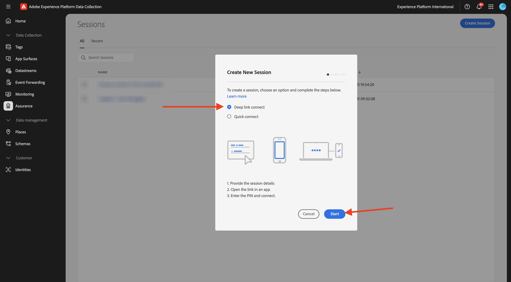
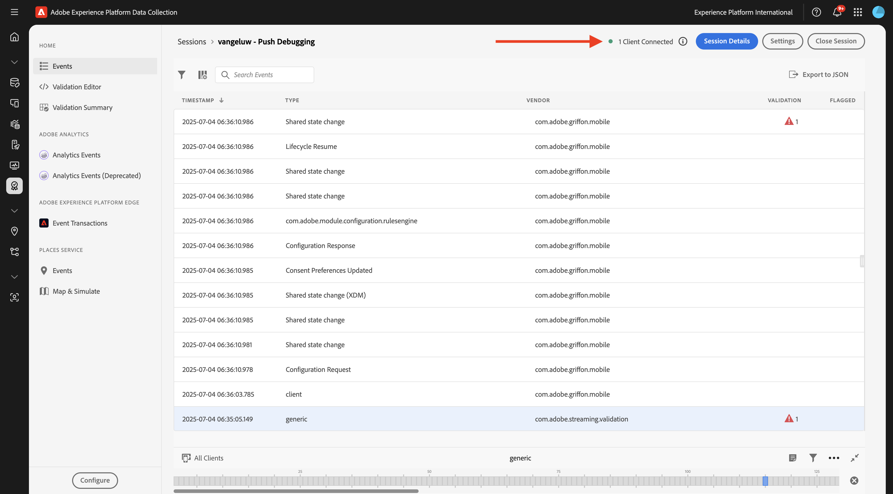
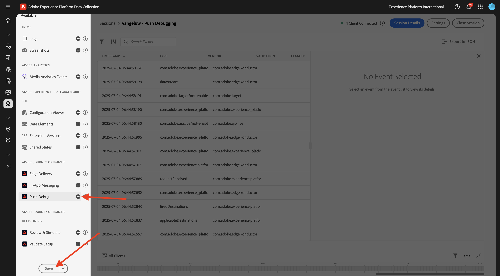

# 3.3.1 Aan de slag met pushmeldingen

Als u pushmeldingen wilt gebruiken met Adobe Journey Optimizer, moet u een aantal instellingen controleren en weten wat deze zijn.

Hier zijn alle instellingen die moeten worden gecontroleerd:

- Datasets en schema&#39;s in Adobe Experience Platform
- DataStream voor mobiele apparaten
- Eigenschappen voor gegevensverzameling voor mobiele apparaten
- App-oppervlak voor push-certificaten
- Uw pushinstellingen testen met AEP Assurance

Laten we deze een voor een herzien.

Login aan Adobe Journey Optimizer door naar [ Adobe Experience Cloud ](https://experience.adobe.com) te gaan. Klik **Journey Optimizer**.

U zult aan de **1&rbrace; mening van het Huis {in Journey Optimizer worden opnieuw gericht.** Eerst, zorg ervoor u de correcte zandbak gebruikt. De sandbox die moet worden gebruikt, wordt `--aepSandboxName--` genoemd. U zult dan in de **1} mening van het Huis &lbrace;van uw zandbak** zijn.`--aepSandboxName--`

## 3.3.1.1 Push-gegevensset

Adobe Journey Optimizer gebruikt datasets om dingen zoals de pushtokens van mobiele apparaten of interactie met pushberichten (zoals: bericht verzonden, bericht geopend, enz.) op te slaan in een dataset in Adobe Journey Optimizer.

U kunt deze datasets vinden door **Datasets** in het menu op de linkerkant van uw scherm te gaan. Om systeemdatasets te tonen, klik **toelaten filters** pictogram.

Laat de optie voor **Systeem** toe en onderzoek naar **AJO**. U zult dan de datasets zien die voor dupberichten worden gebruikt.

## 3.3.1.2 DataStream for Mobile

Ga naar [ https://experience.adobe.com/#/data-collection/ ](https://experience.adobe.com/#/data-collection/).

In het linkermenu, ga naar **Datastreams** en onderzoek naar uw gegevensstroom die u in [ het Begonnen Worden ](./../../../../modules/getting-started/gettingstarted/ex2.md) creeerde, die `--aepUserLdap-- - One Adobe Datastream (Mobile)` wordt genoemd. Klik om het te openen.

Klik **uitgeven** op de **Adobe Experience Platform** dienst.

U zult dan de gegevensstroommontages zien die werden bepaald, en waarin datasets gebeurtenissen en profielattributen zullen worden opgeslagen.

U zou ook de volgende opties moeten toelaten als zij nog niet worden toegelaten:

- **Offer Decisioning**
- **de Doelen van Personalization**
- **Adobe Journey Optimizer**

Klik **sparen**.

## 3.3.1.3 Controleer de eigenschap Gegevensverzameling voor mobiele apparaten

Ga naar [ https://experience.adobe.com/#/data-collection/ ](https://experience.adobe.com/#/data-collection/), aan **Markeringen**. Als deel van de [ Begonnen ](./../../../../modules/getting-started/gettingstarted/ex1.md) module, werden de eigenschappen van de Markeringen van de Inzameling van Gegevens gecreeerd.

U hebt deze eigenschappen van de Markeringen van de Inzameling van Gegevens reeds als deel van vorige modules gebruikt.

Klik om de eigenschap Gegevensverzameling voor mobiel te openen.

In uw bezit van de Inzameling van Gegevens, ga naar **Uitbreidingen**. Vervolgens ziet u de verschillende extensies die nodig zijn voor de mobiele app. Klik om de uitbreiding **Adobe Experience Platform Edge Network** te selecteren en dan **te selecteren vorm**.

U zult dan zien dat uw gegevensstroom voor mobiel hier verbonden is. Daarna, annuleert de klik **&#x200B;**&#x200B;om terug naar het uitbreidingsoverzicht te gaan.

Dan ben je weer terug hier. U zult de uitbreiding voor **AEP Assurance** zien. Met AEP Assurance kunt u controleren, testen, simuleren en valideren hoe u gegevens verzamelt of ervaringen opdoet in uw mobiele app. U kunt meer over AEP Assurance hier lezen: [ https://experienceleague.adobe.com/nl/docs/experience-platform/assurance/home](https://experienceleague.adobe.com/nl/docs/experience-platform/assurance/home).

Daarna, vormt de klik **&#x200B;**&#x200B;om de uitbreiding **Adobe Journey Optimizer** te openen. Met deze extensie schakelt u pushmeldingen en meting in voor Adobe Journey Optimizer.

U zult dan zien dat dit is waar de dataset voor het volgen van dupgebeurtenissen verbonden is. U hoeft geen wijzigingen aan te brengen in de eigenschap Gegevensverzameling. Klik **annuleren** om terug naar het vorige scherm te gaan.

## 3.3.1.4 De installatie van uw toepassingsoppervlak controleren

Ga naar [ https://experience.adobe.com/#/data-collection/ ](https://experience.adobe.com/#/data-collection/). In het linkermenu, ga naar **de Oppervlakken van de App** en open de Oppervlakte van de App voor **DX Demo App APNS**.

U zult dan de gevormde Oppervlakte van de App voor iOS en Android zien.

## 3.3.1.5 Test push-berichtinstellingen met AEP Assurance.

U installeerde reeds de **DX Demo** mobiele toepassing als deel van **Begonnen** module. Nadat de app is geïnstalleerd, vindt u deze op het beginscherm van uw apparaat. Klik op het pictogram om de app te openen.

Nadat u zich hebt aangemeld, wordt er een melding weergegeven waarin u wordt gevraagd om toestemming voor het verzenden van meldingen. Wij zullen berichten als deel van het leerprogramma verzenden, zo klik **toestaan**.

Vervolgens ziet u de startpagina van de app. Ga naar **Montages**.

In montages, zult u zien dat momenteel a **Openbaar Project** in app wordt geladen. Klik **Project van de Douane**.

U kunt nu een aangepast project laden. Klik de code QR om uw project gemakkelijk te laden.

Na het gaan door de **Begonnen** sectie, had u dit resultaat. Klik om het **Mobiele Retail project** te openen dat voor u werd gecreeerd.

Voor het geval u per ongeluk uw browser venster, of voor toekomstige demo of enablement zittingen had gesloten, kunt u tot uw websiteproject ook toegang hebben door [ https://dsn.adobe.com/projects ](https://dsn.adobe.com/projects) te gaan. Nadat je je hebt aangemeld bij je Adobe ID, kun je dit zien. Klik op uw mobiele-toepassingsproject om het te openen.

Daarna, klik **Looppas**.

U zult dan deze popup zien, die een QR code bevat. Scan deze QR-code vanuit de mobiele app.

U zult dan uw projectidentiteitskaart tonen in app zien, waarna u **Schakelaar** kunt klikken.

Uw app is nu klaar om te worden gebruikt.

U moet nu een QR-code scannen om uw mobiele apparaat aan te sluiten op uw Assurance-sessie.

Om een zitting van AEP Assurance te beginnen, ga naar [ https://experience.adobe.com/#/data-collection/ ](https://experience.adobe.com/#/data-collection/). Klik **Assurance** in het linkermenu. Dan, klik **creeer Zitting**.

Selecteer **Deep verbinding verbinden** en klik dan **Begin**.

Vul de waarden in:

- Naam sessie: `--aepUserLdap-- - Push Debugging`
- Basis-URL: `dxdemo://default`

Klik **daarna**.

Vervolgens ziet u een QR-code op uw scherm, die u moet scannen met uw iOS-apparaat.

Open de camera-app op uw mobiele apparaat en scan de QR-code die door Assurance wordt weergegeven.

U zult dan een popup scherm zien, vragend u om de SPELD-code in te gaan. Kopieer de SPELD-code van uw scherm van AEP Assurance en klik **verbinden**.

Dan zie je dit.

In Assurance ziet u nu dat een clientapparaat is aangesloten op de Assurance-sessie. Daarna, klik **vormen**.

De rol neer aan **duw zuivert**. Klik **+** pictogram en klik dan **sparen**.

Ga naar **Push zuivert**. Je moet dit zien.

Enkele uitleg:

- De eerste kolom, **Cliënt**, toont de beschikbare herkenningstekens op uw apparaat van iOS. U ziet een ECID en een pushtoken.
- De tweede kolom toont de **Credentials &amp; Configuratie van App Store**
- De tweede kolom toont **informatie van het Profiel**, met extra informatie over welk platform de Duw Symbolische levens in (APNS of APNSSandbox). Als u de **knoop van het Profiel van de Inspectie** klikt, zult u aan Adobe Experience Platform worden genomen en u zult het volledige Profiel van de Klant in real time zien.

Om uw opstelling van de Push configuratie te testen, ga **verzenden de knoop van de Opstelling van de Druk van de Test**. Klik **verzenden het Bericht van de Duw van de Test**

U moet ervoor zorgen dat **DX demo** app niet open is op het ogenblik van het klikken van **verzendt het Duwbericht** knoop. Als de app geopend is, wordt de pushmelding mogelijk op de achtergrond ontvangen en is deze niet zichtbaar.

Vervolgens verschijnt er een pushmelding zoals deze op uw mobiele apparaat.

Als u de pushmelding hebt ontvangen, betekent dit dat uw setup correct is en goed werkt en dat u nu een echte reis kunt maken die zal leiden tot het verzenden van een pushbericht vanuit Journey Optimizer.

## Volgende stappen

Ga naar [ 3.3.2 vormen een reis met dupberichten ](./ex2.md){target="_blank"}

Ga terug naar [ Adobe Journey Optimizer: Duw en In-app Berichten ](ajopushinapp.md){target="_blank"}

Ga terug naar [ Alle modules ](./../../../../overview.md){target="_blank"}
